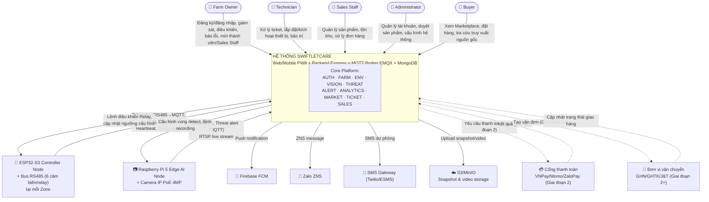

# Software Requirements Specification (SRS)

## SwiftletCare: An Automated Environmental Control and Multi-Modal Health Monitoring System for Swiftlet Farming

---

| Trường thông tin        | Nội dung                            |
| ----------------------- | ----------------------------------- |
| **Tên dự án**           | SwiftletCare                        |
| **Phiên bản SRS**       | 1.21.1                              |
| **Ngày tạo**            | 07/09/2026                          |
| **Thời gian thực hiện** | Tháng 7/2026 – Tháng 12/2026 (FA26) |
| **Chuyên ngành**        | Software Engineering (SE)           |
| **Loại đồ án**          | Capstone Project – KLTN             |

---

## MỤC LỤC

1. [Giới thiệu](#1-giới-thiệu)
2. [Mô tả Tổng quan Hệ thống](#2-mô-tả-tổng-quan-hệ-thống)
3. [Kiến trúc Hệ thống](#3-kiến-trúc-hệ-thống)
4. [Các Tác nhân (Actors)](#4-các-tác-nhân-actors)
5. [Yêu cầu Chức năng](#5-yêu-cầu-chức-năng)
6. [Yêu cầu Phi chức năng](#6-yêu-cầu-phi-chức-năng)
7. [Đặc tả Phần cứng & BOM](#7-đặc-tả-phần-cứng--bom)
8. [Mô hình Dữ liệu](#8-mô-hình-dữ-liệu)
9. [Đặc tả Giao diện & API](#9-đặc-tả-giao-diện--api)
10. [Luồng Xử lý Nghiệp vụ (Flows)](#10-luồng-xử-lý-nghiệp-vụ-flows)
11. [Yêu cầu AI / Computer Vision](#11-yêu-cầu-ai--computer-vision)
12. [Yêu cầu Bảo mật](#12-yêu-cầu-bảo-mật)
13. [Kế hoạch Kiểm thử](#13-kế-hoạch-kiểm-thử)
14. [Phân công & Lịch trình](#14-phân-công--lịch-trình)
15. [Quản lý Rủi ro (Risk Register)](#15-quản-lý-rủi-ro-risk-register)
16. [Giả định, Ràng buộc & Phạm vi Loại trừ](#16-giả-định-ràng-buộc--phạm-vi-loại-trừ)
17. [Vận hành, Triển khai & Tuân thủ Dữ liệu](#17-vận-hành-triển-khai--tuân-thủ-dữ-liệu)
18. [Tiêu chí Nghiệm thu (Definition of Done)](#18-tiêu-chí-nghiệm-thu-definition-of-done)
19. [Bảng Thuật ngữ](#19-bảng-thuật-ngữ)

---

## 1. Giới thiệu

### 1.1. Mục đích Tài liệu

Tài liệu này là Đặc tả Yêu cầu Phần mềm (Software Requirements Specification – SRS) cho hệ thống **SwiftletCare**. Tài liệu mô tả đầy đủ và chính xác tất cả các yêu cầu chức năng, phi chức năng, ràng buộc kỹ thuật, kiến trúc hệ thống và tiêu chí chấp nhận của đồ án tốt nghiệp. SRS này được sử dụng làm căn cứ để:

- Đội phát triển thiết kế, xây dựng và kiểm thử hệ thống.
- Giảng viên hướng dẫn và hội đồng đánh giá xem xét phạm vi đồ án.
- Các bên liên quan hiểu rõ giá trị và giới hạn của sản phẩm.

### 1.2. Phạm vi Hệ thống

**SwiftletCare** là một hệ sinh thái IoT toàn diện kết hợp phần cứng nhúng, thị giác máy tính biên (Edge AI), và nền tảng web/mobile, nhằm giải quyết 4 bài toán chính trong nghề nuôi yến thương mại:

| #   | Bài toán                                                 | Giải pháp                                                         |
| --- | -------------------------------------------------------- | ----------------------------------------------------------------- |
| 1   | Điều khiển vi khí hậu thủ công, phụ thuộc người vận hành | Closed-loop PID Control tự động 24/7 qua ESP32                    |
| 2   | Không thể theo dõi số lượng đàn chim chính xác           | AI Camera đếm chim ra/vào theo thời gian thực                     |
| 3   | Phát hiện thiên địch và sự cố trễ, thiệt hại lớn         | Multi-modal Threat Detection (Vision + Audio)                     |
| 4   | Người mua không có cơ sở xác minh chất lượng tổ yến      | Nest Marketplace với truy xuất nguồn gốc (Farm Traceability Data) — **[làm rõ v1.17.0]** đăng tin + xác thực nguồn gốc bằng dữ liệu IoT + liên hệ trực tiếp, KHÔNG phải sàn thương mại điện tử có giỏ hàng/thanh toán (xem mục 5.8) |

> **[Cập nhật v1.7.0]** Sau rà soát lại cùng BA Review, hệ thống thống nhất vận hành với **5 vai trò người dùng** (Farm Owner, Technician, Sales Staff, Buyer, Administrator) — **gộp Operator vào Farm Owner** thành 1 vai trò duy nhất phía Farm (bản v1.6.0 trước đó tách thành 6 vai trò, không cần thiết cho phạm vi KLTN và không khớp với tài liệu BA gốc vốn đã mô tả đúng 5 actor — xem mục 1.3). Hệ thống vẫn được triển khai theo **3 giai đoạn** — phạm vi nghiệm thu KLTN (FA26) chỉ bao gồm **Giai đoạn 1 (MVP)**, xem chi tiết mục 2.4 và mục 16.3.

### 1.3. Tài liệu Tham chiếu

- `FA26_SE_Capstone_Project_Register_SwiftletCare.docx` – Phiếu đăng ký đề tài KLTN
- `KLTN_2026_SwiftletCare_FA26.docx` – Đặc tả kỹ thuật phần cứng và Edge AI Vision
- YOLOv8/YOLOv10 Documentation – Ultralytics
- ByteTrack: Multi-Object Tracking by Associating Every Detection Box
- EMQX/Mosquitto MQTT Broker Documentation
- Express.js Framework Documentation
- `BA_Review_ActivityFlow_SwiftletCare.md` – Đánh giá BA & thiết kế luồng nghiệp vụ **5 actor (Farmer, Buyer, Technician, Sales Staff, Admin)** — nội dung đã được hợp nhất vào SRS này; mô hình 5 actor được khôi phục đúng theo tài liệu gốc này kể từ bản v1.7.0

### 1.4. Tổng quan Tài liệu

SRS được tổ chức theo chuẩn IEEE 830-1998 với các phần mở rộng cho hệ thống IoT/Edge AI. Mỗi yêu cầu chức năng được định danh duy nhất theo format `[MODULE]-FR-XXX` để dễ truy vết.

---

## 2. Mô tả Tổng quan Hệ thống

### 2.1. Bối cảnh Vấn đề

Nghề nuôi yến thương mại tại Việt Nam là ngành có giá trị kinh tế cao (tổ yến đạt 20–60 triệu đồng/kg), nhưng cực kỳ nhạy cảm với môi trường. Các vấn đề hiện tại:

- **Về môi trường:** Độ ẩm < 75% hoặc nhiệt độ > 31°C gây thoái hóa tổ, chim bỏ tổ, hoặc tỉ lệ tử vong non cao. Hầu hết nông dân dùng cảm biến rời lẻ, phải kiểm tra thủ công nhiều lần/ngày.
- **Về quản lý đàn:** Không có cơ chế đánh giá tự động số lượng chim ra/vào hàng ngày — chỉ số then chốt nhất để đánh giá sức khỏe đàn và dự báo năng suất thu hoạch.
- **Về an ninh:** Thiên địch (chuột, rắn, cú mèo) và sự cố thiết bị (hỏng loa dẫn dụ, mất điện) hiện chỉ được phát hiện khi chủ nhà kiểm tra trực tiếp, thường quá muộn để can thiệp kịp thời.

### 2.2. Đối tượng Người dùng Mục tiêu

> **[Cập nhật v1.7.0 — gộp Operator vào Farm Owner]** Bản v1.6.0 từng tách "Farm Owner" và "Operator" thành 2 vai trò riêng để phân quyền theo Zone. Sau rà soát, nhóm quyết định **gộp lại thành 1 vai trò Farm Owner duy nhất** cho toàn bộ phía Farm: trong phạm vi KLTN (1 farm thử nghiệm, quy mô nhỏ), việc phân quyền chi tiết theo Zone giữa "chủ farm" và "nhân viên vận hành" tạo thêm độ phức tạp không cần thiết và không phản ánh đúng cách vận hành thực tế của các farm quy mô vừa/nhỏ. Một Farm có thể có **nhiều tài khoản Farm Owner** (1 Primary Owner tự đăng ký + các thành viên được mời), tất cả đều có quyền vận hành ngang nhau (xem AUTH-FR-005, `farms.members`, mục 8.2).

| Vai trò           | Thuộc về                                    | Mô tả                                                                                                                                                                                                                                                                                                                   |
| ----------------- | ------------------------------------------- | ----------------------------------------------------------------------------------------------------------------------------------------------------------------------------------------------------------------------------------------------------------------------------------------------------------------------- |
| **Farm Owner**    | Phía khách hàng (Farm)                      | Chủ nhà yến và nhân viên vận hành trực tiếp tại farm — gộp chung 1 vai trò; 1 Farm có 1 tài khoản Primary Owner tự đăng ký, có thể mời thêm thành viên Farm Owner khác (quyền vận hành ngang nhau) và **[Đổi v1.16.0]** đề xuất Sales Staff (chờ Admin duyệt, AUTH-FR-005b/005d — không tự mời/kích hoạt trực tiếp như trước)                                                                                                   |
| **Technician**    | Phía công ty SwiftletCare                   | Nhân viên hỗ trợ kỹ thuật: lắp đặt phần cứng, xử lý ticket sự cố theo SLA, bảo trì định kỳ; **[mới v1.16.0]** quản lý cấu trúc Farm (danh sách, House/Zone) trong `assigned_regions` phụ trách (FARM-FR-009); chat trực tiếp với Farm Owner theo từng ticket (TICKET-FR-014)                                            |
| **Sales Staff**   | **[Đổi v1.16.0] Phía công ty SwiftletCare** | Nhân viên kinh doanh, được Administrator gán quản lý 1 hoặc nhiều Farm (giống mô hình Technician theo vùng) — không còn là nhân viên do Farm Owner tự thuê; vận hành thương mại: sản phẩm, tồn kho, đơn hàng, vận chuyển, đổi trả cấp Farm được gán                                                                     |
| **Buyer**         | Bên ngoài                                   | Khách mua tổ yến; có thể guest checkout hoặc đăng ký tài khoản                                                                                                                                                                                                                                                          |
| **Administrator** | Phía công ty SwiftletCare                   | Quản trị nền tảng: tài khoản, duyệt sản phẩm, phân xử tranh chấp, cấu hình hệ thống toàn cục; **[mới v1.16.0]** quản lý cấu trúc Farm toàn hệ thống không giới hạn vùng (FARM-FR-009), gán Sales Staff vào Farm (đường chính), audit log/cấu hình ngưỡng mặc định/tổng quan sức khỏe hệ thống (Module SYSTEM, mục 5.11) |

### 2.4. Lộ trình Phát triển 3 Giai đoạn & Phạm vi KLTN

> Bổ sung theo BA Review để làm rõ ranh giới giữa "toàn bộ tầm nhìn sản phẩm" và "phạm vi thực sự triển khai/nghiệm thu trong 6 tháng đồ án".

| Giai đoạn　　　　　　　　　　　　　　　　　　　　　　  | Mục tiêu                                                      | Phạm vi chính                                                                                                                                                                                                                                                                                                                                                            |                                                      Thuộc phạm vi KLTN?                                                      |
| ------------------------------------------------------ | ------------------------------------------------------------- | ------------------------------------------------------------------------------------------------------------------------------------------------------------------------------------------------------------------------------------------------------------------------------------------------------------------------------------------------------------------------ | :---------------------------------------------------------------------------------------------------------------------------: |
| 🟢 **Giai đoạn 1 — MVP (Core Monitoring & Control)**　 | Chứng minh giá trị cốt lõi IoT: "nuôi yến từ xa, an toàn hơn" | Farm Owner giám sát/điều khiển 1 farm, cảnh báo, ticket báo lỗi cơ bản, reset ngưỡng về mặc định; Technician lắp đặt & xử lý ticket, quản lý cấu trúc Farm trong vùng phụ trách, chat hỗ trợ theo ticket; Admin quản lý tài khoản, quản lý cấu trúc Farm toàn hệ thống, audit log/cấu hình hệ thống (Module SYSTEM); Marketplace chỉ là landing page tĩnh + form liên hệ |                                          ✅ **Có — đây là phạm vi nghiệm thu chính**                                          |
| 🟡 **Giai đoạn 2 — Vận hành & Thương mại hóa cơ bản**  | Mở use case bán hàng thật + nâng cấp vận hành kỹ thuật        | Kích hoạt Sales Staff, giỏ hàng/thanh toán online thật, SLA ticket, OTA firmware, Traceability đầy đủ trên Marketplace                                                                                                                                                                                                                                                   | ⚠️ **Thiết kế sẵn data model & luồng (mục 5.9, 5.10, 8, 10) nhưng chỉ cài đặt nếu còn thời gian — không bắt buộc nghiệm thu** |
| 🔵 **Giai đoạn 3 — Mở rộng & Thông minh hóa**　　　　  | Nền tảng dữ liệu ngành yến, tối ưu bằng AI                    | Dự báo AI, automation rule builder, predictive maintenance, multi-tenant SaaS, đa kênh bán hàng                                                                                                                                                                                                                                                                          |                                        ❌ **Ngoài phạm vi KLTN — chỉ nêu định hướng**                                         |

**Ý nghĩa với nhóm phát triển:** Task 3 (Backend) và Task 4 (Frontend) nên ưu tiên code chắc chắn toàn bộ Giai đoạn 1 trước, sau đó mới mở rộng sang schema/API của Giai đoạn 2 (đã thiết kế sẵn ở mục 8.2 và 9.1) — tránh dàn trải làm dở cả 3 giai đoạn mà không giai đoạn nào chạy hoàn chỉnh để demo.

SwiftletCare bao gồm **5 sản phẩm đầu ra cụ thể**:

| #   | Sản phẩm                          | Mô tả                                                                |
| --- | --------------------------------- | -------------------------------------------------------------------- |
| P1  | **Hardware Controller Prototype** | Bo mạch IoT ESP32 tích hợp cảm biến + relay, đóng gói trong hộp IP65 |
| P2  | **AI Camera Node**                | Raspberry Pi 4 + IP Camera PoE 4MP + YOLOv8/ByteTrack pipeline       |
| P3  | **Trained AI Model**              | Mô hình đếm chim và phát hiện thiên địch (ONNX/NCNN quantized)       |
| P4  | **Web & Mobile Application**      | Web Dashboard + Mobile Web App (ReactJS / PWA)                       |
| P5  | **Cloud Backend**                 | Node.js + Express API + MQTT Broker + Time-series DB + Alert Service |

---

## 3. Kiến trúc Hệ thống

### 3.1. Mô hình Phân tầng (Tiered Edge AI & IoT Architecture)

```
┌─────────────────────────────────────────────────────────────┐
│                    TIER 3: CLOUD LAYER                      │
│  Express API ──── MongoDB ──── Redis ──── S3/MinIO          │
│  EMQX MQTT Broker ─── Alert Service (Push/Zalo/SMS)        │
└────────────────────────┬───────────────────────────────────┘
                         │ 4G LTE (JSON/MQTT + Snapshots)
┌────────────────────────▼───────────────────────────────────┐
│              TIER 2: EDGE GATEWAY (Router 4G)              │
│  Router 4G LTE Cat4 ─── Local LAN/Wi-Fi ─── PoE Switch    │
└────────┬───────────────────────────────────────┬───────────┘
         │ Wi-Fi (MQTT)                          │ LAN (RTSP)
┌────────▼───────────────────┐    ┌─────────────▼───────────┐
│  TIER 1A: ESP32 NODE       │    │  TIER 1B: EDGE AI NODE  │
│  Modbus RTU Master (MAX485)│    │  Raspberry Pi 4 (4GB)   │
│  RS485 Bus → 5 Sensors     │    │  YOLOv8 + ByteTrack     │
│  RS485 Bus → 4-ch Relay    │    │  IP Camera PoE 4MP      │
│  PID Closed-loop           │    │  30FPS, Starlight IR    │
│  IP65–IP67 Industrial Grade│    │  FullHD Resolution      │
└────────────────────────────┘    └─────────────────────────┘
```

### 3.2. Stack Công nghệ

| Tầng                  | Công nghệ                                                                                                 | Lý do Chọn                                                                              |
| --------------------- | --------------------------------------------------------------------------------------------------------- | --------------------------------------------------------------------------------------- |
| **Firmware/Embedded** | ESP32-WROOM-32D, FreeRTOS, Arduino Framework, RS485 Modbus RTU (ModbusMaster/eModbus), MAX485 Transceiver | Dual-core 240MHz, Wi-Fi tích hợp, MQTT native, RS485 bus cho cảm biến công nghiệp IP65+ |
| **Edge AI**           | Raspberry Pi 4 (4GB), Python, OpenCV                                                                      | Đủ sức chạy YOLO quantized @ 25–30 FPS                                                  |
| **AI Model**          | YOLOv8/YOLOv10, ByteTrack/DeepSORT                                                                        | SOTA lightweight object detection + MOT                                                 |
| **AI Training**       | Roboflow/CVAT, Google Colab GPU, ONNX, NCNN                                                               | Pipeline annotation → quantize → deploy                                                 |
| **MQTT Broker**       | EMQX / Mosquitto                                                                                          | Pub/Sub IoT protocol, low latency                                                       |
| **Backend**           | Node.js + Express, JavaScript/TypeScript                                                                  | Nhẹ, linh hoạt, hệ sinh thái npm lớn, WebSocket (socket.io)                             |
| **Database**          | MongoDB (telemetry), Redis (cache/session)                                                                | Phù hợp time-series IoT, schema linh hoạt                                               |
| **File Storage**      | S3 / MinIO                                                                                                | Lưu trữ snapshot cảnh báo, video clips                                                  |
| **Web Dashboard**     | React.js, TailwindCSS, Chart.js                                                                           | SPA dashboard, real-time chart components                                               |
| **Mobile Web (PWA)**  | ReactJS, TailwindCSS, Vite                                                                                | Progressive Web App cài được trên iOS/Android, không cần app store                      |
| **Notification**      | Firebase FCM (Push Web), Zalo ZNS, SMS (Twilio/ESMS)                                                      | Đa kênh; FCM hỗ trợ push cho PWA qua Service Worker                                     |

---

## 4. Các Tác nhân (Actors)

> **[Cập nhật v1.7.0]** Hệ thống thống nhất **5 actor**: **Farm Owner** (đã gộp Operator), **Technician**, **Sales Staff**, **Buyer**, **Administrator**. Việc gộp Operator vào Farm Owner giúp đơn giản hóa mô hình phân quyền — một Farm không còn phân biệt "chủ" và "nhân viên vận hành" ở cấp hệ thống, mà chỉ phân biệt Primary Owner (người tạo Farm, có thêm quyền quản trị Farm như xóa Farm/mời-gỡ thành viên) và các thành viên Farm Owner khác (quyền vận hành đầy đủ: xem dashboard, điều khiển thiết bị, xử lý ticket, quản lý thu hoạch).

### 4.1. Actor Bên Ngoài

| Actor             | Mô tả                                                                                                                                                                                                              | Quyền hạn                                                                                                                                                                                                                                                                                                                                                                                                                                                                                                                                                                                                                                                                                                                                          | Tài khoản được tạo bởi                                                                                                                  |
| ----------------- | ------------------------------------------------------------------------------------------------------------------------------------------------------------------------------------------------------------------ | -------------------------------------------------------------------------------------------------------------------------------------------------------------------------------------------------------------------------------------------------------------------------------------------------------------------------------------------------------------------------------------------------------------------------------------------------------------------------------------------------------------------------------------------------------------------------------------------------------------------------------------------------------------------------------------------------------------------------------------------------- | --------------------------------------------------------------------------------------------------------------------------------------- |
| **Farm Owner**    | Chủ nhà yến và nhân viên vận hành farm (1 vai trò gộp chung); mỗi Farm có 1 Primary Owner + có thể có thêm thành viên Farm Owner khác                                                                              | Quản lý thông tin farm/house/zone (tạo, đổi tên, xóa mềm), **xem** dashboard thời gian thực của thiết bị đã được Technician lắp đặt & kích hoạt, **chỉnh thông số vận hành** (ngưỡng cảnh báo môi trường — ENV-FR-006, có thể **reset về mặc định hệ thống** — ENV-FR-020 mới v1.16.0, điều khiển relay thủ công — ENV-FR-016..018), tạo/xử lý ticket báo lỗi kèm **chat trực tiếp với Technician phụ trách** (TICKET-FR-014, mới v1.16.0), mời thêm Farm Owner khác hoặc đề xuất Sales Staff (chờ Admin duyệt), đăng bán yến. Primary Owner có thêm quyền: xóa farm, gỡ thành viên. **Không tự đăng ký/gỡ bỏ/thay thế thiết bị vật lý** — việc này thuộc về Technician (mô hình giống thợ lắp mạng/camera: khách hàng chỉ dùng, không tự đấu nối) | **Primary Owner: tự đăng ký** (AUTH-FR-001); **thành viên khác: được Primary Owner mời** (AUTH-FR-005)                                  |
| **Technician**    | Nhân viên hỗ trợ kỹ thuật **phía công ty SwiftletCare** (không thuộc farm)                                                                                                                                         | Lắp đặt phần cứng tại farm; **đăng ký/kích hoạt/gỡ bỏ/thay thế thiết bị vào đúng Farm→House→Zone qua Web Console Onboarding chuyên dụng** (bao gồm cấu hình WiFi thật cho thiết bị qua AP-mode ngay tại chỗ, không cần cắm USB nạp lại firmware mỗi lần lắp — FARM-FR-003/003b); tiếp nhận & xử lý ticket theo SLA, bảo trì định kỳ, đẩy OTA firmware; **[mới v1.16.0]** quản lý cấu trúc Farm (danh sách, House/Zone) trong `assigned_regions` phụ trách (FARM-FR-009, KHÔNG xem được Dashboard/Analytics môi trường như Farm Owner); chat trực tiếp với Farm Owner theo từng ticket (TICKET-FR-014..017)                                                                                                                                         | Administrator tạo, gán khu vực phụ trách                                                                                                |
| **Sales Staff**   | **[Đổi v1.16.0]** Nhân viên kinh doanh **phía công ty SwiftletCare**, được Administrator gán quản lý 1 hoặc nhiều Farm (giống mô hình Technician theo vùng, khác với bản trước là nhân viên do Farm Owner tự thuê) | Quản lý sản phẩm (chờ Admin duyệt), nhập sản lượng thu hoạch, quản lý tồn kho, xử lý đơn hàng & vận chuyển, xử lý đổi trả cấp Farm được gán, xem báo cáo doanh số                                                                                                                                                                                                                                                                                                                                                                                                                                                                                                                                                                                  | **Administrator tạo/gán (đường chính, AUTH-FR-005c)** hoặc **Farm Owner đề xuất — Admin duyệt trước khi kích hoạt** (AUTH-FR-005b/005d) |
| **Buyer**         | Người mua yến, khách hàng tiềm năng/đối tác                                                                                                                                                                        | Xem Marketplace công khai (không cần đăng nhập), xem truy xuất nguồn gốc, đặt hàng (guest hoặc có tài khoản), theo dõi đơn hàng, liên hệ Farm Owner                                                                                                                                                                                                                                                                                                                                                                                                                                                                                                                                                                                                | Tự đăng ký hoặc **guest checkout** (không bắt buộc TK)                                                                                  |
| **Administrator** | Quản trị nền tảng SwiftletCare                                                                                                                                                                                     | Quản lý tài khoản toàn hệ thống, duyệt sản phẩm, cấu hình SLA/ngưỡng mặc định/hoa hồng, phân xử tranh chấp cấp cao, audit log; **[mới v1.16.0]** quản lý cấu trúc Farm toàn hệ thống không giới hạn vùng (FARM-FR-009, KHÔNG xem chi tiết/thông số như Farm Owner), duyệt đề xuất/gán Sales Staff vào Farm (AUTH-FR-005d), xem/duyệt Audit Log + cấu hình ngưỡng mặc định hệ thống thật + xem tổng quan sức khỏe hệ thống (Module SYSTEM, mục 5.11)                                                                                                                                                                                                                                                                                                | Tài khoản gốc hệ thống (seed/super-admin tạo)                                                                                           |

> **Ghi chú quan trọng (giải quyết mâu thuẫn của các bản trước):** Chốt lại: **Farm Owner (Primary) luôn tự đăng ký phần mềm** (AUTH-FR-001/002); các thành viên Farm Owner khác được Primary Owner mời và có quyền vận hành ngang nhau (không phân quyền theo Zone trong phạm vi KLTN). **[Cập nhật — mô hình "công ty vận hành, khách hàng chỉ dùng", giống lắp mạng/camera an ninh]** Việc **đăng ký/kích hoạt thiết bị là một luồng nghiệp vụ chính thức trên Web, chỉ do Technician thực hiện** (không còn đường tự phục vụ song song cho Farm Owner như bản trước) — Farm Owner không tự quét QR/tự cấu hình thiết bị, chỉ nhận bàn giao thiết bị đã hoạt động và thao tác trên dữ liệu/thông số sau đó. Lý do: (1) khớp đúng mô hình kinh doanh — công ty SwiftletCare bán sản phẩm + vận hành nền tảng, không bàn giao đứt quyền kiểm soát kỹ thuật cho khách hàng; (2) việc lắp đặt vật lý (đấu dây RS485) vốn dĩ đã cần Technician có mặt tại farm, nên để họ hoàn tất luôn bước kích hoạt phần mềm trong cùng 1 lượt ghé thăm là hợp lý và giảm rủi ro cấu hình sai. Xem Flow 1/1b (mục 10) đã viết lại theo luồng Technician Web Console.

### 4.2. Actor Hệ thống (Background Services)

| Actor                         | Mô tả                                                                                                              |
| ----------------------------- | ------------------------------------------------------------------------------------------------------------------ |
| **ESP32 Controller Node**     | Thu thập cảm biến, thực thi PID, publish MQTT                                                                      |
| **Raspberry Pi Edge AI Node** | Chạy YOLO + ByteTrack, publish kết quả đếm chim                                                                    |
| **MQTT Broker (EMQX)**        | Trung gian message routing giữa edge và cloud                                                                      |
| **Alert Engine**              | Dịch vụ background phân tích sự kiện và gửi thông báo                                                              |
| **Telemetry Aggregator**      | Thu thập, validate, lưu time-series IoT data                                                                       |
| **Ticket Router**             | Dịch vụ nền tự động gán ticket cho Technician theo khu vực, theo dõi SLA và tự động escalate khi quá hạn (mục 5.9) |

### 4.3. Sơ đồ Ngữ cảnh Hệ thống (System Context Diagram)

> SwiftletCare là 1 hộp trung tâm, giao tiếp với **5 actor người dùng** và các hệ thống bên thứ 3.



_(Đường nét đứt = tích hợp thuộc Giai đoạn 2 trở đi, chưa bắt buộc trong phạm vi KLTN — xem mục 2.4)_

### 4.4. Ma trận Phân quyền Tổng hợp (RACI rút gọn)

> Bổ sung theo BA Review để mọi thành viên team tra cứu nhanh "ai làm gì" khi thiết kế phân quyền API (middleware RBAC, mục 12.1). _R = Thực hiện, A = Phê duyệt/chịu trách nhiệm cuối, I = Được thông báo, "-" = không liên quan._

| Chức năng                                                |                    Farm Owner                    |        Buyer         |          Technician          |         Sales Staff          |         Admin          |
| -------------------------------------------------------- | :----------------------------------------------: | :------------------: | :--------------------------: | :--------------------------: | :--------------------: |
| Đăng ký/đăng nhập                                        | R (Primary tự đăng ký; thành viên khác được mời) | R (tự đăng ký/guest) |        - (Admin tạo)         | - (Farm Owner mời/Admin tạo) |   - (tài khoản gốc)    |
| Xem Dashboard môi trường thời gian thực (ENV-FR-005) ⁵   |                        R                         |          -           |              -               |              -               |           -            |
| Xem Analytics (xu hướng/so sánh/đếm chim) ⁵              |                        R                         |          -           |              -               |              -               |           -            |
| Điều khiển thiết bị (relay)                              |                        R                         |          -           |     R (khắc phục sự cố)      |              -               |           -            |
| Chỉnh ngưỡng cảm biến theo Zone (ENV-FR-006)             |                        R                         |          -           |              -               |              -               |           -            |
| Reset ngưỡng Zone về mặc định hệ thống (ENV-FR-020)      |                        R                         |          -           |              -               |              -               |       I (audit)        |
| Tạo/xử lý ticket lỗi ³                                   |                     R (tạo)                      |          -           |          R (xử lý)           |              -               | A (escalate/can thiệp) |
| Trò chuyện trực tiếp trong Ticket (TICKET-FR-014..017) ⁶ |                        R                         |          -           |              R               |              -               |           I            |
| Gán/kích hoạt/dời thiết bị (Farm→Zone khác) ¹            |                        -                         |          -           |              R               |              -               |       I (audit)        |
| Xem/quản lý cấu trúc Farm (danh sách, House/Zone) ⁵      |                  R (farm mình)                   |          -           |  R (trong assigned_regions)  |              -               |      A (toàn bộ)       |
| Tự đổi WiFi cho thiết bị đã lắp ⁴ (Flow 20)              |                        R                         |          -           |        R (nếu hỗ trợ)        |              -               |           -            |
| Yêu cầu lắp đặt nhà yến mới ²                            |                     R (tạo)                      |          -           | R (nhận tự động & thực hiện) |              -               |  I (audit/can thiệp)   |
| Tạo/sửa sản phẩm                                         |                        I                         |          -           |              -               |              R               |       A (duyệt)        |
| Nhập sản lượng thu hoạch & tồn kho                       |                        I                         |          -           |              -               |              R               |           I            |
| Mua hàng, thanh toán                                     |                        -                         |          R           |              -               |              -               |           -            |
| Xác nhận đơn & cập nhật trạng thái vận chuyển            |                        I                         |     I (theo dõi)     |              -               |              R               |           -            |
| Duyệt tài khoản/khóa-mở khóa tài khoản (Flow 19)         |                        I                         |          I           |              I               |              I               |          R/A           |
| Yêu cầu xoá tài khoản (right to erasure, Flow 19)        |                   R (yêu cầu)                    |     R (yêu cầu)      |         R (yêu cầu)          |         R (yêu cầu)          |   A (xử lý ≤30 ngày)   |
| Quên mật khẩu / quản lý phiên đăng nhập (Flow 11)        |                        R                         |          R           |              R               |              R               |           -            |
| Đẩy OTA firmware (Flow 15)                               |                        I                         |          -           |              R               |              -               |           I            |
| Xử lý khiếu nại đơn hàng                                 |                        I                         |   R (tạo yêu cầu)    |              -               | R (xác minh, xử lý cấp Farm) |  A (phân xử cấp cao)   |
| Cấu hình ngưỡng cảnh báo mặc định, SLA, hoa hồng ⁸       |                        I                         |          -           |              I               |              I               |          R/A           |
| Xem/duyệt Audit Log toàn hệ thống (SYSTEM-FR-001)        |                        -                         |          -           |              -               |              -               |          R/A           |
| Xem tổng quan sức khỏe hệ thống (SYSTEM-FR-003)          |                        -                         |          -           |              -               |              -               |          R/A           |
| Gán Sales Staff vào Farm ⁷                               |                   R (đề xuất)                    |          -           |              -               |              -               |    R/A (gán chính)     |
| Upload/quản lý file loa ru, đánh dấu đã chép thẻ SD ⁹ (ENV-FR-013c) |             -                          |          -           |              R               |              -               |       I (audit)        |
| Chọn bài loa ru mặc định / nghe thử ngay ⁹ (ENV-FR-013c) |                        R                         |          -           |              -               |              -               |           -            |

> ¹ **Gán/kích hoạt/dời thiết bị** (kể cả FARM-FR-007b — chuyển thiết bị đã lắp sang Zone/Farm khác, Flow 21) là việc của **Technician** (nhân viên công ty), không phải Farm Owner tự làm — giống mô hình lắp mạng/camera an ninh: kỹ thuật viên của nhà cung cấp dịch vụ tới lắp đặt phần cứng **và** kích hoạt kết nối luôn trong cùng 1 lượt, khách hàng (Farm Owner) chỉ xem và chỉnh thông số vận hành sau khi thiết bị đã hoạt động. Technician chỉ kích hoạt được thiết bị cho Farm nằm trong `assigned_regions` của mình (xem `users.assigned_regions`, AUTH-FR-005c, mục 8.2) — không phải toàn quyền trên mọi Farm. Admin không cần duyệt từng lần kích hoạt (tránh làm chậm lắp đặt hiện trường) nhưng được thông báo để audit. **[Sửa BA Review — lần 2]** Bản trước (do phiên trước hiểu nhầm là mô hình "bàn giao phần mềm cho Farm Owner tự vận hành") ghi Farm Owner = R tự đăng ký qua QR — không đúng với mô hình SaaS mà công ty SwiftletCare vẫn vận hành nền tảng và kiểm soát qua Technician/Admin (xem mô tả actor Technician/Admin, mục 4.1: cả hai đều "phía công ty SwiftletCare").

> ⁴ **Tự đổi WiFi** khác hẳn ghi chú ¹ (gán/dời thiết bị) — đây là **khu công khai** của AP-mode (FARM-FR-003c), không đụng farmId/houseId/zoneId/mqttCredentials nên không cần `secretKey`, không cần Technician xác nhận gì. Farm Owner (hoặc bất kỳ ai đứng gần thiết bị) tự làm được. Technician chỉ "R (nếu hỗ trợ)" trong trường hợp họ đang có mặt tại farm vì lý do khác (VD đang xử lý ticket) và tiện tay làm luôn, không phải trách nhiệm bắt buộc của họ.

> ² **Yêu cầu lắp đặt nhà yến mới** đi qua ticket loại `INSTALLATION` (TICKET-FR-001/004/004b, Flow 9b) — dùng chung cơ chế Ticket Router tự động như ticket báo lỗi: Technician phụ trách khu vực (`assigned_regions`) nhận ticket ngay, không cần Admin chọn tay cho từng ticket. Admin chỉ **I (audit)** trong vận hành bình thường vì việc "điều phối" thật sự đã xảy ra từ trước — lúc Admin gán khu vực phụ trách cho Technician (AUTH-FR-005c) — chứ không phải điều phối lặp lại mỗi khi có ticket mới. Xem thêm ghi chú ³ về quyền can thiệp khi cần.

> ³ **Cả 2 dòng ticket ở trên (báo lỗi và lắp đặt)**: dù vận hành bình thường là tự động (Ticket Router) và Farm Owner/Technician tự xử lý, **Administrator luôn có toàn quyền can thiệp bất kỳ ticket nào, bất kỳ lúc nào** — xem, sửa, đổi Technician phụ trách, đổi ngày giờ hẹn, đổi priority, đóng/huỷ (TICKET-FR-005b). Đây không phải quyền có điều kiện (chỉ khi vượt SLA hay thiếu Technician) mà là quyền quản trị nền tảng luôn sẵn có, dùng khi có khiếu nại hoặc sai sót phát sinh.

> ⁵ **[mới v1.14.0, làm rõ v1.15.0, FARM-FR-009]** **"Quản lý cấu trúc Farm" — không phải "xem chỉ số vận hành giống Farm Owner".** Ghi chú này (thao tác trên **chính Farm/House/Zone**: tạo House/Zone, xem danh sách Farm) khác ghi chú ¹ (thao tác trên **thiết bị**: gán/kích hoạt/dời). Technician chỉ thấy/thao tác được Farm có `region` khớp `assigned_regions` của mình — không phải toàn quyền mọi Farm, và **không có quyền quản lý tài khoản người dùng** (khoá/mở khoá, tạo tài khoản — việc đó chỉ Administrator làm, xem dòng "Duyệt tài khoản/khóa-mở khóa tài khoản"). Administrator không bị giới hạn theo vùng — quản lý cấu trúc **mọi Farm** _và_ quản lý **mọi tài khoản** (kể cả tài khoản Farm Owner). **Cả Technician lẫn Admin đều KHÔNG được xem Dashboard/Analytics** — xem 2 dòng **"Xem Dashboard môi trường thời gian thực"** và **"Xem Analytics..."** ở trên, cả hai đều chỉ Farm Owner=R **[sửa v1.16.0 — trước đó 2 dòng này gộp chung thành 1 dòng "Xem dữ liệu cảm biến nhà yến mình" và sai giá trị Technician=R/Admin=A, đã tách + sửa cho khớp đúng nội dung ghi chú này]** — dù đã "quản lý" được Farm đó, Technician/Admin biết tình trạng farm qua thiết bị (online/offline) và ticket, không qua dashboard môi trường chi tiết như chủ farm. Farm Owner chỉ thấy Farm mình sở hữu (`owner_id`) hoặc là thành viên (`members`), không liên quan `assigned_regions`. Đã triển khai qua `hasFarmAccess()`/`listAccessibleFarmIds()` (`backend/src/utils/farmAccess.util.ts`) — áp dụng cho `GET /farms`, `GET /farms/:id`, `POST /farms/:id/houses`, `POST /farms/houses/:houseId/zones`, `PUT /farms/zones/:zoneId/thresholds`; route `/dashboard`, `/analytics` giới hạn `FARM_OWNER` ở tầng frontend (`App.tsx`).

> ⁶ **[mới v1.16.0, TICKET-FR-014..017]** Chat gắn theo từng Ticket, không phải kênh chat tự do — chỉ Farm Owner (của farm sở hữu ticket) và Technician đang `assigned_to` ticket đó mới mặc định ở trong kênh. Administrator được đánh dấu `I` (thông báo/quan sát được) chứ không phải `-`, vì theo TICKET-FR-005b, Admin có toàn quyền can thiệp bất kỳ ticket nào bất kỳ lúc nào — có thể tự nâng lên `R` (tham gia trả lời) ngay khi cần, không cần xin phép. Sales Staff không liên quan tới ticket kỹ thuật nên `-`. Chat chỉ hoạt động khi ticket chưa `ĐÃ ĐÓNG` (TICKET-FR-016).

> ⁷ **[mới v1.16.0, AUTH-FR-005b/005c/005d]** Từ v1.16.0, gán Sales Staff vào Farm chuyển sang mô hình **phía công ty** giống Technician: Administrator là người gán chính thức (`R/A`) — tài khoản Sales Staff do Admin tạo/kích hoạt, không tự động qua lời mời của Farm Owner nữa. Farm Owner vẫn được **đề xuất** (`R (đề xuất)`, AUTH-FR-005b) 1 email cụ thể nếu farm mình chưa có Sales Staff phù hợp, nhưng đề xuất này ở trạng thái `PENDING` chờ Admin duyệt (AUTH-FR-005d) — không tự kích hoạt như trước v1.16.0.

> ⁸ **[cập nhật v1.16.0]** "Ngưỡng mặc định" ở dòng này giờ có nguồn dữ liệu thật là `system_settings.default_thresholds` (SYSTEM-FR-002, mục 5.11) thay vì chỉ là giá trị khuyến nghị trong văn bản (ENV-FR-007 trước v1.16.0) — Admin chỉnh giá trị này sẽ ảnh hưởng trực tiếp tới hành vi "Reset về mặc định" (ENV-FR-020) mà Farm Owner dùng.

> ⁹ **[mới v1.20.0, ENV-FR-013c]** Tách bạch 2 việc khác hẳn nhau quanh loa ru, giống tinh thần ghi chú ¹ (thiết bị vật lý là việc của Technician, vận hành là việc của Farm Owner): **upload file + chép tay vào thẻ SD** là thao tác phần cứng (Technician, vì họ là người duy nhất cầm thẻ SD/laptop tại hiện trường — hệ thống không có cách ghi file xuống thẻ từ xa, xem ENV-FR-013c(d)); **chọn bài đã có sẵn để phát / nghe thử** là thao tác vận hành thuần phần mềm (Farm Owner, giống cách họ đã tự chỉnh ngưỡng ENV-FR-006 hay bật/tắt relay ENV-FR-016). Admin chỉ `I (audit)` phần upload, không tham gia chọn bài phát (không phải người vận hành farm).

---

## 5. Yêu cầu Chức năng

### 5.1. Module AUTH – Xác thực & Phân quyền

| ID                             | Yêu cầu                                                                                                                                                                                                                                                                                                                                                                                                                                                                                                                                                                                                                              | Mức độ   | Trạng thái Backend                                                                                                                                                                                       |
| ------------------------------ | ------------------------------------------------------------------------------------------------------------------------------------------------------------------------------------------------------------------------------------------------------------------------------------------------------------------------------------------------------------------------------------------------------------------------------------------------------------------------------------------------------------------------------------------------------------------------------------------------------------------------------------ | -------- | -------------------------------------------------------------------------------------------------------------------------------------------------------------------------------------------------------- |
| AUTH-FR-001                    | Hệ thống cho phép đăng ký tài khoản bằng email/số điện thoại, xác thực OTP — luồng đầy đủ kể cả bad case xem Flow 11                                                                                                                                                                                                                                                                                                                                                                                                                                                                                                                 | Bắt buộc | ✅ Xong                                                                                                                                                                                                  |
| AUTH-FR-002                    | Hỗ trợ đăng nhập bằng email/mật khẩu và OAuth2 (Google) — xem Flow 11                                                                                                                                                                                                                                                                                                                                                                                                                                                                                                                                                                | Bắt buộc | 🟡 Email/password xong; OAuth2 Google chưa cài                                                                                                                                                           |
| AUTH-FR-003                    | Quản lý phiên đăng nhập bằng JWT Access Token (15 phút) + Refresh Token (30 ngày) — xem Flow 11                                                                                                                                                                                                                                                                                                                                                                                                                                                                                                                                      | Bắt buộc | ✅ Xong                                                                                                                                                                                                  |
| AUTH-FR-004                    | Phân quyền theo Role: `ADMIN`, `FARM_OWNER`, `TECHNICIAN`, `SALES_STAFF` (enum thống nhất với schema `users.role`, xem mục 8.2; `BUYER` không có trong enum RBAC vì hỗ trợ guest checkout — xem SALES-FR-013). **[v1.7.0]** Bỏ role `OPERATOR` — đã gộp vào `FARM_OWNER`. **[Làm rõ v1.12.0]** Buyer đăng ký tài khoản qua OTP vẫn là 1 document trong `users` (để `orders.buyer_id` ref tới, phục vụ tra cứu lịch sử đơn hàng) nhưng có `role: null` — không tham gia RBAC vì không có endpoint nào dành riêng cho Buyer bị chặn bởi role middleware (Marketplace/checkout đều public hoặc theo `orders.buyer_id`, không theo role) | Bắt buộc | ✅ Xong (middleware `requireRole`)                                                                                                                                                                       |
| AUTH-FR-005                    | Farm Owner (Primary — người tạo Farm) có thể mời thêm thành viên khác vào Farm với **cùng vai trò Farm Owner**; mọi thành viên Farm Owner của 1 Farm có quyền vận hành ngang nhau (xem `farms.members`, mục 8.2). **[v1.7.0]** Không còn phân quyền theo Zone riêng cho thành viên được mời — nếu cần trong tương lai, đây là điểm mở rộng ở Giai đoạn 2/3. Luồng mời/chấp nhận/từ chối đầy đủ xem Flow 12                                                                                                                                                                                                                           | Bắt buộc | ✅ Xong                                                                                                                                                                                                  |
| AUTH-FR-005b **[Đổi v1.16.0]** | Farm Owner có thể **đề xuất** (request) 1 Sales Staff theo email cho Farm của mình (many-to-many) — đề xuất ở trạng thái `PENDING`, **không tự kích hoạt ngay** mà chờ Administrator duyệt (AUTH-FR-005d). Nếu Farm chưa có Sales Staff nào được duyệt, Farm Owner tự động có toàn bộ quyền của Sales Staff trên Farm đó (permission-based, giữ nguyên hành vi fallback cũ) — xem Flow 16. **[Trước v1.16.0: Farm Owner mời trực tiếp qua Invitation, tự kích hoạt khi accept — không qua Admin duyệt; đã đổi để khớp mô hình Sales Staff phía công ty, xem actor mục 4.1]**                                                         | Bắt buộc | ✅ Xong — `POST /farms/:id/sales-staff` giờ tạo `sales_assignment_requests` (PENDING), không tự kích hoạt nữa; Farm Owner xem kết quả ở `GET /farms/:id/sales-staff-requests` **và nhận thông báo (push theo `notification_preferences` + email) khi Admin duyệt/từ chối** (kênh gửi thật FCM/SMTP chưa nối credential — hiện dừng ở adapter ghi log như các kênh thông báo khác); muốn gỡ Sales Staff thì `POST /farms/:id/sales-staff/:salesStaffId/removal-requests` (`type: REMOVE`, chờ Admin duyệt) |
| AUTH-FR-005c **[Đổi v1.16.0]** | Administrator có thể tạo tài khoản Technician và gán khu vực địa lý phụ trách (`assigned_regions`); Administrator cũng trực tiếp tạo tài khoản Sales Staff và gán vào 1+ Farm — **đây là đường chính thức (company-side)**, song song với việc duyệt đề xuất từ Farm Owner (AUTH-FR-005d), không còn là "trường hợp farm liên kết/hợp tác xã" ngoại lệ như bản trước v1.16.0 — xem Flow 16                                                                                                                                                                                                                                           | Bắt buộc | ✅ Xong (`POST /admin/technicians` kèm `assigned_regions`, `POST /admin/sales-staff` kèm `farm_ids`) |
| AUTH-FR-005d **[mới v1.16.0]** | Administrator xem danh sách đề xuất gán Sales Staff đang chờ duyệt (từ AUTH-FR-005b, `sales_assignment_requests.status=PENDING`) → **duyệt** (tạo `sales_assignments` chính thức, tạo tài khoản Sales Staff nếu email đó chưa có tài khoản) hoặc **từ chối** kèm lý do bắt buộc — Farm Owner nhận thông báo kết quả, có thể đề xuất lại email khác nếu bị từ chối — xem Flow 16                                                                                                                                                                                                                                                      | Bắt buộc | ✅ Xong (`GET /admin/sales-staff-requests`, `PUT /admin/sales-staff-requests/:id/decision` — duyệt tạo tài khoản + `SalesAssignment.requested_via`, từ chối bắt buộc lý do; duyệt được cả yêu cầu gỡ `type: REMOVE` — xoá `SalesAssignment`, idempotent nếu đã gỡ; chốt trạng thái nguyên tử nên 2 Admin bấm đồng thời chỉ 1 người thắng, người còn lại nhận 409; `GET` lọc được theo `type`; Farm Owner nhận thông báo kết quả kèm lý do; đề xuất kẹt ở APPROVED vì tiến trình chết giữa chừng được duyệt lại sau 60 giây để làm nốt) |
| AUTH-FR-006                    | Hỗ trợ xác thực 2 yếu tố (2FA) bằng TOTP (Google Authenticator)                                                                                                                                                                                                                                                                                                                                                                                                                                                                                                                                                                      | Tùy chọn | ⬜ Chưa cài                                                                                                                                                                                              |
| AUTH-FR-007                    | Ghi audit log mọi hành động đăng nhập, thay đổi cấu hình                                                                                                                                                                                                                                                                                                                                                                                                                                                                                                                                                                             | Bắt buộc | ✅ Xong (`audit_logs` + `logAction()`: LOGIN/LOGIN_FAILED, `PASSWORD_RESET`, khoá/mở khoá, yêu cầu xoá/xoá tài khoản (kèm chuyển chủ/xoá mềm từng Farm), tạo tài khoản, đổi vùng Technician, đổi ngưỡng (Zone + mặc định hệ thống), relay override, đăng ký/dời thiết bị, can thiệp ticket, duyệt/từ chối/gỡ Sales Staff; `ip_address` tự lấy từ request qua middleware `requestContext`, đặt `TRUST_PROXY=<số hop proxy>` khi chạy sau proxy — không nhận `true` vì tin `X-Forwarded-For` do client tự đặt). Chưa ghi log: tạo/sửa/xoá Farm-House-Zone và thay đổi thành viên Farm |
| AUTH-FR-008                    | Buyer có thể đặt hàng dạng **guest checkout** (chỉ nhập tên, SĐT/email, địa chỉ giao hàng) mà không cần tạo tài khoản; nếu muốn theo dõi đơn hàng nhiều lần thì đăng ký bằng OTP số điện thoại                                                                                                                                                                                                                                                                                                                                                                                                                                       | Bắt buộc | ⬜ Chưa cài (thuộc module SALES §5.10, hiện stub)                                                                                                                                                        |
| AUTH-FR-009 **[mới v1.12.0]**  | Quên mật khẩu: user nhập email/SĐT → hệ thống gửi OTP hoặc link đặt lại (TTL 15 phút, dùng 1 lần) → xác thực → đặt mật khẩu mới. Sau khi đổi thành công, mọi Refresh Token cũ của user bị thu hồi (buộc đăng nhập lại trên các thiết bị khác) — xem Flow 11                                                                                                                                                                                                                                                                                                                                                                          | Bắt buộc | ✅ Xong                                                                                                                                                                                                  |
| AUTH-FR-010 **[mới v1.12.0, thu hẹp phạm vi v1.16.0]**  | Lời mời thành viên Farm Owner (Farm Owner mời Farm Owner khác — AUTH-FR-005) có TTL 7 ngày và trạng thái `PENDING → ACCEPTED / DECLINED / EXPIRED`; người được mời nhận thông báo (email/push) kèm link chấp nhận; nếu email chưa có tài khoản, chấp nhận lời mời dẫn thẳng vào luồng đăng ký (Flow 11) — xem Flow 12. **[Thu hẹp v1.16.0]** Không còn áp dụng cho Sales Staff — từ v1.16.0, gán Sales Staff đi qua cơ chế đề xuất/duyệt riêng (AUTH-FR-005b/005d, Flow 16), không phải model mời/tự-chấp-nhận này nữa                                                                                                                                                                                                                                                                                      | Bắt buộc | ✅ Xong (cho Farm Owner); phần Sales Staff đã tách ra AUTH-FR-005b/005d                                                                                                                                                                                                  |
| AUTH-FR-011 **[mới v1.12.0]**  | Administrator có thể khoá (`is_active=false`) hoặc mở khoá tài khoản bất kỳ, kèm lý do bắt buộc (ghi vào audit log — AUTH-FR-007); tài khoản bị khoá vẫn còn dữ liệu nhưng mọi request JWT của user đó bị từ chối (401) kể cả token còn hạn — không chỉ chặn lúc login — xem Flow 19                                                                                                                                                                                                                                                                                                                                                 | Bắt buộc | ✅ Xong (`PUT /admin/users/:id/status`, lý do bắt buộc khi khoá; middleware `authenticate` đọc lại `is_active` mỗi request nên chặn ngay cả khi token còn hạn; Socket.io cũng từ chối kết nối của tài khoản bị khoá và ngắt kết nối đang mở; chặn tự khoá; khoá Technician còn ticket đang giao thì response kèm `meta.openTickets` để Admin gán lại; đăng nhập báo lý do khoá chỉ sau khi đúng mật khẩu) |
| AUTH-FR-012 **[mới v1.12.0]**  | User có thể yêu cầu xoá tài khoản và dữ liệu cá nhân (PRIV-NFR-003 — quyền được xoá theo Nghị định 13/2023/NĐ-CP); Administrator xử lý yêu cầu trong ≤ 30 ngày. Quy tắc cascade: nếu là Primary Owner của Farm còn thành viên khác → chuyển `owner_id` cho thành viên `joined_at` sớm nhất trước khi xoá; nếu Farm không còn thành viên nào khác → xóa mềm luôn Farm đó (không xoá dữ liệu telemetry lịch sử, chỉ ẩn khỏi giao diện, phục vụ nghĩa vụ lưu trữ hồ sơ) — xem Flow 19                                                                                                                                                   | Bắt buộc | ✅ Xong (`GET /admin/delete-requests`, `PUT /admin/delete-requests/:id/complete` — cascade chuyển `owner_id`/xoá mềm Farm + ẩn danh hoá PII; còn ticket đang mở thì trả 409 `HAS_OPEN_TICKETS` kèm số ticket, chỉ xoá tiếp khi Admin gửi `force:true`; thông báo chủ mới và người bị xoá; thiết kế chạy lại được sau khi lỗi giữa chừng vì Mongo chạy standalone không có transaction; dọn liên kết trỏ tới user — xoá `SalesAssignment` của Sales Staff bị xoá, từ chối đề xuất Sales Staff đang chờ do/về user đó, cho hết hạn lời mời đang chờ user đã gửi; đặt `users.deleted_at` để phân biệt "đã xoá theo yêu cầu" với "đang bị khoá" — tài khoản đã xoá không khoá/mở khoá lại được) |

### 5.2. Module FARM – Quản lý Trang trại & Thiết bị

| ID                                            | Yêu cầu                                                                                                                                                                                                                                                                                                                                                                                                                                                                                                                                                                                                                                                                                                                                                                                                                                                                                                                                                                                                                                                                                                                                                                                                                                                                                                                                                                                                                                                                                                                                                                                                                                                                                                                                               | Mức độ   | Trạng thái Backend                                                                                                                                                                                  |
| --------------------------------------------- | ----------------------------------------------------------------------------------------------------------------------------------------------------------------------------------------------------------------------------------------------------------------------------------------------------------------------------------------------------------------------------------------------------------------------------------------------------------------------------------------------------------------------------------------------------------------------------------------------------------------------------------------------------------------------------------------------------------------------------------------------------------------------------------------------------------------------------------------------------------------------------------------------------------------------------------------------------------------------------------------------------------------------------------------------------------------------------------------------------------------------------------------------------------------------------------------------------------------------------------------------------------------------------------------------------------------------------------------------------------------------------------------------------------------------------------------------------------------------------------------------------------------------------------------------------------------------------------------------------------------------------------------------------------------------------------------------------------------------------------------------------- | -------- | --------------------------------------------------------------------------------------------------------------------------------------------------------------------------------------------------- |
| FARM-FR-001                                   | Tạo, cập nhật, xóa mềm thông tin trang trại (Farm): tên, địa chỉ, tọa độ GPS, mô tả                                                                                                                                                                                                                                                                                                                                                                                                                                                                                                                                                                                                                                                                                                                                                                                                                                                                                                                                                                                                                                                                                                                                                                                                                                                                                                                                                                                                                                                                                                                                                                                                                                                                   | Bắt buộc | ✅ Xong                                                                                                                                                                                             |
| FARM-FR-002                                   | Mỗi Farm có thể chứa nhiều House (tòa nhà yến), mỗi House nhiều Zone (tầng/khu vực)                                                                                                                                                                                                                                                                                                                                                                                                                                                                                                                                                                                                                                                                                                                                                                                                                                                                                                                                                                                                                                                                                                                                                                                                                                                                                                                                                                                                                                                                                                                                                                                                                                                                   | Bắt buộc | ✅ Xong                                                                                                                                                                                             |
| FARM-FR-003                                   | **Technician** đăng ký thiết bị IoT Node (ESP32 Controller) bằng Device ID + QR Code, qua **Web Console Onboarding chuyên dụng** (không phải Farm Owner tự làm — xem actor Technician, mục 4.1)                                                                                                                                                                                                                                                                                                                                                                                                                                                                                                                                                                                                                                                                                                                                                                                                                                                                                                                                                                                                                                                                                                                                                                                                                                                                                                                                                                                                                                                                                                                                                       | Bắt buộc | ✅ Xong (bắt buộc cặp `{device_id, secret_key}` từ kho `provisioned_devices` do Admin cấp — `POST /admin/provisioned-devices`; báo riêng "Thiết bị đã thuộc về Farm khác"; job `activationOverdue` đánh dấu PENDING >15 phút; heartbeat đầu tiên tự nhận ngưỡng của Zone qua `config/update`, không còn chạy ngưỡng gốc của firmware. Chưa có mqttCredentials riêng từng thiết bị) |
| FARM-FR-003b                                  | Web Console Onboarding cho phép Technician cấu hình WiFi thật của farm cho thiết bị **tại chỗ qua AP-mode** (ESP32 tự phát mạng WiFi tạm khi chưa có cấu hình, Technician kết nối vào và điền form) — không cần cắm cáp USB nạp lại firmware mỗi lần lắp đặt một thiết bị mới. **[Làm rõ v1.13.0]** Payload AP-mode lúc onboarding lần đầu gồm `{wifiSsid, wifiPassword, farmId, houseId, zoneId, mqttUsername, mqttPassword, secretKey}` — thiết bị lưu riêng `secretKey` vào NVS (không hiển thị lại cho ai) để dùng làm mật khẩu cục bộ xác thực Technician trong các lần cấu hình lại sau này khi thiết bị không có mạng (xem FARM-FR-007b, Flow 20) **[Cập nhật v1.18.0]** Cách đẩy identity đổi hẳn cơ chế: KHÔNG qua form AP-mode nữa (đã thử, vướng OS tự mở captive-portal riêng làm mất identity — xem ghi chú kỹ thuật trong Flow 1) mà qua tự phát hiện heartbeat lệch topic + `config/reassign` tự động (`device.service.ts` recordHeartbeat(), đã code + verify thật)                                                                                                                                                                                                                                                                                                                                                                                                                                                                                                                                                                                                                                                                                                                                                                                                                                                                                                                                                                                                                                                                                              | Bắt buộc | 🟡 AP-mode (WiFi-only) đã code + chạy thật (Flow 20); tự đẩy identity qua heartbeat đã code + verify thật (v1.18.0, xem Flow 1 bước 7-8). mqttCredentials/secretKey theo payload gốc vẫn CHƯA cài (ngoài phạm vi hiện tại)                                                                                                                                            |
| FARM-FR-003c **[mới v1.13.0]**                | AP-mode có 2 khu tách biệt trên cùng 1 trang: **khu công khai** (chỉ đổi WiFi, ai đứng gần thiết bị cũng sửa được — không cần biết `secretKey`, phục vụ Farm Owner tự đổi WiFi khi farm đổi router mà thiết bị đã lắp xong, xem Flow 20) và **khu nâng cao** (đổi farmId/houseId/zoneId/mqttCredentials — bị khoá, chỉ mở khi nhập đúng `secretKey` đã lưu lúc onboarding lần đầu, xem FARM-FR-007b, Flow 21). Farm Owner không biết `secretKey` nên không tự dời được Zone của thiết bị, đúng RACI mục 4.4                                                                                                                                                                                                                                                                                                                                                                                                                                                                                                                                                                                                                                                                                                                                                                                                                                                                                                                                                                                                                                                                                                                                                                                                                                           | Bắt buộc | ⬜ Thuộc Firmware/ESP32 (AP-mode), ngoài phạm vi backend                                                                                                                                            |
| FARM-FR-004                                   | **Technician** đăng ký AI Camera Node (Raspberry Pi) bằng Node ID + QR Code qua cùng Web Console Onboarding                                                                                                                                                                                                                                                                                                                                                                                                                                                                                                                                                                                                                                                                                                                                                                                                                                                                                                                                                                                                                                                                                                                                                                                                                                                                                                                                                                                                                                                                                                                                                                                                                                           | Bắt buộc | ✅ Xong                                                                                                                                                                                             |
| FARM-FR-005                                   | Xem trạng thái online/offline của từng thiết bị theo thời gian thực (Last Heartbeat ≤ 30s) — chi tiết cơ chế tự động phát hiện mất kết nối/mất nguồn xem Flow 14                                                                                                                                                                                                                                                                                                                                                                                                                                                                                                                                                                                                                                                                                                                                                                                                                                                                                                                                                                                                                                                                                                                                                                                                                                                                                                                                                                                                                                                                                                                                                                                      | Bắt buộc | ✅ Xong                                                                                                                                                                                             |
| FARM-FR-006                                   | Xem thông tin chi tiết thiết bị: firmware version, uptime, cường độ tín hiệu Wi-Fi (RSSI)                                                                                                                                                                                                                                                                                                                                                                                                                                                                                                                                                                                                                                                                                                                                                                                                                                                                                                                                                                                                                                                                                                                                                                                                                                                                                                                                                                                                                                                                                                                                                                                                                                                             | Bắt buộc | ✅ Xong                                                                                                                                                                                             |
| FARM-FR-007                                   | **Technician** gán thiết bị vào Zone cụ thể khi onboarding; một Zone có thể có nhiều node cảm biến và nhiều camera. Farm Owner chỉ xem, không tự gán/đổi Zone của thiết bị                                                                                                                                                                                                                                                                                                                                                                                                                                                                                                                                                                                                                                                                                                                                                                                                                                                                                                                                                                                                                                                                                                                                                                                                                                                                                                                                                                                                                                                                                                                                                                            | Bắt buộc | ✅ Xong (gán lúc onboarding)                                                                                                                                                                        |
| FARM-FR-008                                   | **Technician** gỡ bỏ và thay thế thiết bị mà không mất lịch sử dữ liệu cũ (qua Web Console, không phải Farm Owner)                                                                                                                                                                                                                                                                                                                                                                                                                                                                                                                                                                                                                                                                                                                                                                                                                                                                                                                                                                                                                                                                                                                                                                                                                                                                                                                                                                                                                                                                                                                                                                                                                                    | Bắt buộc | ✅ Xong (`POST /devices/{sensor| ✅ Xong (`POST /devices/{sensor|camera}-nodes/:id/decommission` gắn `decommissioned_at`, không xoá document nên telemetry theo `node_id` còn nguyên; cảnh báo còn mở của thiết bị được đóng theo và không sinh ticket tự động nữa; `POST /devices/sensor-nodes/:id/replace` onboarding thiết bị mới cùng Zone + `replaced_by`) |
| FARM-FR-007b **[mới v1.13.0, Nhánh A code v1.18.0]** | **Technician** dời thiết bị đã lắp sang Zone khác (cùng Farm) hoặc Farm khác — khác FARM-FR-007 (gán lần đầu lúc onboarding) ở chỗ thiết bị đã có dữ liệu lịch sử, không mất khi đổi Zone. Hệ thống xử lý theo 2 nhánh tuỳ tình trạng kết nối (Flow 21): **(a) còn mạng** — Technician chọn Zone đích trên Web Console, backend gửi lệnh qua MQTT topic cũ, thiết bị tự cập nhật rồi kết nối lại theo topic mới, không cần ai tới hiện trường; **(b) mất mạng** (dời tới nơi khác WiFi) — Technician tới hiện trường, mở khu nâng cao trong AP-mode (FARM-FR-003c), nhập đúng `secretKey` của thiết bị để xác thực cục bộ (không có mạng nên không xác thực qua JWT được). Mọi lần đổi đều ghi `audit_logs` (mục 8.2)                                                                                                                                                                                                                                                                                                                                                                                                                                                                                                                                                                                                                                                                                                                                                                                                                                                                                                                                                                                                                                 | Bắt buộc | 🟡 Nhánh A đã code + verify trên phần cứng thật (`PUT /devices/sensor-nodes/:id/reassign-zone`, firmware `onConfigReassign()` + NVS `saveIdentity()`), có ghi `audit_logs` (`DEVICE_REASSIGNED`). Nhánh B (offline/AP-mode + secretKey) chưa cài |
| FARM-FR-009 **[mới v1.14.0, làm rõ v1.15.0]** | **Phạm vi "quản lý Farm" của Technician/Admin — quản lý CẤU TRÚC + (chỉ Admin) quản lý NGƯỜI DÙNG, KHÔNG PHẢI xem chỉ số vận hành chi tiết như Farm Owner.** Cụ thể gồm 2 vế tách biệt, không được hiểu nhầm là "vào xem farm giống hệt Farm Owner": <br>**(a) Quản lý cấu trúc Farm** (danh sách Farm, tạo/xem House/Zone, thiết bị gắn trong zone, ticket liên quan, chỉnh ngưỡng vận hành khi xử lý sự cố) — **Administrator**: toàn bộ Farm trong hệ thống, không giới hạn vùng. **Technician**: chỉ Farm có `region` nằm trong `assigned_regions` của mình (AUTH-FR-005c) — Farm chưa gán `region` thì không Technician nào truy cập được. <br>**(b) Quản lý người dùng sở hữu Farm** — chỉ **Administrator** có quyền này (khoá/mở khoá bất kỳ tài khoản nào kể cả Farm Owner — AUTH-FR-011, tạo tài khoản Technician/Sales Staff — AUTH-FR-005c); **Technician KHÔNG có quyền quản lý tài khoản người dùng**, kể cả tài khoản Farm Owner trong vùng mình phụ trách. <br>**Loại trừ rõ ràng:** cả Technician lẫn Admin **đều KHÔNG** được xem Dashboard (6 chỉ số môi trường realtime theo zone, ENV-FR-005) hay Analytics (xu hướng/so sánh/đếm chim) — 2 trang đó là công cụ vận hành hằng ngày **của riêng Farm Owner**; route `/dashboard` và `/analytics` chỉ cho phép role `FARM_OWNER` (chặn ở tầng route, không chỉ ẩn nav). Technician/Admin "biết farm đó thế nào" qua trạng thái thiết bị (online/offline/RSSI, trang Thiết bị) và ticket, không qua dashboard môi trường chi tiết. Khác với TICKET-FR-004/RACI ghi chú ¹ (phạm vi **gán/kích hoạt thiết bị**) — cùng cơ chế `assigned_regions` nhưng khác đối tượng thao tác. Farm Owner là role DUY NHẤT quản lý đầy đủ (kể cả Dashboard/Analytics) Farm mình sở hữu/là thành viên | Bắt buộc | ✅ Xong (`hasFarmAccess`/`listAccessibleFarmIds` — `backend/src/utils/farmAccess.util.ts`; route `/dashboard`, `/analytics` giới hạn `RequireRole allow={['FARM_OWNER']}` — `frontend/src/App.tsx`) |

### 5.3. Module ENV – Giám sát & Điều khiển Môi trường

#### 5.3.1. Thu thập Dữ liệu Cảm biến

| ID         | Yêu cầu                                                                                                                                                                                                                                                                                                                                                                                                                                                                                                                  | Mức độ   | Trạng thái Backend                               |
| ---------- | ------------------------------------------------------------------------------------------------------------------------------------------------------------------------------------------------------------------------------------------------------------------------------------------------------------------------------------------------------------------------------------------------------------------------------------------------------------------------------------------------------------------------ | -------- | ------------------------------------------------ |
| ENV-FR-001 | **[Cập nhật v1.8.0 — theo linh kiện thực tế]** ESP32 thu thập dữ liệu từ **5 cảm biến RS485 vật lý** trên bus (mỗi cảm biến 1 Slave ID): ES35-SW nhiệt-ẩm (ID5), ES-ALS-02 ánh sáng (ID4), ES-NH3-01 khí NH3 (ID3), ES-CO2-01 khí CO2 (ID2), ES-NOISE-01 tiếng ồn (ID1) — xem BOM v3.1 mục 7.1. ESP32 đọc lần lượt bằng Modbus Function 0x03, quy đổi giá trị theo công thức từng cảm biến, rồi publish qua MQTT topic: `swiftletcare/{farmId}/{houseId}/{zoneId}/telemetry` (xem cấu trúc topic thống nhất tại mục 9.2) | Bắt buộc | ✅ Xong (backend nhận & lưu qua MQTT)            |
| ENV-FR-002 | Tần suất đọc cảm biến và publish: mỗi 10 giây (có thể cấu hình từ 5–60 giây)                                                                                                                                                                                                                                                                                                                                                                                                                                             | Bắt buộc | ⬜ Thuộc Firmware (ESP32), ngoài phạm vi backend |
| ENV-FR-003 | **[Cập nhật v1.8.0]** Dữ liệu cảm biến bao gồm: Nhiệt độ (°C), Độ ẩm (%), Cường độ ánh sáng (lux), Nồng độ khí NH3 (ppm), CO2 (ppm), Biên độ âm thanh (dB). **Đã loại bỏ H2S (ppm) và TVOC (ppb)** vì không mua cảm biến rời cho 2 khí này; nếu sau này bổ sung cảm biến H2S/TVOC thì mở rộng lại schema `telemetry` (mục 8.2) và ngưỡng tương ứng                                                                                                                                                                       | Bắt buộc | ✅ Xong (schema `Telemetry` đủ 6 chỉ số)         |
| ENV-FR-004 | Backend validate và lưu telemetry vào time-series collection MongoDB; dữ liệu ngoài ngưỡng hợp lệ bị đánh dấu anomaly                                                                                                                                                                                                                                                                                                                                                                                                    | Bắt buộc | ✅ Xong                                          |
| ENV-FR-005 | Dashboard hiển thị giá trị cảm biến thời gian thực qua WebSocket; độ trễ cập nhật ≤ 2 giây                                                                                                                                                                                                                                                                                                                                                                                                                               | Bắt buộc | ✅ Xong (WebSocket `TELEMETRY_UPDATE`)           |

#### 5.3.2. Cấu hình Ngưỡng Điều khiển

| ID                           | Yêu cầu                                                                                                                                                                                                                                                                                                                                                                                                                                         | Mức độ   | Trạng thái Backend                                                                                                             |
| ---------------------------- | ----------------------------------------------------------------------------------------------------------------------------------------------------------------------------------------------------------------------------------------------------------------------------------------------------------------------------------------------------------------------------------------------------------------------------------------------- | -------- | ------------------------------------------------------------------------------------------------------------------------------ |
| ENV-FR-006                   | **[Cập nhật v1.8.0]** Farm Owner cấu hình ngưỡng tự động cho từng Zone: `temp_min` (°C), `temp_max` (°C), `humidity_min` (%), `humidity_max` (%), `light_max` (lux), `nh3_max` (ppm), `co2_max` (ppm). (Đã bỏ `h2s_max`, `tvoc_max` theo bộ cảm biến thực tế)                                                                                                                                                                                   | Bắt buộc | ✅ Xong                                                                                                                        |
| ENV-FR-007 **[Đổi v1.16.0]** | Giá trị mặc định hệ thống cho đủ 7 trường ngưỡng của ENV-FR-006: Nhiệt độ 26–31°C, Độ ẩm 75–95%, Ánh sáng < 0.2 lux, **NH3 < 25 ppm, CO2 < 1500 ppm** (2 trường mới bổ sung v1.16.0 — trước đó thiếu, dù ENV-FR-006 đã cho phép chỉnh cả 2). Giá trị này lưu trong `system_settings.default_thresholds`, Admin chỉnh được qua SYSTEM-FR-002 (mục 5.11), và là nguồn Farm Owner dùng khi "Reset về mặc định" (ENV-FR-020)                        | Bắt buộc | ✅ Xong (`system_settings.default_thresholds`, chưa cấu hình thì dùng giá trị gốc khớp firmware `Config.h`) |
| ENV-FR-008                   | Hệ thống hỗ trợ đặt ngưỡng cảnh báo (Warning) riêng với ngưỡng kích hoạt actuator (Action)                                                                                                                                                                                                                                                                                                                                                      | Bắt buộc | ⬜ Chưa cài (chưa tách ngưỡng Warning riêng khỏi Action)                                                                       |
| ENV-FR-009                   | Lịch sử thay đổi cấu hình được ghi lại với timestamp và user thực hiện                                                                                                                                                                                                                                                                                                                                                                          | Bắt buộc | ✅ Xong (`threshold_history`)                                                                                                  |
| ENV-FR-020 **[mới v1.16.0]** | Farm Owner bấm "Reset về mặc định" trên trang cấu hình ngưỡng của 1 Zone → hệ thống ghi đè `zones.thresholds` bằng giá trị `system_settings.default_thresholds` hiện hành (ENV-FR-007/SYSTEM-FR-002), ghi 1 bản ghi mới vào `threshold_history` (với `source: RESET_TO_DEFAULT`, phân biệt với chỉnh tay `MANUAL`), và publish `config/update` xuống thiết bị qua MQTT giống 1 lần chỉnh ngưỡng thủ công bình thường (ENV-FR-006) — xem Flow 22 | Bắt buộc | ✅ Xong (`PUT /farms/zones/:zoneId/thresholds/reset` lấy nguồn từ `system_settings`, ghi `threshold_history.source=RESET_TO_DEFAULT`) |

#### 5.3.3. Điều khiển Tự động (Closed-loop PID)

| ID          | Yêu cầu                                                                                                                                                                                                                                                                                                                                                                                                                                                                                                                                                                                                                                                                                                                                                                               | Mức độ   | Trạng thái Backend                                                  |
| ----------- | ------------------------------------------------------------------------------------------------------------------------------------------------------------------------------------------------------------------------------------------------------------------------------------------------------------------------------------------------------------------------------------------------------------------------------------------------------------------------------------------------------------------------------------------------------------------------------------------------------------------------------------------------------------------------------------------------------------------------------------------------------------------------------------- | -------- | ------------------------------------------------------------------- |
| ENV-FR-010  | **[Cập nhật v1.9.0]** ESP32 thực thi thuật toán PID/on-off cục bộ để kích Relay phun sương (kênh IN1, GPIO25) khi độ ẩm < humidity_min. Dùng **module Relay thường 4 kênh kích GPIO** (không phải relay Modbus — xem phụ lục Relay Addon)                                                                                                                                                                                                                                                                                                                                                                                                                                                                                                                                             | Bắt buộc | ⬜ Thuộc Firmware (ESP32 PID loop), ngoài phạm vi backend           |
| ENV-FR-011  | **[Cập nhật v1.9.0]** ESP32 kích Relay quạt thông gió (kênh IN3, GPIO27) khi nhiệt độ > temp_max hoặc NH3 > nh3_max hoặc CO2 > co2_max. (Bỏ điều kiện H2S/TVOC). Nhóm ENV-FR-010→019 (điều khiển tự động) đã **mở khoá** sau khi bổ sung module Relay thường 4 kênh GPIO                                                                                                                                                                                                                                                                                                                                                                                                                                                                                                              | Bắt buộc | ⬜ Thuộc Firmware (ESP32 PID loop), ngoài phạm vi backend           |
| ENV-FR-012  | ESP32 kích Relay sưởi nhiệt (kênh dự phòng IN4, GPIO14) khi nhiệt độ < temp_min — tuỳ chọn, chỉ khi có gắn thiết bị sưởi                                                                                                                                                                                                                                                                                                                                                                                                                                                                                                                                                                                                                                                              | Bắt buộc | ⬜ Thuộc Firmware (ESP32 PID loop), ngoài phạm vi backend           |
| ENV-FR-013  | ESP32 tắt ánh sáng (nếu có) khi ánh sáng môi trường > light_max                                                                                                                                                                                                                                                                                                                                                                                                                                                                                                                                                                                                                                                                                                                       | Bắt buộc | ⬜ Thuộc Firmware (ESP32 PID loop), ngoài phạm vi backend           |
| ENV-FR-013b | **[Cập nhật v1.10.0]** ESP32 điều khiển hệ thống loa ru dẫn dụ: (a) Relay kênh IN2 (GPIO26) đóng/ngắt NGUỒN cấp cho amply/loa; (b) Module phát nhạc **DFPlayer Mini** (giao tiếp UART qua GPIO32/33) đọc file âm thanh (MP3/WAV) từ thẻ microSD, ESP32 gửi lệnh `play/stop/volume/loop` qua UART; (c) tín hiệu audio qua amply **PAM8403** (nếu loa >3W) rồi ra loa. Điều khiển theo **lịch cố định** (mặc định 5:00-7:00 và 17:00-19:00) hoặc thủ công. File âm thanh nạp sẵn vào thẻ SD (Mức 1); upload file từ xa qua cloud → ESP32 ghi SD là **Mức 2 (stretch, không bắt buộc MVP)**. Liên kết THREAT-FR-006: khi relay loa ON + DFPlayer đang play mà cảm biến dB (ES-NOISE-01) không tăng → cảnh báo SPEAKER_FAILURE. Chi tiết: xem phụ lục `SwiftletCare_Relay_Audio_Guide.md` | Bắt buộc | ✅ Xong — `PUT /devices/sensor-nodes/:id/speaker-schedule` + MQTT `config/update` (tối đa 2 khung giờ tròn), web: modal "Lịch loa ru" ở trang Thiết bị; phát nhạc thuộc Firmware         |
| ENV-FR-013c **[mới v1.20.0]** | Quản lý & phát file âm thanh loa ru từ xa qua Web (mở rộng ENV-FR-013b Mức 2): **(a) Upload** — Technician/Admin upload file `.mp3` mới qua Web Console cho 1 SensorNode cụ thể (validate MIME/dung lượng theo mục 12.4, ≤10MB), đặt tên thân thiện + nhập `track_number` (số thứ tự file sẽ tương ứng trên thẻ SD, VD `2` = `0002.mp3`), đánh dấu `synced_to_sd` sau khi **tự tay chép file đó vào thẻ SD bằng laptop** (quy trình thủ công không đổi — xem `SwiftletCare_Components_Guide_v3.9.md` §10); **(b) Chọn bài mặc định** — Farm Owner xem danh mục các bài đã `synced_to_sd=true` của thiết bị mình, chọn 1 bài làm `speaker_track` cho lịch phát cố định (5-7h/17-19h) — publish MQTT `config/update` tái dùng đúng field `speaker_track` **đã có sẵn ở firmware** (`Config::update()`, không cần sửa ESP32); **(c) Nghe thử ngay** — Farm Owner phát thử 1 bài bất kể giờ/lịch để kiểm tra — **cần bổ sung firmware**: topic mới `audio/command` (`{action:"play" hoặc "stop", track}`) + `AudioManager::forcePlay()/forceStop()` bỏ qua điều kiện `speakerScheduleEnabled`/khung giờ (khác Manual Override relay hiện tại ở ENV-FR-016, vốn chỉ đóng nguồn amply chứ KHÔNG tự gọi `dfPlayer.play()`); **(d) Ràng buộc phần cứng cứng (không thể tự động hoá thêm)** — DFPlayer Mini **không có lệnh ghi file qua UART** (thư viện `DFRobotDFPlayerMini` chỉ có `play/stop/volume/loop/next/previous/EQ/outputDevice/sleep/reset`, xác nhận từ chính thư viện đang dùng trong `firmware/`), nên catalog trên web **không tự đẩy được file xuống thẻ SD vật lý** — mọi bài mới bắt buộc qua bước (a) chép tay 1 lần; hệ thống chỉ tự động hoá phần chọn/phát giữa các bài **đã có sẵn** trên thẻ, không thay thế được bước chép file. Nếu `synced_to_sd=false`, hệ thống chặn (b)/(c) và báo rõ lý do thay vì phát nhầm/im lặng. Xem thêm mục 8.2 (`audio_tracks`), mục 9.1 (API), mục 9.2 (topic `audio/command`) | Tùy chọn | ✅ Xong — model `audio_tracks` + 7 route `/devices/sensor-nodes/:id/audio-tracks*` & `audio/stop` (MinIO qua `aws-sdk`), firmware `audio/command` (nghe thử tự dừng sau 5 phút), web: modal "File loa ru" ở trang Thiết bị |
| ENV-FR-014  | Hệ thống tiếp tục thực thi Closed-loop Control cục bộ khi mất kết nối Internet (Offline Resilience)                                                                                                                                                                                                                                                                                                                                                                                                                                                                                                                                                                                                                                                                                   | Bắt buộc | ⬜ Thuộc Firmware (ESP32 offline resilience), ngoài phạm vi backend |
| ENV-FR-015  | Trạng thái relay (ON/OFF) được publish lên MQTT và đồng bộ lên Cloud mỗi khi thay đổi                                                                                                                                                                                                                                                                                                                                                                                                                                                                                                                                                                                                                                                                                                 | Bắt buộc | ✅ Xong (đồng bộ `relay_states` qua MQTT `relay/status`)            |

#### 5.3.4. Điều khiển Thủ công (Manual Override)

| ID         | Yêu cầu                                                                                                                                    | Mức độ   | Trạng thái Backend                                                        |
| ---------- | ------------------------------------------------------------------------------------------------------------------------------------------ | -------- | ------------------------------------------------------------------------- |
| ENV-FR-016 | Farm Owner có thể bật/tắt thủ công từng relay qua Web/Mobile UI                                                                            | Bắt buộc | ✅ Xong                                                                   |
| ENV-FR-017 | Khi ở chế độ Manual Override, PID Control bị tạm dừng cho relay đó; hiển thị cảnh báo rõ ràng                                              | Bắt buộc | ✅ Xong (`control_mode=MANUAL` + cảnh báo trạng thái)                     |
| ENV-FR-018 | Manual Override tự động hết hạn sau thời gian cấu hình (mặc định 30 phút), trả về chế độ tự động — luồng đầy đủ kể cả bad case xem Flow 13 | Bắt buộc | ✅ Xong (job `overrideExpiry`, mặc định 30 phút; tắt sớm qua `DELETE /devices/sensor-nodes/:id/relay-override`)                          |
| ENV-FR-019 | Lịch sử mọi lần override được ghi lại (user, thời gian, relay, trạng thái)                                                                 | Bắt buộc | ⬜ Chưa cài (chỉ lưu trạng thái hiện tại, chưa có lịch sử override riêng) |

### 5.4. Module VISION – AI Camera & Đếm Chim

#### 5.4.1. Luồng Video & Xử lý AI

| ID            | Yêu cầu                                                                                                       | Mức độ   | Trạng thái Backend                                                    |
| ------------- | ------------------------------------------------------------------------------------------------------------- | -------- | --------------------------------------------------------------------- |
| VISION-FR-001 | Raspberry Pi nhận luồng RTSP từ Camera IP PoE 4MP (2K @ 30 FPS) qua LAN nội bộ                                | Bắt buộc | ⬜ Thuộc Edge AI (Raspberry Pi), ngoài phạm vi backend                |
| VISION-FR-002 | Mô hình YOLOv8/YOLOv10 (ONNX/NCNN quantized) chạy inference @ 25–30 FPS trên RPi 4                            | Bắt buộc | ⬜ Thuộc Edge AI (Raspberry Pi), ngoài phạm vi backend                |
| VISION-FR-003 | Hệ thống detect và classify các class: `swiftlet`, `rat`, `snake`, `owl`                                      | Bắt buộc | ⬜ Thuộc Edge AI (Raspberry Pi), ngoài phạm vi backend                |
| VISION-FR-004 | Thuật toán ByteTrack theo dõi ID object qua các frame để tránh đếm trùng                                      | Bắt buộc | ⬜ Thuộc Edge AI (Raspberry Pi), ngoài phạm vi backend                |
| VISION-FR-005 | Logic đếm dựa trên vector di chuyển: chim vượt qua line ảo theo hướng ra → counted as EXIT; ngược lại → ENTRY | Bắt buộc | ⬜ Thuộc Edge AI (Raspberry Pi), ngoài phạm vi backend                |
| VISION-FR-006 | RPi publish kết quả đếm realtime qua MQTT: `{entry_count, exit_count, timestamp, confidence}`                 | Bắt buộc | 🟡 Backend đã có handler `birdCount.handler.ts` chờ dữ liệu MQTT thật |
| VISION-FR-007 | Hỗ trợ camera Night Vision (IR) để đếm chim trong điều kiện ánh sáng yếu lúc bình minh/hoàng hôn              | Bắt buộc | ⬜ Thuộc phần cứng Camera IR, ngoài phạm vi backend                   |

#### 5.4.2. Theo dõi & Thống kê Đàn Chim

| ID            | Yêu cầu                                                                                               | Mức độ   | Trạng thái Backend                                                         |
| ------------- | ----------------------------------------------------------------------------------------------------- | -------- | -------------------------------------------------------------------------- |
| VISION-FR-008 | Backend tổng hợp entry/exit count theo phiên (session): Phiên Sáng (ra), Phiên Tối (về)               | Bắt buộc | ✅ Xong (code tổng hợp entry/exit theo phiên; chờ dữ liệu thật từ Edge AI) |
| VISION-FR-009 | Tính toán Return Rate hàng ngày: `return_rate = (evening_entry / morning_exit) × 100%`                | Bắt buộc | ✅ Xong (tính `return_rate`; chờ dữ liệu thật từ Edge AI)                  |
| VISION-FR-010 | Lưu lịch sử đếm chim theo ngày, tuần, tháng; hiển thị biểu đồ xu hướng                                | Bắt buộc | ✅ Xong (endpoint `bird-count/trends`; chờ dữ liệu thật)                   |
| VISION-FR-011 | Cảnh báo khi return_rate giảm > 20% so với trung bình 7 ngày trước                                    | Bắt buộc | ✅ Xong (cảnh báo giảm >20%; chờ dữ liệu thật)                             |
| VISION-FR-012 | Dashboard hiển thị live count thời gian thực trong giờ cao điểm (5:30–7:00 sáng và 17:30–19:00 chiều) | Bắt buộc | ⬜ Thuộc Frontend/Dashboard, ngoài phạm vi backend                         |

#### 5.4.3. Live Stream Camera

| ID            | Yêu cầu                                                                             | Mức độ   | Trạng thái Backend                                          |
| ------------- | ----------------------------------------------------------------------------------- | -------- | ----------------------------------------------------------- |
| VISION-FR-013 | Farm Owner xem live stream camera qua Web/PWA App (HLS qua Video.js hoặc WebRTC)    | Bắt buộc | ⬜ Thuộc Frontend + Edge AI (stream), ngoài phạm vi backend |
| VISION-FR-014 | Live stream hiển thị bounding box overlay và ID tracking theo thời gian thực        | Tùy chọn | ⬜ Thuộc Frontend + Edge AI (stream), ngoài phạm vi backend |
| VISION-FR-015 | Xem video recording của các sự kiện đã qua (lưu trữ 7 ngày mặc định, cấu hình được) | Bắt buộc | ⬜ Chưa cài (chưa có endpoint video recording)              |

### 5.5. Module THREAT – Phát hiện Mối đe dọa

#### 5.5.1. Phát hiện Thiên địch qua Camera

| ID            | Yêu cầu                                                                                                                             | Mức độ   | Trạng thái Backend                                                                           |
| ------------- | ----------------------------------------------------------------------------------------------------------------------------------- | -------- | -------------------------------------------------------------------------------------------- |
| THREAT-FR-001 | Khi phát hiện đối tượng class `rat`, `snake`, hoặc `owl` với confidence ≥ 0.7, hệ thống lập tức capture frame và kích hoạt cảnh báo | Bắt buộc | 🟡 Backend nhận & tạo cảnh báo qua `alert.handler.ts` chung; thuật toán detect thuộc Edge AI |
| THREAT-FR-002 | Snapshot frame (với bounding box) được upload lên S3/MinIO và gửi kèm URL trong notification                                        | Bắt buộc | ⬜ Thuộc Edge AI (upload S3) + Frontend hiển thị, ngoài phạm vi backend hiện tại             |
| THREAT-FR-003 | Áp dụng Non-Maximum Suppression và Temporal Filtering (≥ 2 frame liên tiếp) trước khi kích hoạt alert, tránh false positive         | Bắt buộc | ⬜ Thuộc Edge AI (NMS/Temporal Filtering), ngoài phạm vi backend                             |
| THREAT-FR-004 | Mức độ cảnh báo thiên địch: CRITICAL (snake, owl) và HIGH (rat)                                                                     | Bắt buộc | ✅ Xong (mức độ mặc định theo `AlertType` trong `alert.service.ts`)                          |

#### 5.5.2. Phát hiện Sự cố Âm thanh

| ID            | Yêu cầu                                                                                                            | Mức độ   | Trạng thái Backend                                                                            |
| ------------- | ------------------------------------------------------------------------------------------------------------------ | -------- | --------------------------------------------------------------------------------------------- |
| THREAT-FR-005 | Module MAX9814 thu âm liên tục; ESP32 phân tích biên độ và tần số cơ bản                                           | Bắt buộc | ⬜ Thuộc Firmware (ESP32 + MAX9814), ngoài phạm vi backend                                    |
| THREAT-FR-006 | Phát hiện sự cố loa dẫn dụ: Khi amplitude âm thanh giảm đột ngột > 70% so với baseline → cảnh báo SPEAKER_FAILURE  | Bắt buộc | ✅ Xong — ESP32 publish `{base}/alert` (phát 1 lần khi sự cố bắt đầu), backend `alert.handler.ts` → `alert.service#ingestDeviceAlert` |
| THREAT-FR-007 | Phát hiện tiếng chim hoảng loạn: Pattern tần số bất thường (spike noise, continuous high dB) → cảnh báo BIRD_PANIC | Bắt buộc | 🟡 Backend nhận & tạo cảnh báo qua `alert.handler.ts` chung; thuật toán detect thuộc Firmware |
| THREAT-FR-008 | Lưu audio snippet 10 giây trước và sau sự kiện âm thanh bất thường                                                 | Tùy chọn | ⬜ Thuộc Firmware (lưu audio snippet), ngoài phạm vi backend                                  |

#### 5.5.3. Phát hiện Sự cố Thiết bị & Hạ tầng

| ID            | Yêu cầu                                                                                                                                                                                                                                                                                                                                                                                                                                   | Mức độ   | Trạng thái Backend                                                                         |
| ------------- | ----------------------------------------------------------------------------------------------------------------------------------------------------------------------------------------------------------------------------------------------------------------------------------------------------------------------------------------------------------------------------------------------------------------------------------------- | -------- | ------------------------------------------------------------------------------------------ |
| THREAT-FR-009 | Phát hiện mất kết nối ESP32 (timeout heartbeat > 60 giây) → cảnh báo NODE_OFFLINE                                                                                                                                                                                                                                                                                                                                                         | Bắt buộc | ✅ Xong (job `deviceOffline` → `raiseNodeOfflineAlert`)                                    |
| THREAT-FR-010 | Phát hiện Raspberry Pi offline hoặc model inference tốc độ giảm < 10 FPS → cảnh báo EDGE_AI_DEGRADED                                                                                                                                                                                                                                                                                                                                      | Bắt buộc | 🟡 Backend nhận & tạo cảnh báo qua `alert.handler.ts` chung; đo FPS thuộc Edge AI          |
| THREAT-FR-011 | Phát hiện bơm nước cạn (pump running dry): relay ON nhưng humidity không tăng sau 5 phút → cảnh báo PUMP_DRY                                                                                                                                                                                                                                                                                                                              | Bắt buộc | ✅ Xong — ESP32 publish `{base}/alert` (phát 1 lần khi sự cố bắt đầu), backend `alert.handler.ts` → `alert.service#ingestDeviceAlert` |
| THREAT-FR-012 | Phát hiện mất điện: Watchdog cứng phát hiện reset không mong muốn → ESP32 publish POWER_OUTAGE alert khi khởi động lại                                                                                                                                                                                                                                                                                                                    | Bắt buộc | ✅ Xong — ESP32 publish `{base}/alert` (phát 1 lần khi sự cố bắt đầu), backend `alert.handler.ts` → `alert.service#ingestDeviceAlert` |
| THREAT-FR-013 | **[Cập nhật v1.8.0]** Trong mỗi chu kỳ đọc Modbus (ENV-FR-002), nếu 1 Slave ID cảm biến timeout/lỗi CRC → giữ giá trị cũ, gắn cờ `stale`, cảnh báo `SENSOR_FAULT` (MEDIUM); nếu ≥ 3/5 Slave ID timeout liên tiếp trong 3 chu kỳ → nghi ngờ lỗi vật lý toàn bus (đứt dây/mất nguồn/nhiễu) → cảnh báo `RS485_BUS_FAILURE` (CRITICAL) thay vì báo từng cảm biến riêng lẻ. (Ngưỡng tính trên 5 thiết bị thực tế: Noise/CO2/NH3/Light/ES35-SW) | Bắt buộc | ✅ Xong — ESP32 publish `{base}/alert` (phát 1 lần khi sự cố bắt đầu), backend `alert.handler.ts` → `alert.service#ingestDeviceAlert` |

### 5.6. Module ALERT – Hệ thống Cảnh báo & Thông báo

| ID           | Yêu cầu                                                                                        | Mức độ   | Trạng thái Backend                                                        |
| ------------ | ---------------------------------------------------------------------------------------------- | -------- | ------------------------------------------------------------------------- |
| ALERT-FR-001 | Alert Engine phân loại cảnh báo theo 4 mức: CRITICAL, HIGH, MEDIUM, LOW                        | Bắt buộc | ✅ Xong                                                                   |
| ALERT-FR-002 | Gửi Push Notification qua Firebase FCM đến Mobile App (< 3 giây)                               | Bắt buộc | 🟡 Định tuyến xong; chưa nối credential Firebase FCM thật (chỉ log ở dev) |
| ALERT-FR-003 | Gửi Zalo ZNS (Zalo Notification Service) cho cảnh báo CRITICAL và HIGH                         | Bắt buộc | 🟡 Định tuyến xong; chưa nối credential Zalo ZNS thật (chỉ log ở dev)     |
| ALERT-FR-004 | Gửi SMS (Twilio/ESMS.vn) làm kênh dự phòng khi mạng kém                                        | Tùy chọn | 🟡 Định tuyến xong; chưa nối credential SMS gateway thật (chỉ log ở dev)  |
| ALERT-FR-005 | Farm Owner cấu hình kênh nhận thông báo (Push/Zalo/SMS) theo từng loại sự kiện                 | Bắt buộc | ✅ Xong (`PUT /auth/notification-preferences`)                            |
| ALERT-FR-006 | Hỗ trợ "giờ im lặng" (Do Not Disturb): không gửi thông báo ngoại trừ CRITICAL                  | Bắt buộc | ✅ Xong (giờ im lặng, trừ CRITICAL)                                       |
| ALERT-FR-007 | Dashboard hiển thị Notification Center với lịch sử tất cả cảnh báo, trạng thái đã đọc/chưa đọc | Bắt buộc | ✅ Xong                                                                   |
| ALERT-FR-008 | Cơ chế chống spam: mỗi sự cố (cùng loại, cùng zone, cùng thiết bị) chỉ có 1 cảnh báo đang mở — lặp lại thì cập nhật `last_seen_at`/`occurrence_count`, không tạo mới; vượt ngưỡng tự đóng sau 5 phút bình thường, mất kết nối tự đóng khi thiết bị online lại | Bắt buộc | ✅ Xong (dedup theo sự cố + tự đóng)                                       |
| ALERT-FR-009 | Farm Owner xác nhận (acknowledge) cảnh báo và ghi chú hành động đã xử lý                       | Bắt buộc | ✅ Xong                                                                   |

### 5.7. Module ANALYTICS – Phân tích & Báo cáo

| ID               | Yêu cầu                                                                                                  | Mức độ   | Trạng thái Backend                                                       |
| ---------------- | -------------------------------------------------------------------------------------------------------- | -------- | ------------------------------------------------------------------------ |
| ANALYTICS-FR-001 | Dashboard hiển thị biểu đồ lịch sử telemetry môi trường theo khoảng thời gian: 1h, 6h, 24h, 7d, 30d      | Bắt buộc | ✅ Xong                                                                  |
| ANALYTICS-FR-002 | Biểu đồ xu hướng đàn chim: entry/exit count theo ngày, return rate theo tuần                             | Bắt buộc | ✅ Xong (code xong; chờ dữ liệu thật từ module VISION)                   |
| ANALYTICS-FR-003 | Báo cáo tương quan (Correlation Report) giữa điều kiện môi trường và return rate                         | Bắt buộc | ✅ Xong (code xong; chờ dữ liệu thật từ module VISION)                   |
| ANALYTICS-FR-004 | Thống kê nest growth logging: chủ trang trại nhập liệu số lượng tổ thu hoạch, hệ thống hiển thị xu hướng | Bắt buộc | 🟡 Đã có `nest_count` theo Harvest Batch; chưa có biểu đồ xu hướng riêng |
| ANALYTICS-FR-005 | So sánh đa Zone trên cùng một màn hình (Multi-Zone Comparison)                                           | Bắt buộc | ✅ Xong (Multi-Zone Comparison)                                          |
| ANALYTICS-FR-006 | Export báo cáo dưới định dạng PDF và CSV                                                                 | Tùy chọn | ⬜ Chưa cài (export PDF/CSV)                                             |
| ANALYTICS-FR-007 | Heatmap nhiệt độ/độ ẩm theo thời gian trong ngày (để phát hiện pattern)                                  | Tùy chọn | ⬜ Chưa cài (heatmap)                                                    |

### 5.8. Module MARKET – Đăng bán Yến & Truy xuất Nguồn gốc

> **[Làm rõ v1.17.0 — triết lý thiết kế "bán" trong SwiftletCare]** "Bán" ở module này nghĩa là **trưng bày có xác thực + kết nối liên hệ**, không phải "giỏ hàng + thanh toán". Đây là lựa chọn thiết kế có chủ đích, không phải bản rút gọn tạm thời của Module SALES (mục 5.10): giá trị cốt lõi Farm Owner nhận được là dùng chính dữ liệu IoT đã thu thập (môi trường, đàn chim — vốn là trọng tâm của SwiftletCare) làm **bằng chứng uy tín** khi đăng bán; Buyer xem được Traceability Card đầy đủ rồi **liên hệ trực tiếp Farm Owner** (điện thoại/Zalo/email) để chốt giao dịch ngoài hệ thống — đúng cách nhiều farm yến thật đang bán qua uy tín/mối quen, không qua sàn TMĐT. Nếu triển khai thêm giỏ hàng/thanh toán/vận chuyển thật (Module SALES), hệ thống sẽ lấn sang định vị "sàn thương mại điện tử", pha loãng trọng tâm "quản lý nhà yến bằng IoT" — vì vậy Module SALES được tách hẳn riêng, đánh dấu Giai đoạn 2/tùy chọn, không phải điều kiện để module này "hoàn chỉnh".

#### 5.8.1. Quản lý Thu hoạch (Harvest Batch)

| ID            | Yêu cầu                                                                                                                                                            | Mức độ   | Trạng thái Backend          |
| ------------- | ------------------------------------------------------------------------------------------------------------------------------------------------------------------ | -------- | --------------------------- |
| MARKET-FR-001 | Farm Owner tạo **Harvest Batch** (đợt thu hoạch) ghi nhận: ngày thu hoạch, zone thu hoạch, số lượng tổ, trọng lượng (gram), loại yến (thô/tinh), ảnh chụp sản phẩm | Bắt buộc | ✅ Xong                     |
| MARKET-FR-002 | Hệ thống **tự động gắn kèm dữ liệu môi trường** (snapshot) tại thời điểm thu hoạch: nhiệt độ, độ ẩm, ánh sáng, NH3 trung bình 7 ngày trước thu hoạch               | Bắt buộc | ✅ Xong                     |
| MARKET-FR-003 | Hệ thống tự động gắn kèm **thông tin đàn chim**: return rate trung bình 30 ngày, tổng số chim ước tính tại zone thu hoạch                                          | Bắt buộc | ✅ Xong                     |
| MARKET-FR-004 | Mỗi Harvest Batch có mã truy xuất duy nhất (**Trace Code**) dạng UUID hoặc mã QR để người mua tra cứu                                                              | Bắt buộc | ✅ Xong (`trace_code` UUID) |
| MARKET-FR-005 | Farm Owner có thể chỉnh sửa hoặc xóa mềm Harvest Batch trước khi đăng bán; sau khi đăng bán thì chỉ được cập nhật trạng thái                                       | Bắt buộc | ✅ Xong                     |

#### 5.8.2. Đăng bán & Marketplace

| ID            | Yêu cầu                                                                                                                                           | Mức độ   | Trạng thái Backend |
| ------------- | ------------------------------------------------------------------------------------------------------------------------------------------------- | -------- | ------------------ |
| MARKET-FR-006 | Farm Owner tạo **Nest Listing** (tin đăng bán) từ một Harvest Batch: tiêu đề, mô tả, giá tham khảo, trạng thái (AVAILABLE / SOLD / HIDDEN)        | Bắt buộc | ✅ Xong            |
| MARKET-FR-007 | Nest Listing hiển thị **thông tin truy xuất nguồn gốc công khai**: tên farm, zone, ngày thu hoạch, dữ liệu môi trường, ảnh sản phẩm               | Bắt buộc | ✅ Xong            |
| MARKET-FR-008 | Buyer (không cần đăng nhập) có thể **xem danh sách Nest Listing công khai**, lọc theo loại yến, khu vực, khoảng giá                               | Bắt buộc | ✅ Xong            |
| MARKET-FR-009 | Buyer xem chi tiết Listing → hiển thị **Traceability Card**: biểu đồ nhiệt độ/độ ẩm 7 ngày trước thu hoạch, return rate, thông tin farm           | Bắt buộc | ✅ Xong            |
| MARKET-FR-010 | Buyer có thể **liên hệ Farm Owner** qua form liên hệ (gửi email/Zalo) hoặc số điện thoại (nếu Owner cho phép hiển thị)                            | Bắt buộc | ✅ Xong            |
| MARKET-FR-011 | Buyer có thể **quét QR Code / nhập Trace Code** trên bao bì sản phẩm để tra cứu nguồn gốc lô yến đã mua                                           | Bắt buộc | ✅ Xong            |
| MARKET-FR-012 | Farm Owner xem **thống kê lượt xem, lượt liên hệ** cho từng Listing                                                                               | Tùy chọn | ✅ Xong            |
| MARKET-FR-013 | Hệ thống hiển thị **Farm Profile công khai**: tên farm, địa chỉ (cấp tỉnh/thành), số năm hoạt động, số lượng đàn chim, điểm môi trường trung bình | Tùy chọn | ✅ Xong            |

---

### 5.9. Module TICKET – Hỗ trợ Kỹ thuật & SLA

> Module này còn thiếu hoàn toàn ở bản gốc: SRS v1.4.0 chỉ nhắc "Alert" (hệ thống tự phát hiện sự cố) nhưng chưa mô tả quy trình con người xử lý sự cố đó. Thuộc phạm vi KLTN (Giai đoạn 1).

#### 5.9.1. Tạo & Định tuyến Ticket

| ID             | Yêu cầu                                                                                                                                                                                                                                                                                                                                                                                                                                                                                                                                                                                                                                                      | Mức độ   | Trạng thái Backend                                                                                         |
| -------------- | ------------------------------------------------------------------------------------------------------------------------------------------------------------------------------------------------------------------------------------------------------------------------------------------------------------------------------------------------------------------------------------------------------------------------------------------------------------------------------------------------------------------------------------------------------------------------------------------------------------------------------------------------------------ | -------- | ---------------------------------------------------------------------------------------------------------- |
| TICKET-FR-001  | Farm Owner tạo ticket thủ công, chọn loại: nhóm **báo lỗi** (`SENSOR_FAULT`, `RS485_BUS_FAILURE`, `ACTUATOR_FAILURE`, `NODE_OFFLINE`, `EDGE_AI_DEGRADED`, `POWER_OUTAGE`, `SPEAKER_FAILURE`, `PREDATOR_DETECTED`, `OTHER`) hoặc nhóm **yêu cầu dịch vụ** (`INSTALLATION` — yêu cầu lắp đặt House/Zone/thiết bị mới, xem Flow 9b). Với ticket `INSTALLATION`, Farm Owner chọn luôn **ngày giờ hẹn mong muốn** (`scheduled_visit_at`) ngay lúc tạo — không cần thêm bước liên hệ qua lại để chốt lịch                                                                                                                                                          | Bắt buộc | ✅ Xong                                                                                                    |
| TICKET-FR-002  | Hệ thống tự động tạo ticket và liên kết với Alert tương ứng khi Alert Engine phát sinh cảnh báo CRITICAL/HIGH chưa được acknowledge trong 15 phút. Riêng NODE_OFFLINE: chỉ tạo khi thiết bị mất kết nối liên tục quá 1 giờ (kể cả đã acknowledge); mỗi lần mất kết nối tối đa 1 ticket, mất kết nối lại khi ticket cũ còn mở thì ghi chú vào ticket cũ                                                                                                                                                                                                                                                                                                                                                                                                                                                                                                            | Bắt buộc | ✅ Xong (job `alertEscalation`)                                                                            |
| TICKET-FR-003  | Mỗi ticket có mức ưu tiên P1/P2/P3, gán tự động theo loại (VD: `RS485_BUS_FAILURE`, `PREDATOR_DETECTED` → P1 mặc định; `INSTALLATION`/`MAINTENANCE` → P3 mặc định vì không khẩn cấp) nhưng Technician/Admin có thể điều chỉnh thủ công kèm lý do                                                                                                                                                                                                                                                                                                                                                                                                             | Bắt buộc | ✅ Xong                                                                                                    |
| TICKET-FR-004  | Ticket Router (actor hệ thống, mục 4.2) tự động gán **mọi loại ticket** (kể cả `INSTALLATION`) cho Technician phụ trách khu vực địa lý của Farm, dựa theo `assigned_regions` mà **Administrator đã điều phối từ trước** (AUTH-FR-005c) — không cần Admin can thiệp thủ công theo từng ticket phát sinh                                                                                                                                                                                                                                                                                                                                                       | Bắt buộc | ✅ Xong                                                                                                    |
| TICKET-FR-004b | Với ticket loại `INSTALLATION`: `scheduled_visit_at` do **Farm Owner chọn sẵn lúc tạo ticket** (TICKET-FR-001), không phải Technician/Admin đặt sau. Sau khi Ticket Router tự động gán, Technician chỉ cần xác nhận tiếp nhận đúng ngày giờ đó (không có bước liên hệ qua lại để chốt lịch). Nếu Technician không sắp xếp được đúng giờ đã chọn, Technician tự sửa `scheduled_visit_at` kèm ghi chú lý do, hoặc báo Administrator can thiệp gán lại (xem TICKET-FR-005b). SLA phản hồi của `INSTALLATION` tính theo thời điểm Technician xác nhận tiếp nhận (VD ≤ 24h kể từ lúc tạo ticket), khác với SLA khắc phục sự cố của ticket báo lỗi (TICKET-FR-006) | Bắt buộc | ✅ Xong (`PUT /tickets/:id/scheduled-date` Technician được gán tự dời lịch, lý do bắt buộc, báo Farm Owner; `responded_at` ghi lúc xác nhận tiếp nhận, job SLA đánh dấu `is_sla_response_breached`) |
| TICKET-FR-005  | Nếu không có Technician nào phù hợp khu vực hoặc Technician phụ trách đang quá tải (> N ticket mở), Ticket Router gán cho Technician dự phòng hoặc đưa vào hàng đợi chung                                                                                                                                                                                                                                                                                                                                                                                                                                                                                    | Bắt buộc | ✅ Xong (ngưỡng quá tải N do Admin cấu hình `GET/PUT /system/settings/ticket-routing`, mặc định 10; không còn ai → hàng đợi chung `GET /tickets?unassigned=true` + báo Admin; `POST /tickets/:id/reassign-request` cho Flow 9 case 4a. Chưa chuyển dự phòng sang vùng khác — Admin gán tay bằng TICKET-FR-005b) |
| TICKET-FR-005b | **Administrator có toàn quyền quản lý mọi ticket** (mọi loại, mọi trạng thái, bất kể do Ticket Router tự động gán hay ai tạo): xem chi tiết, sửa thông tin, đổi priority/`scheduled_visit_at`, gán lại (reassign) sang Technician khác, hoặc đóng/huỷ ticket. Đây là quyền can thiệp **luôn sẵn có** để xử lý ngoại lệ, khiếu nại, hoặc sai sót phát sinh — không giới hạn ở trường hợp vượt SLA (TICKET-FR-009) hay không tìm được Technician phù hợp (TICKET-FR-005)                                                                                                                                                                                       | Bắt buộc | ✅ Xong (`PUT /tickets/:id/admin-override` — đổi Technician/priority/`scheduled_visit_at`/status, bỏ qua ràng buộc luồng thường, `reason` bắt buộc) |

#### 5.9.2. Xử lý & SLA

| ID            | Yêu cầu                                                                                                                                                                                                                                                                                                                                         | Mức độ   | Trạng thái Backend                                                         |
| ------------- | ----------------------------------------------------------------------------------------------------------------------------------------------------------------------------------------------------------------------------------------------------------------------------------------------------------------------------------------------- | -------- | -------------------------------------------------------------------------- |
| TICKET-FR-006 | SLA cấu hình được bởi Administrator theo mức ưu tiên; mặc định đề xuất: **P1** phản hồi ≤ 30 phút / xử lý ≤ 4 giờ, **P2** phản hồi ≤ 4 giờ / xử lý ≤ 24 giờ, **P3** phản hồi ≤ 24 giờ / xử lý ≤ 72 giờ                                                                                                                                          | Bắt buộc | ✅ Xong (`system_settings.sla_hours` + `GET/PUT /system/settings/sla`; trước đó hard-code trong `ticket.service.ts` nên chưa đạt SLA-NFR-001) |
| TICKET-FR-007 | Technician cập nhật trạng thái ticket theo đúng luồng đầy đủ cho **mọi loại ticket** (kể cả `INSTALLATION` — xem Flow 9b): `MỚI` (chờ tiếp nhận) → `ĐANG XỬ LÝ` (đã tiếp nhận, đang xử lý/chuẩn bị lắp đặt) → `CHỜ XÁC NHẬN HIỆN TRƯỜNG` (đã làm xong tại farm, chờ checklist/xác nhận) → `ĐÃ ĐÓNG`; mỗi lần đổi trạng thái ghi log kèm ghi chú | Bắt buộc | ✅ Xong                                                                    |
| TICKET-FR-008 | Technician có thể xử lý từ xa (restart thiết bị, đẩy OTA, cập nhật cấu hình qua MQTT command) trước khi quyết định cần đến hiện trường — luồng OTA đầy đủ kể cả rollback khi lỗi xem Flow 15                                                                                                                                                    | Bắt buộc | 🟡 Backend xong (`POST /devices/sensor-nodes/:id/commands`: RESTART / PUSH_CONFIG / OTA qua `config/update`, cho cả thiết bị `DEGRADED`; firmware chỉ tải từ HTTPS + host trong `OTA_ALLOWED_HOSTS`; broker chưa kết nối thì trả 503 thay vì báo đã gửi; quá 30 phút chưa xác nhận qua heartbeat thì đánh dấu `ota_failed`); firmware ESP32 chưa xử lý trường `command` |
| TICKET-FR-009 | Nếu ticket vượt SLA xử lý mà chưa đóng, hệ thống tự động **escalate**: gửi thông báo cho Administrator và Technician dự phòng                                                                                                                                                                                                                   | Bắt buộc | ✅ Xong (`jobs/slaBreach.job.ts` quét mỗi 2 phút, bật `is_sla_breached` + audit `TICKET_SLA_BREACHED` + báo Admin. Escalate tay ghi `escalated_at`, KHÔNG tính là vượt SLA. Lưu ý `alertEscalation.job` KHÔNG phải job này — nó thuộc TICKET-FR-002) |
| TICKET-FR-010 | Với ticket "Lắp đặt mới", Technician bắt buộc hoàn thành **checklist nghiệm thu (Site Acceptance Test)** trước khi đóng ticket: kiểm tra 5 địa chỉ Modbus phản hồi đúng, camera RTSP ổn định, kết nối 4G, relay đóng/ngắt đúng                                                                                                                  | Bắt buộc | ✅ Xong                                                                    |
| TICKET-FR-011 | Farm Owner đánh giá mức độ hài lòng (1–5 sao) sau khi ticket đóng                                                                                                                                                                                                                                                                               | Tùy chọn | ✅ Xong                                                                    |
| TICKET-FR-012 | Administrator xem dashboard KPI: số ticket mở/đóng theo Technician, thời gian xử lý trung bình, tỉ lệ đúng SLA                                                                                                                                                                                                                                  | Bắt buộc | ✅ Xong (`GET /tickets/kpi`: loại ticket bị huỷ khỏi thời gian xử lý; tỉ lệ SLA tính trên mọi ticket đã tới hạn gồm cả ticket còn treo; theo từng Technician có tên, thời gian xử lý và tỉ lệ SLA riêng) |
| TICKET-FR-013 | Hệ thống hỗ trợ bảo trì định kỳ: Administrator/Technician lên lịch bảo trì theo Farm, tự tạo ticket loại `MAINTENANCE` khi đến hạn                                                                                                                                                                                                              | Tùy chọn | ✅ Xong (`/maintenance-schedules` CRUD + job mỗi giờ tạo ticket MAINTENANCE trước hạn `MAINTENANCE_LEAD_DAYS` ngày qua Ticket Router, chống tạo trùng, tự tắt lịch của farm đã xoá) |

#### 5.9.3. Chat Trực tiếp theo Ticket **[mới v1.16.0]**

> Kênh hội thoại 2 chiều thời gian thực giữa Farm Owner và Technician, khác hẳn cơ chế `notes` sẵn có (TICKET-FR-007) — `notes` là nhật ký ghi chú 1 chiều gắn theo mỗi lần đổi trạng thái ticket (ai làm gì, khi nào), còn chat ở đây là hội thoại qua lại thật sự để 2 bên trao đổi trong lúc xử lý sự cố. Trả lời trực tiếp yêu cầu "Technician hỗ trợ Farm Owner, bao gồm nhận chat hỗ trợ" của actor Technician (mục 4.1).

| ID            | Yêu cầu                                                                                                                                                                                                                                                                                                                                                                                               | Mức độ   | Trạng thái Backend |
| ------------- | ----------------------------------------------------------------------------------------------------------------------------------------------------------------------------------------------------------------------------------------------------------------------------------------------------------------------------------------------------------------------------------------------------- | -------- | ------------------ |
| TICKET-FR-014 | Mỗi ticket có 1 kênh chat 2 chiều thời gian thực giữa Farm Owner (thuộc farm sở hữu ticket) và Technician đang `assigned_to`; Administrator tham gia được bất kỳ lúc nào theo quyền can thiệp toàn diện (TICKET-FR-005b); Sales Staff không tham gia — xem Flow 23                                                                                                                                    | Bắt buộc | ✅ Xong (`ticket_messages`; quyền: Farm Owner/member, Technician đang phụ trách, Admin — Technician khác cùng vùng bị chặn) |
| TICKET-FR-015 | Tin nhắn truyền thời gian thực qua WebSocket (phòng `ticket:{ticketId}`); lịch sử tin nhắn lấy được qua REST có phân trang để tải lại khi mở lại tab hoặc khi client không giữ kết nối WebSocket liên tục                                                                                                                                                                                             | Bắt buộc | ✅ Xong (Socket `JOIN_TICKET_CHAT`/`SEND_TICKET_MESSAGE` có ack, room `ticket:{id}`, `TICKET_MESSAGE_NEW`; REST `GET/POST /tickets/:id/messages` có phân trang, dedupe `clientMessageId`) |
| TICKET-FR-016 | Chat chỉ hoạt động khi ticket ở trạng thái khác `ĐÃ ĐÓNG`; khi ticket đóng, kênh chuyển **read-only** (vẫn xem lại lịch sử, không gửi thêm được) — muốn trao đổi tiếp phải tạo ticket mới                                                                                                                                                                                                             | Bắt buộc | ✅ Xong (ticket CLOSED → gửi tin trả 409, lịch sử vẫn đọc được) |
| TICKET-FR-017 | Khi ticket được reassign sang Technician khác (do quá tải — TICKET-FR-005, hoặc Admin reassign — TICKET-FR-005b), hệ thống tự thêm 1 tin nhắn hệ thống vào thread ("Đã chuyển xử lý sang &lt;tên Technician mới&gt;"); Technician mới xem lại được toàn bộ lịch sử chat để nắm bối cảnh; Technician cũ mất quyền gửi tin nhắn mới kể từ thời điểm reassign (vẫn xem lại lịch sử cũ nếu cần đối chiếu) | Bắt buộc | ✅ Xong (tin hệ thống + `TICKET_CHAT_ASSIGNEE_CHANGED` khi Admin override / Technician xin gán lại; người cũ bị đá khỏi room, chỉ đọc lịch sử tới tin bàn giao) |

---

### 5.10. Module SALES – Bán hàng, Tồn kho & Vận chuyển

> **[Thuộc Giai đoạn 2, làm rõ v1.17.0]** Đây là **lớp thương mại điện tử đầy đủ** (tồn kho thật, đơn hàng, thanh toán, vận chuyển, đổi trả — do actor **Sales Staff** vận hành), bổ sung THÊM cho module MARKET (5.8) — không phải "hoàn thiện nốt" module MARKET vốn đã là 1 thiết kế "bán" trọn vẹn theo đúng chủ đích (xem giới thiệu mục 5.8). Data model và API được thiết kế sẵn nhưng **việc cài đặt/nghiệm thu KLTN không bắt buộc** (xem mục 2.4) — cố ý tách riêng để không pha loãng định vị cốt lõi "quản lý nhà yến bằng IoT" của hệ thống; nếu nhóm còn thời gian ở Phase 5–6 có thể triển khai làm điểm cộng.

#### 5.10.1. Quản lý Sản phẩm & Tồn kho

| ID           | Yêu cầu                                                                                                                                                                             | Mức độ   | Trạng thái Backend              |
| ------------ | ----------------------------------------------------------------------------------------------------------------------------------------------------------------------------------- | -------- | ------------------------------- |
| SALES-FR-001 | Sales Staff tạo **Product** từ 1 Harvest Batch (MARKET-FR-001): tên, mô tả, giá, hình ảnh, liên kết `env_snapshot`/`flock_snapshot` để hiển thị Traceability                        | Bắt buộc | ⬜ Chưa cài (stub, Giai đoạn 2) |
| SALES-FR-002 | Product gửi Administrator duyệt trước khi hiển thị công khai trên Marketplace (trạng thái: `PENDING_REVIEW → APPROVED / REJECTED`) — luồng đầy đủ kể cả từ chối/gửi lại xem Flow 17 | Bắt buộc | ⬜ Chưa cài (stub, Giai đoạn 2) |
| SALES-FR-003 | Mỗi lần Sales Staff nhập đợt thu hoạch mới (liên kết Harvest Batch), số lượng tự động **cộng vào Inventory** theo loại sản phẩm                                                     | Bắt buộc | ⬜ Chưa cài (stub, Giai đoạn 2) |
| SALES-FR-004 | Sales Staff xem tồn kho hiện tại theo từng sản phẩm; hệ thống tự cảnh báo khi tồn kho dưới ngưỡng tối thiểu cấu hình được — xem Flow 18                                             | Bắt buộc | ⬜ Chưa cài (stub, Giai đoạn 2) |
| SALES-FR-005 | Khi tồn kho về 0, sản phẩm tự động chuyển trạng thái `OUT_OF_STOCK`, ẩn khỏi trang đặt hàng (vẫn hiển thị để xem thông tin) — xem Flow 18                                           | Bắt buộc | ⬜ Chưa cài (stub, Giai đoạn 2) |

#### 5.10.2. Đơn hàng & Vận chuyển

| ID           | Yêu cầu                                                                                                                                                                                                                                                                                               | Mức độ   | Trạng thái Backend              |
| ------------ | ----------------------------------------------------------------------------------------------------------------------------------------------------------------------------------------------------------------------------------------------------------------------------------------------------- | -------- | ------------------------------- |
| SALES-FR-006 | Khi Buyer đặt hàng, hệ thống **tạm giữ (soft-reserve)** số lượng tương ứng trong Inventory ngay lập tức, tránh 2 Buyer cùng mua sản phẩm sắp hết                                                                                                                                                      | Bắt buộc | ⬜ Chưa cài (stub, Giai đoạn 2) |
| SALES-FR-007 | Trạng thái đơn hàng dùng **1 bộ enum thống nhất** cho cả Buyer/Sales Staff/Admin: `PENDING_CONFIRMATION → CONFIRMED → PACKED → SHIPPING → DELIVERED / DELIVERY_FAILED / CANCELLED`                                                                                                                    | Bắt buộc | ⬜ Chưa cài (stub, Giai đoạn 2) |
| SALES-FR-008 | Sales Staff xác nhận đơn (kiểm tra đủ tồn kho), đóng gói, nhập mã vận đơn, cập nhật trạng thái theo từng bước                                                                                                                                                                                         | Bắt buộc | ⬜ Chưa cài (stub, Giai đoạn 2) |
| SALES-FR-009 | Khi đơn chuyển `DELIVERED`, hệ thống **trừ tồn kho chính thức**; khi đơn bị `CANCELLED` trước khi giao, **hoàn lại tồn kho tạm giữ** ở SALES-FR-006                                                                                                                                                   | Bắt buộc | ⬜ Chưa cài (stub, Giai đoạn 2) |
| SALES-FR-010 | Buyer theo dõi trạng thái đơn hàng real-time qua WebSocket/thông báo push                                                                                                                                                                                                                             | Bắt buộc | ⬜ Chưa cài (stub, Giai đoạn 2) |
| SALES-FR-011 | Sales Staff xử lý đổi trả cấp Farm: kiểm tra tình trạng hàng hoàn, xác nhận đổi hàng mới hoặc đề xuất hoàn tiền lên Admin                                                                                                                                                                             | Bắt buộc | ⬜ Chưa cài (stub, Giai đoạn 2) |
| SALES-FR-012 | Administrator tiếp nhận khiếu nại/tranh chấp, chuyển Sales Staff xác minh tình trạng hàng thực tế trước khi ra quyết định cuối (hoàn tiền qua cổng thanh toán hoặc yêu cầu đổi hàng)                                                                                                                  | Bắt buộc | ⬜ Chưa cài (stub, Giai đoạn 2) |
| SALES-FR-013 | Buyer có thể đặt hàng qua **guest checkout** (tên, SĐT/email, địa chỉ) mà không cần tài khoản; đơn hàng vẫn tra cứu được qua link/mã đơn gửi kèm SMS/email                                                                                                                                            | Bắt buộc | ⬜ Chưa cài (stub, Giai đoạn 2) |
| SALES-FR-014 | Thanh toán hỗ trợ COD và thanh toán online (VNPay/Momo/ZaloPay); **mô hình thu tiền (nền tảng giữ hộ theo kiểu escrow hay Farm/Sales Staff thu trực tiếp và trả hoa hồng định kỳ) là quyết định nghiệp vụ cần chốt với stakeholder trước khi thiết kế module thanh toán** (xem mục 15 RISK và mục 16) | Bắt buộc | ⬜ Chưa cài (stub, Giai đoạn 2) |
| SALES-FR-015 | Sales Staff xem báo cáo doanh số theo ngày/tháng/sản phẩm cho (các) Farm được gán                                                                                                                                                                                                                     | Tùy chọn | ⬜ Chưa cài (stub, Giai đoạn 2) |
| SALES-FR-016 | Hệ thống cảnh báo chéo cho Sales Staff khi Farm nguồn đang có ticket kỹ thuật mức P1/CRITICAL còn mở (VD: `PREDATOR_DETECTED`, `RS485_BUS_FAILURE`), gợi ý cân nhắc tạm dừng nhận đơn mới cho sản phẩm từ Farm đó                                                                                     | Tùy chọn | ⬜ Chưa cài (stub, Giai đoạn 2) |

---

### 5.11. Module SYSTEM – Quản trị & Giám sát Hệ thống **[mới v1.16.0]**

> Trả lời trực tiếp yêu cầu "Admin kiểm soát toàn bộ hệ thống" (actor mục 4.1) — trước v1.16.0, các quyền admin nằm rải rác (khoá tài khoản — AUTH-FR-011, can thiệp ticket — TICKET-FR-005b, duyệt sản phẩm — SALES-FR-002, xem trạng thái node — OPS-NFR-004) mà không có module riêng nào gom lại thành "trung tâm điều hành" cho Admin. Phạm vi ở đây giữ vừa đủ (công cụ giám sát/cấu hình, không phải 1 hệ BI đầy đủ).

| ID            | Yêu cầu                                                                                                                                                                                                                                                                                                                       | Mức độ   | Trạng thái Backend       |
| ------------- | ----------------------------------------------------------------------------------------------------------------------------------------------------------------------------------------------------------------------------------------------------------------------------------------------------------------------------- | -------- | ------------------------ |
| SYSTEM-FR-001 | Administrator xem/lọc **Audit Log** toàn hệ thống theo `actor_id`, loại hành động, đối tượng bị tác động, khoảng thời gian — dùng lại collection `audit_logs` đã có từ v1.12.0 (AUTH-FR-007) nhưng trước đó chưa có UI/endpoint để duyệt lại                                                                                  | Bắt buộc | ✅ Xong (`GET /system/audit-logs`) |
| SYSTEM-FR-002 | Administrator xem/chỉnh **giá trị ngưỡng mặc định hệ thống** (`system_settings.default_thresholds`, đủ 7 trường như ENV-FR-006/007) — nguồn dữ liệu thật thay cho ENV-FR-007 (trước v1.16.0 chỉ là khuyến nghị văn bản); mọi thay đổi ghi vào `audit_logs`. Đây là nguồn Farm Owner dùng khi "Reset về mặc định" (ENV-FR-020) | Bắt buộc | ✅ Xong (`GET/PUT /system/settings/default-thresholds`; kiểm tra min<max **và** khoảng đo của từng cảm biến — nhiệt −40..125°C, ẩm 0..100%, ánh sáng ≤ 200.000 lux, NH3 ≤ 500 ppm, CO2 ≤ 5000 ppm — dùng chung với chỉnh ngưỡng Zone; `system_settings` ép singleton bằng unique index `_singleton`) |
| SYSTEM-FR-003 | **Tổng quan sức khỏe hệ thống** — mở rộng OPS-NFR-004 (vốn chỉ đếm node online/offline) thành 1 màn hình duy nhất: tổng số Farm/Zone/thiết bị theo trạng thái, số ticket mở theo priority, số tài khoản theo role/trạng thái hoạt động — không cần drill-down sâu, không phải BI đầy đủ                                       | Bắt buộc | ✅ Xong (`GET /system/health-overview`; Farm, Zone và thiết bị cùng chỉ tính Farm chưa xoá mềm) |
| SYSTEM-FR-004 | Xuất báo cáo định kỳ (CSV/PDF) từ dữ liệu SYSTEM-FR-003 — chỉ nêu định hướng, không bắt buộc nghiệm thu KLTN                                                                                                                                                                                                                  | Tùy chọn | ⬜ Chưa cài (định hướng) |

---

## 6. Yêu cầu Phi chức năng

### 6.1. Hiệu năng (Performance)

| ID           | Yêu cầu                                                            | Mục tiêu                               |
| ------------ | ------------------------------------------------------------------ | -------------------------------------- |
| PERF-NFR-001 | Thời gian cập nhật telemetry lên dashboard                         | ≤ 2 giây (qua WebSocket)               |
| PERF-NFR-002 | Thời gian gửi Push Notification đến mobile sau khi event kích hoạt | ≤ 3–5 giây                             |
| PERF-NFR-003 | Thời gian phản hồi API REST (P95)                                  | ≤ 500ms                                |
| PERF-NFR-004 | Tốc độ inference AI model trên Raspberry Pi 4                      | ≥ 25 FPS                               |
| PERF-NFR-005 | ESP32 thực thi PID loop và publish MQTT                            | ≤ 100ms latency                        |
| PERF-NFR-006 | Backend chịu tải đồng thời                                         | ≥ 100 concurrent WebSocket connections |
| PERF-NFR-007 | Thời gian khởi động lại ESP32 sau mất điện và reconnect MQTT       | ≤ 30 giây                              |

### 6.2. Độ tin cậy & Khả năng phục hồi (Reliability & Resilience)

| ID          | Yêu cầu                                                                                           |
| ----------- | ------------------------------------------------------------------------------------------------- |
| REL-NFR-001 | ESP32 tiếp tục thực thi Closed-loop Control ngay cả khi mất Internet hoàn toàn                    |
| REL-NFR-002 | ESP32 có hardware watchdog timer; tự reset và reconnect khi firmware bị treo                      |
| REL-NFR-003 | ESP32 lưu buffer dữ liệu cảm biến cục bộ (SPIFFS/Flash) khi mất MQTT; upload khi kết nối phục hồi |
| REL-NFR-004 | Raspberry Pi tự khởi động lại process AI nếu crash (Supervisor/PM2 process manager)               |
| REL-NFR-005 | Hardware bypass switches cơ học cho phép điều khiển thủ công pump/quạt khi firmware lỗi hoàn toàn |
| REL-NFR-006 | Backend deploy với ít nhất 2 instance (Load Balancer) để đảm bảo HA                               |
| REL-NFR-007 | Dữ liệu telemetry được backup tự động hàng ngày                                                   |

### 6.3. Khả năng mở rộng (Scalability)

| ID            | Yêu cầu                                                                           |
| ------------- | --------------------------------------------------------------------------------- |
| SCALE-NFR-001 | Kiến trúc backend hỗ trợ horizontal scaling (stateless services + Redis cache)    |
| SCALE-NFR-002 | MQTT Broker (EMQX) hỗ trợ ≥ 10,000 concurrent connections (production deployment) |
| SCALE-NFR-003 | Một Farm có thể quản lý tối đa 10 Houses và 50 Zones                              |
| SCALE-NFR-004 | Hệ thống hỗ trợ thêm loại cảm biến mới mà không cần thay đổi kiến trúc core       |

### 6.4. Bảo mật (Security)

| ID          | Yêu cầu                                                                                      |
| ----------- | -------------------------------------------------------------------------------------------- |
| SEC-NFR-001 | Giao tiếp MQTT giữa Edge và Cloud sử dụng TLS 1.2+ và MQTT Authentication                    |
| SEC-NFR-002 | API REST sử dụng HTTPS (TLS 1.3); mọi endpoint được bảo vệ bởi JWT                           |
| SEC-NFR-003 | Mật khẩu lưu trữ bằng bcrypt (cost factor ≥ 12)                                              |
| SEC-NFR-004 | Rate limiting: ≤ 100 request/phút cho authenticated endpoints                                |
| SEC-NFR-005 | Device Authentication: ESP32 và RPi xác thực bằng Device Certificate khi connect MQTT Broker |
| SEC-NFR-006 | S3 bucket không public; snapshot images chỉ truy cập qua Presigned URL (TTL 15 phút)         |

### 6.5. Khả dụng (Usability)

| ID         | Yêu cầu                                                                                        |
| ---------- | ---------------------------------------------------------------------------------------------- |
| UX-NFR-001 | Web App hỗ trợ responsive design trên desktop (1920×1080), tablet (768px+) và mobile (≥ 375px) |
| UX-NFR-002 | Mobile PWA cài được trên iOS 16.4+ (Safari Add to Home Screen) và Android 9+ (Chrome)          |
| UX-NFR-003 | PWA hoạt động offline với Service Worker cache cho các màn hình dashboard chính                |
| UX-NFR-004 | Giao diện hỗ trợ tiếng Việt là ngôn ngữ mặc định; tùy chọn tiếng Anh                           |
| UX-NFR-005 | Onboarding thiết bị mới qua QR Code hoàn thành trong < 3 phút                                  |
| UX-NFR-006 | Dashboard load time (LCP) ≤ 3 giây trên 4G                                                     |
| UX-NFR-007 | PWA Lighthouse score: Performance ≥ 80, PWA ≥ 90                                               |

### 6.6. Chi phí & Hiệu quả

| ID           | Yêu cầu                                                                                                               |
| ------------ | --------------------------------------------------------------------------------------------------------------------- |
| COST-NFR-001 | Tổng chi phí phần cứng prototype ≤ 10.105.000 VNĐ (theo BOM v1.3 – linh kiện cập nhật 2026, xem mục 7.1)              |
| COST-NFR-002 | Edge AI ưu tiên xử lý cục bộ trên RPi; chỉ upload snapshots + metadata lên cloud (không stream video liên tục qua 4G) |
| COST-NFR-003 | Dữ liệu telemetry gửi lên cloud ở dạng JSON compact; tần suất tối đa 1 message/10 giây                                |

### 6.7. Hỗ trợ Kỹ thuật & Vận hành Thương mại

| ID            | Yêu cầu                                                                                                                                                         |
| ------------- | --------------------------------------------------------------------------------------------------------------------------------------------------------------- |
| SLA-NFR-001   | SLA phản hồi/xử lý ticket theo mức ưu tiên phải cấu hình được qua Admin Portal, không hard-code (đối chiếu TICKET-FR-006)                                       |
| SLA-NFR-002   | Hệ thống tự động escalate ticket quá SLA trong vòng ≤ 5 phút sau khi vượt hạn                                                                                   |
| SALES-NFR-001 | Thao tác trừ/hoàn tồn kho (soft-reserve) phải là **atomic operation** ở tầng DB để tránh race condition khi nhiều Buyer đặt hàng cùng lúc 1 sản phẩm sắp hết    |
| SALES-NFR-002 | Toàn bộ giao dịch thanh toán (nếu triển khai Giai đoạn 2) phải qua cổng thanh toán đạt chuẩn PCI-DSS; hệ thống **không lưu trữ trực tiếp số thẻ/OTP ngân hàng** |

---

## 7. Đặc tả Phần cứng & BOM

### 7.1. Hardware Bill of Materials (BOM v3.1 — Linh kiện Thực tế)

> **[Cập nhật v1.8.0]** BOM được viết lại theo **linh kiện thật đã mua** (nhà cung cấp EPCB IoT Services). Chi tiết đầy đủ (register map, màu dây từng cảm biến, hướng dẫn đấu nối) xem file phụ lục `SwiftletCare_Components_Guide_v3.1.md` và sơ đồ tương tác `SwiftletCare_Wiring_Detailed_v3.html`.

**Cụm IoT Controller hiện tại (5 cảm biến giám sát, chưa có Relay):**

| STT | Thiết bị                                             | Model thực tế                                                                                    | Slave ID | Nguồn | Vai trò                                          |
| --- | ---------------------------------------------------- | ------------------------------------------------------------------------------------------------ | :------: | ----- | ------------------------------------------------ |
| 1   | Vi điều khiển                                        | **ESP32 NodeMCU 38 chân Type-C (CP2102, ESP32-WROOM-32)**                                        |    —     | 5V    | Modbus Master, MQTT, Wi-Fi                       |
| 2   | **Đế mở rộng ESP32 38 chân**                         | Domino 3.81mm, FR4, có lỗ bắt vít                                                                |    —     | —     | Đấu dây không cần hàn, cố định chắc              |
| 3   | Module chuyển đổi RS485                              | UART TTL to RS485 V2 (auto-direction)                                                            |    —     | 5V    | Cầu nối ESP32 ↔ bus RS485                        |
| 4   | Cảm biến tiếng ồn                                    | ES-NOISE-01 (30-130dB)                                                                           |    1     | 12V   | Đo dB                                            |
| 5   | Cảm biến CO2                                         | ES-CO2-01 (0-5000ppm)                                                                            |    2     | 12V   | Đo CO2                                           |
| 6   | Cảm biến khí NH3                                     | ES-NH3-01 (0-500ppm, điện hóa)                                                                   |    3     | 12V   | Đo NH3                                           |
| 7   | Cảm biến ánh sáng                                    | ES-ALS-02 (0-200.000 Lux)                                                                        |    4     | 12V   | Đo Lux                                           |
| 8   | Cảm biến nhiệt-ẩm                                    | ES35-SW (chip SHT35)                                                                             |    5     | 12V   | Đo nhiệt độ + độ ẩm, node cuối bus               |
| 9   | Nguồn                                                | AC Adapter 12V/2A (jack DC)                                                                      |    —     | —     | Cấp nguồn toàn hệ thống                          |
| 10  | **Mạch hạ áp #1**                                    | **Buck LM2596 3A** (in 3-30V, out 1.5-30V, 92%)                                                  |    —     | —     | 12V→5V cho ESP32 + module RS485                  |
| 11  | **Mạch hạ áp #2**                                    | **Buck LM2596 3A** (thứ 2)                                                                       |    —     | —     | 12V→5V cho PAM8403 + DFPlayer + relay (tải nặng) |
| 12  | **Domino phân phối**                                 | **TB1504 (4 mối, 15A/600V)**                                                                     |    —     | —     | Chia nguồn 12V                                   |
| 13  | Dây điện nhiều lõi (mỏng)                            | —                                                                                                |    —     | —     | Đấu nối                                          |
| 14  | Router 4G LTE                                        | (giữ nguyên)                                                                                     |    —     | —     | Phát Wi-Fi/Internet cho ESP32                    |
| 15  | **Module 4 Relay 5V opto cách ly kích H/L (Jumper)** | 250VAC-10A/30VDC-10A, ~200mA/relay, chọn mức kích High/Low                                       |    —     | 5V    | Điều khiển 3 actuator + 1 dự phòng               |
| 16  | Máy phun sương                                       | Bơm/vỉ phun (12V DC hoặc 220VAC)                                                                 |    —     | tải   | Tăng ẩm — kênh Relay IN1 (GPIO25)                |
| 17  | Loa ru (dẫn dụ chim yến)                             | Loa + amply (thường 220VAC)                                                                      |    —     | tải   | Dẫn dụ chim — kênh Relay IN2 (GPIO26), theo lịch |
| 18  | Quạt thông gió                                       | Quạt (12V DC hoặc 220VAC)                                                                        |    —     | tải   | Giảm nhiệt/xả khí — kênh Relay IN3 (GPIO27)      |
| 19  | **Module phát MP3 DFPlayer Mini**                    | MP3/WAV/WMA, microSD FAT16/32 ≤32GB, ampli tích hợp, UART/IO, thư mục ≤100×255 bài, 6 mức volume |    —     | 5V    | Nguồn phát âm thanh loa ru                       |
| 20  | **Amply PAM8403 6W Hifi 2.0 (có volume)**            | Class-D 2×3W, nguồn 5V-**1.2A**, loa 4Ω/8Ω, núm volume + lọc nhiễu                               |    —     | 5V    | Khuếch đại DFPlayer đẩy loa ru                   |
| 21  | **Thẻ microSD**                                      | ≤32GB FAT32                                                                                      |    —     | —     | Chứa file âm thanh loa ru                        |
| 22  | Điện trở 1kΩ                                         | —                                                                                                |    —     | —     | Bảo vệ chân RX DFPlayer                          |

> **Ghi chú BOM v3.3 (linh kiện thực tế):**
>
> - **4 cảm biến EPCB (Noise/CO2/NH3/Light)** dùng chung màu dây: **Nâu=VCC, Đen=GND, Vàng=A, Xanh dương=B**, mặc định **4800bps**.
> - **ES35-SW** dùng màu dây KHÁC: **Đỏ=VCC, Đen=GND, Vàng=A+, Xanh lá=B-**, mặc định **9600bps** → **phải đổi về 4800bps** (dùng ESP32 chạy sketch cấu hình, không cần USB-RS485 — xem Sensor Config Guide).
> - **Điện trở đầu cuối:** dùng trở 120Ω tích hợp trong ES35-SW (bật DIP Pin 5 = ON, đặt ở cuối bus) → không cần trở rời.
> - **ESP32 dùng đế mở rộng 38 chân** (domino 3.81mm): mọi GPIO ra domino vít → **đấu dây không cần hàn**, cố định vào hộp bằng vít. Chỉ tương thích ESP32 38 chân.
> - **DÙNG 2 MẠCH BUCK LM2596 3A** (⚠️ thay đổi quan trọng): Buck #1 cấp ESP32 + module RS485 (~0.5A); Buck #2 cấp riêng cho PAM8403 (1.2A) + DFPlayer + relay (~2.1A) — tách riêng vì PAM8403 6W ngốn nhiều dòng, dùng chung 1 Buck dễ sụt áp treo ESP32. **Chỉnh mỗi Buck ra đúng 5V bằng biến trở + đo VOM trước khi cắm** (⚠️ ngõ ra mặc định có thể cao gây cháy). Cẩn thận cấp ngược chân +/- IN.
> - **Domino TB1504 (4 mối, 15A/600V)** phân phối nguồn 12V — dư sức tải.
> - **Module RS485 V2 là loại tự động**, đấu THẲNG TX/RX (không đấu chéo).
> - **Relay: module 4 kênh 5V opto cách ly kích H/L chọn bằng Jumper** — **đặt Jumper ở kích mức CAO (High)**: `digitalWrite(pin, HIGH)` = bật (logic trực quan). Tiếp điểm 250VAC-10A đóng được tải 220V. 3 kênh: phun sương (IN1/GPIO25)/loa ru (IN2/GPIO26)/quạt (IN3/GPIO27), 1 dự phòng (IN4/GPIO14).
> - **Loa ru:** **DFPlayer Mini** (đọc MP3/WAV/WMA từ microSD ≤32GB, hỗ trợ thư mục ≤100×255 bài) → **PAM8403 6W có núm volume** khuếch đại → loa. Relay IN2 đóng/ngắt nguồn amply. Điều khiển play/stop/volume theo lịch (5-7h, 17-19h). Chi tiết: xem phụ lục `SwiftletCare_Components_Guide_v3.3.md`.
> - **Camera (nhánh Vision):** camera nhà yến IP 2MP **IR 940nm không phát sáng** (không làm chim sợ), ống kính 2.8mm góc rộng, IP66+, RTSP — xem `SwiftletCare_Camera_Guide_NhaYen_Full.md`. Chạy AI trên laptop (không cần RPi/PoE ngay).
> - **Đã bỏ so với thiết kế cũ:** cảm biến H2S + TVOC + nhiệt-ẩm ngoài trời, cầu chì rời, điện trở terminator rời, nguồn tổ ong, relay Modbus RS485, Camera PoE 4MP Starlight, Switch PoE.
> - **⚠️ Ngân sách nguồn:** nhánh Buck #2 có thể chạm 2.1A khi loa phát hết công suất + 3 relay đóng. **Nếu loa ru công suất lớn → cấp nguồn 220VAC riêng cho amply/loa** (relay IN2 đóng/ngắt 220V), hoặc nâng adapter lên 12V/3A-5A.
> - **Cần bổ sung:** đầu jack DC cái để đấu adapter vào domino.
>
> **Sơ đồ đấu nối (linh kiện thật):**
>
> ```
> AC Adapter 12V/2A → Domino TB1504 ─┬─ Buck#1 (5V) → ESP32 (đế 38 chân) + Module RS485 → BUS: Noise-CO2-NH3-Light-ES35SW
>                                    ├─ Buck#2 (5V) → PAM8403 + DFPlayer + Relay 4 kênh
>                                    └─ 12V → 5 cảm biến + tải relay 12V
> ```

### 7.2. Yêu cầu ESP32 Firmware

- Framework: Arduino (PlatformIO) hoặc ESP-IDF v5.x với FreeRTOS
- Các task chạy song song: **Modbus Polling Task**, MQTT Publish Task, OTA Update Task (PID Control Task **tạm hoãn** — chờ mua Relay)
- **Giao tiếp cảm biến:** RS485 Modbus RTU Master qua UART2 (GPIO16 RX, GPIO17 TX) + Module UART TTL to RS485 V2 (auto-direction, đấu thẳng không chéo)
- **Modbus Library:** `ModbusMaster` (Arduino) hoặc `eModbus` (ESP32-native, non-blocking)
- **Sensor polling:** Đọc lần lượt 5 Slave ID qua Modbus Function Code 0x03 (Read Holding Registers), chu kỳ 10 giây (cấu hình được 5–60s)
- **Bus config:** **Baud rate 4800 bps** (đã đồng bộ tất cả cảm biến về 4800), 8-N-1, Slave ID 1–5
- **Công thức quy đổi từng cảm biến (QUAN TRỌNG khi code):**
  - ES-NOISE-01 (ID1, reg 0x0000): giá trị ÷ 10 = dB
  - ES-CO2-01 (ID2, reg 0x0000): giá trị trực tiếp = ppm
  - ES-NH3-01 (ID3, reg 0x0000): bản 500ppm → giá trị trực tiếp = ppm
  - ES-ALS-02 (ID4, reg 0x0002, đọc 2 reg 32-bit): bản 200k Lux → giá trị × 100 = Lux
  - ES35-SW (ID5, reg 0 + 1, đọc 2 reg): giá trị ÷ 10 = °C và %RH
- **Điều khiển Relay (cập nhật v1.11.0):** dùng **module 4 relay 5V opto cách ly kích H/L (chọn Jumper)** — `digitalWrite()` trực tiếp, không qua Modbus. Chân: IN1=GPIO25 (phun sương), IN2=GPIO26 (loa ru), IN3=GPIO27 (quạt), IN4=GPIO14 (dự phòng/sưởi). **Đặt Jumper mỗi relay ở kích mức CAO (High)** → `digitalWrite(pin, HIGH)` = bật, `LOW` = tắt (logic trực quan, ghi rõ trong code).
- **Relay Task:** thêm task điều khiển relay theo (a) ngưỡng cảm biến cho misting/ventilation/heating, (b) lịch cố định cho loa ru (5-7h, 17-19h), (c) lệnh Manual Override từ cloud.
- **Audio Task (loa ru, mới v1.10.0):** dùng thư viện `DFRobotDFPlayerMini`, giao tiếp DFPlayer qua UART1 hoặc SoftwareSerial (GPIO33=TX→DFPlayer RX qua trở 1kΩ, GPIO32=RX←DFPlayer TX). Lệnh: `volume(0-30)`, `play(track)`, `loop(track)`, `stop()`. Trình tự phát: bật Relay IN2 → play; hết giờ: stop → ngắt Relay IN2. File âm thanh đặt tên `0001.mp3, 0002.mp3...` trên thẻ SD (FAT32).
- Protocol: MQTT over TLS (port 8883), QoS Level 1
- Local storage: NVS (Non-Volatile Storage) cho config; SPIFFS cho buffer telemetry offline
- Hardware Watchdog Timer: timeout 30 giây
- **Lưu ý cấu hình cảm biến trước khi lắp:** dùng app **Insight Sensor** (EPCB tặng kèm) hoặc Modbus Poll + USB-RS485 để (1) đổi baudrate ES35-SW 9600→4800, (2) xác nhận Slave ID 1-5 đúng.

### 7.3. Yêu cầu Raspberry Pi Edge Node

- OS: Raspberry Pi OS Lite 64-bit (Bullseye/Bookworm)
- Runtime: Python 3.10+, OpenCV 4.8+
- AI Framework: ONNX Runtime / NCNN
- Process Manager: PM2 hoặc Supervisor để auto-restart
- Camera Input: RTSP stream từ IP Camera PoE qua Gigabit LAN

### 7.4. Yêu cầu Backend (Node.js + Express)

- Runtime: Node.js 20 LTS (LTS), JavaScript/TypeScript
- Framework: Express.js 4.x
- Middleware: `express-validator` (input validation), `helmet` (security headers), `cors`, `morgan` (logging)
- WebSocket: `socket.io` (realtime dashboard updates)
- MQTT Client: `mqttjs/mqtt.js` (subscribe telemetry từ Broker)
- ORM/ODM: Mongoose (MongoDB)
- Auth: `jsonwebtoken` + `bcryptjs`
- Process Manager: PM2 (cluster mode)
- Testing: Jest + Supertest

### 7.5. Yêu cầu Frontend (ReactJS + PWA)

- Build tool: Vite 5+
- Framework: React 18+, React Router v6
- Styling: TailwindCSS 3+
- State Management: Zustand hoặc React Query (server state)
- Charts: Chart.js + react-chartjs-2
- Realtime: socket.io-client
- PWA: Vite PWA plugin (`vite-plugin-pwa`), Service Worker, Web Push API
- UI Components: shadcn/ui hoặc Headless UI
- HTTP Client: Axios
- Build output: Static files deploy lên Nginx / Vercel / Cloudflare Pages

---

## 8. Mô hình Dữ liệu

### 8.1. Entity Relationship (Tổng quan)

```
User (1) ──< FarmMembership >── (N) Farm           # mọi thành viên đều role: FARM_OWNER; phân biệt bằng cờ is_primary (người tạo Farm)
User (1) ──< SalesAssignment >── (N) Farm           # role: SALES_STAFF, many-to-many
User (1) ──< TechnicianRegion >── (N) Region        # Technician phụ trách khu vực
Farm (1) ──< (N) House
House (1) ──< (N) Zone
Zone (1) ──< (N) SensorNode (ESP32)
Zone (1) ──< (N) CameraNode (RPi)
SensorNode (1) ──< (N) TelemetryRecord
CameraNode (1) ──< (N) BirdCountRecord
Zone (1) ──< (N) Alert
Alert (1) ──< (0..1) Ticket                          # Alert có thể sinh ra Ticket
Farm (1) ──< (N) Ticket
User/Technician (1) ──< (N) Ticket (assigned_to)
Farm (1) ──< (N) HarvestBatch
HarvestBatch (1) ──< (0..1) Product                  # thay cho liên kết trực tiếp NestListing
Product (1) ──< (1) Inventory
Product (1) ──< (N) OrderItem
Order (1) ──< (N) OrderItem
Order (1) ──< (0..1) Shipment
Order (1) ──< (0..N) ReturnRequest
HarvestBatch (1) ──< (1) NestListing
NestListing (1) ──< (N) ContactInquiry (from Buyer)
Farm (1) ──< (N) Invitation                          # lời mời Farm Owner/Sales Staff, mới v1.12.0
User (1) ──< (N) AuditLog (actor_id)                 # mới v1.12.0, AUTH-FR-007
Ticket (1) ──< (N) TicketMessage                     # mới v1.16.0, TICKET-FR-014..017
Farm (1) ──< (N) SalesAssignmentRequest              # mới v1.16.0, AUTH-FR-005b/005d — đề xuất chờ Admin duyệt trước khi thành SalesAssignment
```

> `NestListing`/`ContactInquiry` (Giai đoạn 1, mục 5.8) vẫn giữ nguyên cho luồng "đăng tin + liên hệ" đơn giản. Các entity mới `Product/Inventory/Order/OrderItem/Shipment/ReturnRequest/Ticket` (Giai đoạn 2, mục 5.9/5.10) là **lớp mở rộng phía trên** — `Product` tham chiếu `harvest_batch_id` giống `NestListing` để tái sử dụng dữ liệu Traceability đã có, tránh trùng lặp mô hình.

### 8.2. Schema Chi tiết (MongoDB Collections)

#### `users`

```json
{
  "_id": "ObjectId",
  "email": "string (unique, indexed)",
  "phone": "string",
  "password_hash": "string (bcrypt, null nếu chỉ đăng nhập OTP)",
  "full_name": "string",
  "role": "enum: ADMIN | FARM_OWNER | TECHNICIAN | SALES_STAFF | null (null = Buyer đã đăng ký qua OTP theo SALES-FR-013 — vẫn là 1 document trong `users` để orders.buyer_id ref tới, nhưng không mang role RBAC nào vì Buyer không truy cập bất kỳ endpoint nào bị chặn bởi role middleware, mục 12.1)",
  "assigned_regions": [
    "string (chỉ dùng khi role=TECHNICIAN, VD: ['HCMC', 'Long An'])"
  ],
  "avatar_url": "string",
  "notification_preferences": {
    "push": true,
    "zalo": true,
    "sms": false,
    "quiet_hours": { "start": "22:00", "end": "06:00" }
  },
  "created_at": "ISODate",
  "updated_at": "ISODate",
  "is_active": "boolean",
  "deactivated_at": "ISODate (nullable — set khi Admin khoá tài khoản, AUTH-FR-011)",
  "deactivated_reason": "string (nullable, bắt buộc nhập khi khoá)",
  "password_reset_token_hash": "string (nullable, hash của OTP/token đặt lại mật khẩu, AUTH-FR-009)",
  "password_reset_expires_at": "ISODate (nullable)"
}
```

#### `invitations` — [mới v1.12.0, AUTH-FR-010]

```json
{
  "_id": "ObjectId",
  "farm_id": "ObjectId (ref: farms)",
  "invited_email": "string",
  "invited_role": "enum: FARM_OWNER | SALES_STAFF",
  "invited_by": "ObjectId (ref: users)",
  "token": "string (unique, dùng trong link mời)",
  "status": "enum: PENDING | ACCEPTED | DECLINED | EXPIRED",
  "expires_at": "ISODate (created_at + 7 ngày)",
  "created_at": "ISODate",
  "responded_at": "ISODate (nullable)"
}
```

#### `audit_logs` — [mới v1.12.0, AUTH-FR-007]

```json
{
  "_id": "ObjectId",
  "actor_id": "ObjectId (ref: users, nullable nếu hệ thống tự thực hiện)",
  "action": "string (đang dùng: LOGIN, LOGIN_FAILED, PASSWORD_RESET, ACCOUNT_LOCKED, ACCOUNT_UNLOCKED, DELETION_REQUESTED, ACCOUNT_DELETED, FARM_OWNERSHIP_TRANSFERRED, FARM_SOFT_DELETED, USER_CREATED, TECHNICIAN_REGIONS_UPDATED, THRESHOLD_UPDATED, DEFAULT_THRESHOLDS_UPDATED, RELAY_OVERRIDE, RELAY_OVERRIDE_CLEARED, SPEAKER_SCHEDULE_UPDATED, AUDIO_TRACK_UPLOADED, AUDIO_TRACK_SYNC_UPDATED, AUDIO_TRACK_SELECTED, AUDIO_TRACK_DELETED, DEVICE_REGISTERED, DEVICE_REASSIGNED, TICKET_ADMIN_OVERRIDE, SALES_STAFF_REQUEST_APPROVED, SALES_STAFF_REQUEST_REJECTED, SALES_STAFF_UNASSIGNED; dự kiến khi có module SALES: PRODUCT_APPROVED)",
  "target_type": "string (VD: user, farm, zone, sensor_node, camera_node, ticket, sales_assignment, sales_assignment_request, system_settings, product)",
  "target_id": "ObjectId (nullable)",
  "metadata": "object (chi tiết thay đổi, before/after nếu có)",
  "ip_address": "string (nullable — tự lấy từ request qua middleware requestContext; rỗng khi hệ thống tự thực hiện ngoài request, VD job nền/MQTT)",
  "created_at": "ISODate"
}
```

#### `farms`

```json
{
  "_id": "ObjectId",
  "name": "string",
  "address": "string",
  "region": "string (nullable, VD: 'HCMC' — khu vực địa lý dùng để khớp với users.assigned_regions, xác định Technician nào được lắp đặt/xử lý ticket cho farm này; AUTH-FR-005c, TICKET-FR-004, RACI mục 4.4 ghi chú ¹. Farm chưa gán region thì không Technician nào truy cập được)",
  "coordinates": { "lat": "number", "lng": "number" },
  "owner_id": "ObjectId (ref: users — Primary Owner, người tạo Farm)",
  "members": [
    {
      "user_id": "ObjectId (ref: users, role=FARM_OWNER)",
      "is_primary": false,
      "joined_at": "ISODate"
    }
  ],
  "created_at": "ISODate",
  "is_deleted": "boolean"
}
```

#### `houses`

```json
{
  "_id": "ObjectId",
  "farm_id": "ObjectId (ref: farms)",
  "name": "string",
  "floors": "number",
  "description": "string",
  "created_at": "ISODate"
}
```

#### `zones`

```json
{
  "_id": "ObjectId",
  "house_id": "ObjectId (ref: houses)",
  "name": "string",
  "floor": "number",
  "thresholds": {
    "temp_min": 26.0,
    "temp_max": 31.0,
    "humidity_min": 75.0,
    "humidity_max": 95.0,
    "light_max": 0.2,
    "nh3_max": 25,
    "co2_max": 1500
  },
  "created_at": "ISODate"
}
```

> **[Sửa v1.16.0]** Bổ sung field `nh3_max` (trước đó thiếu trong ví dụ schema dù ENV-FR-006 đã cho phép chỉnh từ v1.8.0 — lỗi tài liệu, không phải thay đổi thật).

#### `threshold_history` **[mới v1.16.0 — trước đó chỉ được nhắc tên ở ENV-FR-009, chưa có schema thật]**

```json
{
  "_id": "ObjectId",
  "zone_id": "ObjectId (ref: zones)",
  "changed_by": "ObjectId (ref: users)",
  "old_values": { "...": "7 trường giống zones.thresholds" },
  "new_values": { "...": "7 trường giống zones.thresholds" },
  "source": "enum: MANUAL | RESET_TO_DEFAULT (mới v1.16.0 — phân biệt chỉnh tay theo ENV-FR-006 với reset về mặc định hệ thống theo ENV-FR-020)",
  "changed_at": "ISODate"
}
```

#### `system_settings` **[mới v1.16.0, SYSTEM-FR-002]**

```json
{
  "_id": "ObjectId (chỉ 1 document duy nhất trong collection này — singleton)",
  "_singleton": "boolean (luôn true, unique index — ép chỉ có 1 document ở tầng DB; upsert bám theo khoá này nên 2 request đồng thời lần đầu không tạo trùng)",
  "default_thresholds": {
    "temp_min": 26.0,
    "temp_max": 31.0,
    "humidity_min": 75.0,
    "humidity_max": 95.0,
    "light_max": 0.2,
    "nh3_max": 25,
    "co2_max": 1500
  },
  "updated_by": "ObjectId (ref: users, role=ADMIN)",
  "updated_at": "ISODate"
}
```

#### `sensor_nodes`

```json
{
  "_id": "ObjectId",
  "device_id": "string (unique, hardware MAC-based)",
  "zone_id": "ObjectId (ref: zones)",
  "secret_key_hash": "string (bcrypt, giống password_hash của users — mới v1.13.0, FARM-FR-003b/007b. Chỉ dùng để BACKEND đối chiếu khi cần (VD xác nhận thiết bị trong log), không phải nguồn để Technician tra lại — Technician luôn đọc secretKey trực tiếp từ nhãn dán vật lý trên vỏ thiết bị vì họ bắt buộc phải đứng cạnh máy lúc cần dùng nó (nhánh mất mạng, Flow 21), không cần và không nên có API 'xem lại secretKey' qua web vì đó là lỗ hổng bảo mật không cần thiết",
  "firmware_version": "string",
  "last_heartbeat": "ISODate",
  "status": "enum: PENDING | ONLINE | OFFLINE | ERROR (PENDING = Technician đã tạo record qua Web Console Onboarding nhưng thiết bị chưa gửi heartbeat đầu tiên — xem Flow 1, mục 10)",
  "rssi": "number (dBm)",
  "relay_states": {
    "misting": "boolean (kênh IN1, GPIO25 — phun sương)",
    "speaker": "boolean (kênh IN2, GPIO26 — loa ru, mới v1.9.0)",
    "ventilation": "boolean (kênh IN3, GPIO27 — quạt thông gió)",
    "heating": "boolean (kênh IN4/dự phòng, GPIO14 — sưởi, tuỳ chọn)"
  },
  "relay_type": "string ('GPIO' — module relay thường 4 kênh kích GPIO, không phải Modbus)",
  "speaker_schedule": {
    "enabled": "boolean",
    "windows": [
      { "start": "05:00", "end": "07:00" },
      { "start": "17:00", "end": "19:00" }
    ]
  },
  "audio": {
    "current_track": "number (số file trên SD, VD: 1 = 0001.mp3)",
    "volume": "number (0-30)",
    "playing": "boolean",
    "loop": "boolean (loa ru thường phát lặp)"
  },
  "control_mode": "enum: AUTO | MANUAL",
  "registered_at": "ISODate"
}
```

#### `audio_tracks` **[mới v1.20.0, ENV-FR-013c]**

> Danh mục file loa ru đã upload qua Web cho 1 thiết bị cụ thể — **KHÔNG phải nguồn DFPlayer đọc trực tiếp** (DFPlayer chỉ đọc file vật lý trên thẻ SD nó cắm). `file_url` chỉ dùng để Farm Owner/Technician nghe lại trên web trước khi quyết định chép vào thẻ. `synced_to_sd` là cờ **Technician tự đánh dấu bằng tay** sau khi chép file thật vào thẻ SD — hệ thống không có cách xác minh ngược file có thật trên thẻ hay không (giới hạn phần cứng, xem ENV-FR-013c(d)).

```json
{
  "_id": "ObjectId",
  "node_id": "ObjectId (ref: sensor_nodes)",
  "track_number": "number (khớp thứ tự file vật lý trên thẻ SD, VD 2 = 0002.mp3 — Technician tự nhập, không tự sinh)",
  "display_name": "string (tên thân thiện Farm Owner nhìn thấy trên Web, VD 'Tiếng chim gọi bầy')",
  "file_url": "string (MinIO, bản gốc để nghe thử trên web — không phải nguồn DFPlayer phát)",
  "file_size_bytes": "number (≤10MB, mục 12.4)",
  "synced_to_sd": "boolean (Technician tự đánh dấu đã chép file vào thẻ SD thật — mặc định false lúc mới upload)",
  "uploaded_by": "ObjectId (ref: users, role=TECHNICIAN|ADMIN)",
  "uploaded_at": "ISODate"
}
```

#### `telemetry` (Time-series, heavy write)

```json
{
  "_id": "ObjectId",
  "node_id": "ObjectId (ref: sensor_nodes)",
  "zone_id": "ObjectId",
  "timestamp": "ISODate (indexed, TTL: 90 ngày — lưu tối đa 1 mẫu/10s/thiết bị, thêm mẫu lúc chuyển bình thường ↔ vượt ngưỡng)",
  "temperature": "number (từ ES35-SW, giá trị Modbus ÷10)",
  "humidity": "number (từ ES35-SW, giá trị Modbus ÷10)",
  "light_lux": "number (từ ES-ALS-02, bản 200k Lux → giá trị ×100)",
  "nh3_ppm": "number (từ ES-NH3-01, bản 500ppm → giá trị trực tiếp)",
  "co2_ppm": "number (từ ES-CO2-01, giá trị trực tiếp)",
  "sound_db": "number (từ ES-NOISE-01, giá trị Modbus ÷10)",
  "is_anomaly": "boolean"
  // [v1.8.0] Đã bỏ h2s_ppm, tvoc_ppb theo bộ cảm biến thực tế. Thêm lại nếu mua cảm biến H2S/TVOC.
}
```

#### `bird_count_records`

```json
{
  "_id": "ObjectId",
  "camera_node_id": "ObjectId (ref: camera_nodes)",
  "zone_id": "ObjectId",
  "timestamp": "ISODate",
  "session_type": "enum: MORNING_EXIT | EVENING_ENTRY",
  "entry_count": "number",
  "exit_count": "number",
  "return_rate": "number (percentage)",
  "confidence_avg": "number"
}
```

#### `alerts`

```json
{
  "_id": "ObjectId",
  "farm_id": "ObjectId",
  "zone_id": "ObjectId (nullable)",
  "node_id": "ObjectId (nullable)",
  "type": "enum: THRESHOLD_BREACH | PREDATOR_DETECTED | NODE_OFFLINE | EDGE_AI_DEGRADED | SPEAKER_FAILURE | PUMP_DRY | BIRD_PANIC | POWER_OUTAGE | LOW_RETURN_RATE | SENSOR_FAULT | RS485_BUS_FAILURE",
  "severity": "enum: CRITICAL | HIGH | MEDIUM | LOW",
  "title": "string",
  "message": "string",
  "snapshot_url": "string (nullable, S3 presigned)",
  "metadata": "object",
  "status": "enum: ACTIVE | ACKNOWLEDGED | RESOLVED",
  "created_at": "ISODate",
  "acknowledged_at": "ISODate",
  "acknowledged_by": "ObjectId (ref: users)",
  "acknowledgement_note": "string"
}
```

#### `harvest_batches`

```json
{
  "_id": "ObjectId",
  "farm_id": "ObjectId (ref: farms)",
  "zone_id": "ObjectId (ref: zones)",
  "created_by": "ObjectId (ref: users)",
  "trace_code": "string (unique, UUID v4 – mã truy xuất nguồn gốc)",
  "harvest_date": "ISODate",
  "nest_count": "number",
  "weight_grams": "number",
  "nest_type": "enum: RAW | CLEANED | PREMIUM",
  "product_images": ["string (S3 URLs)"],
  "env_snapshot": {
    "avg_temperature": "number (7d avg before harvest)",
    "avg_humidity": "number (7d avg)",
    "avg_light_lux": "number (7d avg)",
    "avg_nh3_ppm": "number (7d avg)",
    "avg_h2s_ppm": "number (7d avg)",
    "avg_co2_ppm": "number (7d avg)",
    "avg_tvoc_ppb": "number (7d avg)",
    "telemetry_range": { "from": "ISODate", "to": "ISODate" }
  },
  "flock_snapshot": {
    "avg_return_rate_30d": "number (percentage)",
    "estimated_population": "number"
  },
  "status": "enum: DRAFT | LISTED | ARCHIVED",
  "created_at": "ISODate",
  "updated_at": "ISODate",
  "is_deleted": "boolean"
}
```

#### `nest_listings`

```json
{
  "_id": "ObjectId",
  "harvest_batch_id": "ObjectId (ref: harvest_batches)",
  "farm_id": "ObjectId (ref: farms)",
  "title": "string",
  "description": "string",
  "price_vnd": "number (nullable – giá tham khảo)",
  "price_unit": "string (e.g., 'gram', 'tổ', 'kg')",
  "listing_status": "enum: AVAILABLE | SOLD | HIDDEN",
  "contact_info": {
    "show_phone": "boolean",
    "show_email": "boolean",
    "show_zalo": "boolean"
  },
  "view_count": "number",
  "inquiry_count": "number",
  "published_at": "ISODate",
  "created_at": "ISODate",
  "updated_at": "ISODate"
}
```

#### `contact_inquiries`

```json
{
  "_id": "ObjectId",
  "listing_id": "ObjectId (ref: nest_listings)",
  "buyer_name": "string",
  "buyer_phone": "string (nullable)",
  "buyer_email": "string (nullable)",
  "message": "string",
  "created_at": "ISODate",
  "is_read": "boolean"
}
```

#### `tickets` — [Module TICKET]

```json
{
  "_id": "ObjectId",
  "farm_id": "ObjectId (ref: farms)",
  "zone_id": "ObjectId (nullable)",
  "alert_id": "ObjectId (nullable, ref: alerts — nếu ticket sinh tự động từ Alert)",
  "created_by": "ObjectId (ref: users, nullable nếu hệ thống tự tạo)",
  "type": "enum: SENSOR_FAULT | RS485_BUS_FAILURE | ACTUATOR_FAILURE | NODE_OFFLINE | EDGE_AI_DEGRADED | POWER_OUTAGE | SPEAKER_FAILURE | PREDATOR_DETECTED | INSTALLATION | MAINTENANCE | OTHER",
  "priority": "enum: P1 | P2 | P3",
  "status": "enum: NEW | IN_PROGRESS | AWAITING_FIELD_CONFIRMATION | CLOSED",
  "assigned_to": "ObjectId (ref: users, role=TECHNICIAN)",
  "scheduled_visit_at": "ISODate (nullable — chỉ dùng cho type=INSTALLATION/MAINTENANCE; Farm Owner chọn ngay lúc tạo ticket (TICKET-FR-001), Technician chỉ xác nhận; Admin có thể sửa lại nếu cần điều phối lại, TICKET-FR-005b)",
  "sla_response_due_at": "ISODate",
  "sla_resolve_due_at": "ISODate",
  "is_sla_breached": "boolean",
  "sat_checklist": {
    "modbus_addresses_ok": "boolean",
    "camera_rtsp_ok": "boolean",
    "lte_connection_ok": "boolean",
    "relay_test_ok": "boolean"
  },
  "notes": [
    { "author_id": "ObjectId", "content": "string", "created_at": "ISODate" }
  ],
  "satisfaction_rating": "number (1-5, nullable)",
  "last_message_at": "ISODate (nullable — mới v1.16.0, denormalized từ ticket_messages để sort danh sách ticket theo hoạt động chat gần nhất)",
  "created_at": "ISODate",
  "closed_at": "ISODate (nullable)"
}
```

#### `ticket_messages` — [mới v1.16.0, Module TICKET, TICKET-FR-014..017]

```json
{
  "_id": "ObjectId",
  "ticket_id": "ObjectId (ref: tickets)",
  "sender_id": "ObjectId (ref: users)",
  "sender_role_snapshot": "enum: FARM_OWNER | TECHNICIAN | ADMIN (chụp lại role tại thời điểm gửi, không đổi theo role hiện tại của user sau này)",
  "content": "string",
  "is_system": "boolean (true cho tin nhắn hệ thống tự động, VD thông báo reassign — TICKET-FR-017)",
  "client_message_id": "string (nullable, UUID sinh phía client — dùng để dedupe khi client gửi lại sau khi mất kết nối)",
  "created_at": "ISODate"
}
```

> Khác `tickets.notes` ở trên (nhật ký 1 chiều gắn theo lần đổi trạng thái) — đây là hội thoại 2 chiều thời gian thực (TICKET-FR-014/015). Chỉ đọc/ghi được khi ticket chưa `ĐÃ ĐÓNG` (TICKET-FR-016).

#### `products` — [Module SALES — Giai đoạn 2]

```json
{
  "_id": "ObjectId",
  "farm_id": "ObjectId (ref: farms)",
  "harvest_batch_id": "ObjectId (ref: harvest_batches)",
  "created_by": "ObjectId (ref: users, role=SALES_STAFF hoặc FARM_OWNER)",
  "name": "string",
  "description": "string",
  "price_vnd": "number",
  "price_unit": "string",
  "images": ["string (S3 URLs)"],
  "review_status": "enum: PENDING_REVIEW | APPROVED | REJECTED",
  "rejection_reason": "string (nullable)",
  "listing_status": "enum: ACTIVE | OUT_OF_STOCK | HIDDEN",
  "created_at": "ISODate",
  "updated_at": "ISODate"
}
```

#### `inventory` — [Module SALES — Giai đoạn 2]

```json
{
  "_id": "ObjectId",
  "product_id": "ObjectId (ref: products, unique)",
  "quantity_available": "number",
  "quantity_reserved": "number (soft-reserve khi có đơn PENDING_CONFIRMATION/CONFIRMED)",
  "low_stock_threshold": "number",
  "updated_at": "ISODate"
}
```

#### `orders` — [Module SALES — Giai đoạn 2]

```json
{
  "_id": "ObjectId",
  "order_code": "string (unique, để guest tra cứu)",
  "buyer_id": "ObjectId (nullable, ref: users — null nếu guest checkout)",
  "buyer_name": "string",
  "buyer_phone": "string",
  "buyer_email": "string (nullable)",
  "shipping_address": "string",
  "status": "enum: PENDING_CONFIRMATION | CONFIRMED | PACKED | SHIPPING | DELIVERED | DELIVERY_FAILED | CANCELLED",
  "payment_method": "enum: COD | VNPAY | MOMO | ZALOPAY",
  "payment_status": "enum: UNPAID | PAID | REFUNDED",
  "total_amount_vnd": "number",
  "handled_by": "ObjectId (nullable, ref: users, role=SALES_STAFF)",
  "created_at": "ISODate",
  "updated_at": "ISODate"
}
```

#### `order_items` — [Module SALES — Giai đoạn 2]

```json
{
  "_id": "ObjectId",
  "order_id": "ObjectId (ref: orders)",
  "product_id": "ObjectId (ref: products)",
  "farm_id": "ObjectId (ref: farms, denormalized để tra cứu nhanh)",
  "quantity": "number",
  "unit_price_vnd": "number (snapshot giá tại thời điểm đặt hàng)"
}
```

#### `shipments` — [Module SALES — Giai đoạn 2]

```json
{
  "_id": "ObjectId",
  "order_id": "ObjectId (ref: orders, unique)",
  "carrier": "string (VD: GHN, GHTK, J&T — tùy chọn Giai đoạn 2+)",
  "tracking_code": "string (nullable)",
  "shipped_at": "ISODate (nullable)",
  "delivered_at": "ISODate (nullable)",
  "delivery_note": "string (nullable, lý do thất bại nếu có)"
}
```

#### `return_requests` — [Module SALES — Giai đoạn 2]

```json
{
  "_id": "ObjectId",
  "order_id": "ObjectId (ref: orders)",
  "reason": "string",
  "evidence_images": ["string (S3 URLs)"],
  "status": "enum: SUBMITTED | UNDER_VERIFICATION | APPROVED_REFUND | APPROVED_EXCHANGE | REJECTED",
  "verified_by": "ObjectId (nullable, ref: users, role=SALES_STAFF)",
  "resolved_by": "ObjectId (nullable, ref: users, role=ADMIN)",
  "resolution_note": "string (nullable)",
  "created_at": "ISODate",
  "resolved_at": "ISODate (nullable)"
}
```

#### `sales_assignments` — [ánh xạ nhiều-nhiều Farm ↔ Sales Staff]

```json
{
  "_id": "ObjectId",
  "farm_id": "ObjectId (ref: farms)",
  "sales_staff_id": "ObjectId (ref: users, role=SALES_STAFF)",
  "invited_by": "ObjectId (ref: users, role=FARM_OWNER hoặc ADMIN)",
  "requested_via": "ObjectId (nullable, ref: sales_assignment_requests — mới v1.16.0, truy vết nếu gán này xuất phát từ đề xuất của Farm Owner thay vì Admin tự gán trực tiếp)",
  "assigned_at": "ISODate"
}
```

#### `sales_assignment_requests` — [mới v1.16.0, AUTH-FR-005b/005d]

```json
{
  "_id": "ObjectId",
  "farm_id": "ObjectId (ref: farms)",
  "type": "enum: ADD | REMOVE (mặc định ADD; REMOVE = Farm Owner yêu cầu gỡ Sales Staff khỏi Farm, Flow 16 bước 1e; document tạo trước khi có field này được hiểu là ADD)",
  "requested_by": "ObjectId (ref: users, role=FARM_OWNER)",
  "sales_staff_id": "ObjectId (nullable, ref: users — chỉ có khi type=REMOVE, tài khoản Sales Staff cần gỡ)",
  "sales_staff_email": "string",
  "status": "enum: PENDING | APPROVED | REJECTED",
  "reviewed_by": "ObjectId (nullable, ref: users, role=ADMIN)",
  "review_note": "string (nullable, bắt buộc khi REJECTED)",
  "created_at": "ISODate",
  "reviewed_at": "ISODate (nullable)"
}
```

---

## 9. Đặc tả Giao diện & API

### 9.0. Quy ước chung của API

| Quy ước                | Mô tả                                                                                                                        |
| ---------------------- | ---------------------------------------------------------------------------------------------------------------------------- |
| **Base path**          | Tất cả endpoint dưới đây có prefix `/api/v1` (ví dụ: `POST /api/v1/auth/login`). Version tăng khi có breaking change.        |
| **Định dạng response** | JSON, bọc trong envelope thống nhất: `{ "success": boolean, "data": ..., "error": { "code", "message" } }`                   |
| **Phân trang**         | Query params `page` (mặc định 1), `limit` (mặc định 20, tối đa 100); response kèm `meta: { total, page, limit }`             |
| **Mã lỗi HTTP**        | 400 (validation), 401 (chưa auth), 403 (không đủ quyền), 404 (không tồn tại), 409 (conflict), 429 (rate limit), 500 (server) |
| **Rate limiting**      | Header `X-RateLimit-Limit` / `X-RateLimit-Remaining` trả về trên mọi response đã auth (đối chiếu SEC-NFR-004)                |
| **WebSocket Auth**     | Client gửi JWT Access Token qua `auth: { token }` khi khởi tạo Socket.io connection; server reject nếu invalid/expired       |

### 9.1. REST API Endpoints (Node.js + Express)

#### Authentication

| Method | Endpoint                | Mô tả                                       | Auth          |
| ------ | ----------------------- | ------------------------------------------- | ------------- |
| POST   | `/auth/register`        | Đăng ký tài khoản                           | Public        |
| POST   | `/auth/login`           | Đăng nhập, trả JWT                          | Public        |
| POST   | `/auth/refresh`         | Làm mới Access Token                        | Refresh Token |
| POST   | `/auth/logout`          | Thu hồi Refresh Token                       | JWT           |
| POST   | `/auth/otp/send`        | Gửi OTP xác thực email/phone                | Public        |
| POST   | `/auth/otp/verify`      | Xác thực OTP                                | Public        |
| POST   | `/auth/forgot-password` | Gửi OTP/link đặt lại mật khẩu (AUTH-FR-009) | Public        |
| POST   | `/auth/reset-password`  | Đặt mật khẩu mới bằng OTP/token nhận được   | Public        |
| POST   | `/auth/delete-request`  | User tự yêu cầu xoá tài khoản (AUTH-FR-012) | JWT           |

#### Farms

| Method | Endpoint                                                  | Mô tả                                                                                                    | Auth                |
| ------ | --------------------------------------------------------- | -------------------------------------------------------------------------------------------------------- | ------------------- |
| GET    | `/farms`                                                  | Danh sách farm của user                                                                                  | JWT                 |
| POST   | `/farms`                                                  | Tạo farm mới (người tạo trở thành Primary Owner)                                                         | JWT (OWNER)         |
| GET    | `/farms/:id`                                              | Chi tiết farm                                                                                            | JWT                 |
| PUT    | `/farms/:id`                                              | Cập nhật farm                                                                                            | JWT (OWNER)         |
| DELETE | `/farms/:id`                                              | Xóa mềm farm                                                                                             | JWT (Primary OWNER) |
| POST   | `/farms/:id/members`                                      | Mời thành viên Farm Owner khác (tạo invitation, AUTH-FR-010)                                             | JWT (OWNER)         |
| DELETE | `/farms/:id/members/:userId`                              | Gỡ thành viên khỏi Farm                                                                                  | JWT (Primary OWNER) |
| POST   | `/farms/:id/sales-staff` | Farm Owner đề xuất Sales Staff theo email — tạo `sales_assignment_requests` PENDING, chờ Admin duyệt (AUTH-FR-005b) | JWT (Primary OWNER) |
| GET    | `/farms/:id/sales-staff` | Danh sách Sales Staff đã được gán vào Farm | JWT |
| GET    | `/farms/:id/sales-staff-requests` | Các đề xuất/yêu cầu gỡ của Farm và kết quả duyệt (kèm lý do nếu bị từ chối) | JWT |
| POST   | `/farms/:id/sales-staff/:salesStaffId/removal-requests` **[mới v1.19.0]** | Farm Owner yêu cầu gỡ Sales Staff khỏi Farm — `type: REMOVE`, chờ Admin duyệt (Flow 16 bước 1e) | JWT (Primary OWNER) |
| PUT    | `/farms/zones/:zoneId/thresholds/reset` **[mới v1.16.0]** | Reset ngưỡng của 1 Zone về giá trị mặc định hệ thống (`system_settings.default_thresholds`) — ENV-FR-020 | JWT (OWNER)         |
| GET    | `/invitations/:token`                                     | Xem chi tiết lời mời trước khi chấp nhận                                                                 | Public              |
| POST   | `/invitations/:token/accept`                              | Chấp nhận lời mời (Farm Owner hoặc Sales Staff)                                                          | Public/JWT          |
| POST   | `/invitations/:token/decline`                             | Từ chối lời mời                                                                                          | Public              |

#### Quản lý Tài khoản — [Admin, mới v1.12.0]

| Method | Endpoint                                                     | Mô tả                                                                 | Auth        |
| ------ | ------------------------------------------------------------ | --------------------------------------------------------------------- | ----------- |
| GET    | `/admin/users`                                               | Danh sách toàn bộ tài khoản (filter theo role/trạng thái)             | JWT (ADMIN) |
| PUT    | `/admin/users/:id/status`                                    | Khoá/mở khoá tài khoản kèm lý do (AUTH-FR-011)                        | JWT (ADMIN) |
| GET    | `/admin/delete-requests`                                     | Danh sách yêu cầu xoá tài khoản đang chờ xử lý                        | JWT (ADMIN) |
| PUT    | `/admin/delete-requests/:id/complete`                        | Xác nhận đã xoá xong dữ liệu theo AUTH-FR-012 — còn ticket đang mở thì 409 `HAS_OPEN_TICKETS`, gửi `force:true` để vẫn xoá                         | JWT (ADMIN) |
| GET    | `/admin/sales-staff-requests` **[mới v1.16.0]**              | Danh sách đề xuất gán Sales Staff đang chờ duyệt (AUTH-FR-005d; lọc `status`, `type=ADD|REMOVE`)       | JWT (ADMIN) |
| PUT    | `/admin/sales-staff-requests/:id/decision` **[mới v1.16.0]** | Duyệt (tạo `sales_assignments`) hoặc từ chối kèm lý do (AUTH-FR-005d) | JWT (ADMIN) |
| POST   | `/admin/technicians` | Admin tạo tài khoản Technician kèm `assigned_regions` (AUTH-FR-005c) | JWT (ADMIN) |
| PUT    | `/admin/technicians/:id/regions` | Điều chỉnh khu vực phụ trách của Technician (Flow 21 bước 4a-x) | JWT (ADMIN) |
| POST   | `/admin/sales-staff` | Admin tạo tài khoản Sales Staff kèm `farm_ids` (AUTH-FR-005c) | JWT (ADMIN) |
| DELETE | `/admin/farms/:farmId/sales-staff/:salesStaffId` | Admin gỡ Sales Staff khỏi Farm trực tiếp (Flow 16 bước 1e) | JWT (ADMIN) |

#### Hệ thống / Giám sát — [Admin, mới v1.16.0, Module SYSTEM mục 5.11]

| Method | Endpoint                              | Mô tả                                                                                                      | Auth        |
| ------ | ------------------------------------- | ---------------------------------------------------------------------------------------------------------- | ----------- |
| GET    | `/system/audit-logs`                  | Xem/lọc Audit Log toàn hệ thống theo actor/hành động/thời gian (SYSTEM-FR-001)                             | JWT (ADMIN) |
| GET    | `/system/settings/default-thresholds` | Xem giá trị ngưỡng mặc định hệ thống hiện hành (SYSTEM-FR-002)                                             | JWT (ADMIN) |
| PUT    | `/system/settings/default-thresholds` | Chỉnh giá trị ngưỡng mặc định hệ thống — nguồn cho ENV-FR-020 (SYSTEM-FR-002)                              | JWT (ADMIN) |
| GET    | `/system/health-overview`             | Tổng quan số Farm/Zone/thiết bị theo trạng thái, ticket theo priority, tài khoản theo role (SYSTEM-FR-003) | JWT (ADMIN) |

#### Devices

| Method | Endpoint                                                    | Mô tả                                                                                                                                                                                                                                                       | Auth                   |
| ------ | ----------------------------------------------------------- | ----------------------------------------------------------------------------------------------------------------------------------------------------------------------------------------------------------------------------------------------------------- | ---------------------- |
| POST   | `/devices/sensor-nodes/register`                            | Đăng ký ESP32 node                                                                                                                                                                                                                                          | JWT                    |
| GET    | `/devices/sensor-nodes`                                     | Danh sách ESP32 nodes                                                                                                                                                                                                                                       | JWT                    |
| PUT    | `/devices/sensor-nodes/:id/thresholds`                      | Cập nhật ngưỡng                                                                                                                                                                                                                                             | JWT                    |
| POST   | `/devices/sensor-nodes/:id/relay`                           | Điều khiển relay                                                                                                                                                                                                                                            | JWT                    |
| DELETE | `/devices/sensor-nodes/:id/relay-override` **[mới v1.21.0]** | Tắt Manual Override sớm, trả thiết bị về AUTO ngay (ENV-FR-018) — publish MQTT `relay/command` `{action:"clear_override"}` | JWT (FARM_OWNER/TECHNICIAN/ADMIN) |
| PUT    | `/devices/sensor-nodes/:id/speaker-schedule` **[mới v1.21.0]** | Lịch loa ru của thiết bị (ENV-FR-013b): bật/tắt, 1-2 khung giờ tròn, âm lượng — publish MQTT `config/update` | JWT (FARM_OWNER/TECHNICIAN/ADMIN) |
| PUT    | `/devices/sensor-nodes/:id/reassign-zone` **[mới v1.13.0]** | Dời thiết bị sang Zone/Farm khác (FARM-FR-007b) — chỉ khi thiết bị đang ONLINE, publish MQTT `config/reassign`; trả lỗi rõ ràng nếu thiết bị đang OFFLINE (hướng dẫn Technician dùng nhánh AP-mode tại chỗ + đọc secretKey trên nhãn dán thiết bị, Flow 21) | JWT (TECHNICIAN/ADMIN) |
| POST   | `/devices/sensor-nodes/:id/audio-tracks` **[mới v1.20.0]**  | Upload file `.mp3` mới vào danh mục loa ru của thiết bị (ENV-FR-013c(a)) — multipart/form-data, lưu MinIO + tạo bản ghi `audio_tracks` với `synced_to_sd=false`                                                                                             | JWT (TECHNICIAN/ADMIN) |
| GET    | `/devices/sensor-nodes/:id/audio-tracks` **[mới v1.20.0]**  | Danh mục bài đã upload cho thiết bị này, để Farm Owner chọn phát (ENV-FR-013c(b))                                                                                                                                                                            | JWT                    |
| PUT    | `/devices/sensor-nodes/:id/audio-tracks/:trackId/sync-status` **[mới v1.20.0]** | Technician đánh dấu đã/chưa thực sự chép file vào thẻ SD (`synced_to_sd`) — bắt buộc `true` trước khi Farm Owner chọn/phát thử được bài này                                                                                    | JWT (TECHNICIAN/ADMIN) |
| PUT    | `/devices/sensor-nodes/:id/audio-tracks/:trackId/select` **[mới v1.20.0]** | Đặt bài này làm `speaker_track` mặc định cho lịch phát cố định (ENV-FR-013c(b)) — publish MQTT `config/update`; trả lỗi nếu `synced_to_sd=false`                                                                               | JWT (FARM_OWNER)       |
| POST   | `/devices/sensor-nodes/:id/audio-tracks/:trackId/play-now` **[mới v1.20.0]** | Phát thử bài này ngay lập tức, bỏ qua lịch (ENV-FR-013c(c)) — publish MQTT `audio/command`; trả lỗi nếu `synced_to_sd=false` hoặc thiết bị không ONLINE. Firmware tự dừng sau 5 phút (`FORCE_PLAY_MAX_MS`)                          | JWT (FARM_OWNER)       |
| DELETE | `/devices/sensor-nodes/:id/audio-tracks/:trackId` **[mới v1.20.0]** | Xoá 1 bài khỏi danh mục web (không xoá file vật lý khỏi thẻ SD — Technician tự xoá tay nếu cần)                                                                                                                                              | JWT (TECHNICIAN/ADMIN) |
| POST   | `/devices/sensor-nodes/:id/audio/stop` **[mới v1.21.0]** | Dừng phát thử (ENV-FR-013c(c)) — publish MQTT `audio/command` `{action:"stop"}`; đang trong khung giờ thì thiết bị phát lại bài theo lịch | JWT (FARM_OWNER) |
| GET    | `/devices/camera-nodes`                                     | Danh sách Camera nodes                                                                                                                                                                                                                                      | JWT                    |
| GET    | `/devices/system-status` **[mới v1.19.0]** | Admin xem nhanh trạng thái mọi node toàn hệ thống — tóm tắt theo trạng thái + danh sách node kèm Farm/House/Zone (OPS-NFR-004); chỉ tính thiết bị của Farm chưa xoá mềm, cùng phạm vi với `devices` của `/system/health-overview` | JWT (ADMIN) |

#### Telemetry & Analytics

| Method | Endpoint                       | Mô tả                                | Auth |
| ------ | ------------------------------ | ------------------------------------ | ---- |
| GET    | `/telemetry/zones/:id/latest`  | Giá trị cảm biến mới nhất            | JWT  |
| GET    | `/telemetry/zones/:id/history` | Lịch sử (query: from, to, interval)  | JWT  |
| GET    | `/analytics/bird-count/daily`  | Thống kê đếm chim hàng ngày          | JWT  |
| GET    | `/analytics/bird-count/trends` | Xu hướng đàn chim                    | JWT  |
| GET    | `/analytics/correlation`       | Tương quan môi trường vs return rate | JWT  |

#### Alerts

| Method | Endpoint                  | Mô tả                                      | Auth |
| ------ | ------------------------- | ------------------------------------------ | ---- |
| GET    | `/alerts`                 | Danh sách cảnh báo (có phân trang, filter) | JWT  |
| GET    | `/alerts/:id`             | Chi tiết cảnh báo                          | JWT  |
| PUT    | `/alerts/:id/acknowledge` | Xác nhận cảnh báo                          | JWT  |

#### Harvest & Marketplace

| Method | Endpoint                              | Mô tả                                                    | Auth        |
| ------ | ------------------------------------- | -------------------------------------------------------- | ----------- |
| POST   | `/harvests`                           | Tạo Harvest Batch mới (auto-attach env + flock snapshot) | JWT (OWNER) |
| GET    | `/harvests`                           | Danh sách Harvest Batch của farm                         | JWT (OWNER) |
| GET    | `/harvests/:id`                       | Chi tiết Harvest Batch                                   | JWT (OWNER) |
| PUT    | `/harvests/:id`                       | Cập nhật Harvest Batch (chỉ khi DRAFT)                   | JWT (OWNER) |
| DELETE | `/harvests/:id`                       | Xóa mềm Harvest Batch                                    | JWT (OWNER) |
| POST   | `/marketplace/listings`               | Tạo Nest Listing từ Harvest Batch                        | JWT (OWNER) |
| GET    | `/marketplace/listings`               | Danh sách Listing công khai (có filter, phân trang)      | **Public**  |
| GET    | `/marketplace/listings/:id`           | Chi tiết Listing + Traceability Card                     | **Public**  |
| PUT    | `/marketplace/listings/:id`           | Cập nhật Listing (trạng thái, giá, mô tả)                | JWT (OWNER) |
| GET    | `/marketplace/trace/:traceCode`       | Tra cứu nguồn gốc lô yến qua Trace Code / QR             | **Public**  |
| POST   | `/marketplace/listings/:id/inquiries` | Buyer gửi form liên hệ                                   | **Public**  |
| GET    | `/marketplace/listings/:id/inquiries` | Owner xem danh sách liên hệ                              | JWT (OWNER) |
| GET    | `/marketplace/listings/:id/stats`     | Thống kê lượt xem, lượt liên hệ                          | JWT (OWNER) |
| GET    | `/marketplace/farms/:id/profile`      | Farm Profile công khai                                   | **Public**  |

#### Tickets & SLA — [Module TICKET]

| Method | Endpoint                                  | Mô tả                                                                          | Auth                                                                                |
| ------ | ----------------------------------------- | ------------------------------------------------------------------------------ | ----------------------------------------------------------------------------------- |
| POST   | `/tickets`                                | Farm Owner tạo ticket báo lỗi thủ công                                         | JWT (OWNER)                                                                         |
| GET    | `/tickets`                                | Danh sách ticket (filter theo farm/status/priority/assignee)                   | JWT                                                                                 |
| GET    | `/tickets/:id`                            | Chi tiết ticket + lịch sử ghi chú                                              | JWT                                                                                 |
| PUT    | `/tickets/:id/status`                     | Technician cập nhật trạng thái ticket                                          | JWT (TECHNICIAN)                                                                    |
| POST   | `/tickets/:id/notes`                      | Thêm ghi chú xử lý                                                             | JWT                                                                                 |
| PUT    | `/tickets/:id/sat-checklist`              | Cập nhật checklist nghiệm thu lắp đặt                                          | JWT (TECHNICIAN)                                                                    |
| POST   | `/tickets/:id/escalate`                   | Escalate thủ công lên Admin (ngoài cơ chế tự động SLA-NFR-002)                 | JWT (TECHNICIAN/ADMIN)                                                              |
| POST   | `/tickets/:id/rating`                     | Farm Owner đánh giá mức hài lòng sau khi đóng ticket                           | JWT (OWNER)                                                                         |
| PUT    | `/tickets/:id/admin-override` **[mới v1.19.0]** | Admin can thiệp mọi ticket: đổi Technician (phải là Technician đang hoạt động)/priority (tính lại SLA theo mốc lúc tạo)/`scheduled_visit_at`/status, bỏ qua ràng buộc luồng thường, `reason` bắt buộc (TICKET-FR-005b) | JWT (ADMIN) |
| GET    | `/tickets/kpi`                            | Dashboard KPI xử lý ticket theo Technician                                     | JWT (ADMIN)                                                                         |
| GET    | `/tickets/:id/messages` **[mới v1.16.0]** | Lịch sử tin nhắn chat của ticket, phân trang (TICKET-FR-015)                   | JWT (participant: Farm Owner/member của farm, Technician `assigned_to`, hoặc ADMIN) |
| POST   | `/tickets/:id/messages` **[mới v1.16.0]** | Gửi tin nhắn qua REST fallback khi không giữ kết nối WebSocket (TICKET-FR-015) | JWT (participant, như trên)                                                         |

#### Sales, Inventory & Orders — [Module SALES — Giai đoạn 2]

| Method | Endpoint                                   | Mô tả                                                                                                                                                                                                                | Auth                          |
| ------ | ------------------------------------------ | -------------------------------------------------------------------------------------------------------------------------------------------------------------------------------------------------------------------- | ----------------------------- |
| POST   | `/farms/:id/sales-staff` **[Đổi v1.16.0]** | Farm Owner **đề xuất** Sales Staff cho Farm — tạo `sales_assignment_requests` (`PENDING`), không gán thẳng như trước v1.16.0; chờ Admin duyệt qua `PUT /admin/sales-staff-requests/:id/decision` (AUTH-FR-005b/005d) | JWT (OWNER)                   |
| GET    | `/farms/:id/sales-staff`                   | Danh sách Sales Staff của Farm                                                                                                                                                                                       | JWT (OWNER)                   |
| POST   | `/products`                                | Sales Staff tạo Product từ Harvest Batch                                                                                                                                                                             | JWT (SALES_STAFF/OWNER)       |
| PUT    | `/products/:id`                            | Chỉnh sửa Product (chỉ khi chưa APPROVED hoặc theo quy tắc duyệt lại)                                                                                                                                                | JWT (SALES_STAFF/OWNER)       |
| POST   | `/products/:id/submit-review`              | Gửi Product cho Admin duyệt                                                                                                                                                                                          | JWT (SALES_STAFF/OWNER)       |
| PUT    | `/products/:id/review`                     | Admin duyệt/từ chối Product                                                                                                                                                                                          | JWT (ADMIN)                   |
| GET    | `/products`                                | Danh sách Product công khai (filter, phân trang)                                                                                                                                                                     | **Public**                    |
| GET    | `/inventory/:productId`                    | Xem tồn kho hiện tại của 1 Product                                                                                                                                                                                   | JWT (SALES_STAFF/OWNER)       |
| POST   | `/orders`                                  | Buyer tạo đơn hàng (hỗ trợ guest checkout, tự soft-reserve tồn kho)                                                                                                                                                  | **Public**                    |
| GET    | `/orders/:orderCode`                       | Tra cứu đơn hàng theo mã (guest) hoặc theo JWT (Buyer có tài khoản)                                                                                                                                                  | Public/JWT                    |
| GET    | `/orders`                                  | Danh sách đơn hàng (Sales Staff xem theo Farm được gán)                                                                                                                                                              | JWT (SALES_STAFF/ADMIN)       |
| PUT    | `/orders/:id/confirm`                      | Sales Staff xác nhận đơn (kiểm tra tồn kho)                                                                                                                                                                          | JWT (SALES_STAFF)             |
| PUT    | `/orders/:id/status`                       | Cập nhật trạng thái đơn theo từng bước (PACKED/SHIPPING/DELIVERED)                                                                                                                                                   | JWT (SALES_STAFF)             |
| POST   | `/orders/:id/return-requests`              | Buyer/Sales Staff tạo yêu cầu đổi trả                                                                                                                                                                                | Public/JWT                    |
| PUT    | `/return-requests/:id/verify`              | Sales Staff xác minh tình trạng hàng hoàn                                                                                                                                                                            | JWT (SALES_STAFF)             |
| PUT    | `/return-requests/:id/resolve`             | Admin ra quyết định cuối (hoàn tiền/đổi hàng/từ chối)                                                                                                                                                                | JWT (ADMIN)                   |
| GET    | `/sales-reports`                           | Báo cáo doanh số theo Farm/khoảng thời gian                                                                                                                                                                          | JWT (SALES_STAFF/OWNER/ADMIN) |

### 9.2. MQTT Topic Schema

```
# Telemetry từ ESP32 lên Cloud (mọi payload đều có `deviceId` — backend tra
# SensorNode theo field này, không theo topic)
swiftletcare/{farmId}/{houseId}/{zoneId}/telemetry          # ~1s; `timestamp` = epoch ms (NTP),
                                                            # thiếu khi chưa sync → backend lấy giờ
                                                            # nhận. Có relay_states + control_mode.
                                                            # Backend emit socket mỗi mẫu nhưng chỉ
                                                            # lưu DB 1 mẫu/10s (luôn lưu mẫu vượt
                                                            # ngưỡng). Mẫu cũ >60s = buffer offline
                                                            # (REL-NFR-003, 1 dòng/10s): chỉ lưu lịch
                                                            # sử, không cảnh báo, không đè dashboard
swiftletcare/{farmId}/{houseId}/{zoneId}/relay/status       # KHÔNG retain; gửi khi trạng thái đổi +
                                                            # mỗi 30s. Chỉ cập nhật relay, không
                                                            # quyết định ONLINE/OFFLINE
swiftletcare/{farmId}/{houseId}/{zoneId}/heartbeat          # 30s + ngay sau mỗi lần connect với
                                                            # `justConnected: true` → backend đẩy lại
                                                            # config/update (ngưỡng + lịch loa)
swiftletcare/{farmId}/{houseId}/{zoneId}/alert              # {deviceId, type, severity, message}:
                                                            # SPEAKER_FAILURE, PUMP_DRY, SENSOR_FAULT,
                                                            # RS485_BUS_FAILURE, POWER_OUTAGE — gửi 1
                                                            # lần khi sự cố bắt đầu (THREAT-FR-006/
                                                            # 011/012/013)

# Lệnh từ Cloud xuống ESP32
swiftletcare/{farmId}/{houseId}/{zoneId}/relay/command      # {relayName, state, durationMs} hoặc
                                                            # {action:"clear_override"} (job hết hạn
                                                            # override → trả mọi relay về AUTO)
swiftletcare/{farmId}/{houseId}/{zoneId}/config/update      # temp_min..co2_max + speaker_schedule_
                                                            # enabled, speaker_window{1,2}_{start,end}
                                                            # _hour, speaker_volume, speaker_track;
                                                            # ESP32 lưu NVS
swiftletcare/{farmId}/{houseId}/{zoneId}/audio/command     # mới v1.20.0, ENV-FR-013c(c) — payload
                                                            # {action:"play"|"stop", track?: number}.
                                                            # Khác config/update (cấu hình PERSIST
                                                            # xuống NVS, áp dụng theo lịch): đây là
                                                            # lệnh one-shot "phát thử ngay", không ghi
                                                            # NVS, không đụng speakerScheduleEnabled.
                                                            # Firmware: AudioManager::requestPlay()/
                                                            # requestStop() (lệnh UART chạy trong
                                                            # pidTask), phát 1 lần, tự dừng sau 5
                                                            # phút (FORCE_PLAY_MAX_MS)
swiftletcare/{farmId}/{houseId}/{zoneId}/config/reassign   # mới v1.13.0, FARM-FR-007b — dời
                                                            # Zone khi thiết bị còn mạng: payload
                                                            # {newFarmId, newHouseId, newZoneId,
                                                            # newMqttUsername, newMqttPassword}.
                                                            # ESP32 lưu NVS rồi tự disconnect/
                                                            # reconnect theo topic mới, KHÔNG cần
                                                            # AP-mode (khác nhánh mất mạng, Flow 21)

# Từ Raspberry Pi Edge AI
swiftletcare/{farmId}/{houseId}/{zoneId}/vision/bird-count
swiftletcare/{farmId}/{houseId}/{zoneId}/vision/alert
swiftletcare/{farmId}/{houseId}/{zoneId}/vision/heartbeat

# QoS Level:
# - Telemetry: QoS 0 (best effort, high frequency)
# - Commands/Config: QoS 1 (at-least-once)
# - Alerts/Heartbeat: QoS 1 (ESP32/PubSubClient chỉ publish được QoS 0)
# - Không dùng retained message: backend bỏ qua mọi message retained
```

### 9.3. WebSocket Events (Socket.io)

```
# Client subscribe
JOIN_ZONE: { zoneId }

# Server emit
TELEMETRY_UPDATE: { zoneId, temperature, humidity, light, nh3, co2, sound, timestamp }
RELAY_UPDATE: { zoneId, relayName, state, mode }
BIRD_COUNT_UPDATE: { zoneId, entryCount, exitCount, sessionType, timestamp }
ALERT_NEW: { alertId, severity, type, title, message, snapshotUrl }
DEVICE_STATUS_CHANGE: { nodeId, status, timestamp }
ZONE_THRESHOLD_UPDATE: { zoneId, thresholds, updatedBy, source }   # mới v1.16.0 — source: "MANUAL" | "RESET_TO_DEFAULT" (ENV-FR-006/ENV-FR-020)

# --- Chat theo Ticket — mới v1.16.0, TICKET-FR-014..017 ---
# Client subscribe
JOIN_TICKET_CHAT: { ticketId }

# Client emit
SEND_TICKET_MESSAGE: { ticketId, content, clientMessageId }

# Server emit
TICKET_MESSAGE_NEW: { ticketId, messageId, senderId, senderRoleSnapshot, content, isSystem, createdAt }
TICKET_CHAT_CLOSED: { ticketId, reason }
TICKET_CHAT_ASSIGNEE_CHANGED: { ticketId, oldAssigneeId, newAssigneeId }
```

> **[Sửa v1.12.0]** `TELEMETRY_UPDATE` trước đây còn sót `h2s`, `tvoc` — 2 trường này đã bị loại bỏ khỏi `ENV-FR-003`/schema `telemetry` từ v1.8.0 (không mua cảm biến rời) nhưng quên cập nhật ở đây, gây lệch giữa event payload và dữ liệu thật.

---

## 10. Luồng Xử lý Nghiệp vụ (Flows)

### Flow 1: Onboarding Thiết bị (Technician Web Console — FARM-FR-003/003b)

> **[Cập nhật — mô hình "công ty vận hành, khách hàng chỉ dùng"]** Khác bản trước (Farm Owner tự quét QR qua Mobile App): đăng ký/kích hoạt thiết bị giờ là 1 luồng nghiệp vụ chính thức trên **Web, chỉ Technician thao tác** — giống kỹ thuật viên nhà mạng/lắp camera tới lắp đặt và kích hoạt kết nối trong cùng 1 lượt. Farm Owner không tham gia luồng này, chỉ thấy kết quả cuối (thiết bị xuất hiện trong Zone, có dữ liệu).

```
0. (Tiền đề) Farm Owner đã tạo Farm→House→Zone từ trước trên Web (FARM-FR-001/002);
   nếu chưa có, Technician có thể tạo hộ khi tới lắp đặt (cùng quyền truy cập Farm
   qua assigned_regions).
1. Technician lắp đặt phần cứng tại farm: đấu dây RS485 (5 cảm biến), đấu relay 4 kênh,
   cấp nguồn ESP32.
2. Technician đăng nhập Web Dashboard (tài khoản Technician) → mở "Web Console
   Onboarding" → chọn Farm → House → Zone đích.
3. Quét/nhập Device ID + secretKey in trên vỏ ESP32 (được công ty cấp sẵn lúc chuẩn bị
   thiết bị, không phải Farm Owner tự sinh ra) → Technician bấm "Bắt đầu kích hoạt".
4. Backend xác thực {deviceId, secretKey}, tạo SensorNode record (trạng thái PENDING,
   gán sẵn zone_id đã chọn ở bước 2), sinh mqttCredentials riêng cho thiết bị này.
5. Vì ESP32 mới chưa có WiFi, Technician dùng điện thoại/laptop kết nối vào mạng AP
   tạm do ESP32 tự phát ("SwiftletCare-Setup-<deviceId>") — Web Console hiển thị
   hướng dẫn bước này.
6. Technician mở trang cấu hình cục bộ tại 192.168.4.1 (do ESP32 tự phục vụ) → chỉ
   điền WiFi thật của farm (SSID/mật khẩu) — KHÔNG cần nhập/nhận thêm gì về
   farmId/houseId/zoneId ở bước này (xem ghi chú kỹ thuật bên dưới).

   > **[Đã code + verify thật trên phần cứng, v1.18.0]** Bản nháp đầu của kế hoạch
   > này định nhúng `{farmId, houseId, zoneId}` làm query-param vào link
   > `http://192.168.4.1/?farmId=..` rồi mở rộng form AP-mode với field ẩn để trình
   > duyệt tự gửi kèm khi Technician bấm "Kết nối" — đã **thử thật và bỏ**: cả
   > Windows lẫn Android đều tự động mở sẵn 1 phiên bản captive-portal CỦA RIÊNG hệ
   > điều hành (probe kết nối mạng chuẩn, kiểu NCSI) trỏ thẳng vào `192.168.4.1/`
   > KHÔNG kèm query string, và trang đó luôn thắng cuộc đua trước khi Technician
   > kịp mở link thật — dẫn tới WiFi được lưu đúng nhưng identity bị mất trắng, lặp
   > lại nhất quán qua nhiều lần thử (cả trên laptop Windows và điện thoại thật).
   > Vì vậy `WiFiProvisioner.cpp` CỐ TÌNH giữ nguyên y hệt Flow 20 (chỉ hỏi WiFi,
   > không đụng gì tới identity) — việc gán identity thật chuyển hẳn sang cơ chế tự
   > phát hiện qua heartbeat ở bước 8 dưới đây, tái dùng đúng `config/reassign` đã
   > xây cho FARM-FR-007b Nhánh A nhưng do BACKEND tự kích hoạt thay vì Technician
   > bấm nút. Đã verify 2 lần độc lập trên ESP32 thật: 1 thiết bị test hoàn toàn mới
   > (chưa từng có identity trong NVS) và chính thiết bị đang dùng thật (sau khi
   > erase NVS mô phỏng "thiết bị mới") — cả 2 lần đều tự chuyển đúng topic trong
   > vòng 1 chu kỳ heartbeat (~30s), không cần thao tác tay.

7. ESP32 lưu WiFi vào NVS, khởi động lại, tự kết nối WiFi thật + MQTT Broker —
   NHƯNG vẫn dùng farmId/houseId/zoneId MẶC ĐỊNH (Secrets.h lúc xuất xưởng, hoặc
   giá trị NVS cũ nếu là thiết bị tái sử dụng), nên publish heartbeat/telemetry lên
   SAI topic (không khớp Zone Technician vừa chọn ở bước 2).
8. Backend nhận heartbeat này bình thường (subscribe theo wildcard
   `swiftletcare/+/+/+/heartbeat` + khớp theo `deviceId` trong payload, không phụ
   thuộc topic — xem `device.service.ts` `recordHeartbeat()`), cập nhật SensorNode
   status: PENDING → ONLINE. Đồng thời so sánh farmId/houseId/zoneId TRÊN TOPIC vừa
   nhận với chain thật của `zone_id` đã gán ở bước 4 → phát hiện lệch → **tự động**
   publish MQTT `config/reassign` lên đúng topic (sai) mà ESP32 đang lắng nghe, kèm
   farmId/houseId/zoneId thật. ESP32 nhận lệnh, lưu identity thật vào NVS
   (`StorageManager::saveIdentity()`), tự khởi động lại lần 2, kết nối lại MQTT dưới
   đúng topic — không cần Technician/Web Console làm gì thêm ở bước này.
9. Web Console hiển thị "Thiết bị đã kết nối thành công" → Technician xác nhận bàn giao.
10. Farm Owner đăng nhập Web Dashboard, thấy thiết bị mới đã có dữ liệu trong đúng Zone —
    không cần thao tác gì thêm.

--- Trường hợp lỗi/ngoại lệ ---
3a. secretKey sai hoặc deviceId đã được đăng ký cho Farm khác trước đó → Web Console
    báo lỗi rõ ràng ("Mã kích hoạt không đúng" / "Thiết bị đã thuộc về Farm khác"),
    không tạo SensorNode record, Technician kiểm tra lại nhãn dán trên vỏ máy
5a. Technician không kết nối được vào AP tạm của ESP32 (tín hiệu yếu, ESP32 lỗi khi
    boot vào chế độ AP) → SensorNode vẫn ở status PENDING → Web Console cho phép
    "Thử lại" (ESP32 tự quay lại AP-mode nếu sau 5 phút không nhận được cấu hình
    mới, không cần rút nguồn cắm lại thủ công)
6a. Technician điền sai WiFi thật của farm (sai mật khẩu) → bước 7 thất bại, ESP32
    không kết nối được WiFi thật → tự động quay lại AP-mode sau 60 giây để nhập lại,
    KHÔNG mất cấu hình farmId/houseId/zoneId/mqttCredentials đã nhận trước đó
7a. WiFi thật đúng nhưng MQTT Broker không kết nối được (broker down, sai
    mqttCredentials do lỗi backend) → ESP32 vẫn giữ kết nối WiFi, tự retry MQTT mỗi
    10s; nếu quá 5 phút chưa kết nối được, Web Console hiển thị cảnh báo cho
    Technician biết cần kiểm tra phía backend/broker (không phải lỗi tại thiết bị)
8a. Quá 15 phút kể từ bước 4 mà chưa nhận heartbeat đầu tiên (SensorNode vẫn PENDING)
    → hệ thống tự đánh dấu ticket/record là "Kích hoạt quá hạn", Technician xem lại
    toàn bộ các bước 5-7 tại hiện trường trước khi báo hỏng thiết bị
```

### Flow 1b: Onboarding AI Camera Node (Raspberry Pi) — Technician thực hiện

```
1. Technician lắp đặt Camera IP PoE + Raspberry Pi tại Zone, đấu nối PoE Switch.
2. Technician mở Web Console Onboarding → chọn Farm → House → Zone → loại thiết bị
   "AI Camera Node" → quét/nhập Node ID + secretKey (dán sẵn trên vỏ RPi).
3. Web Console gửi POST /devices/camera-nodes/register {nodeId, secretKey, zoneId, rtspUrl}
4. Backend tạo camera_node record, trả về {mqttCredentials, streamConfig}
5. Technician cấu hình RTSP URL của Camera IP PoE vào RPi (qua màn hình HDMI tạm thời
   hoặc SSH) và nhập WiFi/LAN nếu cần
6. RPi khởi động service AI (PM2) → kết nối MQTT Broker → publish heartbeat đầu tiên
7. RPi chạy self-test: đọc thử 10 frame từ RTSP, xác nhận FPS ≥ 25 trước khi báo ONLINE
8. Backend cập nhật status ONLINE → Web Console hiển thị "Camera đã kết nối thành công"
   kèm ảnh preview 1 frame → Technician xác nhận bàn giao
9. Nếu self-test thất bại (FPS thấp hoặc RTSP timeout) → Web Console hiển thị lỗi cụ thể
   và gợi ý khắc phục (kiểm tra dây LAN, nguồn PoE) ngay tại hiện trường

--- Trường hợp lỗi/ngoại lệ ---
3a. secretKey sai hoặc nodeId đã đăng ký cho Farm khác → giống Flow 1 bước 3a, không
    tạo camera_node record
9a. Self-test thất bại lặp lại > 3 lần liên tiếp (đã kiểm tra dây/nguồn) → Technician
    tạo Ticket loại `SENSOR_FAULT` ngay tại chỗ (không cần rời farm rồi Farm Owner
    phải tạo lại) để theo dõi lịch sử xử lý, nghi ngờ lỗi phần cứng Camera/RPi cần
    đổi máy
```

### Flow 2: Closed-loop Environmental Control

```
1. ESP32 đọc SHT31 mỗi 10 giây: temp=32.5°C, humidity=71%
2. Humidity (71%) < threshold_min (75%) → PID tính output
3. ESP32 bật Relay Misting (Relay #1 ON)
4. Publish MQTT: {relay: "misting", state: ON, trigger: "AUTO_PID", timestamp}
5. Backend nhận → cập nhật relay_states trong DB
6. WebSocket emit → Dashboard hiển thị icon bơm đang chạy
7. Sau 3 phút: humidity=76% > threshold_min → PID giảm output → Relay OFF
8. Nếu sau 5 phút humidity không tăng → Alert: PUMP_DRY (MEDIUM)
```

### Flow 3: Swiftlet Counting Session (Evening Return)

```
0. (Bối cảnh) 5:30–7:00 sáng cùng ngày, RPi đã chạy "Morning Session" (session_type: MORNING_EXIT) tương tự các bước 1–7 bên dưới nhưng đếm theo chiều ra → kết thúc lưu exit_count = 1823 vào `bird_count_records`
1. 17:30 - RPi bắt đầu "Evening Session" mode (tăng độ nhạy detection)
2. Camera stream RTSP → RPi decode frame @ 30FPS
3. YOLOv8 detect: [{class: "swiftlet", bbox: [x,y,w,h], conf: 0.92}]
4. ByteTrack assign Track ID: track_id=15
5. Frame t+1: track_id=15 vượt qua crossing line → direction: INWARD
6. Increment entry_count: 1547
7. Mỗi 30 giây publish MQTT: {sessionType: "EVENING_ENTRY", entryCount: 1547, exitCount: 0}
8. 19:00 - RPi kết thúc session → Backend truy vấn exit_count = 1823 của MORNING_EXIT session cùng ngày, cùng zone → compute return_rate = 1547/1823 = 84.8% (theo công thức VISION-FR-009)
9. Publish summary → Backend lưu BirdCountRecord
10. Dashboard cập nhật biểu đồ xu hướng
```

### Flow 4: Predator Intrusion Detection

```
1. RPi frame inference: [{class: "snake", bbox: [...], conf: 0.87}]
2. Temporal filter: snake detected trong 3 frame liên tiếp (frame 101, 102, 103)
3. Confirm detection → Capture frame 102 (bounding box overlay)
4. Upload snapshot JPEG lên S3/MinIO → nhận presigned URL (TTL: 7 ngày)
5. Publish MQTT Alert: {type: PREDATOR_DETECTED, class: "snake", severity: CRITICAL, snapshotUrl}
6. Alert Engine nhận → tạo Alert record trong DB
7. Gửi đa kênh đồng thời:
   - Firebase FCM Push: "🚨 Phát hiện RẮN tại Nhà Yến A - Tầng 2!" + ảnh
   - Zalo ZNS: Template "Cảnh báo khẩn: Thiên địch xâm nhập" + URL ảnh
8. Dashboard alert badge: +1 CRITICAL
9. Farm Owner nhận notification → mở app → xem ảnh → acknowledge + ghi chú "Đã xử lý"

--- Trường hợp lỗi/ngoại lệ ---
9a. Farm Owner xem ảnh snapshot và xác định đây là **false positive** (VD: bóng đổ
    giống hình rắn) → acknowledge với ghi chú "Báo động giả" thay vì "Đã xử lý" —
    dữ liệu này được giữ lại làm feedback cải thiện model AI ở Phase 3 (không có
    vòng lặp tự động retrain trong phạm vi KLTN, chỉ lưu để nhóm xem xét thủ công)
9b. Farm Owner không mở app trong 15 phút (CRITICAL chưa acknowledge) → hệ thống tự
    tạo Ticket theo TICKET-FR-002, chuyển sang Flow 9 để Technician cũng được báo
```

### Flow 5: Alert khi Loa dẫn dụ Hỏng

```
1. MAX9814 liên tục đọc biên độ âm thanh: baseline ~65dB (loa đang phát)
2. Giá trị đột ngột: ~12dB (giảm >80%)
3. ESP32 phân tích: amplitude_drop > 70% trong 30 giây liên tục
4. Publish Alert MQTT: {type: SPEAKER_FAILURE, severity: HIGH, soundDb: 12}
5. Alert Engine → Push Notification: "⚠️ Nghi ngờ hỏng loa dẫn dụ - Kiểm tra ngay"
```

### Flow 6: Dashboard Multi-Zone Analytics

```
1. Farm Owner mở Dashboard Web → chọn Tab "Phân tích"
2. GET /analytics/bird-count/trends?farmId=X&range=30d
3. Backend aggregate từ bird_count_records → tính return_rate theo ngày
4. Chart.js hiển thị line chart: return_rate 30 ngày
5. Phát hiện ngày 15/10 return_rate = 62% (giảm mạnh)
6. Owner click vào điểm → Detail panel hiển thị env data ngày đó: temp_max=33.2°C
7. Correlation insight: "Ngày có nhiệt độ > 32°C, return rate giảm trung bình 18%"
```

### Flow 7: Đăng bán Yến với Truy xuất Nguồn gốc

```
1. Farm Owner mở Dashboard → chọn Tab "Thu hoạch" → click "Tạo đợt thu hoạch mới"
2. Nhập thông tin: ngày thu hoạch, zone, số lượng tổ, trọng lượng, loại yến, upload ảnh sản phẩm
3. POST /harvests → Backend tự động:
   a. Query telemetry 7 ngày trước harvest_date tại zone → tính avg temp, humidity, light, NH3
   b. Query bird_count_records 30 ngày → tính avg return_rate, estimated population
   c. Gắn env_snapshot + flock_snapshot vào Harvest Batch
   d. Sinh trace_code (UUID v4) + QR Code image
4. Owner xem lại Harvest Batch (trạng thái: DRAFT) → kiểm tra dữ liệu
5. Owner click "Đăng bán" → nhập tiêu đề, mô tả, giá tham khảo → POST /marketplace/listings
6. Listing xuất hiện trên trang Marketplace công khai (status: AVAILABLE)
7. Buyer truy cập Marketplace → lọc theo loại yến, khu vực → xem danh sách Listing
8. Buyer click vào Listing → hiển thị Traceability Card:
   - Thông tin farm (tên, tỉnh/thành, năm hoạt động)
   - Biểu đồ nhiệt độ/độ ẩm 7 ngày trước thu hoạch
   - Return rate trung bình 30 ngày, số lượng đàn chim
   - Ảnh sản phẩm, ngày thu hoạch, loại yến
9. Buyer gửi liên hệ qua form → Farm Owner nhận notification
10. Sau khi bán xong → Owner cập nhật Listing status: SOLD
11. Buyer nhận sản phẩm → quét QR Code trên bao bì → GET /marketplace/trace/:traceCode
    → Hiển thị đầy đủ thông tin nguồn gốc lô yến đã mua

--- Trường hợp lỗi/ngoại lệ ---
3a. Zone chưa đủ 7 ngày dữ liệu telemetry (farm mới, mới lắp thiết bị) → hệ thống
    vẫn tạo Harvest Batch nhưng `env_snapshot` đánh dấu `insufficient_data: true`,
    hiển thị rõ trên Traceability Card ("Chưa đủ dữ liệu môi trường lịch sử") thay
    vì hiện số liệu sai lệch hoặc rỗng gây hiểu nhầm
5a. Owner sửa/xoá Harvest Batch sau khi đã "Đăng bán" (status khác DRAFT) → hệ thống
    từ chối theo MARKET-FR-005, chỉ cho cập nhật trạng thái Listing (AVAILABLE/
    SOLD/HIDDEN), không cho sửa lại env_snapshot/flock_snapshot đã gắn — đảm bảo
    tính toàn vẹn dữ liệu truy xuất đã công bố
11a. Buyer nhập/quét Trace Code không tồn tại hoặc sai định dạng → trả về thông báo
    rõ ràng "Không tìm thấy lô yến với mã này, vui lòng kiểm tra lại" (không lộ chi
    tiết lỗi hệ thống), tránh dùng để dò brute-force trace_code (thêm rate limit
    theo SEC-NFR-004 cho riêng endpoint public này)
```

### Flow 8: Xử lý Sự cố Cảm biến RS485 & Cảnh báo Đa kênh (Sensor-to-Alert)

```
1. Mỗi 10 giây, ESP32-S3 gửi Modbus request (0x03/0x04) lần lượt qua Addr 1 → 5
2a. Nếu 1 địa chỉ timeout/lỗi CRC → giữ giá trị cũ, gắn cờ stale
2b. Nếu ≥ 3/5 địa chỉ timeout liên tiếp trong 3 chu kỳ → nghi ngờ lỗi vật lý toàn bus
3a. Trường hợp 2a → publish Alert: SENSOR_FAULT (MEDIUM)
3b. Trường hợp 2b → publish Alert: RS485_BUS_FAILURE (CRITICAL) (theo THREAT-FR-013)
4. Backend nhận, lưu Alert, Alert Engine phân loại mức độ, dedup 5 phút/Zone
5. Gửi đa kênh: FCM Push, Zalo ZNS (nếu CRITICAL/HIGH), SMS dự phòng
6. Farm Owner nhận cảnh báo → thử điều khiển thủ công (nếu là lỗi actuator) hoặc xem chi tiết (nếu là lỗi cảm biến/bus)
7. Nếu Farm Owner không tự xử lý được → tạo Ticket liên kết Alert (TICKET-FR-002) → chuyển sang Flow 9
8. Nếu trong ngưỡng an toàn → chỉ cập nhật Dashboard qua WebSocket, không cảnh báo
```

### Flow 9: Vòng đời Ticket & SLA (Farm Owner ↔ Technician ↔ Admin)

```
1. Ticket được tạo (thủ công bởi Farm Owner, hoặc tự động từ Alert CRITICAL/HIGH chưa ack sau 15 phút)
2. Hệ thống gán priority P1/P2/P3 theo loại lỗi (VD: RS485_BUS_FAILURE, PREDATOR_DETECTED → P1 mặc định)
3. Ticket Router gán Technician theo assigned_regions của Farm; tính sla_response_due_at, sla_resolve_due_at
4. Technician nhận thông báo → xác nhận tiếp nhận → status: IN_PROGRESS
5. Technician chẩn đoán từ xa (xem log telemetry, gửi lệnh restart/OTA qua MQTT command)
6a. Xử lý được từ xa → status: CLOSED, ghi chú nguyên nhân
6b. Cần đến hiện trường → lên lịch hẹn với Farm Owner → sửa chữa/thay thế → chạy lại checklist SAT → status: CLOSED
7. Trong suốt quá trình, nếu vượt sla_resolve_due_at mà chưa CLOSED → hệ thống tự động escalate (SLA-NFR-002):
   thông báo Administrator + gán thêm Technician dự phòng
7b. Ngoài escalate tự động ở bước 7, Administrator có thể chủ động xem và can thiệp
    sửa ticket này (đổi Technician, đổi priority, đóng/huỷ) bất kỳ lúc nào nếu phát
    sinh vấn đề/khiếu nại, không cần đợi vượt SLA (TICKET-FR-005b)
8. Farm Owner đánh giá mức độ hài lòng (1-5 sao) sau khi ticket đóng
9. Administrator xem dashboard KPI: tỉ lệ đúng SLA theo từng Technician (TICKET-FR-012)

--- Trường hợp lỗi/ngoại lệ ---
4a. Technician bị gán nhầm (ticket ngoài `assigned_regions` do dữ liệu farm sai địa
    chỉ, hoặc Technician đang nghỉ) → Technician bấm "Yêu cầu gán lại" kèm lý do →
    ticket quay về hàng đợi, Ticket Router thử gán Technician dự phòng khác
    (TICKET-FR-005); nếu vẫn không có ai phù hợp → escalate cho Admin
5a. Sự cố tự hết trước khi Technician kịp xử lý (VD: mất điện tạm thời rồi có điện
    lại, alert tự chuyển RESOLVED) → Technician xác nhận không cần can thiệp thêm →
    status: CLOSED, ghi chú "Tự phục hồi, không cần sửa chữa"
6c. Farm Owner tự huỷ ticket giữa chừng (đã tự khắc phục được, hoặc báo nhầm) →
    status: CLOSED kèm ghi chú "Farm Owner tự đóng" — Technician đang xử lý (nếu đã
    IN_PROGRESS) nhận thông báo dừng, không cần tới hiện trường nữa
```

### Flow 9b: Yêu cầu Lắp đặt Nhà Yến Mới (Farm Owner → Ticket Router → Technician)

> Khác Flow 9 chỉ ở **loại ticket và SLA** (lên lịch hẹn thay vì khắc phục sự cố) — cơ chế định tuyến giống hệt nhau: Ticket Router tự động gán theo `assigned_regions`, không cần Admin can thiệp từng ticket, vì Admin **đã điều phối trước** ở bước gán khu vực phụ trách cho Technician (AUTH-FR-005c) — không phải điều phối lại mỗi khi có ticket mới. Đây là luồng trả lời câu hỏi "farm owner có nhà yến mới thì sao" — Farm Owner không tự lắp/kích hoạt được (xem actor Farm Owner, mục 4.1), phải qua ticket này.

```
1. Farm Owner có nhà yến mới → mở Web Dashboard → "Yêu cầu lắp đặt" → tạo ticket
   type=INSTALLATION: mô tả (VD: "Nhà yến mới, 1 tầng, cần 1 bộ ESP32 + 5 cảm biến"),
   địa chỉ, số lượng House/Zone dự kiến, và chọn thẳng NGÀY GIỜ HẸN cụ thể
   (`scheduled_visit_at`, TICKET-FR-001/004b) — không có bước liên hệ qua lại để
   chốt lịch. (Nếu House/Zone thật trong hệ thống chưa có — có thể tạo cùng lúc
   Technician xuống khảo sát, hoặc Farm Owner tự tạo House rỗng trước theo
   FARM-FR-002, tuỳ chọn.)
2. Ticket vào trạng thái `MỚI`, priority mặc định P3 (TICKET-FR-003)
3. Ticket Router tự động gán ticket cho Technician phụ trách khu vực của Farm, theo
   `assigned_regions` mà Admin đã thiết lập từ trước (TICKET-FR-004) — giống hệt cơ
   chế Flow 9, không có bước Admin duyệt/chọn tay ở đây
4. **Tiếp nhận:** Technician nhận thông báo được gán, thấy sẵn ngày giờ hẹn Farm
   Owner đã chọn → bấm xác nhận tiếp nhận → status: `MỚI` → `ĐANG XỬ LÝ`. Nếu không
   sắp xếp được đúng giờ đó, Technician tự sửa `scheduled_visit_at` kèm ghi chú, hoặc
   báo Administrator can thiệp gán lại/đổi lịch (TICKET-FR-005b)
5. **Đang xử lý:** đúng ngày giờ hẹn, Technician xuống farm, khảo sát/tạo House-Zone
   còn thiếu (FARM-FR-001/002 — nếu Farm Owner chưa tạo trước), lắp đặt phần cứng,
   rồi thực hiện Flow 1 (Onboarding Thiết bị qua Web Console) để kích hoạt thiết bị
   vào đúng Zone — ticket vẫn ở status `ĐANG XỬ LÝ` trong suốt quá trình này
6. **Chờ xác nhận hiện trường:** Technician hoàn thành checklist nghiệm thu SAT
   (TICKET-FR-010: 5 địa chỉ Modbus, camera RTSP, kết nối 4G, relay đóng/ngắt) →
   cập nhật ticket status: `ĐANG XỬ LÝ` → `CHỜ XÁC NHẬN HIỆN TRƯỜNG`
7. **Đóng ticket:** sau khi checklist đạt, Technician đóng ticket → status:
   `CHỜ XÁC NHẬN HIỆN TRƯỜNG` → `ĐÃ ĐÓNG` (mỗi bước đổi trạng thái đều ghi log kèm
   ghi chú, TICKET-FR-007)
8. Farm Owner nhận thông báo "Nhà yến mới đã sẵn sàng" → đăng nhập, thấy House/Zone
   mới đã có dữ liệu thời gian thực, không cần thao tác kỹ thuật gì thêm
9. Farm Owner đánh giá mức độ hài lòng (1-5 sao, TICKET-FR-011, tuỳ chọn)
10. **Xuyên suốt các bước 2-9:** Administrator có thể xem và can thiệp sửa ticket này
    bất kỳ lúc nào (đổi Technician, đổi ngày giờ, đổi priority, đóng/huỷ) nếu phát
    sinh vấn đề — không phải chỉ giới hạn ở trường hợp ngoại lệ (TICKET-FR-005b).
    Bình thường Admin không cần thao tác gì, chỉ xem KPI tổng hợp (TICKET-FR-012)

--- Trường hợp lỗi/ngoại lệ ---
4a. Farm Owner huỷ yêu cầu trước ngày hẹn (đổi ý, hoặc dời vô thời hạn) — có thể xảy
    ra ở bất kỳ thời điểm nào từ bước 1 đến trước bước 5 → Farm Owner tự đổi status
    ticket → `ĐÃ ĐÓNG` (huỷ), ghi chú lý do — Technician được gán nhận thông báo để
    không xuống farm theo lịch cũ
4b. Đến ngày hẹn nhưng Technician không tới được (ốm, sự cố cá nhân) và không kịp tự
    đổi lịch → sau `sla_response_due_at` mà ticket vẫn `MỚI`/chưa xác nhận tiếp nhận
    đúng hạn → tự động escalate cho Administrator (giống TICKET-FR-009) để gán
    Technician dự phòng
6a. SAT checklist KHÔNG đạt (VD: 1/5 địa chỉ Modbus không phản hồi, camera RTSP
    chập chờn) → Technician KHÔNG được đóng ticket (TICKET-FR-010 chặn cứng) →
    ghi chú lý do → status giữ `ĐANG XỬ LÝ`, đặt lại `scheduled_visit_at` cho lần
    quay lại gần nhất (VD: chờ hàng thay thế) → Farm Owner nhận thông báo "Cần
    thêm 1 buổi lắp đặt" kèm lý do
```

### Flow 10: Đặt hàng, Xử lý Đơn & Đổi trả (Buyer ↔ Sales Staff ↔ Admin) — [Giai đoạn 2]

```
1. Buyer xem Product (đã qua Admin duyệt) → xem Traceability Card → thêm giỏ hàng
2. Buyer checkout: chọn guest checkout hoặc đăng nhập → nhập địa chỉ giao hàng → chọn COD/thanh toán online
3. Nếu thanh toán online: chuyển cổng thanh toán → xác nhận kết quả
   3a. Thanh toán thành công → tạo Order (status: PENDING_CONFIRMATION)
   3b. Thanh toán thất bại/huỷ giữa chừng (hết phiên, sai OTP ngân hàng...) → KHÔNG
       tạo Order, KHÔNG soft-reserve tồn kho, Buyer quay lại giỏ hàng thử lại
   Nếu COD: tạo Order ngay (status: PENDING_CONFIRMATION)
4. Hệ thống soft-reserve số lượng tương ứng trong Inventory (SALES-FR-006)
4a. Sản phẩm vừa hết hàng đúng lúc Buyer checkout (race condition 2 Buyer cùng mua
    sản phẩm sắp hết) → thao tác soft-reserve atomic ở tầng DB (SALES-NFR-001) đảm
    bảo chỉ 1 Buyer giữ được hàng; Buyer còn lại nhận lỗi rõ ràng "Sản phẩm vừa hết
    hàng" ngay khi checkout, không tạo Order treo
5. Order được gửi đến Sales Staff phụ trách Farm nguồn của sản phẩm
6. Sales Staff kiểm tra tồn kho thật → xác nhận đơn (status: CONFIRMED)
   Nếu Farm đang có ticket P1/CRITICAL mở → hệ thống cảnh báo chéo, Sales Staff cân nhắc liên hệ Buyer trước khi xác nhận (SALES-FR-016)
7. Sales Staff đóng gói (status: PACKED) → nhập mã vận đơn, bàn giao vận chuyển (status: SHIPPING)
8. Buyer theo dõi trạng thái real-time qua WebSocket/thông báo
9a. Giao thành công → status: DELIVERED → trừ tồn kho chính thức (SALES-FR-009) → Buyer đánh giá sản phẩm
9b. Giao thất bại → status: DELIVERY_FAILED → Sales Staff liên hệ Buyer xử lý giao lại/hủy → nếu hủy, hoàn tồn kho tạm giữ
10. Nếu Buyer không hài lòng → tạo Return Request → Admin tiếp nhận → chuyển Sales Staff xác minh tình trạng hàng
11. Sales Staff xác nhận đủ/không đủ điều kiện đổi-trả → Admin ra quyết định cuối: hoàn tiền qua cổng thanh toán hoặc điều phối đổi hàng
```

### Flow 11: Đăng ký, Đăng nhập & Quản lý Phiên (Farm Owner/Buyer) — [mới v1.12.0]

```
1. User mở Web → "Đăng ký" → nhập email/SĐT → hệ thống gửi OTP (AUTH-FR-001)
2. User nhập OTP đúng trong thời hạn → tạo tài khoản (`role: FARM_OWNER` nếu đăng ký
   từ Web Dashboard, hoặc `role: null` nếu là Buyer đăng ký từ Marketplace — AUTH-FR-004,
   SALES-FR-013) → Farm Owner tự động trở thành Primary Owner nếu đây là Farm đầu
   tiên họ tạo
3. Đăng nhập bằng email/mật khẩu hoặc OAuth2 Google (AUTH-FR-002) → nhận Access
   Token (15 phút) + Refresh Token (30 ngày, lưu ở httpOnly cookie)
4. Access Token hết hạn giữa phiên làm việc → Frontend tự gọi POST /auth/refresh
   bằng Refresh Token → nhận Access Token mới, User không cảm nhận được gián đoạn
5. User bấm "Đăng xuất" → Refresh Token hiện tại bị thu hồi (POST /auth/logout)

--- Trường hợp lỗi/ngoại lệ ---
1a. Email/SĐT đã tồn tại → hệ thống báo lỗi, gợi ý "Quên mật khẩu" (Flow 11 bước
    dưới) thay vì tạo trùng tài khoản
2a. OTP sai quá 5 lần hoặc hết hạn (TTL mặc định 5 phút) → yêu cầu gửi lại OTP mới,
    khoá tạm gửi OTP 60 giây/lần để chống spam SMS/email
3a. Sai mật khẩu quá 5 lần liên tiếp trong 15 phút → khoá đăng nhập tạm thời 15 phút
    cho tài khoản đó (không phải khoá vĩnh viễn như AUTH-FR-011 do Admin) — chống
    brute-force, không cần code CAPTCHA riêng cho phạm vi KLTN
3b. Tài khoản bị Admin khoá (`is_active=false`) → đăng nhập thành công về mặt mật
    khẩu nhưng bị chặn ngay sau đó, hiển thị "Tài khoản đã bị khoá, liên hệ hỗ trợ"
    kèm lý do nếu Admin đã ghi (AUTH-FR-011)
4a. Refresh Token hết hạn (>30 ngày không dùng) hoặc đã bị thu hồi (do đổi mật khẩu
    ở nơi khác — AUTH-FR-009, hoặc bị Admin khoá) → Frontend buộc đăng xuất, chuyển
    về màn hình đăng nhập, không tự đăng nhập lại được

--- Quên mật khẩu (AUTH-FR-009) ---
6. User bấm "Quên mật khẩu" → nhập email/SĐT → POST /auth/forgot-password → nhận
   OTP/link đặt lại (TTL 15 phút, dùng 1 lần)
7. User nhập OTP + mật khẩu mới → POST /auth/reset-password → mật khẩu đổi thành
   công → mọi Refresh Token cũ bị thu hồi → yêu cầu đăng nhập lại
7a. OTP/link hết hạn hoặc đã dùng → hệ thống từ chối, yêu cầu bắt đầu lại từ bước 6
```

### Flow 12: Mời & Quản lý Thành viên Farm (Farm Owner) — [mới v1.12.0]

```
1. Primary Owner mở Farm → "Mời thành viên" → nhập email + chọn vai trò
   (FARM_OWNER khác — AUTH-FR-005, hoặc Sales Staff — AUTH-FR-005b)
2. Hệ thống tạo `Invitation` (status: PENDING, TTL 7 ngày) → gửi email/thông báo
   kèm link `/invitations/:token`
3a. Email đã có tài khoản → người được mời đăng nhập → bấm "Chấp nhận" →
    POST /invitations/:token/accept → thêm vào `farms.members` (Farm Owner) hoặc
    tạo `SalesAssignment` (Sales Staff) → status: ACCEPTED
3b. Email chưa có tài khoản → bấm link mời → dẫn thẳng vào Flow 11 bước 1 (đăng ký)
    với email pre-fill → đăng ký xong tự động accept invitation luôn, không cần
    thao tác thêm lần 2
4. Người mời (Primary Owner) thấy thành viên mới xuất hiện trong danh sách Farm,
   có quyền vận hành ngang nhau ngay lập tức (AUTH-FR-005)
5. Primary Owner có thể gỡ thành viên bất kỳ lúc nào (DELETE /farms/:id/members/:userId)
   → thành viên bị gỡ mất quyền truy cập Farm ngay (JWT vẫn hợp lệ nhưng middleware
   kiểm tra lại `farms.members` mỗi request, không cache quyền trong token)

--- Trường hợp lỗi/ngoại lệ ---
3c. Người được mời bấm "Từ chối" → status: DECLINED, Primary Owner nhận thông báo
3d. Quá 7 ngày không phản hồi → status tự chuyển EXPIRED, link không còn dùng được
    → Primary Owner phải gửi lời mời mới nếu vẫn cần
5a. Primary Owner cố gỡ chính mình → hệ thống từ chối (Farm luôn phải có ít nhất 1
    Primary Owner) — muốn rời Farm, Primary Owner phải chuyển quyền cho thành viên
    khác trước (thao tác thủ công qua Admin nếu cần, ngoài phạm vi UI tự phục vụ
    Phase 1)
```

### Flow 13: Điều khiển Relay Thủ công & Tự động Hết hạn Override (Farm Owner) — [mới v1.12.0, ENV-FR-016..019]

```
1. Farm Owner mở Dashboard Zone → bấm bật/tắt 1 relay (VD: Misting) thủ công
2. Frontend gọi POST /devices/sensor-nodes/:id/relay {relayName, state: true} →
   Backend cập nhật `control_mode: MANUAL`, đặt `override_expiry = now + 30 phút`
   (mặc định, cấu hình được — ENV-FR-018), publish MQTT command tới ESP32
3. ESP32 nhận lệnh → đóng relay → publish `relay/status` xác nhận → Backend cập
   nhật `relay_states` thật, emit RELAY_UPDATE qua WebSocket
4. Dashboard hiển thị relay đang ở chế độ MANUAL kèm đồng hồ đếm ngược tới
   `override_expiry` (ENV-FR-017 — cảnh báo rõ ràng khi đang override)
5. PID Control tạm dừng cho riêng relay đó trong lúc MANUAL (relay khác vẫn tự động
   bình thường)
6. Hết 30 phút → hệ thống tự trả relay đó về `control_mode: AUTO`, publish lệnh tắt
   override xuống ESP32 → PID tiếp quản lại theo ngưỡng đã cấu hình (ENV-FR-018)
7. Mọi lần bật/tắt override được ghi lại: user, thời gian, relay, trạng thái
   (ENV-FR-019)

--- Trường hợp lỗi/ngoại lệ ---
2a. ESP32 đang mất kết nối MQTT lúc Farm Owner bấm nút → Backend vẫn cập nhật DB
    lạc quan (optimistic) nhưng Dashboard hiển thị rõ trạng thái "Đang chờ xác
    nhận từ thiết bị" (khác màu với trạng thái đã xác nhận) cho tới khi nhận được
    `relay/status` thật — tránh Farm Owner tưởng lầm lệnh đã chạy trong khi ESP32
    chưa hề nhận được
2b. Quá 30 giây không nhận được xác nhận từ ESP32 → Dashboard báo "Không thể xác
    nhận trạng thái relay, kiểm tra kết nối thiết bị" (liên kết chéo với Flow 14 —
    có thể thiết bị đã mất kết nối)
4a. Farm Owner muốn gia hạn thêm trước khi hết 30 phút → bấm lại nút bật (idempotent,
    cùng trạng thái) → `override_expiry` được làm mới thêm 30 phút từ thời điểm đó
6a. Ngay lúc hệ thống tự trả về AUTO (bước 6) mà ESP32 đang mất kết nối → lệnh trả
    về AUTO được xếp hàng, ESP32 tự áp dụng ngay khi kết nối lại (không bị mất lệnh)
```

### Flow 14: Thiết bị Mất kết nối/Mất nguồn → Dashboard Tự động chuyển Offline (Farm Owner) — [mới v1.12.0, FARM-FR-005]

> Trả lời trực tiếp câu hỏi thực tế đã phát sinh trong quá trình phát triển: "nếu rút thiết bị ra hoặc mất nguồn thì Dashboard có tự hiểu là Offline không". Đã cài đặt thật (không chỉ là đặc tả trên giấy).

```
1. ESP32 gửi heartbeat mỗi 30 giây (MQTT_HEARTBEAT_MS, mục 7.2) trong điều kiện
   hoạt động bình thường → Backend cập nhật `last_heartbeat`, `status: ONLINE`
2. Farm Owner rút nguồn/dây mạng của ESP32 → thiết bị ngừng gửi heartbeat và
   telemetry ngay lập tức, không có tín hiệu "tôi sắp tắt" nào được gửi trước
   (mất điện đột ngột, không phải graceful shutdown)
3. Một job nền chạy mỗi 10 giây quét toàn bộ SensorNode đang `ONLINE` nhưng
   `last_heartbeat` đã quá 30 giây (FARM-FR-005) → tự động chuyển `status: OFFLINE`
4. Backend phát sự kiện `DEVICE_STATUS_CHANGE` qua WebSocket tới mọi client đang
   mở Zone đó
5. Trang "Thiết bị" (Devices) cập nhật chấm trạng thái (StatusDot) từ xanh → đỏ
   ngay lập tức, không cần Farm Owner bấm F5
6. Song song, badge "Live" trên Dashboard cũng tự chuyển "Mất kết nối" sau tối đa
   20 giây không nhận thêm dữ liệu telemetry mới — cơ chế độc lập ở phía client,
   phản ứng nhanh hơn 30 giây từ phía backend, phòng trường hợp socket bị nghẽn
7. Farm Owner cắm nguồn/dây mạng lại → ESP32 khởi động, kết nối WiFi + MQTT →
   gửi heartbeat đầu tiên → Backend chuyển lại `status: ONLINE` → DEVICE_STATUS_CHANGE
   phát lại → Dashboard tự chuyển xanh trở lại, không cần thao tác gì thêm

--- Trường hợp lỗi/ngoại lệ ---
2a. Mất mạng/nhiễu tín hiệu RẤT NGẮN (dưới 30 giây) rồi tự phục hồi → job nền ở
    bước 3 KHÔNG kịp đánh dấu OFFLINE (do kiểm tra mỗi 10s và ngưỡng 30s) → tránh
    "nhấp nháy" trạng thái gây khó chịu cho Farm Owner vì những đợt rớt mạng bình
    thường không đáng báo động
3a. Nếu thiết bị OFFLINE kéo dài, THREAT-FR-009 song song phát alert NODE_OFFLINE
    (ngưỡng riêng 60 giây, mức cảnh báo chính thức) — khác với việc đổi StatusDot
    ở bước 3-5 vốn chỉ là trạng thái hiển thị tức thời, không phải alert cần
    acknowledge
```

### Flow 15: Cập nhật Firmware qua OTA (Technician) — [mới v1.12.0, TICKET-FR-008]

```
1. Technician xác định cần cập nhật firmware (bugfix, tính năng mới) cho 1 hoặc
   nhiều SensorNode qua Web Console
2. Technician chọn thiết bị → "Đẩy OTA" → chọn phiên bản firmware đã build sẵn
   (`.bin` upload lên S3/MinIO trước đó ở bước build/release nội bộ team)
3. Backend publish lệnh OTA qua MQTT `config/update` (hoặc gọi trực tiếp
   ElegantOTA endpoint `http://<ip-esp32>/update` nếu cùng LAN) kèm URL firmware
4. ESP32 tải file `.bin`, xác thực (checksum), ghi vào partition OTA dự phòng
5. Ghi thành công → ESP32 tự khởi động lại vào firmware mới → gửi heartbeat với
   `firmware_version` mới → Backend cập nhật, Technician xác nhận thành công

--- Trường hợp lỗi/ngoại lệ ---
4a. Tải file thất bại giữa chừng (mất mạng) → ESP32 tiếp tục chạy firmware CŨ
    (partition OTA mới không được đánh dấu hợp lệ) → không có gián đoạn vận hành,
    Technician thử đẩy lại OTA sau
4b. Checksum sai (file hỏng khi tải) → ESP32 từ chối flash, tự rollback, giữ
    nguyên firmware cũ, log lỗi qua Serial/MQTT để Technician biết cần build lại
5a. Firmware mới bị lỗi (boot loop, watchdog reset liên tục) → ESP32 tự động
    rollback về firmware cũ ở lần khởi động lại kế tiếp nếu không thấy heartbeat
    thành công trong X giây (cơ chế OTA rollback tiêu chuẩn của ESP-IDF/Arduino-OTA)
    — tránh biến thiết bị thành "gạch" (bricked) từ xa, không ai gỡ về sửa tay được
```

### Flow 16: Gán & Onboarding Sales Staff (Admin/Farm Owner) — [mới v1.12.0, sửa v1.16.0 — Sales Staff chuyển sang mô hình phía công ty, Giai đoạn 2]

```
1a. [Đường chính] Administrator tự tạo tài khoản Sales Staff và gán trực tiếp vào
    1+ Farm qua `SalesAssignment` (AUTH-FR-005c) — không cần qua bước mời/chấp
    nhận, giống hệt cách Admin tạo tài khoản Technician + gán assigned_regions
1b. [Đường phụ] Farm Owner đề xuất 1 Sales Staff theo email cho Farm của mình
    (`POST /farms/:id/sales-staff`, AUTH-FR-005b) → tạo bản ghi
    `sales_assignment_requests` trạng thái PENDING → Administrator xem tại
    `GET /admin/sales-staff-requests`, duyệt (tạo tài khoản nếu email chưa có +
    tạo `SalesAssignment` với `requested_via` trỏ về request này) hoặc từ chối
    kèm lý do (AUTH-FR-005d) — Farm Owner nhận thông báo kết quả
2. Sales Staff đăng nhập → thấy danh sách Farm mình được gán → chọn Farm để quản
   lý sản phẩm/tồn kho/đơn hàng (Flow 17, Flow 10)

--- Trường hợp lỗi/ngoại lệ ---
1c. Sales Staff được gán bởi nhiều Farm khác nhau → 1 tài khoản Sales Staff có thể
    có nhiều `SalesAssignment` (many-to-many, đúng theo ER diagram mục 8.1) — không
    cần tạo tài khoản riêng cho mỗi Farm
1d. Admin từ chối đề xuất của Farm Owner (`sales_assignment_requests.status:
    REJECTED` kèm `review_note` bắt buộc) → Farm Owner nhận thông báo kèm lý do,
    có thể đề xuất lại với email khác
1e. Farm Owner muốn gỡ Sales Staff khỏi Farm → chỉ được **yêu cầu gỡ** (đối xứng
    với việc gán, tương tự Flow 12 bước 5 nhưng qua Admin):
    `POST /farms/:id/sales-staff/:salesStaffId/removal-requests` tạo
    `sales_assignment_requests` với `type: REMOVE`, PENDING. Administrator duyệt ở
    `PUT /admin/sales-staff-requests/:id/decision` (từ chối phải kèm lý do) hoặc tự
    gỡ thẳng bằng `DELETE /admin/farms/:farmId/sales-staff/:salesStaffId` — thực thi
    gỡ `SalesAssignment`, Sales Staff mất quyền truy cập Farm đó ngay, các
    Order/Product đã tạo trước đó vẫn giữ nguyên lịch sử (không xoá), chỉ chặn
    thao tác mới. Farm Owner nhận thông báo kết quả
```

### Flow 17: Duyệt/Từ chối Sản phẩm (Administrator ↔ Sales Staff) — [mới v1.12.0, SALES-FR-002, Giai đoạn 2]

```
1. Sales Staff tạo Product từ 1 Harvest Batch → POST /products (status: DRAFT)
2. Sales Staff hoàn thiện thông tin (giá, mô tả, ảnh) → POST /products/:id/submit-review
   → status: PENDING_REVIEW
3. Administrator xem danh sách Product chờ duyệt → kiểm tra thông tin, đối chiếu
   Traceability (env_snapshot/flock_snapshot có hợp lý không)
4a. Đạt yêu cầu → PUT /products/:id/review {decision: APPROVED} → status: APPROVED
    → Product hiển thị công khai trên Marketplace, cộng vào Inventory (SALES-FR-003)
4b. Không đạt → PUT /products/:id/review {decision: REJECTED, reason} → status:
    REJECTED, Sales Staff nhận thông báo kèm lý do cụ thể

--- Trường hợp lỗi/ngoại lệ ---
4c. Sau khi REJECTED, Sales Staff sửa lại thông tin theo góp ý → gọi lại
    POST /products/:id/submit-review → quay về PENDING_REVIEW, lặp lại từ bước 3
    (không giới hạn số lần gửi lại trong phạm vi KLTN)
4d. Product đã APPROVED nhưng sau đó phát hiện vi phạm (thông tin sai sự thật) →
    Administrator có quyền chuyển thẳng về REJECTED/ẩn khỏi Marketplace bất kỳ lúc
    nào (không chỉ giới hạn ở bước duyệt lần đầu), tương tự tinh thần TICKET-FR-005b
```

### Flow 18: Cảnh báo Tồn kho Thấp (Sales Staff) — [mới v1.12.0, SALES-FR-004/005, Giai đoạn 2]

```
1. Mỗi khi Order chuyển DELIVERED, tồn kho Product bị trừ chính thức (SALES-FR-009)
2. Nếu tồn kho sau khi trừ xuống dưới ngưỡng tối thiểu (cấu hình được theo từng
   Product) → hệ thống gửi thông báo cho Sales Staff phụ trách
3. Sales Staff nhập thêm Harvest Batch mới liên kết Product đó → tồn kho tự cộng
   lại (SALES-FR-003), thông báo cảnh báo tự tắt khi vượt lại ngưỡng

--- Trường hợp lỗi/ngoại lệ ---
1a. Tồn kho về đúng 0 → Product tự chuyển `OUT_OF_STOCK`, ẩn khỏi trang đặt hàng
    (Buyer không checkout được) nhưng vẫn xem được thông tin/Traceability
    (SALES-FR-005) — tránh Buyer đặt hàng vào sản phẩm không còn hàng
1b. Sales Staff không xử lý cảnh báo trong thời gian dài (không có SLA cứng như
    Ticket vì đây không phải sự cố kỹ thuật) → Farm Owner (đồng sở hữu Farm) cũng
    nhìn thấy cảnh báo tồn kho thấp trên Dashboard chung, có thể tự nhắc Sales
    Staff ngoài hệ thống
```

### Flow 19: Quản lý Tài khoản bởi Administrator (khoá/mở khoá, xoá theo yêu cầu) — [mới v1.12.0, AUTH-FR-011/012, PRIV-NFR-003]

```
--- Khoá/Mở khoá tài khoản ---
1. Administrator phát hiện/nhận báo cáo tài khoản vi phạm (spam, gian lận đơn
   hàng, lạm dụng hệ thống) → mở trang Quản lý Tài khoản → tìm user
2. PUT /admin/users/:id/status {is_active: false, reason} → tài khoản bị khoá,
   lý do bắt buộc nhập, ghi vào `audit_logs`
3. Mọi request JWT tiếp theo của user đó bị middleware từ chối (401) ngay cả khi
   Access Token còn hạn — không cần đợi token hết hạn tự nhiên (AUTH-FR-011)
4. User cố đăng nhập lại → thấy thông báo "Tài khoản đã bị khoá" kèm lý do
5. Administrator xem lại, quyết định mở khoá khi hợp lý → PUT .../status
   {is_active: true} → user đăng nhập lại bình thường

--- Xoá tài khoản theo yêu cầu (Right to Erasure) ---
6. User (bất kỳ role nào) vào Cài đặt tài khoản → "Yêu cầu xoá tài khoản" →
   POST /auth/delete-request → tạo yêu cầu, Administrator nhận thông báo
7. Administrator xem yêu cầu, xác minh danh tính (đối chiếu email đã xác thực),
   xử lý trong ≤ 30 ngày theo AUTH-FR-012:
   7a. Nếu là Primary Owner của Farm còn thành viên khác → chuyển `owner_id` sang
       thành viên `joined_at` sớm nhất, thông báo cho thành viên đó
   7b. Nếu Primary Owner mà Farm không còn thành viên nào khác → xoá mềm luôn Farm
       (giữ lại dữ liệu telemetry lịch sử phục vụ nghĩa vụ lưu trữ, chỉ ẩn khỏi UI)
8. Administrator xác nhận hoàn tất → PUT /admin/delete-requests/:id/complete →
   tài khoản bị xoá/ẩn PII (email/SĐT/tên thay bằng placeholder), user nhận email
   xác nhận cuối cùng trước khi mất quyền truy cập

--- Trường hợp lỗi/ngoại lệ ---
2a. Administrator cố khoá chính tài khoản Admin khác duy nhất còn lại → hệ thống
    có thể cho phép (không giới hạn cứng như Primary Owner ở Flow 12, vì có thể có
    tài khoản gốc/super-admin dự phòng ngoài UI) nhưng cảnh báo rõ trước khi xác nhận
7c. User gửi yêu cầu xoá nhưng đang có Order/Ticket dở dang → Administrator có thể
    tạm hoãn xử lý và ghi chú lý do (VD: chờ hoàn tất giao dịch) thay vì xoá ngay,
    miễn vẫn phản hồi trong hạn 30 ngày cho user biết tình trạng. Với ticket dở
    dang, API chặn sẵn: `PUT /admin/delete-requests/:id/complete` trả 409
    `HAS_OPEN_TICKETS` kèm số ticket đang mở (được giao cho user, do user tạo, hoặc
    thuộc Farm sẽ bị xoá mềm) — Admin xử lý xong ticket rồi gọi lại, hoặc gửi
    `force:true` để vẫn xoá. (Order dở dang thuộc module SALES Giai đoạn 2, chưa
    kiểm tra tự động.) Khoá Technician còn ticket đang giao thì response kèm
    `meta.openTickets` để Admin gán lại (TICKET-FR-005b)
```

### Flow 20: Farm Owner Tự Đổi WiFi cho Thiết bị Đã Lắp (khu công khai AP-mode) — [mới v1.13.0, FARM-FR-003c]

> Trả lời câu hỏi thực tế phát sinh khi thiết bị bị mang đi chỗ khác/farm đổi router: trước đây phải cắm USB sửa `Secrets.h` và nạp lại firmware — không hợp lý vì đây không phải việc kỹ thuật, không nên bắt Farm Owner chờ Technician. Khác Flow 1 (onboarding thiết bị mới, Technician-only) và Flow 21 (dời Zone, Technician-only): đây là **khu công khai** của AP-mode, ai đứng gần thiết bị cũng dùng được, không cần `secretKey`. Đã cài đặt thật (`firmware/src/wifi/WiFiProvisioner`), không chỉ là đặc tả trên giấy.

```
1. Farm đổi router/đổi WiFi, hoặc thiết bị được mang tới vị trí khác — ESP32
   không kết nối được WiFi đã lưu trong NVS nữa
2. Sau ~10 giây thử kết nối thất bại, ESP32 tự phát SoftAP
   `SwiftletCare-Setup-<deviceId>` (mở, không mật khẩu) — đồng thời vẫn khởi
   động bình thường các task cảm biến/relay/PID (không ảnh hưởng REL-NFR-001)
3. Farm Owner (hoặc bất kỳ ai đứng gần thiết bị) lấy điện thoại, kết nối vào
   mạng đó → trình duyệt tự bật popup trang cấu hình (captive portal, DNS
   redirect mọi domain về thiết bị)
4. Nhập tên WiFi + mật khẩu mới của farm → bấm "Kết nối"
5. ESP32 lưu WiFi mới vào NVS, khởi động lại, tự kết nối bằng WiFi mới,
   khôi phục lại hoạt động bình thường (MQTT reconnect, flush buffer offline)
6. Không cần backend, không cần Web Console, không cần Technician — farmId/
   houseId/zoneId/mqttCredentials giữ nguyên vì không đổi (khác Flow 21)

--- Trường hợp lỗi/ngoại lệ ---
4a. Nhập sai mật khẩu WiFi mới → sau restart kết nối thất bại → ESP32 tự
    quay lại bước 2 (phát AP lần nữa) để nhập lại — không giới hạn số lần thử
5a. Không có ai đứng gần thiết bị để cấu hình → ESP32 vẫn ở AP-mode vô thời
    hạn (không tự thoát), nhưng vẫn tiếp tục điều khiển cục bộ + đệm dữ liệu
    offline bình thường; chỉ mất phần gửi dữ liệu lên Cloud cho tới khi có
    người cấu hình lại
```

### Flow 21: Technician Dời Thiết bị sang Zone/Farm Khác — [mới v1.13.0, FARM-FR-007b]

> Khác Flow 20 (Farm Owner tự đổi WiFi, khu công khai): đây là **khu nâng cao** của AP-mode, cần `secretKey` mới mở khoá được vì đổi farmId/houseId/zoneId sai sẽ gán nhầm dữ liệu telemetry vĩnh viễn sang Zone khác — không thể để Farm Owner tự làm (RACI mục 4.4).

```
1. Farm Owner báo Technician muốn dời 1 thiết bị đã lắp sang Zone khác (cùng
   Farm) hoặc sang Farm khác (VD thiết bị dư ở Farm này, thiếu ở Farm kia)
2. Technician xác định thiết bị đích còn ONLINE hay đã OFFLINE (do sắp dời
   khỏi vùng phủ WiFi cũ) — 2 nhánh xử lý khác nhau:

--- Nhánh A: thiết bị còn ONLINE (dời trong cùng vùng phủ WiFi) ---
3a. Technician mở trang quản lý thiết bị trên Web Dashboard → chọn thiết bị
    → "Dời sang Zone khác" → chọn Farm→House→Zone đích (chỉ thấy Farm trong
    `assigned_regions` của mình, kể cả Farm đích khác Farm nguồn)
4a. Backend kiểm tra Technician có quyền trên CẢ Farm nguồn lẫn Farm đích →
    publish lệnh qua topic MQTT CŨ: `config/reassign` kèm
    {newFarmId, newHouseId, newZoneId, newMqttUsername, newMqttPassword}
5a. ESP32 nhận lệnh, lưu cấu hình mới vào NVS, ngắt kết nối MQTT cũ, kết nối
    lại theo topic mới — không cần AP-mode, không cần ai tới hiện trường
6a. Backend cập nhật `zone_id` của SensorNode, ghi `audit_logs`, giữ nguyên
    lịch sử telemetry cũ (không mất dữ liệu, chỉ đổi chủ sở hữu từ thời điểm
    dời đi)

--- Nhánh B: thiết bị đã/sắp OFFLINE (dời khác vùng phủ WiFi) ---
3b. Technician tới hiện trường lắp đặt thiết bị tại vị trí mới — vì WiFi
    cũ không còn phủ tới, ESP32 tự vào AP-mode (giống Flow 20 bước 2)
4b. Technician kết nối vào AP tạm, mở khu **nâng cao** trong trang cấu hình
    (khác form WiFi công khai) → nhập `secretKey` đọc trực tiếp từ nhãn dán
    trên vỏ thiết bị (không tra qua web — đang đứng cạnh máy sẵn rồi)
5b. ESP32 đối chiếu `secretKey` nhập vào với giá trị đã lưu trong NVS từ lúc
    onboarding lần đầu (Flow 1) — khớp thì mở khoá form farmId/houseId/
    zoneId/mqttCredentials mới; Technician điền form này CÙNG với WiFi mới
    của vị trí mới trong 1 lượt
6b. ESP32 lưu tất cả vào NVS, khởi động lại, kết nối WiFi mới + MQTT theo
    topic mới
7b. Khi thiết bị gửi heartbeat đầu tiên theo Zone mới, backend tự cập nhật
    `zone_id`, ghi `audit_logs` — giống bước 6a

--- Trường hợp lỗi/ngoại lệ ---
4a-x. Technician không có quyền trên Farm đích (ngoài `assigned_regions`) →
      API từ chối 403, gợi ý báo Admin điều chỉnh `assigned_regions` nếu
      thật sự cần dời sang khu vực đó
5b-x. Nhập sai `secretKey` quá 5 lần → khu nâng cao tự khoá 15 phút (chống
      dò mật khẩu qua AP mở), khu công khai (đổi WiFi) vẫn dùng bình thường
```

### Flow 22: Farm Owner Cấu hình & Reset Ngưỡng Zone — [mới v1.16.0, ENV-FR-006/007/020]

> Trước v1.16.0, ENV-FR-006 (chỉnh ngưỡng thủ công) đã ✅ Xong nhưng chưa từng có Flow mô tả — luồng dưới đây bổ sung cả 2 phần: chỉnh tay (đã có, nay mới viết Flow) và reset về mặc định (mới hoàn toàn).

```
--- Nhánh A: Chỉnh ngưỡng thủ công (ENV-FR-006, đã có từ v1.8.0) ---
1a. Farm Owner mở trang cấu hình Zone → sửa 1 hoặc nhiều trong 7 trường ngưỡng
    (temp_min/max, humidity_min/max, light_max, nh3_max, co2_max) → Lưu
2a. Backend validate từng cặp min/max (`temp_min < temp_max`,
    `humidity_min < humidity_max`) và khoảng giá trị hợp lệ theo sensor
3a. Backend ghi `zones.thresholds` mới, thêm bản ghi `threshold_history`
    (`source: MANUAL`), publish `config/update` tới thiết bị trong Zone qua
    MQTT, emit `ZONE_THRESHOLD_UPDATE` cho các client đang mở Dashboard/trang
    cấu hình của Zone đó

--- Nhánh B: Reset về mặc định hệ thống (ENV-FR-020, mới v1.16.0) ---
1b. Farm Owner bấm "Reset về mặc định" trên trang cấu hình Zone → modal xác
    nhận cảnh báo sẽ ghi đè toàn bộ 7 giá trị hiện tại
2b. `PUT /farms/zones/:zoneId/thresholds/reset` → backend đọc
    `system_settings.default_thresholds` hiện hành
3b. Backend ghi đè `zones.thresholds` bằng giá trị mặc định, thêm bản ghi
    `threshold_history` (`source: RESET_TO_DEFAULT`), publish `config/update`,
    emit `ZONE_THRESHOLD_UPDATE` — giống bước 3a nhưng nguồn giá trị khác

--- Trường hợp lỗi/ngoại lệ ---
2a-x. Farm Owner nhập `min > max` cho bất kỳ cặp nào → 400 lỗi validate, không
      ghi đè, form hiển thị lỗi ngay tại trường sai
3-x.  Zone hiện có thiết bị đang OFFLINE khi chỉnh tay hoặc reset → DB và
      `threshold_history` vẫn cập nhật bình thường ngay; chỉ việc publish
      `config/update` qua MQTT bị delay tới khi thiết bị kết nối lại (ESP32
      tự chạy theo ngưỡng cũ đã cache cục bộ trong lúc chờ, không mất điều
      khiển hoàn toàn — khớp cơ chế resilience khi mất mạng, xem Flow 14).
      UI hiển thị "Đã lưu, sẽ áp dụng khi thiết bị online trở lại"
3-y.  Zone hiện có relay đang ở chế độ Manual Override (ENV-FR-017) khi ngưỡng
      thay đổi/reset → ngưỡng mới được lưu nhưng KHÔNG ảnh hưởng ngay tới relay
      đang override — chỉ có hiệu lực từ lúc override hết hạn/trả về AUTO
      (ENV-FR-018); UI cảnh báo rõ 2 trạng thái này tách biệt
2b-x. `system_settings.default_thresholds` chưa từng được Admin cấu hình
      (deployment mới) → dùng giá trị seed ban đầu từ ENV-FR-007, reset không
      bao giờ fail cứng vì thiếu cấu hình
```

### Flow 23: Chat Trực tiếp trong Ticket (Farm Owner ↔ Technician, Admin quan sát) — [mới v1.16.0, TICKET-FR-014..017]

> Trả lời trực tiếp yêu cầu "Technician hỗ trợ kỹ thuật cho Farm Owner, bao gồm nhận chat hỗ trợ" (actor Technician, mục 4.1) — khác hẳn `notes` (ghi chú 1 chiều theo trạng thái, đã có từ trước) ở chỗ đây là hội thoại 2 chiều thời gian thực.

```
1. Farm Owner mở chi tiết 1 ticket đang `IN_PROGRESS` → tab "Trò chuyện" →
   client emit `JOIN_TICKET_CHAT { ticketId }`
2. Backend xác thực người join là Farm Owner/member của `ticket.farm_id`,
   hoặc đúng Technician đang `assigned_to`, hoặc ADMIN → cho join room
   `ticket:{ticketId}`
3. Farm Owner gõ tin nhắn → emit `SEND_TICKET_MESSAGE { ticketId, content,
   clientMessageId }` → backend lưu `ticket_messages`, cập nhật
   `tickets.last_message_at`, broadcast `TICKET_MESSAGE_NEW` cho cả room
4. Technician (đã join từ console riêng) nhận tin thời gian thực, trả lời
   tương tự qua bước 3
5. Khi Farm Owner/Technician mở lại tab sau đó, client gọi
   `GET /tickets/:id/messages` để tải lịch sử cũ trước khi tiếp tục nhận tin
   mới qua WebSocket
6. Administrator có thể join bất kỳ lúc nào để quan sát hoặc toàn quyền can
   thiệp (TICKET-FR-005b) mà không cần xin phép ai

--- Trường hợp lỗi/ngoại lệ ---
3a. Gửi tin khi ticket đã chuyển `ĐÃ ĐÓNG` → server từ chối
    `SEND_TICKET_MESSAGE`/`POST /tickets/:id/messages` với lỗi rõ ràng; UI ẩn
    ô nhập, chỉ hiển thị lịch sử ở chế độ đọc (TICKET-FR-016)
4a. Ticket bị reassign giữa cuộc trò chuyện (Admin reassign theo
    TICKET-FR-005b, hoặc Ticket Router escalate theo TICKET-FR-005) → backend
    tự thêm 1 tin nhắn hệ thống (`is_system: true`) vào thread, emit
    `TICKET_CHAT_ASSIGNEE_CHANGED`; Technician mới được xem toàn bộ lịch sử để
    nắm bối cảnh; Technician cũ mất quyền gửi tin mới ngay từ lần
    `SEND_TICKET_MESSAGE` kế tiếp (quyền được check lại theo `assigned_to`
    hiện tại mỗi lần gửi, không cache quyền cũ)
5a. Mất kết nối giữa lúc gửi tin (socket disconnect trước khi nhận ack) →
    client hiển thị tin ở trạng thái "đang gửi" kèm `clientMessageId` cục bộ;
    khi reconnect, client gửi lại với cùng `clientMessageId` để backend dedupe
    (không lưu trùng); nếu vẫn thất bại sau vài lần, client đánh dấu "gửi thất
    bại" và cho gửi lại thủ công
6a. Người không liên quan (không phải Farm Owner/member của farm đó, không
    phải Technician đang phụ trách, không phải Admin) cố `JOIN_TICKET_CHAT`
    cho ticket không thuộc về mình → server từ chối join, không rò rỉ lịch sử
    tin nhắn
```

### Sơ đồ Luồng Chính Toàn Hệ thống (Master Flow)

> Gộp toàn bộ các luồng actor + hệ thống nền thành 1 bức tranh swimlane, thể hiện 2 trục nghiệp vụ song song (Vận hành Kỹ thuật và Thương mại) cùng chia sẻ 1 nguồn dữ liệu gốc là Farm/Zone. **[Cập nhật v1.12.0]** Đã thêm nhánh Technician lắp đặt/kích hoạt thiết bị (Flow 1/1b), yêu cầu lắp đặt nhà yến mới đi thẳng vào Ticket Router (Flow 9b), phát hiện mất kết nối tự động (Flow 14), và quản lý tài khoản của Admin (Flow 19). Sơ đồ này chỉ minh hoạ luồng dữ liệu chính ở tầm cao — 8 Flow còn lại thiên về nghiệp vụ tài khoản/phiên đăng nhập (Flow 11-13, 15-18) không vẽ riêng ở đây vì không thêm actor/node mới, xem chi tiết từng Flow tương ứng.

```mermaid
flowchart LR
    subgraph L1["Tầng Thiết bị"]
        Sensor["Bus RS485<br/>5 Cảm biến + Camera AI"]
    end

    subgraph L2["Tầng Xử lý Cloud"]
        MQTT["MQTT Broker<br/>+ Backend"]
        AlertEngine["Alert Engine<br/>CRITICAL/HIGH/MEDIUM/LOW"]
    end

    subgraph L3["Trục Vận hành Kỹ thuật"]
        FarmerOps["Farm Owner<br/>giám sát, chỉnh thông số, yêu cầu lắp đặt"]
        TicketQ["Ticket Router<br/>(báo lỗi + INSTALLATION)"]
        TechOps["Technician<br/>xử lý sự cố theo SLA<br/>+ lắp đặt/kích hoạt qua Web Console"]
    end

    subgraph L4["Trục Thương mại (Giai đoạn 2)"]
        Harvest["Farm Owner/Sales Staff<br/>nhập Harvest Batch"]
        Listing["Sales Staff<br/>tạo Product"]
        Market["Marketplace công khai"]
        BuyerOps["Buyer<br/>mua hàng"]
        Fulfill["Sales Staff<br/>xử lý đơn & vận chuyển"]
    end

    subgraph L5["Quản trị"]
        AdminOps["Administrator<br/>duyệt, phân xử, cấu hình"]
    end

    Sensor -- "Telemetry + Bird count" --> MQTT
    MQTT -- "Dữ liệu real-time" --> FarmerOps
    MQTT -- "Snapshot môi trường/đàn chim theo chu kỳ" --> Harvest
    MQTT --> AlertEngine
    AlertEngine -- "Cảnh báo ngưỡng/sự cố" --> FarmerOps
    AlertEngine -- "Tạo Ticket tự động hoặc do Farm Owner báo (Flow 8/9)" --> TicketQ
    FarmerOps -- "Yêu cầu lắp đặt nhà yến mới (Flow 9b)" --> TicketQ
    TicketQ --> TechOps
    TechOps -- "Đóng ticket/escalate" --> AdminOps
    TechOps -- "Lắp đặt + kích hoạt thiết bị qua Web Console (Flow 1/1b)" --> Sensor
    FarmerOps -- "Điều khiển thủ công qua Relay (Flow 13)" --> Sensor
    MQTT -.->|"Mất heartbeat >30s → tự chuyển Offline (Flow 14)"| FarmerOps

    Harvest --> Listing
    Listing -- "Chờ duyệt" --> AdminOps
    AdminOps -- "Duyệt sản phẩm" --> Market
    Market --> BuyerOps
    BuyerOps -- "Đặt hàng, thanh toán" --> Fulfill
    Fulfill -- "Cập nhật trạng thái vận chuyển" --> BuyerOps
    BuyerOps -- "Khiếu nại (nếu có)" --> AdminOps
    AdminOps -- "Chuyển xác minh" --> Fulfill

    AdminOps -.-> TicketQ
    AdminOps -.->|"Cảnh báo chéo: Farm đang gặp sự cố<br/>→ tạm dừng nhận đơn mới"| Fulfill
    AdminOps -.->|"Quản lý tài khoản: khoá/mở khoá/xoá theo yêu cầu (Flow 19)<br/>— áp dụng cho mọi actor, chỉ vẽ đại diện 1 nhánh"| FarmerOps
```



---

## 11. Yêu cầu AI / Computer Vision

### 11.1. Dataset Requirements

| Thông số             | Giá trị                                      |
| -------------------- | -------------------------------------------- |
| Classes              | swiftlet, rat, snake, owl (4 classes)        |
| Tổng số ảnh mục tiêu | ≥ 5.000 images (sau augmentation)            |
| Tỉ lệ split          | Train 70% / Val 15% / Test 15%               |
| Annotation format    | YOLO format (normalized bounding boxes)      |
| Annotation tool      | Roboflow / CVAT                              |
| Augmentation         | Flip H/V, Brightness ±30%, Blur, Noise, Crop |

### 11.2. Model Specifications

| Thông số                     | Giá trị Mục tiêu                       |
| ---------------------------- | -------------------------------------- |
| Base Model                   | YOLOv8n / YOLOv10n (nano, lightweight) |
| Input Resolution             | 640×640                                |
| mAP@0.5 (test set)           | ≥ 75%                                  |
| Precision (swiftlet class)   | ≥ 80%                                  |
| Recall (swiftlet class)      | ≥ 80%                                  |
| Inference speed (RPi 4 ONNX) | ≥ 25 FPS                               |
| Model format deployment      | ONNX hoặc NCNN (quantized INT8)        |
| Model size                   | ≤ 20MB (sau quantization)              |

### 11.3. Tracking Algorithm

| Thông số                 | Giá trị                                   |
| ------------------------ | ----------------------------------------- |
| Tracker                  | ByteTrack (primary) / DeepSORT (fallback) |
| Counting method          | Virtual line crossing (bi-directional)    |
| Max tracks active        | 50 concurrent                             |
| Track confirmation       | ≥ 3 consecutive frames                    |
| False positive reduction | Temporal filtering: 3/5 frames confirm    |

### 11.4. Training Pipeline

```
1. Thu thập video từ IP Camera (RTSP → RPi ghi ra MicroSD)
2. Lọc frame có chuyển động (Motion Detection) → tiết kiệm 80% disk
3. Upload lên Roboflow → annotation bounding box 4 classes
4. Augmentation: random flip, brightness, blur, mosaic
5. Train YOLOv8n trên Kaggle T4 GPU (~2 giờ/100 epochs)
6. Evaluate: mAP, Precision, Recall, Confusion Matrix
7. Export → ONNX → quantize INT8 → test trên RPi
8. Nếu FPS < 25: dùng NCNN hoặc giảm input resolution xuống 480×480
```

---

## 12. Yêu cầu Bảo mật

### 12.1. Authentication & Authorization

- JWT Secret: HS256, key ≥ 256-bit, rotate định kỳ
- Access Token TTL: 15 phút; Refresh Token TTL: 30 ngày
- Role-based access control (RBAC) áp dụng ở middleware level
- API Gateway validate JWT trước khi route đến service

### 12.2. IoT Security

- MQTT: TLS 1.2+, Certificate-based device authentication
- Mỗi device có client certificate riêng (X.509)
- Device certificate bị revoke khi device bị gỡ khỏi hệ thống
- MQTT ACL: device chỉ được publish/subscribe topic của chính nó

### 12.3. Data Security

- Password: bcrypt, cost=12
- PII (email, phone): không log ra stdout; masked trong audit logs
- S3 snapshot: private bucket; truy cập qua Presigned URL TTL 15 phút
- Database: connection string, API keys lưu trong environment variables / secrets manager

### 12.4. Input Validation

- Tất cả REST API inputs được validate bằng class-validator (NestJS)
- MQTT payload được schema-validate trước khi xử lý
- File upload (nếu có): validate MIME type, giới hạn 10MB

---

## 13. Kế hoạch Kiểm thử

### 13.1. Unit Testing

| Module                    | Framework                       | Coverage Target     |
| ------------------------- | ------------------------------- | ------------------- |
| Backend NestJS Services   | Jest                            | ≥ 80% line coverage |
| PID Control Logic (ESP32) | Unity Test Framework            | ≥ 90%               |
| AI Model (evaluation)     | Python pytest + sklearn metrics | mAP ≥ 75%           |

### 13.2. Integration Testing

| Test Case       | Mô tả                                                            |
| --------------- | ---------------------------------------------------------------- |
| MQTT End-to-End | ESP32 publish → MQTT Broker → Backend subscribe → DB write       |
| Alert Pipeline  | Telemetry breach → Alert Engine → Notification gửi (mock FCM)    |
| Bird Count E2E  | Video input → RPi inference → MQTT publish → Backend → Dashboard |
| Manual Override | Web UI click relay → API → MQTT command → ESP32 xác nhận         |

### 13.3. Performance Testing

| Metric               | Tool           | Target                        |
| -------------------- | -------------- | ----------------------------- |
| API throughput       | k6 / Artillery | 100 req/s @ P95 ≤ 500ms       |
| WebSocket concurrent | Artillery      | 100 connections, latency ≤ 2s |
| MQTT message rate    | MQTT Bench     | 1000 msg/s throughput         |
| RPi AI inference     | Custom timer   | ≥ 25 FPS                      |

### 13.4. Hardware Testing

| Test               | Mô tả                                     | Tiêu chí Pass                       |
| ------------------ | ----------------------------------------- | ----------------------------------- |
| Offline Resilience | Ngắt mạng → ESP32 tiếp tục PID            | Control hoạt động trong 24h offline |
| Power Recovery     | Ngắt nguồn → Cắm lại → Kiểm tra reconnect | Reconnect trong ≤ 30 giây           |
| Sensor Accuracy    | So sánh SHT31 với thiết bị chuẩn          | Sai số nhiệt độ ≤ 0.3°C, Độ ẩm ≤ 2% |
| Relay Durability   | Bật/tắt relay 10.000 lần                  | Không lỗi cơ học                    |

### 13.5. AI Model Evaluation

| Metric                              | Target                  |
| ----------------------------------- | ----------------------- |
| mAP@0.5 (overall)                   | ≥ 75%                   |
| Precision (swiftlet)                | ≥ 80%                   |
| Recall (swiftlet)                   | ≥ 80%                   |
| False Positive Rate (predator)      | ≤ 5%                    |
| Counting Accuracy (controlled test) | ≤ 5% error trên 100 con |

---

## 14. Phân công & Lịch trình

### 14.1. Phân công Nhiệm vụ

> ⚠️ **Cần hoàn tất trước khi bắt đầu Phase 1:** cột "Thành viên phụ trách" hiện để `TBD` — nhóm phải điền tên thật và commit trong buổi kick-off, vì Phase 1 (tháng 7/2026) đã yêu cầu môi trường dev sẵn sàng cho cả 5 nhánh song song. Đề xuất quy mô nhóm tối thiểu **4–5 thành viên**, mỗi người phụ trách chính 1 task và hỗ trợ Task 5.

| Task                          | Nội dung                                                                         | Kỹ năng cần thiết                                       | Thành viên phụ trách  |
| ----------------------------- | -------------------------------------------------------------------------------- | ------------------------------------------------------- | --------------------- |
| **Task 1 – Hardware**         | Thiết kế sơ đồ mạch, lắp ráp prototype, firmware ESP32 (sensor, PID, MQTT, OTA)  | C/C++ nhúng, RS485/Modbus, điện tử cơ bản               | TBD                   |
| **Task 2 – AI Pipeline**      | Thu thập dataset, annotation, train YOLOv8, tích hợp ByteTrack, optimize cho RPi | Python, Ultralytics/PyTorch, OpenCV                     | TBD                   |
| **Task 3 – Backend**          | REST API (Express), MQTT Broker setup, MongoDB schema, WebSocket, Alert Engine   | Node.js/Express, MongoDB, MQTT                          | TBD                   |
| **Task 4 – Frontend/Mobile**  | React.js Dashboard, PWA (mobile web), chart components, live stream              | React, TailwindCSS, Socket.io-client                    | TBD                   |
| **Task 5 – Testing & Thesis** | Thực nghiệm thực tế, đánh giá model, đo latency, viết báo cáo KLTN               | Trách nhiệm chung, điều phối bởi 1 thành viên phụ trách | TBD (lead luân phiên) |

**Ma trận trách nhiệm chéo:** mỗi thành viên phụ trách chính 1 task nhưng bắt buộc tham gia Integration Testing (mục 13.2) của ít nhất 1 task khác để đảm bảo cả nhóm hiểu toàn hệ thống trước khi bảo vệ đồ án.

### 14.2. Lịch trình Dự kiến

| Giai đoạn                        | Thời gian       | Deliverable                                          |
| -------------------------------- | --------------- | ---------------------------------------------------- |
| Phase 1: Setup & Research        | Tháng 7/2026    | SRS hoàn chỉnh, Hardware BOM mua sắm, môi trường dev |
| Phase 2: Hardware + Backend Core | Tháng 8/2026    | ESP32 firmware + MQTT + DB schema                    |
| Phase 3: AI Pipeline             | Tháng 8–9/2026  | Dataset annotated + Model v1 trained                 |
| Phase 4: Frontend + Integration  | Tháng 9–10/2026 | Web Dashboard + Mobile App                           |
| Phase 5: Testing & Optimization  | Tháng 11/2026   | Test reports, Model v2                               |
| Phase 6: Thesis Writing          | Tháng 12/2026   | Báo cáo KLTN + Demo                                  |

---

## 15. Quản lý Rủi ro (Risk Register)

| ID      | Rủi ro                                                                                                                  | Xác suất   | Tác động   | Chiến lược Giảm thiểu                                                                                                                                 |
| ------- | ----------------------------------------------------------------------------------------------------------------------- | ---------- | ---------- | ----------------------------------------------------------------------------------------------------------------------------------------------------- |
| RISK-01 | Dataset AI không đủ 5.000 ảnh chất lượng (đặc biệt class `owl`, `snake` hiếm gặp)                                       | Cao        | Cao        | Bắt đầu thu thập dữ liệu từ Phase 1 song song; dùng synthetic augmentation và public dataset bổ sung; hạ mục tiêu mAP nếu cần và ghi rõ trong báo cáo |
| RISK-02 | Camera/RPi không lắp được tại nhà yến thật (chủ nhà yến từ chối cho lắp thiết bị thử nghiệm)                            | Trung bình | Cao        | Chuẩn bị phương án demo tại mô hình nhà yến mini (indoor mock-up) làm backup                                                                          |
| RISK-03 | RPi 4 không đạt 25 FPS với YOLOv8 sau khi thêm ByteTrack                                                                | Trung bình | Trung bình | Quantize INT8, giảm input resolution xuống 480×480, cân nhắc RPi 5 (đã có trong BOM v1.3)                                                             |
| RISK-04 | RS485 bus nhiễu tín hiệu khi kéo dây dài trong nhà yến (nhiều tầng)                                                     | Trung bình | Trung bình | Dùng điện trở terminator 120Ω hai đầu bus, cáp shielded, giới hạn chiều dài bus theo khuyến nghị Modbus RTU                                           |
| RISK-05 | Thành viên nhóm thiếu kinh nghiệm về 1 trong 3 mảng (hardware/AI/web) làm chậm tiến độ                                  | Cao        | Cao        | Phân công theo thế mạnh (mục 14.1), review chéo hàng tuần, timebox học kỹ thuật mới tối đa 1 tuần/task                                                |
| RISK-06 | Chi phí phần cứng vượt ngân sách khi mua thực tế (giá linh kiện biến động)                                              | Trung bình | Thấp       | Chốt nhà cung cấp sớm, dự phòng buffer 10% trên tổng BOM (≈ 1.010.000₫ thêm)                                                                          |
| RISK-07 | Zalo ZNS / Firebase FCM có giới hạn quota miễn phí                                                                      | Thấp       | Trung bình | Kiểm tra hạn mức free-tier trước Phase 4; fallback về Web Push nếu vượt quota                                                                         |
| RISK-08 | Mô hình thu tiền (escrow vs Farm/Sales Staff thu trực tiếp) chưa chốt với stakeholder → chặn thiết kế module thanh toán | Cao        | Cao        | Đưa quyết định này vào buổi họp chốt yêu cầu sớm nhất (trước Phase 4); nếu chưa chốt kịp, triển khai trước bằng COD-only để không block demo          |
| RISK-09 | Team không đủ người đóng vai Technician thật để test luồng SLA/ticket trong lúc demo                                    | Trung bình | Trung bình | Dùng chính thành viên nhóm đóng vai Technician khi demo; viết kịch bản test rõ ràng cho hội đồng                                                      |
| RISK-10 | Module SALES (Giai đoạn 2) bị dồn vào cuối lịch trình do ưu tiên Giai đoạn 1 → không kịp demo trọn vẹn                  | Trung bình | Thấp       | Đã gắn rõ "không bắt buộc nghiệm thu" ở mục 2.4 — chỉ code nếu còn dư thời gian sau khi Giai đoạn 1 ổn định                                           |

---

## 16. Giả định, Ràng buộc & Phạm vi Loại trừ

### 16.1. Giả định (Assumptions)

- Trang trại thử nghiệm có sẵn nguồn điện 220V ổn định và kết nối 4G khả dụng tại vị trí lắp đặt.
- Chủ nhà yến hợp tác đồng ý cho lắp thiết bị thử nghiệm ít nhất 1 tháng để thu thập dữ liệu thực tế.
- Nhóm có quyền truy cập GPU (Google Colab/Kaggle) đủ để train YOLOv8 trong thời gian Phase 3.
- Các thư viện/framework mã nguồn mở (YOLOv8, ByteTrack, EMQX, v.v.) giữ nguyên license miễn phí trong suốt thời gian dự án.

### 16.2. Ràng buộc (Constraints)

- Ngân sách phần cứng prototype giới hạn ở mức đã duyệt trong mục 7.1 (10.105.000 VNĐ), không tính chi phí cloud hosting/domain.
- Thời gian thực hiện cố định trong khung FA26 (7/2026–12/2026), không thể gia hạn.
- Đồ án chỉ triển khai **1 farm thử nghiệm** (không phải multi-tenant production thật) — các con số về scalability (mục 6.3) là mục tiêu kiến trúc, không phải benchmark bắt buộc verify với tải thật.

### 16.3. Ngoài Phạm vi (Out of Scope)

Các hạng mục sau **không** thuộc phạm vi nghiệm thu bắt buộc của đồ án KLTN này (Giai đoạn 1), cần nêu rõ với hội đồng để tránh hiểu nhầm:

- Module SALES đầy đủ (giỏ hàng, thanh toán online, tồn kho, vận chuyển, đổi trả — mục 5.10) thuộc **Giai đoạn 2**: đã có đặc tả FR/data model/API đầy đủ để mở rộng sau, nhưng **không bắt buộc cài đặt/nghiệm thu** trong KLTN. **[Làm rõ v1.17.0]** Đây không phải "Marketplace tạm dừng ở mức thấp vì chưa kịp làm" — Module MARKET (mục 5.8: đăng tin + truy xuất nguồn gốc + form liên hệ) là **thiết kế "bán" hoàn chỉnh và có chủ đích** cho đúng định vị cốt lõi "quản lý nhà yến bằng IoT" (Farm Owner dùng dữ liệu môi trường/đàn chim đã xác thực làm uy tín, Buyer xem nguồn gốc rồi liên hệ trực tiếp để chốt mua ngoài hệ thống). Module SALES là lớp thương mại điện tử đầy đủ (giao dịch/thanh toán/vận chuyển thật) dành cho ai muốn mở rộng xa hơn, không phải điều kiện để "hoàn thiện" tính năng bán hàng — xem mục 5.8 (giới thiệu) và mục 2.2.
- Phân quyền chi tiết theo Zone giữa các thành viên Farm Owner trong cùng 1 Farm — đã gộp thành 1 vai trò với quyền vận hành ngang nhau trong Giai đoạn 1 (xem mục 2.2); đây là điểm mở rộng tiềm năng cho Giai đoạn 2/3 nếu có nhu cầu thực tế.
- Mô hình thu tiền cụ thể (escrow hay Farm/Sales Staff thu trực tiếp) là quyết định nghiệp vụ **chưa chốt** — xem RISK-08 (mục 15); nếu triển khai Module SALES thì mặc định dùng COD trước để không phụ thuộc quyết định này.
- Ứng dụng mobile native (iOS/Android qua App Store/Play Store) — chỉ có PWA.
- Đa ngôn ngữ đầy đủ ngoài Việt/Anh (UX-NFR-004 chỉ yêu cầu 2 ngôn ngữ).
- Tích hợp với hệ thống ERP/kế toán của trang trại.
- Tích hợp API thật với đối tác vận chuyển (GHN/GHTK/J&T) — Giai đoạn 2 chỉ cần nhập mã vận đơn thủ công (SALES-FR-008); tự động đồng bộ trạng thái là Giai đoạn 3.
- Chứng nhận pháp lý an toàn thực phẩm (VSATTP) cho sản phẩm yến — hệ thống chỉ hỗ trợ _truy xuất dữ liệu môi trường_, không thay thế quy trình kiểm định chất lượng chính thức.
- Vận hành production thật với SLA thương mại (uptime 99.9%, on-call 24/7) — các mục tiêu NFR/SLA (mục 6.7) là target kỹ thuật cho demo/thesis, không phải cam kết SLA pháp lý thật.

---

## 17. Vận hành, Triển khai & Tuân thủ Dữ liệu

> Phần này bổ sung các khía cạnh vận hành thường bị bỏ sót trong SRS đồ án nhưng cần thiết để nhóm không bị lúng túng khi deploy.

### 17.1. Môi trường Triển khai

| Môi trường     | Mục đích                                    | Ghi chú                                                             |
| -------------- | ------------------------------------------- | ------------------------------------------------------------------- |
| `local`        | Phát triển trên máy cá nhân                 | Docker Compose: MongoDB + Redis + EMQX local                        |
| `staging/demo` | Môi trường demo cho GVHD và hội đồng        | Deploy trên VPS giá rẻ hoặc free-tier (Render/Railway/Oracle Cloud) |
| `production`   | Nếu triển khai tại farm thật để thu dữ liệu | Có thể dùng chung với staging do quy mô nhỏ (1 farm)                |

### 17.2. Quản lý Cấu hình & Secrets

- Biến môi trường (API keys, JWT secret, MongoDB URI, MQTT broker credentials, Firebase/Zalo keys) lưu trong file `.env` **không commit vào Git** (`.gitignore`).
- Cung cấp file `.env.example` liệt kê đầy đủ tên biến (không kèm giá trị thật) để thành viên mới setup nhanh.
- Repo tách biệt theo module: `firmware-esp32/`, `edge-ai-rpi/`, `backend/`, `frontend/` — mỗi thư mục có README riêng hướng dẫn chạy local.

### 17.3. Logging & Giám sát (Observability)

| ID          | Yêu cầu                                                                                                                                                                                                                               |
| ----------- | ------------------------------------------------------------------------------------------------------------------------------------------------------------------------------------------------------------------------------------- |
| OPS-NFR-001 | Backend log theo format JSON có structured fields (timestamp, level, requestId) qua `morgan`/`winston`                                                                                                                                |
| OPS-NFR-002 | ESP32 và RPi in log qua Serial/stdout với mức độ: INFO, WARN, ERROR; RPi log thêm ra file xoay vòng (log rotation)                                                                                                                    |
| OPS-NFR-003 | Có endpoint `/health` ở Backend trả về trạng thái kết nối DB, Redis, MQTT Broker để kiểm tra nhanh khi demo                                                                                                                           |
| OPS-NFR-004 | Dashboard admin (Administrator) có màn hình xem nhanh trạng thái tất cả node (online/offline) toàn hệ thống — **[mới v1.16.0]** nay được bao trọn trong phạm vi rộng hơn của **SYSTEM-FR-003** (mục 5.11), không triển khai trùng lặp |

### 17.4. Tuân thủ Dữ liệu Cá nhân (Data Privacy)

Hệ thống thu thập dữ liệu cá nhân (email, số điện thoại, tên) của Farm Owner/Buyer và hình ảnh từ camera giám sát. Nhóm cần tuân thủ tinh thần **Nghị định 13/2023/NĐ-CP về Bảo vệ Dữ liệu Cá nhân**:

| ID           | Yêu cầu                                                                                                                |
| ------------ | ---------------------------------------------------------------------------------------------------------------------- |
| PRIV-NFR-001 | Có màn hình/thông báo xin sự đồng ý (consent) khi người dùng đăng ký tài khoản, nêu rõ dữ liệu nào được thu thập       |
| PRIV-NFR-002 | Buyer gửi form liên hệ (MARKET-FR-010) chỉ lưu tối thiểu thông tin cần thiết (tên, 1 kênh liên hệ, nội dung)           |
| PRIV-NFR-003 | Cung cấp chức năng cho user yêu cầu xóa tài khoản và dữ liệu cá nhân liên quan (right to erasure)                      |
| PRIV-NFR-004 | Camera chỉ ghi hình khu vực nhà yến (không hướng ra khu dân cư xung quanh) để tránh xâm phạm quyền riêng tư bên thứ ba |

---

## 18. Tiêu chí Nghiệm thu (Definition of Done)

> Mỗi yêu cầu chức năng (FR) ở mục 5 chỉ được xem là "hoàn thành" khi thỏa **cả 4 điều kiện** sau, để tránh tình trạng "code xong nhưng chưa demo được":

1. **Code hoàn chỉnh & review:** Merge vào nhánh `develop` qua Pull Request, có ít nhất 1 thành viên khác review.
2. **Test pass:** Unit test liên quan (mục 13.1) chạy pass trong CI; với FR có Integration Test tương ứng (mục 13.2), test đó cũng phải pass.
3. **Demo được end-to-end:** Có thể trình diễn trực tiếp luồng nghiệp vụ tương ứng (đối chiếu Flow ở mục 10), không chỉ chạy được ở môi trường local của 1 người.
4. **Tài liệu cập nhật:** README/API doc cập nhật nếu có thay đổi endpoint hoặc schema; SRS này được cập nhật version nếu yêu cầu thay đổi so với đặc tả gốc.

**Ví dụ áp dụng cho VISION-FR-005 (logic đếm chim qua line ảo):** chỉ Done khi (1) code ByteTrack + line-crossing đã review, (2) có unit test cho hàm tính hướng di chuyển, (3) demo được RPi đếm đúng số chim đi qua trong 1 đoạn video test 5 phút, (4) README mô-đun AI ghi rõ cách cấu hình vị trí line ảo.

---

## 19. Bảng Thuật ngữ

| Thuật ngữ                      | Định nghĩa                                                                                                                                                        |
| ------------------------------ | ----------------------------------------------------------------------------------------------------------------------------------------------------------------- |
| **Edge AI**                    | Xử lý AI trực tiếp trên thiết bị biên (RPi) thay vì trên cloud                                                                                                    |
| **MQTT**                       | Message Queuing Telemetry Transport – protocol nhẹ cho IoT                                                                                                        |
| **PID Control**                | Proportional-Integral-Derivative – thuật toán điều khiển vòng kín                                                                                                 |
| **YOLO**                       | You Only Look Once – kiến trúc object detection thời gian thực                                                                                                    |
| **ByteTrack**                  | Thuật toán Multi-Object Tracking không cần re-ID feature                                                                                                          |
| **RTSP**                       | Real Time Streaming Protocol – giao thức truyền video từ camera IP                                                                                                |
| **PoE**                        | Power over Ethernet – cấp nguồn cho thiết bị qua cáp mạng                                                                                                         |
| **BOM**                        | Bill of Materials – danh sách vật tư và linh kiện                                                                                                                 |
| **Return Rate**                | Tỉ lệ chim về trong ngày: (số chim về buổi tối) / (số chim ra buổi sáng) × 100%                                                                                   |
| **Closed-loop**                | Hệ thống điều khiển có phản hồi; output được đo và dùng để điều chỉnh input                                                                                       |
| **Quantization**               | Kỹ thuật nén model AI từ FP32 xuống INT8 để tăng tốc inference                                                                                                    |
| **FCM**                        | Firebase Cloud Messaging – dịch vụ push notification của Google                                                                                                   |
| **Zalo ZNS**                   | Zalo Notification Service – kênh thông báo qua Zalo                                                                                                               |
| **QoS**                        | Quality of Service – mức độ đảm bảo delivery trong MQTT                                                                                                           |
| **TTL**                        | Time To Live – thời gian hết hạn của dữ liệu/token                                                                                                                |
| **Presigned URL**              | URL có chữ ký thời hạn để truy cập file private trên S3                                                                                                           |
| **MOT**                        | Multi-Object Tracking – theo dõi nhiều đối tượng cùng lúc qua video                                                                                               |
| **Harvest Batch**              | Đợt thu hoạch tổ yến, gắn liền với dữ liệu môi trường và thông tin đàn chim                                                                                       |
| **Trace Code**                 | Mã truy xuất nguồn gốc duy nhất (UUID) gắn với mỗi lô yến thu hoạch                                                                                               |
| **Traceability Card**          | Giao diện hiển thị thông tin nguồn gốc: farm, môi trường, đàn chim, ảnh SP                                                                                        |
| **Nest Listing**               | Tin đăng bán yến trên Marketplace, liên kết với Harvest Batch                                                                                                     |
| **SLA**                        | Service Level Agreement – cam kết thời gian phản hồi/xử lý ticket theo mức ưu tiên (mục 5.9, 6.7)                                                                 |
| **Ticket**                     | Bản ghi 1 sự cố/yêu cầu hỗ trợ kỹ thuật cần Technician xử lý, có vòng đời trạng thái riêng (mục 5.9)                                                              |
| **P1/P2/P3**                   | Mức ưu tiên ticket (P1 khẩn cấp nhất → P3 thấp nhất), quyết định thời hạn SLA                                                                                     |
| **Escalate**                   | Cơ chế tự động chuyển/thông báo cấp cao hơn khi ticket/cảnh báo vượt SLA chưa xử lý                                                                               |
| **RACI**                       | Responsible/Accountable/Consulted/Informed – ma trận phân quyền theo vai trò (mục 4.4)                                                                            |
| **Primary Owner**              | Thành viên Farm Owner đầu tiên (người tạo Farm); có thêm quyền quản trị Farm như mời/gỡ thành viên, xóa Farm (mục 4.1, 8.2)                                       |
| **Soft-reserve**               | Tạm giữ số lượng tồn kho ngay khi Buyer đặt hàng, trước khi trừ chính thức lúc giao hàng thành công (SALES-FR-006)                                                |
| **Escrow**                     | Mô hình nền tảng giữ hộ tiền thanh toán rồi chuyển cho Farm sau khi giao hàng thành công (quyết định nghiệp vụ chưa chốt — xem mục 15, 16.3)                      |
| **Guest Checkout**             | Buyer đặt hàng không cần tạo tài khoản, chỉ cần thông tin liên hệ tối thiểu (SALES-FR-013)                                                                        |
| **RS485 Bus Failure**          | Sự cố mất tín hiệu đồng loạt nhiều cảm biến/relay do dùng chung 1 bus RS485 daisy-chain (THREAT-FR-013)                                                           |
| **SAT (Site Acceptance Test)** | Checklist nghiệm thu kỹ thuật tại hiện trường trước khi Technician bàn giao thiết bị cho Farm Owner (TICKET-FR-010)                                               |
| **OTA (Over-The-Air Update)**  | Cập nhật firmware ESP32 từ xa qua WiFi (ElegantOTA), không cần cắm USB nạp lại — có cơ chế tự rollback nếu firmware mới lỗi (Flow 15)                             |
| **Right to Erasure**           | Quyền yêu cầu xoá tài khoản/dữ liệu cá nhân của người dùng, theo tinh thần Nghị định 13/2023/NĐ-CP về Bảo vệ Dữ liệu Cá nhân (PRIV-NFR-003, AUTH-FR-012, Flow 19) |
| **Ticket Chat**                 | Kênh hội thoại 2 chiều thời gian thực gắn theo 1 Ticket cụ thể giữa Farm Owner và Technician đang phụ trách, Admin quan sát/tham gia được bất kỳ lúc nào — khác `notes` (nhật ký ghi chú 1 chiều theo trạng thái) (TICKET-FR-014..017, Flow 23, mới v1.16.0) |
| **System Settings**            | Bản ghi cấu hình toàn hệ thống duy nhất (singleton) do Administrator quản lý — hiện gồm bộ giá trị ngưỡng mặc định dùng cho tính năng Reset về mặc định (SYSTEM-FR-002, ENV-FR-020, mới v1.16.0)                                                              |

---

_Tài liệu SRS này được tạo ngày 07/09/2026. Mọi thay đổi yêu cầu phải được cập nhật kèm phiên bản và ngày sửa đổi._

**Lịch sử phiên bản:**

| Phiên bản | Ngày       | Thay đổi                                                                                                                                                                                                                                                                                                                                                                                                                                                                                                                                                                                                                                                                                                                                                                                                                                                                                                                                                                                                                                                                                                                                                                                                                                                                                                                                                                                                                                                                                                                                                                                                                                                                                                                                                                                                                                                                                                                                                                                                                                                                                                                                                                                                                                                                                                                                                                                                                                                                                                                                                                                                                                                                                                                                                                                                                                                                                  |
| --------- | ---------- | ----------------------------------------------------------------------------------------------------------------------------------------------------------------------------------------------------------------------------------------------------------------------------------------------------------------------------------------------------------------------------------------------------------------------------------------------------------------------------------------------------------------------------------------------------------------------------------------------------------------------------------------------------------------------------------------------------------------------------------------------------------------------------------------------------------------------------------------------------------------------------------------------------------------------------------------------------------------------------------------------------------------------------------------------------------------------------------------------------------------------------------------------------------------------------------------------------------------------------------------------------------------------------------------------------------------------------------------------------------------------------------------------------------------------------------------------------------------------------------------------------------------------------------------------------------------------------------------------------------------------------------------------------------------------------------------------------------------------------------------------------------------------------------------------------------------------------------------------------------------------------------------------------------------------------------------------------------------------------------------------------------------------------------------------------------------------------------------------------------------------------------------------------------------------------------------------------------------------------------------------------------------------------------------------------------------------------------------------------------------------------------------------------------------------------------------------------------------------------------------------------------------------------------------------------------------------------------------------------------------------------------------------------------------------------------------------------------------------------------------------------------------------------------------------------------------------------------------------------------------------------------------- |
| 1.4.0     | 11/09/2026 | Cập nhật toàn bộ linh kiện/phần mềm lên phiên bản 2026 (ESP32-S3, RPi 5, SHT40, YOLO11, Node 22 LTS, React 19, Vite 6)                                                                                                                                                                                                                                                                                                                                                                                                                                                                                                                                                                                                                                                                                                                                                                                                                                                                                                                                                                                                                                                                                                                                                                                                                                                                                                                                                                                                                                                                                                                                                                                                                                                                                                                                                                                                                                                                                                                                                                                                                                                                                                                                                                                                                                                                                                                                                                                                                                                                                                                                                                                                                                                                                                                                                                    |
| 1.5.0     | 12/09/2026 | Rà soát toàn diện: sửa lỗi cộng tổng BOM, thống nhất role, sửa nhầm lẫn stack, làm rõ MQTT topic, bổ sung Flow 1b, làm rõ nguồn dữ liệu exit_count, thêm quy ước API chung, thêm Risk Register/Out-of-Scope/Vận hành/Definition of Done, bổ sung RACI                                                                                                                                                                                                                                                                                                                                                                                                                                                                                                                                                                                                                                                                                                                                                                                                                                                                                                                                                                                                                                                                                                                                                                                                                                                                                                                                                                                                                                                                                                                                                                                                                                                                                                                                                                                                                                                                                                                                                                                                                                                                                                                                                                                                                                                                                                                                                                                                                                                                                                                                                                                                                                     |
| 1.6.0     | 12/09/2026 | Hợp nhất BA Review: mở rộng từ 4 lên **6 vai trò** (thêm Technician, Sales Staff); thêm 2 module TICKET (5.9) và SALES (5.10, Giai đoạn 2); thêm 8 collection MongoDB mới; thêm Flow 8/9/10 và Master Flow; thêm NFR mục 6.7; thêm RISK-08→10                                                                                                                                                                                                                                                                                                                                                                                                                                                                                                                                                                                                                                                                                                                                                                                                                                                                                                                                                                                                                                                                                                                                                                                                                                                                                                                                                                                                                                                                                                                                                                                                                                                                                                                                                                                                                                                                                                                                                                                                                                                                                                                                                                                                                                                                                                                                                                                                                                                                                                                                                                                                                                             |
| 1.7.0     | 12/09/2026 | **Gộp actor Farm Owner + Operator → 1 vai trò "Farm Owner" duy nhất**, đưa hệ thống về đúng **5 actor** (Farm Owner, Technician, Sales Staff, Buyer, Administrator) theo tài liệu BA gốc (mục 1.3): (1) cập nhật mục 1.2/2.2 mô tả 5 vai trò, giải thích lý do gộp; (2) cập nhật mục 4.1 (bỏ hàng Operator, thêm khái niệm Primary Owner vs thành viên được mời), 4.3 (bỏ node Operator khỏi System Context Diagram); (3) cập nhật AUTH-FR-004 (bỏ role `OPERATOR` khỏi enum), AUTH-FR-005 (Farm Owner mời thành viên Farm Owner khác thay vì Operator giới hạn Zone); (4) cập nhật ENV-FR-016, TICKET-FR-001 (bỏ "Operator"); (5) cập nhật ERD và schema `users.role`, `farms.members` (mục 8.1, 8.2) theo mô hình mới (`is_primary` thay cho `role: OPERATOR`); (6) cập nhật API `/tickets` (bỏ quyền OPERATOR); (7) cập nhật Flow 8/9 và Master Flow (bỏ nhắc "Operator"); (8) thêm thuật ngữ **Primary Owner** vào Bảng Thuật ngữ; (9) cập nhật mục 16.3 Out-of-Scope để nêu rõ việc gộp vai trò là quyết định phạm vi Giai đoạn 1                                                                                                                                                                                                                                                                                                                                                                                                                                                                                                                                                                                                                                                                                                                                                                                                                                                                                                                                                                                                                                                                                                                                                                                                                                                                                                                                                                                                                                                                                                                                                                                                                                                                                                                                                                                                                                                    |
| 1.8.0     | 12/09/2026 | **Cập nhật phần cứng theo linh kiện THỰC TẾ đã mua (EPCB IoT Services):** (1) BOM mục 7.1 viết lại thành **BOM v3.1** — 5 cảm biến RS485 thật: ES-NOISE-01 (ID1), ES-CO2-01 (ID2), ES-NH3-01 (ID3), ES-ALS-02 (ID4), ES35-SW (ID5); (2) **bỏ H2S + TVOC** (không mua cảm biến rời) khỏi ENV-FR-003, ENV-FR-006, ENV-FR-011, schema `telemetry`; (3) chỉ dùng **1 cảm biến nhiệt-ẩm ES35-SW** (bỏ bản ngoài trời); (4) đổi **nguồn tổ ong 12V/10A → AC Adapter 12V/2A**; (5) đổi **MAX485 generic → Module UART TTL to RS485 V2** (auto-direction, đấu thẳng không chéo); (6) **bỏ cầu chì + điện trở terminator rời** — dùng trở 120Ω tích hợp trong ES35-SW (DIP Pin 5); (7) firmware mục 7.2: baud **9600→4800** đồng bộ, thêm công thức quy đổi từng cảm biến, lưu ý dùng app Insight Sensor đổi baud ES35-SW; (8) **PID Control (ENV-FR-010→019) đánh dấu BLOCKED** — chờ mua Relay 4 kênh; (9) THREAT-FR-013 ngưỡng lỗi bus theo 5 thiết bị; (10) tách phần Camera/Raspberry Pi (Vision) ra khỏi cụm phần cứng hiện tại — triển khai sau. Chi tiết đầy đủ: xem phụ lục `SwiftletCare_Components_Guide_v3.1.md` + sơ đồ tương tác `SwiftletCare_Wiring_Detailed_v3.html`                                                                                                                                                                                                                                                                                                                                                                                                                                                                                                                                                                                                                                                                                                                                                                                                                                                                                                                                                                                                                                                                                                                                                                                                                                                                                                                                                                                                                                                                                                                                                                                                                                                                                                              |
| 1.9.0     | 12/09/2026 | **Bổ sung Relay điều khiển (Relay thường/GPIO) + 3 actuator:** (1) chọn **module Relay thường 4 kênh 5V có opto cách ly, kích GPIO** thay cho relay Modbus RS485 (đơn giản, rẻ, tách riêng khỏi bus RS485); (2) **mở khoá nhóm ENV-FR-010→019** (bỏ trạng thái BLOCKED) — cập nhật ENV-FR-010/011/012 dùng relay GPIO với mã chân cụ thể (IN1=GPIO25 phun sương, IN3=GPIO27 quạt, IN4=GPIO14 sưởi dự phòng); (3) **thêm ENV-FR-013b** — điều khiển **loa ru dẫn dụ** (IN2=GPIO26) theo lịch cố định (5-7h, 17-19h), liên kết THREAT-FR-006 phát hiện loa hỏng; (4) cập nhật schema `sensor_nodes.relay_states` thêm `speaker`, `relay_type='GPIO'`, `speaker_schedule`; (5) BOM v3.1 thêm 4 dòng: module relay 4 kênh + máy phun sương + loa ru + quạt thông gió; (6) firmware 7.2 thêm Relay Task + mã chân GPIO + lưu ý kích mức thấp. Chi tiết: xem phụ lục `SwiftletCare_Relay_Addon.md`                                                                                                                                                                                                                                                                                                                                                                                                                                                                                                                                                                                                                                                                                                                                                                                                                                                                                                                                                                                                                                                                                                                                                                                                                                                                                                                                                                                                                                                                                                                                                                                                                                                                                                                                                                                                                                                                                                                                                                                              |
| 1.10.0    | 12/09/2026 | **Bổ sung hệ thống âm thanh loa ru (nạp & phát file):** (1) thêm **DFPlayer Mini** (đọc MP3/WAV từ thẻ microSD, giao tiếp UART GPIO32/33) + **amply PAM8403** + thẻ microSD vào BOM — làm rõ amply KHÔNG tự phát file, bắt buộc cần DFPlayer làm nguồn phát; (2) mở rộng **ENV-FR-013b** với chuỗi hoạt động đầy đủ: Relay IN2 đóng nguồn amply → DFPlayer play file từ SD → PAM8403 khuếch đại → loa; điều khiển play/stop/volume/loop qua UART theo lịch; (3) thêm field `audio` (current_track, volume, playing, loop) vào schema `sensor_nodes`; (4) firmware 7.2 thêm **Audio Task** với thư viện DFRobotDFPlayerMini; (5) phân 2 mức: Mức 1 nạp sẵn SD + điều khiển từ xa (MVP), Mức 2 upload file từ cloud → ESP32 ghi SD (stretch goal). Chi tiết: xem phụ lục `SwiftletCare_Relay_Audio_Guide.md` (gộp chung Relay + Âm thanh, thay `SwiftletCare_Relay_Addon.md`)                                                                                                                                                                                                                                                                                                                                                                                                                                                                                                                                                                                                                                                                                                                                                                                                                                                                                                                                                                                                                                                                                                                                                                                                                                                                                                                                                                                                                                                                                                                                                                                                                                                                                                                                                                                                                                                                                                                                                                                                               |
| 1.11.0    | 12/09/2026 | **Chốt BOM theo LINH KIỆN THỰC TẾ đã mua (IC Đây Rồi + EPCB):** (1) ESP32 = **NodeMCU 38 chân Type-C CP2102** + **đế mở rộng 38 chân** (đấu dây không cần hàn); (2) **DÙNG 2 MẠCH BUCK LM2596 3A** — Buck#1 cho ESP32+RS485, Buck#2 riêng cho PAM8403+DFPlayer+relay (vì PAM8403 6W ngốn 1.2A, tách nguồn tránh sụt áp treo ESP32); (3) Domino = **TB1504 (4 mối 15A/600V)**; (4) Relay = **module 4 kênh opto cách ly kích H/L chọn Jumper** — đặt kích mức CAO (High=bật), firmware `digitalWrite(HIGH)`=bật; (5) **DFPlayer Mini** (hỗ trợ MP3/WAV/WMA, thư mục ≤100×255 bài, SD ≤32GB) + **PAM8403 6W Hifi có núm volume** (5V-1.2A, lọc nhiễu); (6) cập nhật firmware 7.2: relay kích High thay vì Low; (7) ⚠️ cảnh báo ngân sách nguồn nhánh Buck#2 ~2.1A — nếu loa lớn thì cấp 220V riêng cho amply/loa; (8) Camera nhánh Vision = **camera nhà yến IR 940nm không phát sáng** (không làm chim sợ), 2.8mm góc rộng, IP66+, RTSP — theo 6 tiêu chí chuẩn ngành, chạy AI trên laptop. Chi tiết: `SwiftletCare_Components_Guide_v3.3.md` + `SwiftletCare_Camera_Guide_NhaYen_Full.md`                                                                                                                                                                                                                                                                                                                                                                                                                                                                                                                                                                                                                                                                                                                                                                                                                                                                                                                                                                                                                                                                                                                                                                                                                                                                                                                                                                                                                                                                                                                                                                                                                                                                                                                                                                                                 |
| 1.12.0    | 16/09/2026 | **Rà soát toàn diện luồng nghiệp vụ + đổi mô hình vận hành thiết bị (dựa trên code thực tế đã chạy):** (1) Đổi mô hình onboarding thiết bị từ "Farm Owner tự quét QR" sang **"Technician thao tác qua Web Console" (giống kỹ thuật viên lắp mạng/camera)** — cập nhật actor Farm Owner/Technician (mục 4.1), RACI (mục 4.4), FARM-FR-003/003b/004/007/008, viết lại Flow 1/1b; (2) Thêm **TICKET loại `INSTALLATION`** cho luồng "Farm Owner có nhà yến mới → Ticket Router tự động gán Technician (không qua Admin điều phối tay)" — TICKET-FR-001/003/004/004b/005b, Flow 9b (mới), field `scheduled_visit_at` do Farm Owner chọn thẳng lúc tạo ticket; (3) Thêm **quyền can thiệp toàn diện của Admin trên mọi ticket** (TICKET-FR-005b) và làm rõ TICKET-FR-007 áp dụng đủ 4 trạng thái cho mọi loại ticket; (4) **Bổ sung 9 Flow hoàn toàn mới** (Flow 11→19) để mỗi actor có luồng nghiệp vụ đầy đủ cả happy path lẫn bad case: đăng ký/đăng nhập/quên mật khẩu/refresh token (Flow 11), mời-chấp nhận-từ chối thành viên Farm (Flow 12), điều khiển relay thủ công + auto-revert override (Flow 13), **thiết bị mất kết nối/mất nguồn → Dashboard tự Offline** khớp đúng cơ chế đã code thật — `deviceOfflineJob` cron 10s + ngưỡng 30s heartbeat + client-side staleness 20s (Flow 14), OTA firmware + rollback khi lỗi (Flow 15), mời/onboarding Sales Staff (Flow 16), duyệt/từ chối sản phẩm (Flow 17), cảnh báo tồn kho thấp (Flow 18), quản lý tài khoản Admin — khoá/mở khoá + xoá theo yêu cầu PRIV-NFR-003 (Flow 19); (5) Thêm **bad case cho các Flow đã có**: Flow 1/1b (secretKey sai, AP-mode/WiFi lỗi, SAT thất bại), Flow 4 (false positive), Flow 7 (Trace Code không tồn tại, race condition sửa Harvest Batch sau khi đăng bán), Flow 9/9b (Technician xin gán lại, Farm Owner huỷ ticket, SAT thất bại tại hiện trường), Flow 10 (thanh toán thất bại, hết hàng do race condition); (6) Thêm **AUTH-FR-009→012** (quên mật khẩu, lời mời thành viên có TTL, khoá/mở khoá tài khoản, xoá tài khoản theo PRIV-NFR-003) và các API endpoint tương ứng (mục 9.1); (7) Thêm collection `invitations`, `audit_logs` và field `deactivated_at/reason`, `password_reset_token_hash` vào `users` (mục 8.1, 8.2); (8) Sửa lỗi lệch dữ liệu: `TELEMETRY_UPDATE` WebSocket event (mục 9.3) còn sót `h2s`/`tvoc` dù đã bỏ 2 cảm biến này từ v1.8.0; (9) **Rà soát cuối:** sửa 3 lỗi đánh số bad-case sai bước phân nhánh (Flow 9b) và 2 dòng RACI thiếu vai trò (xoá tài khoản phải áp dụng mọi role, không chỉ Farm Owner/Sales Staff); thêm thuật ngữ OTA + Right to Erasure vào Bảng Thuật ngữ; (10) **Hoàn thiện:** cập nhật sơ đồ Master Flow (mục 10) thêm nhánh Technician Web Console onboarding, ticket INSTALLATION, offline-detection, quản lý tài khoản Admin; làm rõ `users.role = null` cho Buyer đã đăng ký (không phải bỏ sót, mà Buyer không tham gia RBAC) |

| 1.13.0 | 16/09/2026 | **Bổ sung luồng đổi WiFi/dời thiết bị sau khi đã lắp (xuất phát từ câu hỏi thực tế + code firmware đã chạy thật):** (1) Thêm **FARM-FR-003c** — AP-mode chia 2 khu: khu công khai (đổi WiFi, ai cũng dùng được) và khu nâng cao (đổi farmId/houseId/zoneId/mqttCredentials, khoá bằng `secretKey`); mở rộng FARM-FR-003b nói rõ payload onboarding gồm cả `secretKey` để thiết bị lưu NVS dùng cho lần sau; (2) Thêm **FARM-FR-007b** — Technician dời thiết bị đã lắp sang Zone/Farm khác, 2 nhánh: còn mạng (lệnh MQTT `config/reassign` qua topic cũ, không cần tới hiện trường) và mất mạng (AP-mode + secretKey tại hiện trường); (3) Thêm **Flow 20** (Farm Owner tự đổi WiFi — khớp đúng `firmware/src/wifi/WiFiProvisioner` đã code và verify trên phần cứng + điện thoại thật) và **Flow 21** (Technician dời thiết bị, đủ 2 nhánh online/offline); (4) Thêm topic MQTT `config/reassign` (mục 9.2), endpoint `PUT /devices/sensor-nodes/:id/reassign-zone` (mục 9.1), field `secret_key_hash` vào schema `sensor_nodes` (mục 8.2, lưu hash giống `password_hash` — không phải nơi để Technician tra lại secretKey, họ đọc trực tiếp từ nhãn dán vật lý); (5) Cập nhật RACI (mục 4.4): tách rõ "gán/kích hoạt/dời thiết bị" (Technician, ghi chú ¹ mở rộng) khỏi "tự đổi WiFi" (Farm Owner, ghi chú ⁴ mới) — 2 việc khác hẳn nhau về mức độ nhạy cảm dù cùng dùng chung cơ chế AP-mode |
| 1.14.0 | 17/09/2026 | **Làm rõ phạm vi quản lý Farm theo role (đối chiếu đúng code `farmAccess.util.ts` đã chạy thật, trước đây chỉ ngầm hiểu qua ghi chú ¹ về thiết bị, chưa có mục riêng cho Farm/House/Zone):** (1) Thêm **FARM-FR-009** — Administrator xem/quản lý toàn bộ Farm không giới hạn vùng; Technician chỉ xem/quản lý Farm có `region` khớp `assigned_regions` (danh sách Farm, tạo House/Zone, chỉnh ngưỡng khi xử lý sự cố); Farm Owner chỉ thấy Farm mình sở hữu/là thành viên; (2) Thêm dòng RACI "Xem/quản lý cấu trúc Farm (danh sách, House/Zone)" + ghi chú ⁵ (mục 4.4), phân biệt rõ với ghi chú ¹ (ghi chú ¹ = phạm vi thao tác trên **thiết bị**, ghi chú ⁵ = phạm vi thao tác trên **Farm/House/Zone**, dù cùng dùng chung cơ chế `assigned_regions`) |
| 1.15.0 | 18/09/2026 | **Làm rõ thêm FARM-FR-009/ghi chú ⁵ (mục 4.4) — tránh hiểu nhầm "Technician/Admin quản lý Farm" nghĩa là xem được giống Farm Owner:** nêu rõ "quản lý Farm" của Technician/Admin gồm 2 vế tách biệt — **(a) quản lý cấu trúc** (Farm/House/Zone/thiết bị/ticket, Technician giới hạn theo `assigned_regions`, Admin toàn bộ) và **(b) quản lý người dùng** (chỉ Administrator — khoá/mở khoá tài khoản bất kỳ kể cả Farm Owner theo AUTH-FR-011, tạo tài khoản Technician/Sales Staff theo AUTH-FR-005c; Technician KHÔNG có quyền này) — và khẳng định **cả 2 role đều KHÔNG được xem Dashboard/Analytics** (công cụ vận hành môi trường chi tiết của riêng Farm Owner, chặn ở tầng route `RequireRole allow={['FARM_OWNER']}`) |
| 1.16.0 | 19/09/2026 | **Rà soát toàn diện actor/luồng nghiệp vụ theo 3 sub-agent review song song (Farm Owner; Admin+Technician; Sales Staff + tính nhất quán chéo), đối chiếu tầm nhìn "Farm Owner vận hành farm mình; Admin kiểm soát toàn hệ thống; Technician hỗ trợ kỹ thuật theo vùng kèm chat; Sales Staff cần hướng đi rõ":** (1) **Sửa mâu thuẫn RACI thật** (mục 4.4) — dòng "Xem dữ liệu cảm biến nhà yến mình" (sai, cho Technician R/Admin A) được tách thành 2 dòng "Xem Dashboard.../Xem Analytics..." đúng Farm Owner-only, khớp đúng ghi chú ⁵ (v1.14.0/1.15.0) vốn đã hứa "2 dòng riêng" nhưng chưa từng có; sửa ghi chú ⁵ từ lời hứa thành tham chiếu ngược; (2) **Backfill mô tả actor** Admin/Technician/Sales Staff (mục 2.2, 2.4, 4.1) theo FARM-FR-009 và các mục mới bên dưới; (3) Thêm **ENV-FR-020** (reset ngưỡng Zone về mặc định hệ thống) + mở rộng ENV-FR-007 với nh3_max/co2_max + collection `system_settings`/`threshold_history` (mục 8.2) + Flow 22 (chỉnh ngưỡng tay lẫn reset, trước đó ENV-FR-006 chưa từng có Flow); (4) Thêm **chat trực tiếp theo Ticket** — TICKET-FR-014→017 (mục 5.9.3), collection `ticket_messages`, WebSocket events (mục 9.3), Flow 23, đáp ứng yêu cầu "Technician nhận chat hỗ trợ" (trước đó hoàn toàn chưa có, chỉ có `notes` 1 chiều); (5) Thêm **Module SYSTEM** (mục 5.11 mới) — SYSTEM-FR-001→004: audit-log viewer, cấu hình ngưỡng mặc định hệ thống thật (thay ENV-FR-007 cũ chỉ là khuyến nghị), tổng quan sức khỏe hệ thống (mở rộng OPS-NFR-004), xuất báo cáo (tùy chọn); (6) **Chuyển mô hình Sales Staff sang phía công ty** (giống Technician) — sửa AUTH-FR-005b (Farm Owner giờ chỉ **đề xuất**, hạ trạng thái ✅→🟡 vì hành vi tự-kích-hoạt cũ không còn đúng)/005c (bỏ khung "ngoại lệ co-op", nêu thẳng là đường chính)/thêm 005d (Admin duyệt đề xuất); collection `sales_assignment_requests`; sửa Flow 16, endpoint `/farms/:id/sales-staff`, `/admin/sales-staff-requests`; (7) Thêm 2 mục Bảng Thuật ngữ (Ticket Chat, System Settings); rà lại Flow 6/14 xác nhận không có mâu thuẫn nào khác sót lại |
| 1.18.0 | 20/09/2026 | **Sửa lỗi thật "bật/tắt relay trên web không điều khiển được thiết bị" + chốt kế hoạch kỹ thuật cho phần còn thiếu của Flow 1 (xuất phát từ việc debug trực tiếp trên phần cứng đang chạy):** (1) Phát hiện nguyên nhân gốc: backend publish lệnh MQTT (`relay/command`, `config/update`) theo topic dựng từ **ObjectId Mongo thật** của Farm/House/Zone, trong khi firmware subscribe theo **chuỗi cứng `farm_001/house_001/zone_001`** khai trong `Secrets.h` — 2 bên không bao giờ khớp nên mọi lệnh điều khiển từ Dashboard bị broker âm thầm loại bỏ (đường đọc telemetry/heartbeat không bị ảnh hưởng vì backend subscribe bằng wildcard + khớp theo `device_id` trong payload, không theo topic); (2) **Code thật Nhánh A của FARM-FR-007b** (trước đó mới chỉ là đặc tả) làm cơ chế sửa lỗi chính thức: firmware nhận lệnh MQTT `config/reassign`, lưu `farmId/houseId/zoneId` mới vào NVS (`StorageManager::saveIdentity()`, mới thêm) rồi tự khởi động lại; backend có endpoint `PUT /devices/sensor-nodes/:id/reassign-zone` (chỉ TECHNICIAN/ADMIN, bắt buộc thiết bị ONLINE, kiểm tra quyền cả Farm nguồn lẫn đích) — đã verify thành công trên ESP32 thật (nghe tiếng relay đóng + `relay_states`/`control_mode` phản hồi đúng qua MQTT thật); cập nhật trạng thái FARM-FR-007b từ ⬜ sang 🟡 (Nhánh B offline/AP-mode + `audit_logs` vẫn chưa cài); (3) **Code xong (không còn là kế hoạch) phần duy nhất còn thiếu của Flow 1 bước 5-8 (FARM-FR-003b)** — thử nghiệm thật trên cả Windows lẫn điện thoại cho thấy cách nhúng `{farmId,houseId,zoneId}` vào query-param URL AP-mode KHÔNG khả thi (hệ điều hành luôn tự mở captive-portal riêng không kèm query-param trước khi Technician kịp mở link thật, làm mất identity) → đổi hẳn sang cơ chế **tự phát hiện qua heartbeat**: `WiFiProvisioner.cpp` giữ nguyên chỉ hỏi WiFi (y hệt Flow 20); backend (`recordHeartbeat()`, dùng topic thật của message MQTT — không chỉ payload) so `farmId/houseId/zoneId` trên topic heartbeat vừa nhận với chain thật của `zone_id` đã gán lúc onboarding, lệch thì tự publish `config/reassign` lên đúng topic sai đó — tái dùng cơ chế Nhánh A ở (2) nhưng do backend tự kích hoạt, không cần Technician bấm gì thêm; đã verify 2 lần độc lập trên ESP32 thật (1 thiết bị test mới hoàn toàn + chính thiết bị `node_001` sau khi erase NVS mô phỏng thiết bị mới), cả 2 lần tự chuyển đúng topic trong 1 chu kỳ heartbeat (~30s); (4) Ghi rõ ranh giới giữa Flow 1 (gán định danh **lần đầu** cho thiết bị mới, qua tự phát hiện heartbeat) và Flow 21 Nhánh A (dời định danh cho thiết bị **đã online**, do Technician chủ động bấm nút) — 2 luồng dùng chung cơ chế `config/reassign` nhưng khác nơi kích hoạt; (5) **Module ENV — trang Farm Owner chỉnh/reset 7 ngưỡng tự động theo Zone** (ENV-FR-006/ENV-FR-020, Flow 22): sửa lỗi backend cũ thiếu validate min<max và có `// TODO` bỏ publish MQTT `config/update` (không bao giờ áp dụng xuống thiết bị dù DB đã lưu); thêm field `source` (`MANUAL`/`RESET_TO_DEFAULT`) vào `threshold_history`; thêm `GET /farms/zones/:zoneId` và `PUT /farms/zones/:zoneId/thresholds/reset` (reset về mặc định kỹ thuật cố định, KHÔNG phải `system_settings` admin-configurable — SYSTEM-FR-002 vẫn chưa cài, ghi rõ đây là scope cut); xây UI mới trong `HouseZoneManager.tsx` (nút "Ngưỡng" mỗi Zone, chỉ Farm Owner) và sửa Dashboard đang hiển thị ngưỡng HARDCODE thay vì đọc `zone.thresholds` thật — đã verify qua API thật (validate, publish MQTT, reset) |
| 1.17.0 | 19/09/2026 | **Chốt triết lý thiết kế "bán" trong SwiftletCare — trả lời câu hỏi "Module SALES có mâu thuẫn với định vị 'quản lý nhà yến' không":** làm rõ đây KHÔNG phải mâu thuẫn vì đã được cô lập sẵn (Module MARKET = Giai đoạn 1 bắt buộc, Module SALES = Giai đoạn 2 tùy chọn), nhưng cách diễn đạt cũ dễ khiến người đọc hiểu nhầm Module MARKET (5.8) là "bản rút gọn tạm thời" của Module SALES (5.10) vì chưa kịp làm — đã sửa lại thành khẳng định rõ **đây là 2 thiết kế tách biệt có chủ đích**: (1) Module MARKET (5.8, giới thiệu mới thêm trước 5.8.1) = "bán" nghĩa là trưng bày có xác thực dữ liệu IoT (uy tín) + form liên hệ trực tiếp — giao dịch thật diễn ra ngoài hệ thống, đúng cách nhiều farm yến thật đang bán qua uy tín/mối quen; đây là thiết kế hoàn chỉnh cho định vị "quản lý nhà yến bằng IoT", không phải MVP thiếu tính năng; (2) Module SALES (5.10, sửa đoạn giới thiệu) = lớp thương mại điện tử đầy đủ (giỏ hàng/thanh toán/vận chuyển/đổi trả thật) bổ sung THÊM cho ai muốn mở rộng xa hơn, cố ý tách riêng Giai đoạn 2 để không pha loãng trọng tâm hệ thống nếu triển khai; (3) Cập nhật mục 1.2 (bảng tầm nhìn sản phẩm, dòng #4) và mục 16.3 (Out-of-Scope) cho khớp cách diễn đạt mới |
| 1.19.0 | 21/09/2026 | **Rà soát code phần Admin backend (Trần Minh Kiệt) đối chiếu SRS, sửa toàn bộ finding và đồng bộ lại trạng thái + tài liệu:** (1) **Bổ sung phần còn thiếu so với SRS:** thông báo kết quả duyệt Sales Staff / chuyển chủ farm / xoá tài khoản / yêu cầu xoá gửi Admin (`notifyUser`, `notifyAdmins` — kênh gửi thật vẫn chờ credential FCM/SMTP); **Farm Owner yêu cầu gỡ Sales Staff** (Flow 16 bước 1e — `sales_assignment_requests.type = REMOVE`, `POST /farms/:id/sales-staff/:salesStaffId/removal-requests`, Admin duyệt/từ chối); audit `PASSWORD_RESET`/`DELETION_REQUESTED`/`DEVICE_REGISTERED` và `ip_address` tự ghi qua middleware `requestContext` (`TRUST_PROXY=<số hop>` khi chạy sau proxy); Socket.io từ chối và ngắt kết nối của tài khoản bị khoá/xoá (AUTH-FR-011); xoá tài khoản khi còn ticket mở trả 409 `HAS_OPEN_TICKETS` trừ `force:true` (Flow 19 bước 7c); ngưỡng mặc định và ngưỡng Zone kiểm tra khoảng đo của từng cảm biến (Flow 22 bước 2a). (2) **Sửa lỗi:** `is_active` dạng chuỗi trong `PUT /admin/users/:id/status` bỏ qua lý do bắt buộc (thêm `toBoolean()`); thiếu validate query và `paginate()` để lọt NaN/0/số âm xuống Mongo; `createSalesStaff` không kiểm tra farm tồn tại; hai Admin duyệt đồng thời cùng một đề xuất (chốt trạng thái nguyên tử); health overview đếm thiết bị của farm đã xoá mềm; ngưỡng mặc định lặp ở 3 nơi; thiếu index audit log; xoá tài khoản chạy lại được sau lỗi giữa chừng (Mongo standalone không có transaction). (3) **Dọn dead code:** bỏ nhánh mời Sales Staff kiểu cũ — lời mời SALES_STAFF còn tồn đọng bị từ chối khi accept thay vì tự gán quyền. (4) **Đồng bộ tài liệu:** §9 thêm các endpoint còn thiếu (`/admin/technicians*`, `/admin/sales-staff`, `DELETE /admin/farms/:farmId/sales-staff/:salesStaffId`, `PUT /tickets/:id/admin-override`, `GET /devices/system-status`, các route Sales Staff của Farm); sửa Flow 16 (`POST /farms/:id/sales-staff`, bước 1e), Flow 19 bước 7c; §8.2 thêm `system_settings._singleton`, `sales_assignment_requests.type/sales_staff_id`, danh sách action audit thực tế; cập nhật cột Trạng thái Backend của AUTH-FR-005b/005d/007/011/012 và SYSTEM-FR-002/003. |
| 1.19.1 | 22/09/2026 | **Đồng bộ số liệu Admin + đưa giao diện Admin lên `develop`:** `GET /devices/system-status` (OPS-NFR-004) trước đây đếm cả node của Farm đã xoá mềm nên lệch với `GET /system/health-overview` (SYSTEM-FR-003) hiển thị cùng trang — nay cả hai dùng chung phạm vi "Farm chưa xoá mềm" (`listActiveZoneIds`). Frontend Admin (Người dùng, Yêu cầu tài khoản, Module SYSTEM, can thiệp ticket TICKET-FR-005b) đã nối API thật, không còn dữ liệu giả. |
| 1.20.0 | 22/09/2026 | **Đặc tả upload + chọn phát file loa ru qua Web (mở rộng ENV-FR-013b Mức 2, xuất phát từ việc test loa ru thật trên phần cứng — chưa mua thẻ SD nên khảo sát luôn hướng làm lâu dài thay vì chỉ chép tay):** (1) Thêm **ENV-FR-013c** với 4 phần: (a) Technician/Admin upload `.mp3` qua Web + nhập `track_number` + tự đánh dấu `synced_to_sd` sau khi chép tay vào thẻ; (b) Farm Owner chọn 1 bài đã `synced_to_sd` làm `speaker_track` mặc định cho lịch — tái dùng nguyên field `speaker_track` **đã có sẵn ở firmware** (`Config::update()`), không cần sửa ESP32; (c) Farm Owner "nghe thử ngay" bất kể lịch — **cần bổ sung firmware mới**: topic `audio/command` + `AudioManager::forcePlay()/forceStop()` (chưa code, khác hẳn Manual Override relay hiện tại vốn không gọi `dfPlayer.play()`); (d) nêu rõ giới hạn phần cứng cứng: **DFPlayer Mini không có lệnh ghi file qua UART** (xác nhận từ chính thư viện `DFRobotDFPlayerMini` đang dùng) nên hệ thống KHÔNG thể tự đẩy file xuống thẻ SD từ xa — mọi bài mới bắt buộc qua bước chép tay 1 lần, web chỉ tự động hoá phần chọn/phát giữa các bài đã có sẵn; (2) Thêm collection **`audio_tracks`** (mục 8.2) — `node_id`, `track_number`, `display_name`, `file_url` (MinIO, chỉ để nghe thử trên web), `synced_to_sd` (cờ thủ công), `uploaded_by/at`; (3) Thêm 5 endpoint `/devices/sensor-nodes/:id/audio-tracks*` (mục 9.1, upload/danh mục/đánh dấu đồng bộ/chọn phát/phát-thử-ngay/xoá) và topic MQTT mới `audio/command` (mục 9.2, one-shot, khác `config/update` vốn persist NVS); (4) Thêm 2 dòng RACI + ghi chú ⁹ (mục 4.4) tách "upload/chép SD" (Technician) khỏi "chọn bài/nghe thử" (Farm Owner), theo đúng tinh thần ghi chú ¹ đã có. Toàn bộ ENV-FR-013c ở trạng thái ⬜ đặc tả xong, CHƯA CODE tầng nào (firmware/backend/frontend) — ưu tiên **Tùy chọn**, không chặn nghiệm thu Giai đoạn 1. |
| 1.20.1 | 22/09/2026 | **Backend phần Technician (Trần Minh Kiệt):** chỉ Technician đang được gán mới đổi trạng thái/SAT/escalate ticket (trước đây mọi Technician cùng vùng đều làm được); đo SLA phản hồi bằng `responded_at` (TICKET-FR-004b); Technician tự dời lịch hẹn và xin gán lại (Flow 9 case 4a); Ticket Router có ngưỡng quá tải + hàng đợi chung (TICKET-FR-005); onboarding bắt buộc secretKey + job kích hoạt quá hạn (FARM-FR-003, Flow 1 case 3a/8a); gỡ/thay thiết bị giữ lịch sử (FARM-FR-008); lệnh từ xa + OTA phía backend (TICKET-FR-008); chat trong ticket (TICKET-FR-014..017); bảo trì định kỳ (TICKET-FR-013). |
| 1.20.2 | 23/09/2026 | **Rà soát lại backend Technician, sửa 9 lỗi nghiệp vụ tự phát hiện:** khoá nguồn firmware OTA (chỉ HTTPS + `OTA_ALLOWED_HOSTS`) và phát hiện OTA không hoàn tất; Technician bị chuyển ticket không còn theo dõi được cuộc trò chuyện sau đó (TICKET-FR-017); escalate tay không còn bị tính là vượt SLA, KPI phản hồi đo từ `assigned_at` nên người nhận ticket chuyền tay không bị phạt oan; xin gán lại không đẩy ngược về người đã từ chối; Admin gán lại thì ticket về `NEW`; ticket bảo trì tạo trước hạn 3 ngày, lịch của farm đã xoá tự tắt; camera không còn bị báo "kích hoạt quá hạn" oan (chưa có kênh heartbeat); lệnh từ xa chỉ ghi được vào ticket của chính mình. |
| 1.20.3 | 23/09/2026 | **Rà soát backend Technician vòng 2, sửa 5 lỗi:** gỡ thiết bị nay đóng luôn cảnh báo còn mở của nó và chặn `alertEscalation` sinh ticket cho thiết bị đã tháo về kho (FARM-FR-008); thiết bị mới lắp/thay tự nhận ngưỡng của Zone ngay ở heartbeat đầu tiên thay vì chạy ngưỡng gốc firmware (FARM-FR-003, Flow 1 bước 9); lệnh từ xa trả 503 khi backend chưa kết nối MQTT broker thay vì báo "đã gửi" (TICKET-FR-008), `relay/command` và `config/reassign` trả kèm `meta.commandDelivered`; cho gửi lệnh tới thiết bị `DEGRADED`; đóng thẳng ticket từ `NEW` vẫn ghi `responded_at` để không mất số liệu KPI. |
| 1.21.0 | 23/09/2026 | **Đồng bộ hợp đồng MQTT firmware ↔ backend + cài đặt loa ru:** (1) §9.2 ghi đầy đủ payload/tần suất: thêm topic `{base}/alert` cho ESP32 (trước đây firmware gửi mà backend không nghe → THREAT-FR-006/011/012/013 chưa bao giờ tới hệ thống), telemetry `timestamp` epoch ms, heartbeat `justConnected` (backend đẩy lại `config/update`), `relay/status` không retain, `relay/command` `{action:"clear_override"}`; (2) §9.1 thêm `PUT /devices/sensor-nodes/:id/speaker-schedule` (ENV-FR-013b), `DELETE /devices/sensor-nodes/:id/relay-override` (tắt Manual Override sớm, ENV-FR-018) và `POST /devices/sensor-nodes/:id/audio/stop`; (3) ENV-FR-013b/013c chuyển ✅ — cả 3 tầng firmware/backend/web đã code, nghe thử tự dừng sau 5 phút. |
| 1.21.1 | 25/09/2026 | **Giảm lượng ghi DB + chống ticket rác (đo trên dữ liệu thật: telemetry ~1 bản ghi/giây, 101 cảnh báo vượt ngưỡng trùng đang mở, 114 ticket tự sinh):** (1) §8.2 telemetry lưu tối đa 1 mẫu/10s/thiết bị kể cả khi đang vượt ngưỡng (vẫn ghi ngay lúc chuyển bình thường ↔ vượt ngưỡng; dashboard realtime vẫn 1 mẫu/giây qua socket), TTL 1 năm → 90 ngày; alert đã đóng tự xoá sau 180 ngày; (2) ALERT-FR-008 dedup theo sự cố thay cho cửa sổ 5 phút — mỗi sự cố chỉ 1 cảnh báo đang mở (`last_seen_at`, `occurrence_count`), vượt ngưỡng tự đóng sau 5 phút bình thường, mất kết nối tự đóng khi thiết bị online lại; (3) TICKET-FR-002 với NODE_OFFLINE: chỉ sinh ticket khi mất kết nối liên tục quá 1 giờ (kể cả đã acknowledge), mỗi lần mất kết nối tối đa 1 ticket, mất kết nối lại khi ticket cũ còn mở thì ghi chú vào ticket cũ. |

_Phiên bản hiện tại: 1.21.1 | Ngày cập nhật: 25/09/2026 | Trạng thái: DRAFT — chờ điền tên thành viên phụ trách (mục 14.1) và chốt mô hình thu tiền (RISK-08). Toàn bộ linh kiện phần cứng đã mua & chốt BOM thực tế (5 cảm biến + 2 Buck + đế ESP32 + relay H/L + DFPlayer/PAM8403 + camera IR 940nm); backend AUTH/FARM/DEVICE/TELEMETRY + offline-detection + tự đổi WiFi qua AP-mode + phạm vi truy cập Farm theo role đã code và chạy thật; mới ở v1.16.0 (đặc tả, CHƯA code): reset ngưỡng về mặc định (ENV-FR-020), chat trực tiếp theo Ticket (TICKET-FR-014..017), Module SYSTEM cho Admin (5.11), Sales Staff chuyển mô hình phía công ty (AUTH-FR-005b/c/d); **mới ở v1.17.0: chốt triết lý thiết kế "bán" — Module MARKET (5.8) là thiết kế bán hàng hoàn chỉnh có chủ đích (uy tín IoT + liên hệ trực tiếp), Module SALES (5.10) là lớp TMĐT phụ, không phải điều kiện hoàn thiện**; luồng nghiệp vụ đã rà soát đầy đủ 23 Flow cho cả 5 actor, sẵn sàng làm cơ sở code tiếp các mục trên; **mới ở v1.18.0: FARM-FR-007b Nhánh A (dời Zone khi thiết bị online) VÀ toàn bộ Flow 1 (gán identity lúc onboarding lần đầu, qua cơ chế tự phát hiện heartbeat lệch topic) đều đã CODE XONG + verify trên phần cứng thật, phát sinh từ việc sửa lỗi "relay trên web không điều khiển được thiết bị"; đồng thời hoàn thiện trang Farm Owner chỉnh/reset 7 ngưỡng tự động theo Zone (ENV-FR-006/ENV-FR-020) cả backend lẫn frontend**_
