# Report 4 – Software Design Description (SDD)

**SwiftletCare: An Automated Environmental Control and Multi-Modal Health Monitoring System for Swiftlet Farming**

| Field | Value |
| --- | --- |
| Project code | `[TEAM: approved project code]` |
| Course | SWP490 – Capstone Project, FA26 |
| Team | Nguyễn Chí Bảo (Leader), Trần Minh Kiệt, Nguyễn Vũ Len, Nguyễn Thị Yến Nhi, Thái Minh Tuấn |
| Supervisor | `[TEAM: supervisor name]` |
| Document version | 1.0.8 (Review 2) |
| Date | `[TEAM: dd/mm/2026]` |
| Requirements baseline | Report 3 – SRS 3.0.0 (`docs/reports/report3-srs.md`) |
| Repository | `https://github.com/NBao261/SwiftletCare_KLTN/tree/review-2` |

All diagrams in this document are written in Mermaid and kept in the repository with the text. The API contract is `docs/api/api-spec.yaml` (OpenAPI 3.0, served at `/api-docs`); the database script is `docs/database/init.mongo.js`.

---

## Contents

1. Introduction
2. System Overview
3. Technology Declaration
4. Key Design Decisions
5. Component Design
6. Data Design
7. Interface Design
8. State Machine Diagrams
9. Activity Diagrams
10. Security Design
11. Deployment and Operations
12. Design Status and Known Gaps
13. Revision History

---

## 1. Introduction

### 1.1 Purpose

This document describes how SwiftletCare realises the requirements of Report 3: the components and the data flows between them, the technologies and environments, the database design and script, the lifecycles of the main entities and the business flows of every main workflow. Requirement IDs (`ENV-FR-010`, `BR-19`, `MF-01`…) refer to Report 3.

### 1.2 Scope

The design covers the five modules of the repository:

| Module | Folder | Role |
| --- | --- | --- |
| Firmware | `firmware/` | ESP32 edge controller of one zone: sensing, filtering, fuzzy control, self-diagnosis, offline buffer, MQTT |
| AI pipeline | `ai-pipeline/` | Bird counting at the entrance of a house: detection, tracking, ring counting, annotated stream |
| Backend | `backend/` | REST API, MQTT ingestion, alert engine, background jobs, WebSocket, notifications |
| Web | `frontend/` | Dashboard and web console for all roles (PWA) |
| Mobile | `mobile/` | Mobile application for the Farm Owner and the Domain Expert |

---

## 2. System Overview

### 2.1 Architecture

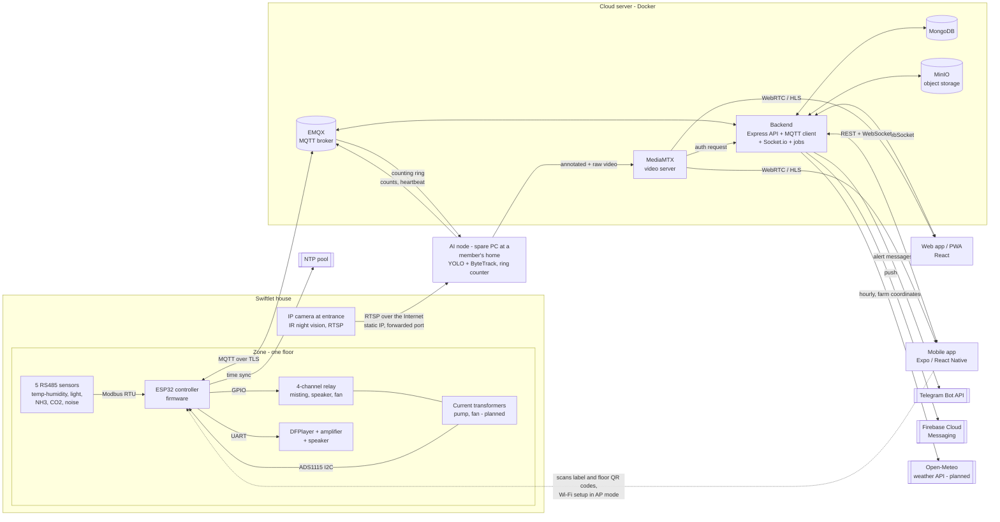
```mermaid
flowchart LR
  subgraph HOUSE[Swiftlet house]
    direction TB
    subgraph ZONE[Zone - one floor]
      S[5 RS485 sensors<br/>temp-humidity, light,<br/>NH3, CO2, noise]
      ESP[ESP32 controller<br/>firmware]
      R[4-channel relay<br/>misting, speaker, fan]
      SPK[DFPlayer + amplifier<br/>+ speaker]
      CT[Current transformers<br/>pump, fan - planned]
      S -- Modbus RTU --> ESP
      ESP -- GPIO --> R
      ESP -- UART --> SPK
      R --- CT
      CT -- ADS1115 I2C --> ESP
    end
    CAM[IP camera at entrance<br/>IR night vision, RTSP]
  end
  AINODE[AI node - spare PC at a<br/>member's home<br/>YOLO + ByteTrack, ring counter]
  subgraph CLOUD[Cloud server - Docker]
    direction TB
    EMQX[(EMQX<br/>MQTT broker)]
    API[Backend<br/>Express API + MQTT client<br/>+ Socket.io + jobs]
    DB[(MongoDB)]
    MINIO[(MinIO<br/>object storage)]
    MTX[MediaMTX<br/>video server]
  end
  WEB[Web app / PWA<br/>React]
  MOB[Mobile app<br/>Expo / React Native]
  TG[[Telegram Bot API]]
  FCM[[Firebase Cloud<br/>Messaging]]
  NTP[[NTP pool]]
  WX[[Open-Meteo<br/>weather API - planned]]

  ESP <-- MQTT over TLS --> EMQX
  CAM -- RTSP over the Internet<br/>static IP, forwarded port --> AINODE
  AINODE -- counts, heartbeat --> EMQX
  EMQX -- counting ring --> AINODE
  AINODE -- annotated + raw video --> MTX
  EMQX <--> API
  API <--> DB
  API <--> MINIO
  MTX -- auth request --> API
  API <-- REST + WebSocket --> WEB
  API <-- REST + WebSocket --> MOB
  MTX -- WebRTC / HLS --> WEB
  MTX -- WebRTC / HLS --> MOB
  API -- alert messages --> TG
  API -- push --> FCM
  ESP -- time sync --> NTP
  API -- hourly, farm coordinates --> WX
  MOB -. scans label and floor QR codes,<br/>Wi-Fi setup in AP mode .-> ESP
```

Redis is started by `docker-compose.yml` but no module uses it yet (reserved); it is therefore not part of the architecture.

### 2.2 Main Data Flows

| # | Flow | Path | Notes |
| --- | --- | --- | --- |
| DF-1 | Telemetry | Sensors → ESP32 (1 Hz, filtered) → MQTT `…/{zone}/telemetry` → backend → MongoDB (1 sample / 10 s) and Socket.io `TELEMETRY_UPDATE` | While the broker is unreachable the ESP32 buffers 1 sample / 10 s in flash (ENV-FR-024) |
| DF-2 | Control | ESP32 decides every 10 s locally (fuzzy) → relays → `relay/status` → backend → `RELAY_UPDATE` | The cloud never closes the control loop (C-1) |
| DF-3 | Configuration | User changes thresholds / coefficients / detection parameters → backend validates and stores with history → MQTT `config/update` → ESP32 clamps and stores in NVS | Full configuration is pushed again when a device reconnects |
| DF-4 | Device alerts | ESP32 detects pump-dry, speaker failure, sensor/bus fault, noise anomaly, power loss → MQTT `alert` → `createAlert()` → `ALERT_NEW`, Telegram, push, in-app inbox | One open alert per incident (ALERT-FR-008) |
| DF-5 | Inferred alerts | Backend jobs: offline (10 s), sensor anomaly and forecast (10 min), return rate (daily) → `createAlert()` | Inferred types stay MEDIUM/LOW and go to the expert's queue |
| DF-6 | Bird counts | Camera RTSP → AI node → MQTT `{house}/vision/bird-count` (session every 30 s, 5-minute buckets) → backend → `BIRD_COUNT_UPDATE` | Counts belong to the house |
| DF-7 | Live video | AI node publishes annotated stream to MediaMTX → viewer gets a 60-second token from the API → MediaMTX asks `POST /internal/stream-auth` → stream to the browser | Video never passes through the backend |
| DF-9 | Device setup | Administrator adds the device to the stock and prints its label → Farm Owner scans the label and the floor code in the mobile app → `POST /devices/sensor-nodes/register` (device `PENDING`) → Wi-Fi entered in AP mode → first heartbeat, still on the default topic → backend sends `config/reassign` with the registered zone → controller restarts on the zone topic → `config/update` → heartbeat reports the configuration version → app shows "configuration applied" | Nothing about the farm is typed on the device (FARM-FR-003c); the same correction moves an offline controller when it reconnects |
| DF-10 | Daily health assessment (MF-11) | After the evening return-rate check: per house, environment in range (telemetry of each zone), air-quality hours and noise episodes (alerts), return-rate drop (counts), data completeness and the day's weather → levels of the house (BR-28) → combined status with reasons (BR-29, 30) → `house_health_days` → daily report → in-app notification → each assessor rates the day before seeing the status (BR-31) | Weekly and monthly reports aggregate the stored days; the field evaluation reads ratings and statuses (ANALYTICS-FR-014) |
| DF-11 | Weather | Hourly job → Open-Meteo by farm coordinates → `weather_observations` (90 days) → charts and DF-10 | Only coordinates leave the system; never used for control (C-6) |
| DF-8 | Expert loop | Health report job (weekly) and inferred alerts → expert verdict, tuning, conclusion → notifications to the Farm Owner | EXPERT-FR-003…011 |

---

## 3. Technology Declaration

### 3.1 Third-Party Services

| Service | Purpose | Data sent | Status |
| --- | --- | --- | --- |
| Telegram Bot API | Out-of-app alert channel (ALERT-FR-013) | Chat ID of the linked user, alert title, message, farm and zone names | Implemented; needs `TELEGRAM_BOT_TOKEN` |
| Firebase Cloud Messaging | Mobile push notifications (ALERT-FR-002) | Device token, alert title and message | Backend adapter logs only; mobile token registration not built |
| Open-Meteo | Weather context: hourly outdoor temperature, humidity, rainfall (ANALYTICS-FR-013) | Latitude and longitude of the farm only | Planned. `[TEAM: confirm the terms of use for this project]` |
| NTP (`pool.ntp.org`) | Clock of the ESP32 for the speaker schedule and hourly noise baseline | Time request only, no user data | Implemented |
| SMTP e-mail provider | OTP, password reset and invitation e-mails | E-mail address, one-time code or link | Not wired: codes are logged in development |
| Roboflow | Annotation of the training images: draft labels from motion tracks are uploaded and corrected by hand | Frames extracted from the team's own entrance clips (masked, no people, no personal data) | In use for the first dataset |
| Google Colab | Training the detection model (Ultralytics) and exporting it to ONNX | The labelled dataset | Planned for the first trained model |

Self-hosted components (no data leaves the operator's servers): EMQX, MongoDB, MinIO, MediaMTX, Redis (reserved, not used yet).

### 3.2 Development Technologies

| Layer | Technology | Version (from the repository) |
| --- | --- | --- |
| Firmware | ESP32 (ESP32-WROOM-32D), Arduino framework on FreeRTOS, PlatformIO `espressif32` | Arduino-ESP32 core 2.0.17; firmware 1.4.0 |
| Firmware libraries | PubSubClient, ArduinoJson, ModbusMaster, DFRobotDFPlayerMini, ElegantOTA; planned: Adafruit ADS1X15 for the current transformers | ^2.8, ^7.0, ^2.0.1, ^1.0.6, ^3.1 |
| Controller board (planned) | Team-designed PCB: ESP32, RS485 transceiver, relay drivers, ADS1115 16-bit ADC with two clamp-on current transformers (SCT-013 or ZMCT103C class, isolated from mains) | `[TEAM: board revision]` |
| AI pipeline | Python, OpenCV, NumPy, ONNX Runtime, supervision (ByteTrack), paho-mqtt, PyYAML, loguru; detection model YOLO26n exported to ONNX (one class, trained on Colab; `torch`/`ultralytics` are not runtime dependencies) | Python 3.11–3.12; opencv-python ≥ 4.14 < 5; numpy ≥ 1.26 < 3; onnxruntime 1.30; supervision 0.30; paho-mqtt 2.x |
| Backend | Node.js, TypeScript, Express, Mongoose, mqtt.js, Socket.io, node-cron, jsonwebtoken, bcryptjs | Node 22, TypeScript ^5.4, Express ^4.19, Mongoose ^8.3, mqtt ^5.6, Socket.io ^4.7, node-cron ^3.0 |
| Web | React, Vite, TailwindCSS, TanStack Query, Zustand, axios, socket.io-client, React Router; `qrcode` (device labels, floor codes), `html5-qrcode` (scanning in the browser), `jspdf` + `jspdf-autotable` (health report PDF) | React ^18.3, Vite ^5.3, Tailwind ^3.4, TanStack Query ^5.40, Zustand ^4.5, React Router ^6.23, qrcode ^1.5.4, html5-qrcode ^2.3.8, jspdf ^2.5.1, jspdf-autotable ^3.8.2 |
| Mobile | Expo (Router), React Native; `expo-camera` for scanning device labels and floor codes | Expo ~53, React Native 0.79.6, React 19.0 |
| Database and infrastructure | MongoDB, EMQX, MinIO, MediaMTX (Docker images) | mongo 7.0, emqx 5.7.0, minio latest, mediamtx 1.21.1 |
| Testing | Jest + mongodb-memory-server (backend, mobile), Vitest (web), Unity on host `pio test -e native` (firmware), pytest (AI pipeline) | Jest ^29.7, Vitest ^1.6 |

### 3.3 Source Code and DevOps

| Item | Choice |
| --- | --- |
| Platform | GitHub, repository `NBao261/SwiftletCare_KLTN` |
| Branches | `develop` is the integration branch (default); `main` receives releases for production. Work branches `feat/…`, `fix/…`, `docs/…`, `chore/…`, `hotfix/…` (`docs/github-setup.md`) |
| Branch rules | `develop`: pull request with 1 approval, stale reviews dismissed, no force push, no deletion. `main`: pull request with code-owner approval, required status checks, linear history, push restricted to the owner |
| Commits | Conventional Commits with a project `type`/`scope` list, checked by commitlint in CI (`.commitlintrc.json`) |
| CI (`.github/workflows/ci.yml`) | On every pull request: commitlint, gitleaks secret scan, then only for the modules the PR touches: backend `lint`, `build:check`, `npm test` (unit + integration on mongodb-memory-server, 80 % line coverage); web `lint`, `tsc`, `vitest`, `build`; firmware `pio test -e native`; mobile `lint`, `typecheck`, `jest`. AI pipeline `pytest` (job added by pull request #89) |
| Code review | Every PR is reviewed against the module's own rules (`*/CLAUDE.md`), with an automated review routine (`.claude/commands/review-pr.md`) plus one human approval |
| CD | No automated deployment: staging and production are deployed by hand from a tag (Section 11) |

### 3.4 Deployment Environments

| Environment | Where | How it is deployed | Rollback |
| --- | --- | --- | --- |
| Development | Each member's machine | `docker compose up -d` (MongoDB, EMQX, MinIO, MediaMTX), `npm run dev` for backend and web, Expo for mobile, ESP32 flashed over USB or LAN OTA | — |
| Staging | One rented VPS (2 vCPU, 4 GB RAM, ≥ 60 GB SSD, Ubuntu 24.04 LTS) in Singapore or Vietnam, `[TEAM: provider]`, with a domain `[TEAM: domain]` and four names: `app.`, `api.`, `stream.`, `mqtt.`. The AI node is the team's spare PC at a member's home, reading the camera over the Internet (Section 11) | From the tag being demonstrated: `docker compose -f docker-compose.staging.yml up -d --build` (backend and web built into images, Caddy reverse proxy with Let's Encrypt TLS, a TLS proxy for MQTT and the video publish, EMQX, MongoDB, MinIO, MediaMTX); pending `npm run migrate:*` scripts run once; demo data loaded by the seed script. Procedure: `docs/deploy/staging.md` | Re-deploy the previous tag with the same command; restore the `mongodump` taken just before the deployment |
| Production | Not operated commercially (Report 3, Section 8) | Same procedure as staging from `main` | Same as staging. Controller firmware rolls back by itself when a new image does not reach the broker within 10 min (FARM-FR-013) |

Defense 1.1 demonstrations run on staging with seeded data (guideline §9.2).

### 3.5 AI Tools

| Tool | Model | Used in |
| --- | --- | --- |
| Claude Code | `[TEAM: model]` | Specification (SRS restructuring), design (this SDD, diagrams), code (backend, firmware, pipeline), tests, pull-request review |
| `[TEAM: other tools]` | `[TEAM]` | `[TEAM]` |

Every AI output merged into `develop` passes code review and CI first (guideline §10).

---

## 4. Key Design Decisions

| ID | Decision | Options considered | Chosen and rationale | Related |
| --- | --- | --- | --- | --- |
| D1 | Where the control loop runs | Cloud decides and sends commands; ESP32 decides locally | **ESP32 decides locally** every 10 s; the cloud only configures. Control keeps working without the Internet, which the registration commits to | ENV-FR-010, 011, 014, C-1 |
| D2 | Control method | On/off thresholds; PID; fuzzy logic | **Zero-order Sugeno fuzzy logic with time-proportioning** on relays: smooth power levels with plain relays, parameters a domain expert can read and tune; mirrored in the backend for simulation and suggestions | ENV-FR-010, 011, 021, ANALYTICS-FR-010 |
| D3 | Device–cloud protocol | HTTP polling; WebSocket; MQTT | **MQTT (EMQX) with TLS**, QoS 1 for commands, `deviceId` in every payload; topics per zone for controllers and per house for AI nodes. Light on the ESP32, survives intermittent links | Section 7.2 |
| D4 | Database | Relational (PostgreSQL); time-series DB; MongoDB | **MongoDB** with Mongoose: telemetry as documents with TTL (90 days), flexible embedded histories (thresholds, tuning), one store for the whole system; schema enforced by `$jsonSchema` validators generated from the models | Section 6 |
| D5 | Where bird counting runs | Raspberry Pi at the house; cloud GPU server fed by the camera stream; desktop PC at the house; **the team's spare PC at a member's home** | **Spare PC at a member's home, reading the camera over the Internet**: no new hardware and more compute than a Raspberry Pi, no paid GPU server, and the machine stays dry and is maintained where the team lives instead of in a humid house nobody visits. The house's VNPT line has a static public IP, so the camera's RTSP feed (1080p, about 2 Mbps) is pulled over TCP through one forwarded port. Costs: the house's uplink carries the feed during the sessions; an outage of either line leaves the session incomplete (VISION-FR-020); the forwarded port must be protected (strong camera password, source IP limited where the modem allows). Checked by a 24-hour pull test and by counting the same clip read locally and over the Internet; throughput is measured on this PC (NFR-04). One camera per entrance, counts per house | VISION-FR-002, 020, THREAT-FR-010, NFR-04 |
| D6 | Counting geometry | Straight virtual line; ring around the hole with tracking only near it; ring with whole-frame tracking | **Whole-frame tracking and a closed ring around the hole, with extrapolation of fast tracks**: birds leave the hole in every direction, so a line misses some; at the hole a bird is a 1–2-frame blur moving 150–200 px/frame (clip of 22/10/2026), so tracking near the hole alone never gives it an identity — tracked over the whole room it already has one, and a fast track lost just outside the ring is counted by its last velocity. Fly-pasts cancel in the net count | VISION-FR-004, 005, 009, 018, BR-25 |
| D7 | Expert in the loop | Expert approval blocks every change; changes apply at once with no review | **Owner changes apply at once and open a review item; only the expert applies system suggestions; without an expert the owner decides** — safety on site is never blocked and every parameter is still validated | EXPERT-FR-010, 011, BR-22 |
| D8 | Live video path | Through the backend; dedicated video server | **MediaMTX** with short-lived viewing tokens checked by the backend: the API never carries video, raw feed only for the pipeline | VISION-FR-013 |
| D9 | Device identity and setup | Technician types device ID and key on a web console; QR code shown on the controller's AP-mode page; small display on the board; Bluetooth (BLE) provisioning; **printed label QR code plus a code on each floor** | **Printed label with device ID and activation key, and a floor code**: the ESP32 has no display or code of its own, and a label needs no hardware or firmware change because the key is checked only by the backend and never stored on the controller. Floors share one Wi-Fi network, so the floor cannot be told by radio; scanning its code replaces choosing from a list. The backend already corrects a controller's topic at its heartbeat, so farm, house and zone are never entered on the device, and an offline move needs no visit. A display or BLE would add hardware or much more firmware for the same two steps. Optional later: derive the device ID from the factory MAC address so every board runs one firmware image | FARM-FR-003, 003c, 007, 007b, 010, 011, 012, BR-26, 27 |
| D10 | How the sources are combined into a house's health | Weighted health score; classifier trained on labelled days; **transparent rules with agreement between sources** | **Rules with agreement**: no source gives weights, and there are no labelled days to train on yet; each source is compared with the house's own past or with sourced ranges, a status needs two sources to reach `ACTION`, every status lists the indicators behind it, and the levels are set by the expert. The rules are judged by agreement with practitioners' independent ratings (NFR-14); a learned model can be tried later on the rated days | ANALYTICS-FR-012, 014, BR-28…31 |
| D11 | Actuator current sensing | None (infer from humidity); Hall-effect IC in the mains path (ACS712); **clamp-on current transformer with an external ADC** | **Current transformer + ADS1115**: isolated from mains, so no mains track crosses the logic board; non-invasive on existing wiring; the ESP32's own ADC is not linear enough. Normal current is learned per load, so no threshold is invented for an unknown pump or fan | THREAT-FR-014, BR-32 |
| D12 | Outdoor conditions | Outdoor sensor node; **weather API**; none | **Weather API (Open-Meteo)** by farm coordinates: no hardware, includes rainfall, which a node does not measure easily and which explains low return rates; it is a regional estimate, so it is context only. An outdoor node stays optional | ANALYTICS-FR-013, BR-30, C-6 |
| D13 | Report files | Server-side PDF; **PDF in the web client, CSV from the API** | **`jspdf` in the web client** (already a dependency) renders the report the API returns, so the file shows the same figures as the screen; the CSV of daily indicators is produced by the API so every client gets the same columns | EXPERT-FR-013 |
| D14 | Scope of the supporting roles | Maintenance tickets with routing by region, SLA and KPIs; Technician invited into each farm by its owner; **Technician sees every farm's devices, without relay control** | **Technician on every farm, devices only**: tickets, SLA, regions and KPIs serve a service company with many customers, not the house (Review 1: "more a platform than a system"); an invitation per farm adds a step for every repair. The risk of a role that is not a farm member is limited by what it can do: no relays, thresholds, coefficients or alert acknowledgement, no environmental data, and every device action is audited and notified to the Farm Owners. Faults reach the owner as repeated alerts instead of tickets | FARM-FR-009, 013, ALERT-FR-015, 016, Report 3 §2.4 |

The Design Brief (BM01, section 3) proposes five of these.

---

## 5. Component Design

### 5.1 Firmware (ESP32 controller)

FreeRTOS tasks pinned to core 1:

| Task | Priority | Does |
| --- | --- | --- |
| `SensorTask` | 2 | Every 1 s: read the five Modbus sensors (`sensors/SensorManager`), mark stale readings, filter temperature and humidity (`sensors/SignalFilter`: median 5 + scalar Kalman), update the hourly noise baseline and detect abnormal noise (`sensors/NoiseAnomalyDetector`); while the broker is unreachable, append the sample to the offline buffer (`storage/StorageManager`, SPIFFS, 1 sample / 10 s, 256 KB) |
| `PIDTask` | 3 | Every 10 s: speaker schedule (`audio/AudioManager`), override expiry, fuzzy misting and fan demand (`pid/FuzzyControl`) with time-proportioning, pump-dry monitor (`pid/PumpDryMonitor`), safe state on missing inputs; applies relays in the precedence of BR-19 and publishes device alerts (pump dry, speaker failure, sensor and bus faults) |
| `MQTTTask` | 1 | Wi-Fi and TLS MQTT session; publishes telemetry, heartbeat (with diagnostics) and relay status, and `POWER_OUTAGE` once after an unexpected restart; flushes the offline buffer after reconnecting; receives commands (`relay/command`, `audio/command`, `config/update`, `config/reassign`) and remote RESTART / OTA with SHA-256 check and rollback (`ota/RemoteCommand`, `ota/RemoteOta`) |
| `loop()` | — | Feeds the task watchdog (30 s); serves the Wi-Fi captive portal (`wifi/WiFiProvisioner`) while it is open, and reopens it when the broker stays unreachable so a new broker address can be entered |

Planned (THREAT-FR-014): `SensorTask` also reads the pump and fan currents from the ADS1115 every second; `PIDTask` learns each load's normal current during its first ON period and compares the current with the relay state (BR-32); telemetry carries both currents and the check raises `ACTUATOR_FAULT`.

Configuration (`config/Config`) is stored in NVS and every received value is clamped to the same ranges as the backend validator. Pure C++ parts (fuzzy, filter, noise detector, pump-dry monitor, remote command) are unit-tested on the host.

### 5.2 AI Pipeline (AI node)

`stream.py` (RTSP or clip loop) runs `pipeline.py` (`FramePipeline`) on every frame: `frame_prep.py` masks the camera's date overlay and cuts the frame into 2 overlapping tiles → `inference.py` runs YOLO (ONNX) on each tile and merges the duplicates of the overlap → `sv.ByteTrack` tracks every bird over the whole frame (boxes enlarged before matching, because a small fast bird's boxes in consecutive frames do not overlap) → `counting.py` (`RingCounter`) counts ring crossings, extrapolates fast tracks at the hole and keeps ambiguous tracks apart → the frame is drawn with green boxes and the yellow ring. `remote_config.py` listens on `{house}/config/update` and swaps in a new ring without restart. The same `FramePipeline` is used by `tools/track_clip.py`, so a recorded clip is processed exactly like the live stream. Dataset tools: `tools/pick_roi.py` (ring calibration), `tools/extract_frames.py` (masked tile images and draft labels from motion tracks for Roboflow), `tools/split_by_day.py` (train/val/test split by recording day).

`stream.py` (pull request #89, on `develop` through #95) reads the latest frame in its own thread and reconnects with back-off, switches sessions in Vietnam time and keeps them in `state.json` across restarts, publishes session counts, 5-minute buckets (`BucketClock`) and heartbeats over MQTT on the house topics, serves an MJPEG preview on localhost and pushes the annotated stream to MediaMTX with ffmpeg (`stream_pusher.py`). Report 3 moves session totals to the backend (VISION-FR-008, 019): the pipeline's own session windows stay as defaults until the backend computes sessions from the buckets (Section 12).

### 5.3 Backend

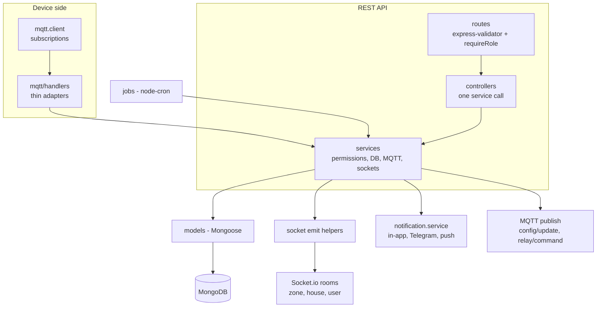
```mermaid
flowchart TB
  subgraph HTTP[REST API]
    RT[routes<br/>express-validator + requireRole] --> CT[controllers<br/>one service call] --> SV[services<br/>permissions, DB, MQTT, sockets]
  end
  subgraph IO[Device side]
    MQ[mqtt.client<br/>subscriptions] --> HD[mqtt/handlers<br/>thin adapters] --> SV
  end
  JOBS[jobs - node-cron] --> SV
  SV --> MD[models - Mongoose] --> DB[(MongoDB)]
  SV --> EMIT[socket emit helpers] --> WS[Socket.io rooms<br/>zone, house, user]
  SV --> NOTI[notification.service<br/>in-app, Telegram, push]
  SV --> PUB[MQTT publish<br/>config/update, relay/command]
```

Layer rules: only services query the database, check permissions, publish MQTT and emit socket events; controllers hold no logic; every route validates input and declares its roles (`backend/CLAUDE.md`).

| Service group | Services | Requirements |
| --- | --- | --- |
| Identity and access | `auth`, `admin`, `farmAccess.util` | AUTH-FR-*, Section 2.4 of Report 3 |
| Structure and devices | `farm`, `device`, `audioTrack`, `stream` | FARM-FR-*, ENV-FR-016…021, VISION-FR-013, 018 |
| Telemetry and control | `telemetry`, `fuzzyModel.util` | ENV-FR-001…005, ANALYTICS-FR-008, 010 |
| Alerts and notifications | `alert`, `sensorAnomaly`, `forecast`, `notification`, `telegram`, `relayUsage` | ALERT-FR-*, THREAT-FR-009, 010 |
| Flock | `birdCount` | VISION-FR-006…012, 017 |
| Analytics and expert | `analytics`, `healthReport`; planned: `healthAssessment`, `weather` | ANALYTICS-FR-*, EXPERT-FR-* |
| Supporting | `system`, `harvest` | SYSTEM-FR-*, MARKET-FR-* |

Background jobs:

| Job | Schedule | Does |
| --- | --- | --- |
| `deviceOffline` | every 10 s | Controller silent > 30 s → `OFFLINE` + `NODE_OFFLINE`; AI node silent > 90 s → `OFFLINE` + `EDGE_AI_DEGRADED` |
| `overrideExpiry` | every 1 min | Expired overrides back to `AUTO` |
| `alertEscalation` | every 2 min | Unacknowledged CRITICAL/HIGH after 15 min, `NODE_OFFLINE` after 1 h → sent once more to the Farm Owners (ALERT-FR-015); automatic resolution of breaches and episodic alerts |
| `sensorAnomaly` | every 10 min | Stuck, jumping and drifting sensors → `SENSOR_ANOMALY` |
| `forecast` | every 10 min | 60-minute forecast → `FORECAST_BREACH` |
| `returnRate` | daily 19:15 (default windows) | House return rate vs previous days → `LOW_RETURN_RATE` |
| `healthReport` | weekly (Mon 06:00); target daily, weekly, monthly (BR-33) | Health reports, notifications. Code: weekly per zone; target: per house with zone sections |
| `healthAssessment` (planned) | daily, after `returnRate` | Daily health status of every house (ANALYTICS-FR-012) |
| `weather` (planned) | hourly | Weather of every farm with coordinates (ANALYTICS-FR-013) |
| `activationOverdue` | every 1 min | Devices not activated in 15 min; OTA unconfirmed after 30 min |
| `relayUsage` | hourly | Pump and fan ON time and switch count since the last service → `MAINTENANCE_DUE` (ALERT-FR-016) |
| `invitationExpiry` | hourly | Invitations older than 7 days → `EXPIRED` |

### 5.4 Web and Mobile

Both clients follow the same pattern: TanStack Query for server state, Zustand for session state, axios for REST, socket.io-client for real-time events, one route group per role. The web application is a PWA; the mobile application uses Expo Router. The web has Farm Owner, Administrator, Technician and Domain Expert screens (the last since pull request #91); the Farm Owner's Vision page plays the annotated stream over WHEP with a token from the API (pull request #93). The counting-ring editor and the mobile screens are still to be built (Section 12).

Health (MF-11): web and mobile show each house's daily status with its reasons and the rating screen, which asks for the assessor's own status before revealing the system's (BR-31); the web exports a report as PDF with `jspdf` and downloads the daily indicators as CSV from the API.

Device setup (MF-10): the mobile app scans the device label and the floor code with `expo-camera`, fills in the registration, guides Wi-Fi provisioning in AP mode and shows the setup progress (FARM-FR-012) from the device status and the configuration sync state (SM-12). The Administrator's stock screen prints the label right after a device is added, because the API returns the activation key only then; the zone screen prints floor codes. Both QR codes are generated in the client with `qrcode` from values the API already returns, so there is no QR endpoint. Formats: `swiftletcare://claim?d=<device ID>&k=<activation key>` and `swiftletcare://zone?z=<zone ID>`; a scan in the web console (`html5-qrcode`) reads the same formats.

---

## 6. Data Design

### 6.1 Logical ERD

```mermaid
erDiagram
  USER {
    ObjectId _id PK
    string email UK
    string role "ADMIN | FARM_OWNER | DOMAIN_EXPERT | TECHNICIAN"
    string full_name
    bool is_active
    string telegram_chat_id
  }
  FARM {
    ObjectId _id PK
    ObjectId owner_id FK
    string name
    array members "embedded: user_id, role, is_primary"
    bool is_deleted
  }
  INVITATION {
    ObjectId _id PK
    ObjectId farm_id FK
    ObjectId invited_by FK
    string invited_role
    string status "PENDING | ACCEPTED | DECLINED | EXPIRED"
    date expires_at
  }
  HOUSE {
    ObjectId _id PK
    ObjectId farm_id FK
    string name
    object bird_count_tuning "return_rate_drop_pct"
    object counting_schedule "planned: seasonal profiles, temporary windows"
    object health_levels "planned: BR-28 levels"
    array bird_count_tuning_history
  }
  ZONE {
    ObjectId _id PK
    ObjectId house_id FK
    ObjectId farm_id FK
    string name
    object thresholds
    object fuzzy_tuning
    object detection_tuning
    number config_version "planned"
    array threshold_history
    array fuzzy_tuning_history
    array detection_tuning_history
  }
  SENSOR_NODE {
    ObjectId _id PK
    string device_id UK
    ObjectId zone_id FK
    string status "PENDING | ONLINE | OFFLINE"
    string control_mode "AUTO | MANUAL"
    object relay_states
    date override_expiry
    string firmware_version
    date last_heartbeat
    date decommissioned_at
    number applied_config_version "planned"
    object actuator_baseline "planned: learned current per load"
    object ota_pending "version, requested_at"
    object ota_failed "version, failed_at"
  }
  CAMERA_NODE {
    ObjectId _id PK
    string device_id UK
    ObjectId house_id FK
    string status
    object counting_ring
    array counting_ring_history
  }
  PROVISIONED_DEVICE {
    ObjectId _id PK
    string device_id UK
    string kind "SENSOR | CAMERA"
    string secret_key_hash
  }
  TELEMETRY {
    ObjectId node_id FK
    ObjectId zone_id FK
    date timestamp "TTL 90 days"
    number temperature
    number humidity
    number nh3_ppm
    number co2_ppm
    number light_lux
    number sound_db
    number misting_pct
    number ventilation_pct
  }
  RELAY_OVERRIDE_LOG {
    ObjectId _id PK
    ObjectId node_id FK
    ObjectId zone_id FK
    ObjectId started_by FK
    string relay
    bool state
    date started_at
    date expires_at
    string end_reason
  }
  AUDIO_TRACK {
    ObjectId _id PK
    ObjectId node_id FK
    number track_number
    bool synced_to_sd
  }
  ALERT {
    ObjectId _id PK
    ObjectId farm_id FK
    ObjectId zone_id FK "zone alerts"
    ObjectId house_id FK "house alerts"
    ObjectId node_id FK
    string type
    string severity
    string status "ACTIVE | ACKNOWLEDGED | DISMISSED (planned) | RESOLVED"
    string previous_status "planned"
    object expert_verdict "result, note, by, at"
    number occurrence_count
  }
  BIRD_COUNT_RECORD {
    ObjectId _id PK
    ObjectId camera_node_id FK
    ObjectId house_id FK
    string session_date
    string session_type "MORNING_EXIT | EVENING_ENTRY"
    number entry_count
    number exit_count
  }
  BIRD_COUNT_BUCKET {
    ObjectId camera_node_id FK
    ObjectId house_id FK
    date bucket_start "TTL 90 days"
    number entry_count
    number exit_count
  }
  ZONE_HEALTH_REPORT {
    ObjectId _id PK
    ObjectId farm_id FK
    ObjectId zone_id FK
    ObjectId house_id FK "planned: report per house"
    string kind "planned: DAILY | WEEKLY | MONTHLY | CUSTOM"
    date period_start
    date period_end
    object metrics
    object expert_conclusion "text, by, at"
  }
  HOUSE_HEALTH_DAY {
    ObjectId _id PK
    ObjectId house_id FK
    ObjectId farm_id FK
    string date "Vietnam day"
    object indicators "planned: environment, air, flock, noise, completeness"
    string status "planned: GOOD | WATCH | ACTION | INSUFFICIENT_DATA"
    array reasons
    array ratings "by, role, rating, note, at, status_shown"
    string state "planned: COMPUTED | RATED | UNRATED"
  }
  WEATHER_OBSERVATION {
    ObjectId _id PK
    ObjectId farm_id FK
    date hour "TTL 90 days"
    number temperature
    number humidity
    number precipitation_mm
  }
  NOTIFICATION {
    ObjectId _id PK
    ObjectId user_id FK
    string title
    object ref "alert | health_report"
    date read_at
    date created_at "TTL 90 days"
  }
  HARVEST_BATCH {
    ObjectId _id PK
    ObjectId farm_id FK
    ObjectId zone_id FK
    ObjectId created_by FK
    string trace_code UK
    date harvest_date
    number nest_count
    number weight_grams
    object env_snapshot
    object flock_snapshot
  }
  AUDIT_LOG {
    ObjectId _id PK
    ObjectId actor_id FK
    string action
    string target_type
    string target_id
  }
  PARAMETER_REVIEW {
    ObjectId _id PK
    ObjectId zone_id FK
    ObjectId changed_by FK
    string group "thresholds | fuzzy"
    object old_values
    object new_values
    string status "planned: PENDING_REVIEW | ACCEPTED | REVERTED | ADJUSTED"
  }
  COEFFICIENT_PROPOSAL {
    ObjectId _id PK
    ObjectId zone_id FK
    ObjectId submitted_by FK
    object suggested_values
    object current_values
    string status "planned: PROPOSED | APPROVED | REJECTED | SUPERSEDED"
    string note
  }
  SYSTEM_SETTING {
    bool _singleton UK
    object default_thresholds
    object sla_hours
  }

  USER ||--o{ FARM : "owns"
  FARM }o--o{ USER : "members"
  FARM ||--o{ INVITATION : "invites"
  FARM ||--o{ HOUSE : "has"
  HOUSE ||--o{ ZONE : "has floors"
  ZONE ||--o{ SENSOR_NODE : "controlled by"
  HOUSE ||--o{ CAMERA_NODE : "entrances"
  SENSOR_NODE ||--o{ TELEMETRY : "publishes"
  SENSOR_NODE ||--o{ RELAY_OVERRIDE_LOG : "overridden"
  SENSOR_NODE ||--o{ AUDIO_TRACK : "plays"
  ZONE ||--o{ ALERT : "zone alerts"
  HOUSE ||--o{ ALERT : "house alerts"
  CAMERA_NODE ||--o{ BIRD_COUNT_RECORD : "sessions"
  CAMERA_NODE ||--o{ BIRD_COUNT_BUCKET : "5-minute counts"
  ZONE ||--o{ ZONE_HEALTH_REPORT : "reported"
  USER ||--o{ NOTIFICATION : "receives"
  ZONE ||--o{ HARVEST_BATCH : "harvested"
  USER ||--o{ AUDIT_LOG : "acts"
  ZONE ||--o{ PARAMETER_REVIEW : "owner changes, planned"
  ZONE ||--o{ COEFFICIENT_PROPOSAL : "suggestions, planned"
  HOUSE ||--o{ HOUSE_HEALTH_DAY : "assessed daily, planned"
  FARM ||--o{ WEATHER_OBSERVATION : "weather, planned"
```

Entities and attributes marked *planned* are required by Report 3 (EXPERT-FR-010, 011, ENV-FR-027, VISION-FR-019, EXPERT-FR-003, ANALYTICS-FR-012, 013, EXPERT-FR-005, 012, THREAT-FR-014) but are not in the code or the database script yet; Section 6.4 lists them. The other way round, the ticket collections, the farm region and the Technician regions are still in the code and the database script until they are dropped (Section 6.4).

### 6.2 Collections

| Collection | Entity | Key indexes | Retention | Notes |
| --- | --- | --- | --- | --- |
| `users` | User | `email` unique | — | Password hash, OTP and reset hashes never returned by the API |
| `farms` | Farm | `owner_id`, `members.user_id` | Soft delete | Members embedded with role |
| `invitations` | Invitation | `token` unique; `farm_id + invited_email + status` | — | 7-day expiry by job |
| `houses` | House | `farm_id` | — | Bird-count tuning per house |
| `zones` | Zone | `house_id`, `farm_id` | — | `farm_id` immutable; histories embedded |
| `sensornodes` | Controller | `device_id` unique; `zone_id`; `status + last_heartbeat` | Decommission flag | Relay state, override expiry, diagnostics |
| `cameranodes` | AI node / camera | `device_id` unique; `house_id` | — | Counting ring and its history |
| `provisioneddevices` | Device stock | `device_id` unique | — | Hash of the device key |
| `telemetries` | Telemetry | `zone_id + timestamp`; TTL on `timestamp` | 90 days | One stored sample per 10 s per device |
| `relayoverridelogs` | Override | `node_id + started_at`; `zone_id + started_at` | — | Source of the autonomy ratio |
| `audiotracks` | Attractant track | `node_id + track_number` unique | — | |
| `alerts` | Alert | `farm_id + zone_id + node_id + type + status`; partial `house_id + type + status`; TTL on `resolved_at` | 180 days after resolution | Expert verdict embedded |
| `birdcountrecords` | Session count | `camera_node_id + session_type + session_date` unique; `house_id + session_date` | — | Upserted every 30 s |
| `birdcountbuckets` | 5-minute count | `camera_node_id + bucket_start` unique; TTL | 90 days | |
| `zonehealthreports` | Health report | `zone_id + period_end` unique | — | Expert conclusion embedded |
| `notifications` | In-app notification | `user_id + created_at`; TTL | 90 days | |
| `harvestbatches` | Harvest | `trace_code` unique; `farm_id + harvest_date` | Soft delete | |
| `auditlogs` | Audit entry | `actor_id + created_at`, `target_type + target_id`, `action + created_at` | — | |
| `systemsettings` | Singleton settings | `_singleton` unique | — | Default thresholds |

The exact field list, types and indexes of every collection are those of the database script (6.5).

### 6.4 Planned Data Changes

| Change | Collection | Requirement |
| --- | --- | --- |
| New collection for reviews of a Farm Owner's change | `parameterreviews` | EXPERT-FR-010 (SM-10) |
| New collection for coefficient suggestion proposals | `coefficientproposals` | EXPERT-FR-011 (SM-11) |
| `config_version` on the zone, `applied_config_version` on the controller | `zones`, `sensornodes` | ENV-FR-027 (SM-12) |
| `DISMISSED` alert status and `previous_status` | `alerts` | EXPERT-FR-003 (SM-01) |
| Seasonal counting schedule; incomplete-session flag on session records | `houses`, `birdcountrecords` | VISION-FR-019, 020 |
| New collection for the daily health status of each house, with its indicators, reasons and ratings | `househealthdays` | ANALYTICS-FR-012, EXPERT-FR-012 (SM-17) |
| New collection for hourly weather, TTL 90 days | `weatherobservations` | ANALYTICS-FR-013 |
| Health-indicator levels per house | `houses` | BR-28 |
| Reports per house with `kind` (daily, weekly, monthly, custom) instead of weekly per zone | `zonehealthreports` (renamed when migrated) | EXPERT-FR-005 |
| Learned normal current per load; pump and fan current in telemetry; alert type `ACTUATOR_FAULT` | `sensornodes`, `telemetries`, `alerts` | THREAT-FR-014 |
| Drop the ticket collections, the farm region, the Technician regions and the SLA and routing settings; drop the ticket enumerations on all three sides | `tickets`, `ticketmessages`, `maintenanceschedules`, `farms`, `users`, `systemsettings` | Report 3 §8 (BM03 row 9) |
| Alert type `MAINTENANCE_DUE`; relay usage counters restart at the Farm Owner's acknowledgement | `alerts`, `sensornodes` | ALERT-FR-016 |
| Remove the unused enumeration values `ERROR`, `DEGRADED` (device) and `ARCHIVED` (harvest), or give them a requirement | `sensornodes`, `cameranodes`, `harvestbatches` | Known gap |

The database script is regenerated from the models when these changes are made (6.5).

### 6.5 Database Script

`docs/database/init.mongo.js` creates every collection with a `$jsonSchema` validator (types, required fields, enumerations, nested objects and arrays) and all indexes, including unique, partial and TTL indexes. It is **generated from the Mongoose models** by `npm run db:script` (`backend/src/utils/dbScript.util.ts`), so the script, the ERD entities above and the code describe the same data:

- `tests/unit/utils/dbScript.util.test.ts` fails if the committed script differs from what the models produce, so a model change cannot be merged without regenerating it;
- `tests/integration/databaseScript.test.ts` enforces the validators (`validationLevel: strict`, `validationAction: error`) on a MongoDB instance and writes real documents through the models, and checks that a document missing a required field is rejected.

Run: `mongosh "<MONGODB_URI>" docs/database/init.mongo.js` (safe to run twice). Seed data for demonstrations: `npm run seed`.

---

## 7. Interface Design

### 7.1 REST API

The full contract (paths, parameters, bodies, responses, roles) is `docs/api/api-spec.yaml`. Every response uses `{ success, data?, meta?, error? }`; lists paginate (default 20, max 100); routes are unprefixed.

| Router | Main resources |
| --- | --- |
| `/auth` | Register, login, refresh, logout, OTP, password reset, notification preferences, Telegram link, deletion request |
| `/farms` | Farms, members, houses, zones, thresholds and reset, fuzzy tuning, detection tuning, bird-count tuning |
| `/invitations` | Accept, decline |
| `/devices` | Sensor nodes (register and move, also by the Farm Owner for MF-10; relay override, speaker schedule, audio tracks, remote commands, history), camera nodes (register, counting ring, stream token) |
| `/telemetry` | Latest and history |
| `/alerts` | List, detail, acknowledge, verdict, verdict statistics |
| `/analytics` | Charts, comparison, control performance, forecast, coefficient suggestion, autonomy, bird counts (current, daily, trends, buckets, correlation) |
| `/health-reports` | Reports and conclusions; planned: daily, weekly and monthly reports per house, daily health statuses of a house, a rating of a day, CSV of daily indicators (routes added to `api-spec.yaml` with the code) |
| `/notifications` | Inbox, mark read |
| `/harvests` | Harvest batches |
| `/admin`, `/system` | Provisioned-device stock (add and return the activation key once, revoke, re-issue key), accounts, Technician accounts, deletion requests, default thresholds, audit log, technical overview |
| `/internal/stream-auth` | MediaMTX authorisation (no user token, blocked from outside by the reverse proxy) |

### 7.2 MQTT

| Topic | Direction | Payload (main fields) | QoS |
| --- | --- | --- | --- |
| `swiftletcare/{farm}/{house}/{zone}/telemetry` | ESP32 → cloud | `deviceId`, six readings, `control_output`, timestamp; planned: `pump_current_a`, `fan_current_a` | 0 |
| `…/{zone}/heartbeat` | ESP32 → cloud | `deviceId`, firmware version, RSSI, free heap, uptime, reset reason, IP | 0 |
| `…/{zone}/relay/status` | ESP32 → cloud | `deviceId`, relay states, control mode | 0 |
| `…/{zone}/alert` | ESP32 → cloud | `deviceId`, type, severity, details (planned type `ACTUATOR_FAULT`) | 0 |
| `…/{zone}/relay/command` | cloud → ESP32 | `deviceId`, relay, state, duration, or `clear_override` | 1 |
| `…/{zone}/config/update` | cloud → ESP32 | Thresholds, fuzzy and detection parameters (zone-wide), speaker settings or `RESTART`/`OTA` (with `deviceId`) | 1 |
| `…/{zone}/config/reassign`, `…/{zone}/audio/command` | cloud → ESP32 | `deviceId`, new zone / play-stop. `config/reassign` is also sent by the backend itself when a heartbeat arrives on another topic than the registered zone (first connection, offline move; FARM-FR-003c) | 1 |
| `swiftletcare/{farm}/{house}/heartbeat` | AI node → cloud | `deviceId`, model version | 0 |
| `…/{house}/vision/bird-count` | AI node → cloud | Session counts every 30 s, or `kind: BUCKET` 5-minute counts | 1 |
| `…/{house}/vision/alert` | AI node → cloud | `EDGE_AI_DEGRADED` | 1 |
| `…/{house}/config/update` | cloud → AI node | `deviceId`, counting ring | 1 |

Ingestion keys off `deviceId` in the payload, not the topic; retained messages are ignored.

### 7.3 WebSocket (Socket.io)

Clients authenticate with the access token. Rooms: `zone:<id>` (`JOIN_ZONE`), `house:<id>` (`JOIN_HOUSE`) and the personal room `user:<id>`. Server events: `TELEMETRY_UPDATE`, `RELAY_UPDATE`, `DEVICE_STATUS_CHANGE`, `ALERT_NEW`, `BIRD_COUNT_UPDATE`, `NOTIFICATION_NEW`.

---

## 8. State Machine Diagrams

One diagram per lifecycle of Report 3, Section 6. Transition labels name the triggering requirement. Diagrams marked *planned* describe behaviour required by Report 3 that the code does not have yet (Section 12).

### 8.1 Alert — status (SM-01)

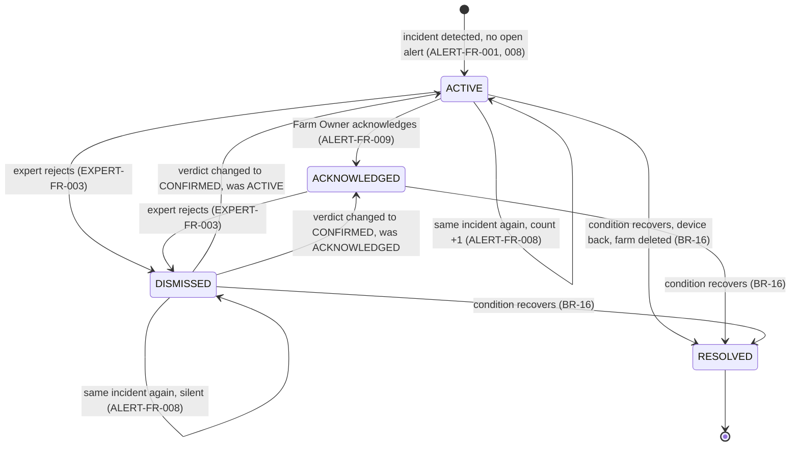
```mermaid
stateDiagram-v2
  [*] --> ACTIVE : incident detected, no open alert (ALERT-FR-001, 008)
  ACTIVE --> ACTIVE : same incident again, count +1 (ALERT-FR-008)
  ACTIVE --> ACKNOWLEDGED : Farm Owner acknowledges (ALERT-FR-009)
  ACTIVE --> DISMISSED : expert rejects (EXPERT-FR-003)
  ACKNOWLEDGED --> DISMISSED : expert rejects (EXPERT-FR-003)
  DISMISSED --> DISMISSED : same incident again, silent (ALERT-FR-008)
  DISMISSED --> ACTIVE : verdict changed to CONFIRMED, was ACTIVE
  DISMISSED --> ACKNOWLEDGED : verdict changed to CONFIRMED, was ACKNOWLEDGED
  ACTIVE --> RESOLVED : condition recovers, device back, farm deleted (BR-16)
  ACKNOWLEDGED --> RESOLVED : condition recovers (BR-16)
  DISMISSED --> RESOLVED : condition recovers (BR-16)
  RESOLVED --> [*]
```

`DISMISSED` is planned.

### 8.2 Alert — expert verdict (SM-02)

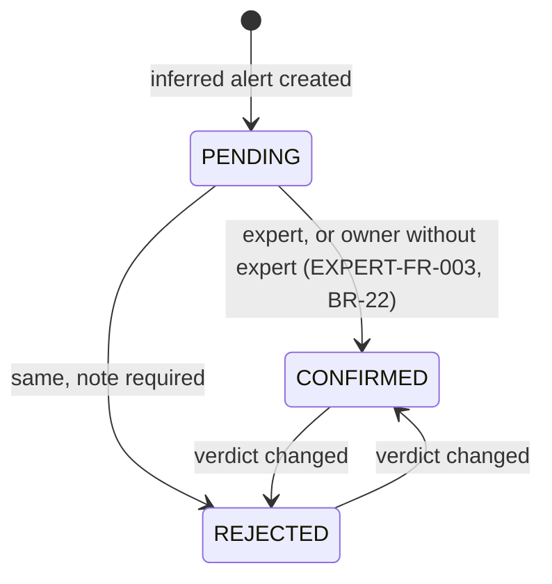
```mermaid
stateDiagram-v2
  [*] --> PENDING : inferred alert created
  PENDING --> CONFIRMED : expert, or owner without expert (EXPERT-FR-003, BR-22)
  PENDING --> REJECTED : same, note required
  CONFIRMED --> REJECTED : verdict changed
  REJECTED --> CONFIRMED : verdict changed
```

### 8.3 Relay — control mode (SM-03)

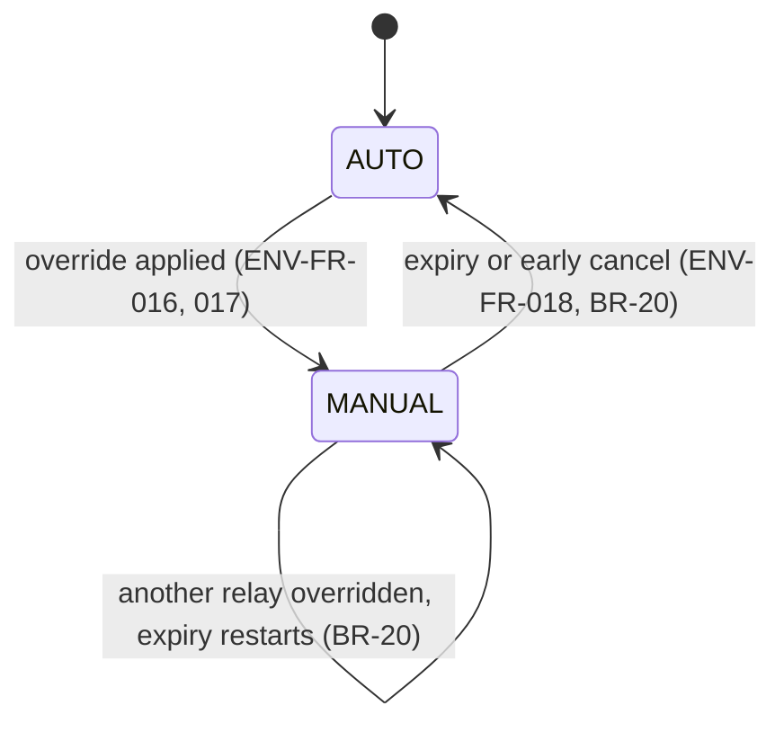
```mermaid
stateDiagram-v2
  [*] --> AUTO
  AUTO --> MANUAL : override applied (ENV-FR-016, 017)
  MANUAL --> MANUAL : another relay overridden, expiry restarts (BR-20)
  MANUAL --> AUTO : expiry or early cancel (ENV-FR-018, BR-20)
```

### 8.4 Invitation (SM-04)

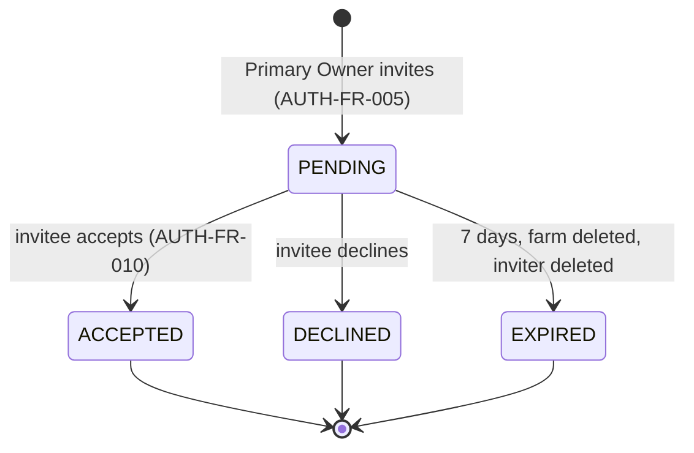
```mermaid
stateDiagram-v2
  [*] --> PENDING : Primary Owner invites (AUTH-FR-005)
  PENDING --> ACCEPTED : invitee accepts (AUTH-FR-010)
  PENDING --> DECLINED : invitee declines
  PENDING --> EXPIRED : 7 days, farm deleted, inviter deleted
  ACCEPTED --> [*]
  DECLINED --> [*]
  EXPIRED --> [*]
```

### 8.5 Ticket (SM-05, removed)

Removed with the maintenance tickets (Report 3, Sections 6.5 and 8). The number is kept so that SM-06…SM-17 keep theirs.

### 8.6 Device — connection status (SM-06)

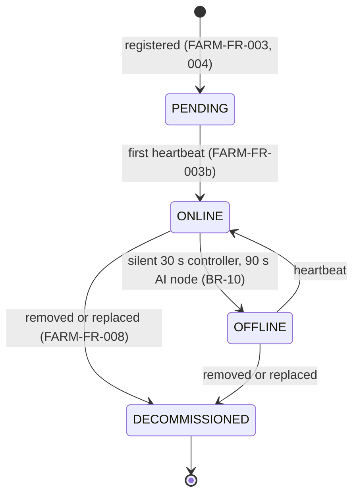
```mermaid
stateDiagram-v2
  [*] --> PENDING : registered (FARM-FR-003, 004)
  PENDING --> ONLINE : first heartbeat (FARM-FR-003b)
  ONLINE --> OFFLINE : silent 30 s controller, 90 s AI node (BR-10)
  OFFLINE --> ONLINE : heartbeat
  ONLINE --> DECOMMISSIONED : removed or replaced (FARM-FR-008)
  OFFLINE --> DECOMMISSIONED : removed or replaced
  DECOMMISSIONED --> [*]
```

Registration is done by the Farm Owner or a Technician (MF-10). A device still `PENDING` 15 min after registration stays `PENDING` and its registrant is notified (FARM-FR-012). `ERROR` and `DEGRADED` are declared in the device status enumeration but never assigned by the code; no requirement uses them (Section 12).

### 8.7 Misting protection (SM-07, controller)

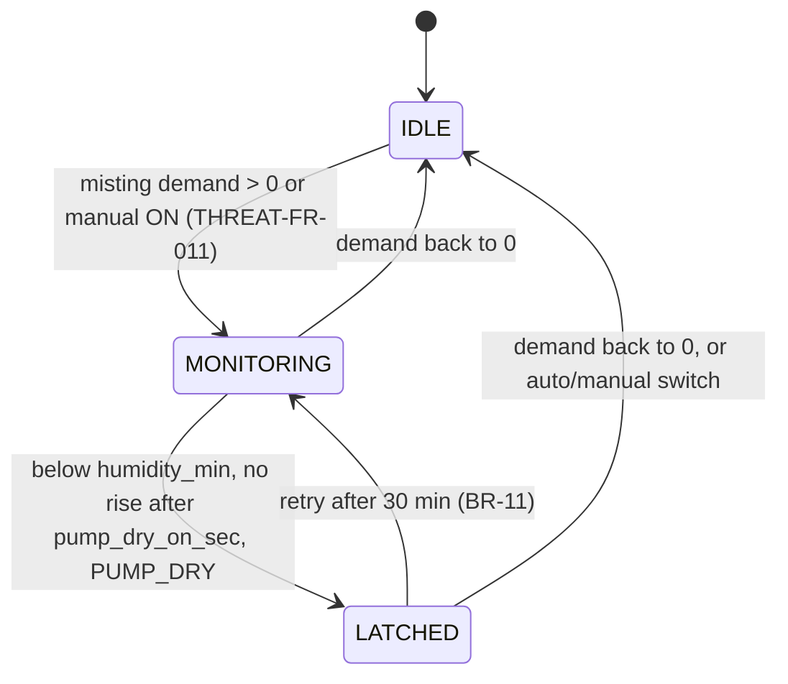
```mermaid
stateDiagram-v2
  [*] --> IDLE
  IDLE --> MONITORING : misting demand > 0 or manual ON (THREAT-FR-011)
  MONITORING --> IDLE : demand back to 0
  MONITORING --> LATCHED : below humidity_min, no rise after pump_dry_on_sec, PUMP_DRY
  LATCHED --> IDLE : demand back to 0, or auto/manual switch
  LATCHED --> MONITORING : retry after 30 min (BR-11)
```

### 8.8 Noise baseline per hour (SM-08, controller)

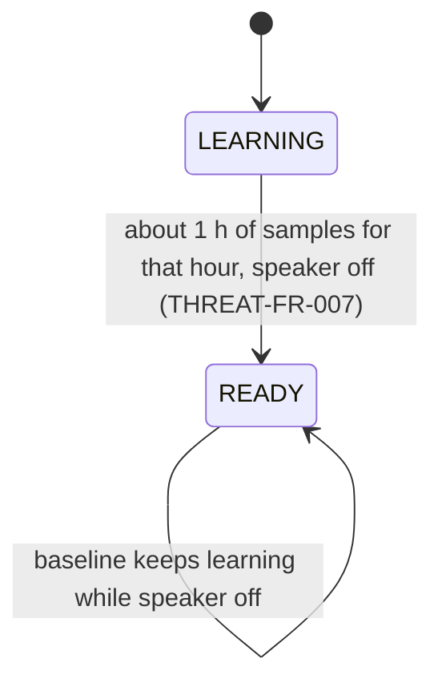
```mermaid
stateDiagram-v2
  [*] --> LEARNING
  LEARNING --> READY : about 1 h of samples for that hour, speaker off (THREAT-FR-007)
  READY --> READY : baseline keeps learning while speaker off
```

### 8.9 Health report (SM-09)

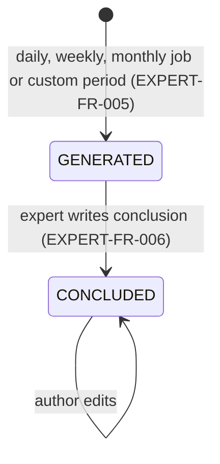
```mermaid
stateDiagram-v2
  [*] --> GENERATED : daily, weekly, monthly job or custom period (EXPERT-FR-005)
  GENERATED --> CONCLUDED : expert writes conclusion (EXPERT-FR-006)
  CONCLUDED --> CONCLUDED : author edits
```

### 8.10 Review of a Farm Owner's change (SM-10, planned)

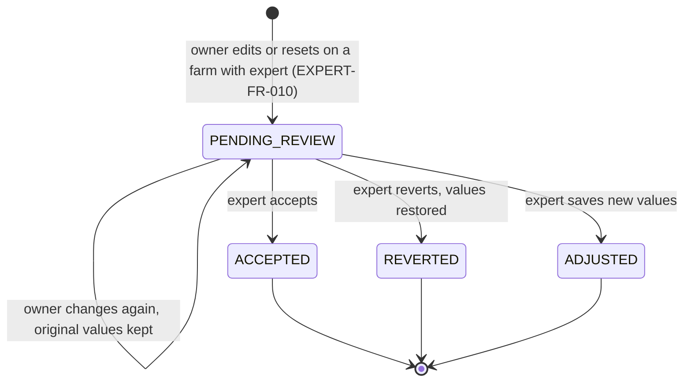
```mermaid
stateDiagram-v2
  [*] --> PENDING_REVIEW : owner edits or resets on a farm with expert (EXPERT-FR-010)
  PENDING_REVIEW --> PENDING_REVIEW : owner changes again, original values kept
  PENDING_REVIEW --> ACCEPTED : expert accepts
  PENDING_REVIEW --> REVERTED : expert reverts, values restored
  PENDING_REVIEW --> ADJUSTED : expert saves new values
  ACCEPTED --> [*]
  REVERTED --> [*]
  ADJUSTED --> [*]
```

### 8.11 Coefficient suggestion proposal (SM-11, planned)

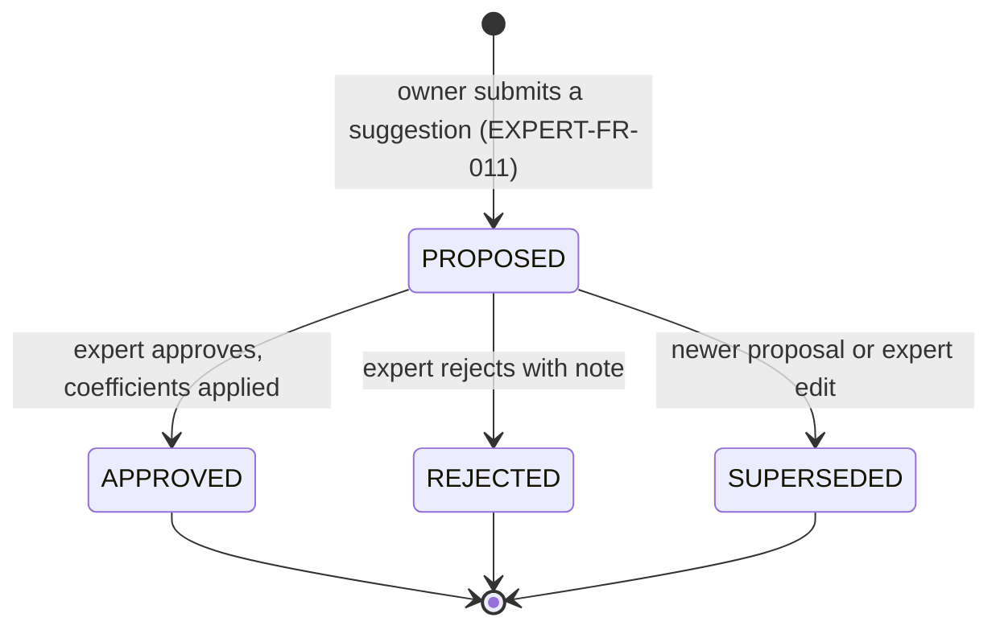
```mermaid
stateDiagram-v2
  [*] --> PROPOSED : owner submits a suggestion (EXPERT-FR-011)
  PROPOSED --> APPROVED : expert approves, coefficients applied
  PROPOSED --> REJECTED : expert rejects with note
  PROPOSED --> SUPERSEDED : newer proposal or expert edit
  APPROVED --> [*]
  REJECTED --> [*]
  SUPERSEDED --> [*]
```

### 8.12 Configuration sync per controller (SM-12, planned)

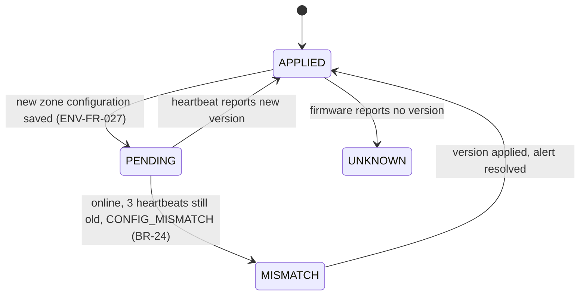
```mermaid
stateDiagram-v2
  [*] --> APPLIED
  APPLIED --> PENDING : new zone configuration saved (ENV-FR-027)
  PENDING --> APPLIED : heartbeat reports new version
  PENDING --> MISMATCH : online, 3 heartbeats still old, CONFIG_MISMATCH (BR-24)
  MISMATCH --> APPLIED : version applied, alert resolved
  APPLIED --> UNKNOWN : firmware reports no version
```

---

### 8.13 Harvest batch (SM-13)

```mermaid
stateDiagram-v2
  [*] --> DRAFT : owner records a harvest, snapshots attached (MARKET-FR-001)
  DRAFT --> DRAFT : owner edits (MARKET-FR-005)
  DRAFT --> DELETED : owner soft-deletes (MARKET-FR-005)
  DELETED --> [*]
```

`ARCHIVED` is declared in the harvest status enumeration but never assigned (Section 12).

### 8.14 User account (SM-14)

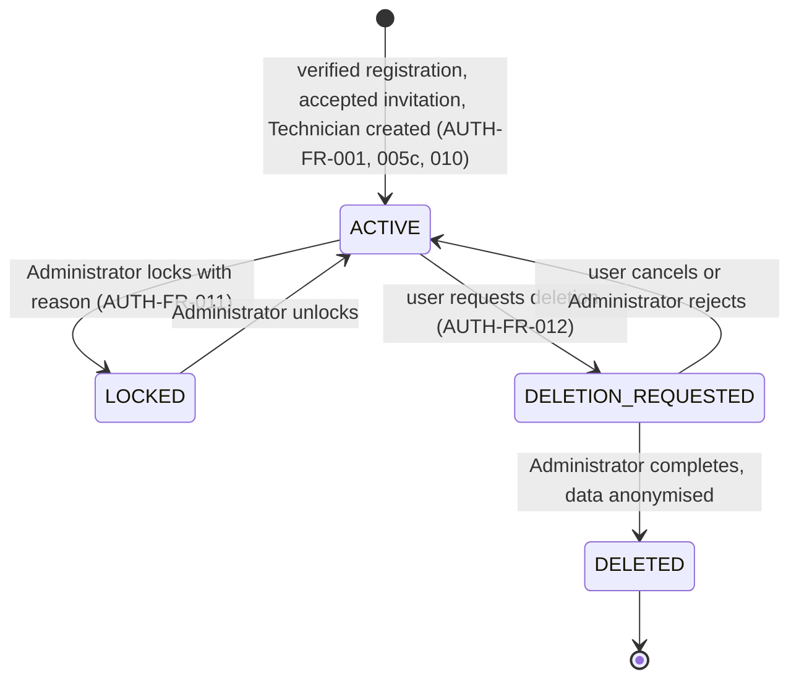
```mermaid
stateDiagram-v2
  [*] --> ACTIVE : verified registration, accepted invitation, Technician created (AUTH-FR-001, 005c, 010)
  ACTIVE --> LOCKED : Administrator locks with reason (AUTH-FR-011)
  LOCKED --> ACTIVE : Administrator unlocks
  ACTIVE --> DELETION_REQUESTED : user requests deletion (AUTH-FR-012)
  DELETION_REQUESTED --> ACTIVE : user cancels or Administrator rejects
  DELETION_REQUESTED --> DELETED : Administrator completes, data anonymised
  DELETED --> [*]
```

### 8.15 Firmware update per controller (SM-15)

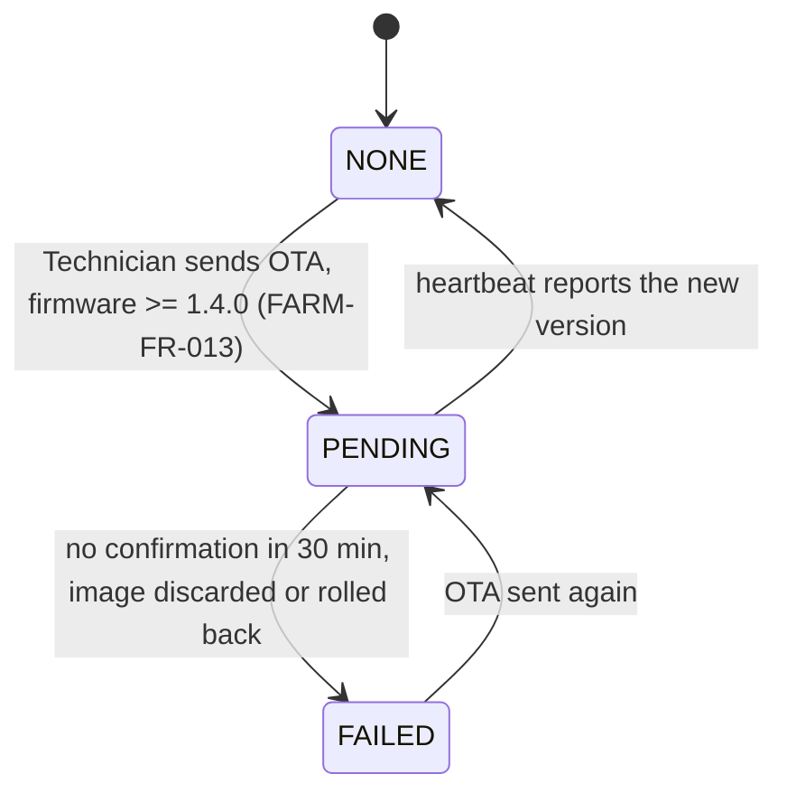
```mermaid
stateDiagram-v2
  [*] --> NONE
  NONE --> PENDING : Technician sends OTA, firmware >= 1.4.0 (FARM-FR-013)
  PENDING --> NONE : heartbeat reports the new version
  PENDING --> FAILED : no confirmation in 30 min, image discarded or rolled back
  FAILED --> PENDING : OTA sent again
```

### 8.16 Device label — stock entry (SM-16)

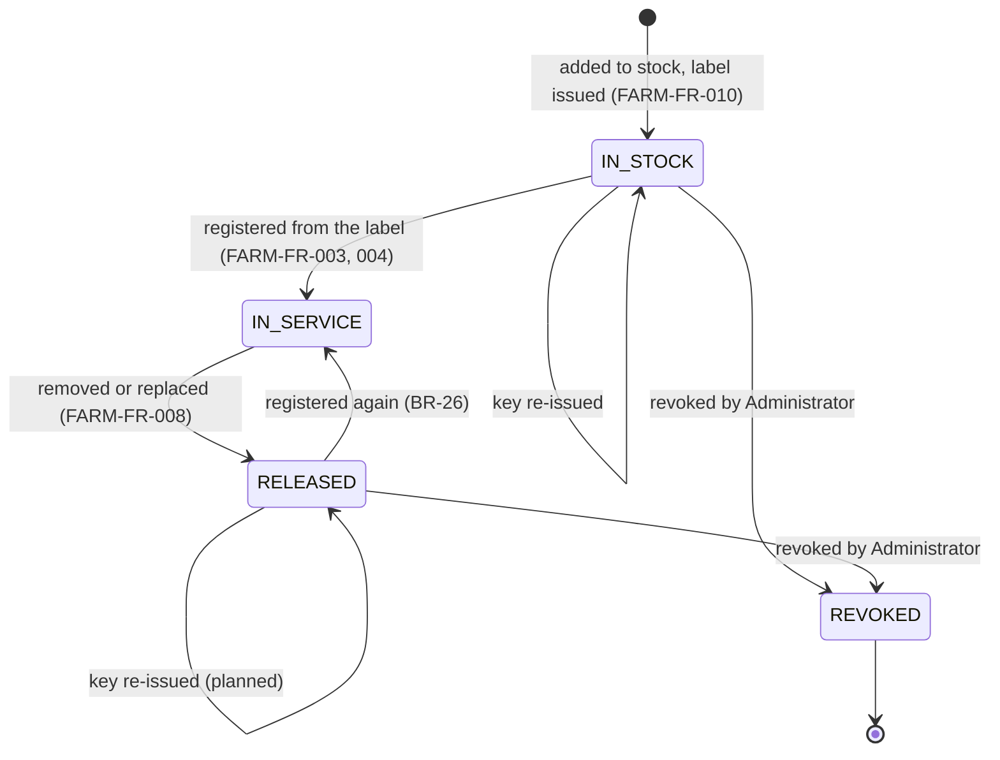
```mermaid
stateDiagram-v2
  [*] --> IN_STOCK : added to stock, label issued (FARM-FR-010)
  IN_STOCK --> IN_SERVICE : registered from the label (FARM-FR-003, 004)
  IN_SERVICE --> RELEASED : removed or replaced (FARM-FR-008)
  RELEASED --> IN_SERVICE : registered again (BR-26)
  IN_STOCK --> IN_STOCK : key re-issued
  RELEASED --> RELEASED : key re-issued (planned)
  IN_STOCK --> REVOKED : revoked by Administrator
  RELEASED --> REVOKED : revoked by Administrator
  REVOKED --> [*]
```

The state is derived from `provisioned_devices` (`claimed_at`, `revoked_at`) and whether a sensor or camera node with that device ID is in service; it is not a stored field. Re-issuing the key of a released device is blocked by the code today (Section 12).

### 8.17 Daily health status of a house (SM-17, planned)

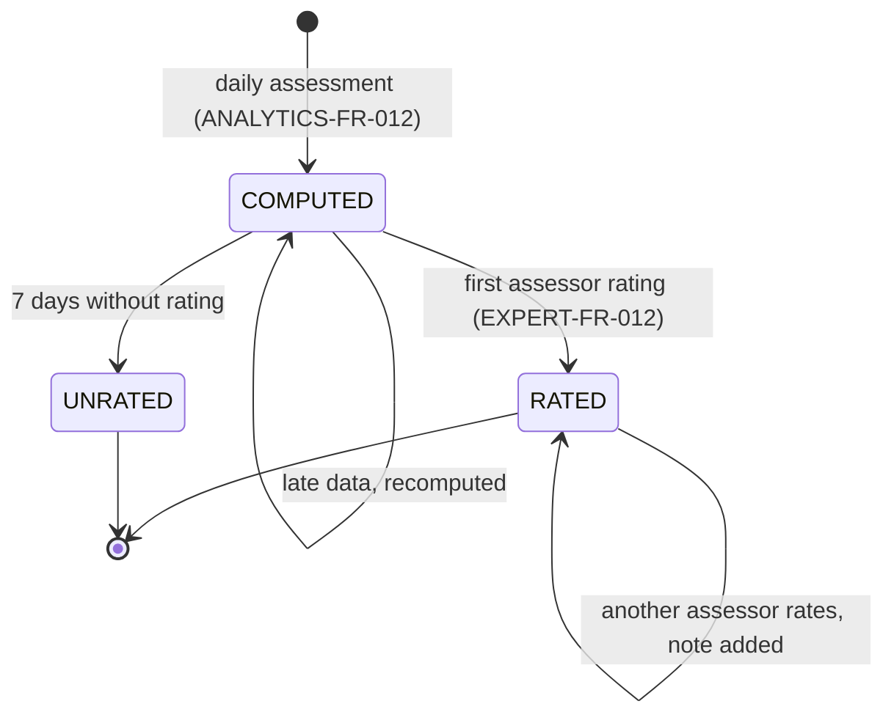
```mermaid
stateDiagram-v2
  [*] --> COMPUTED : daily assessment (ANALYTICS-FR-012)
  COMPUTED --> COMPUTED : late data, recomputed
  COMPUTED --> RATED : first assessor rating (EXPERT-FR-012)
  RATED --> RATED : another assessor rates, note added
  COMPUTED --> UNRATED : 7 days without rating
  RATED --> [*]
  UNRATED --> [*]
```

## 9. Activity Diagrams

One diagram per main and supporting flow of Report 3, Section 2.2. Lanes are the actors (people and external services) and the SwiftletCare components that act for them (controller, backend, AI node); the components are parts of the system, not actors (Report 3, Section 2.3). The diagram shows who takes part and the business decisions, not the internal processing.

### 9.1 MF-01 Automatic micro-climate regulation (AD-01)

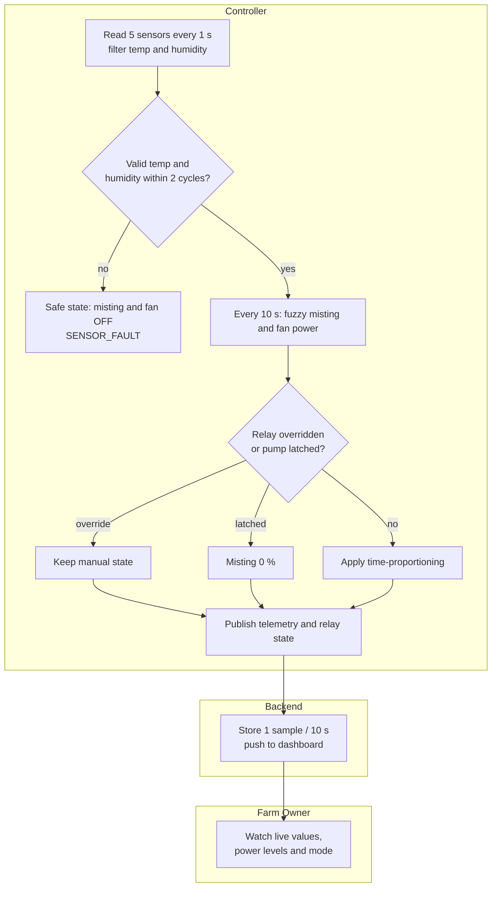
```mermaid
flowchart TB
  subgraph C[Controller]
    A1[Read 5 sensors every 1 s<br/>filter temp and humidity] --> A2{Valid temp and<br/>humidity within 2 cycles?}
    A2 -- no --> A3[Safe state: misting and fan OFF<br/>SENSOR_FAULT]
    A2 -- yes --> A4[Every 10 s: fuzzy misting and fan power]
    A4 --> A5{Relay overridden<br/>or pump latched?}
    A5 -- override --> A6[Keep manual state]
    A5 -- latched --> A7[Misting 0 %]
    A5 -- no --> A8[Apply time-proportioning]
    A6 & A7 & A8 --> A9[Publish telemetry and relay state]
  end
  subgraph B[Backend]
    B1[Store 1 sample / 10 s<br/>push to dashboard]
  end
  subgraph O[Farm Owner]
    O1[Watch live values,<br/>power levels and mode]
  end
  A9 --> B1 --> O1
```

### 9.2 MF-02 Air-quality monitoring (AD-02)

```mermaid
flowchart TB
  subgraph C[Controller]
    A1[Measure NH3 and CO2] --> A2[Publish telemetry]
  end
  subgraph B[Backend]
    B1{Above zone<br/>alert limit?} -- no --> B2[Store, show trend]
    B1 -- yes --> B3[THRESHOLD_BREACH MEDIUM<br/>no fan action]
    B3 --> B4[Notify Farm Owner]
  end
  subgraph O[Farm Owner]
    O1[Acknowledge with note]
  end
  subgraph E[Domain Expert]
    E1[Assess, set or adjust<br/>NH3 / CO2 alert limits]
  end
  A2 --> B1
  B4 --> O1
  B3 --> E1
  E1 --> B5[Store limits with history,<br/>send to controllers]
```

### 9.3 MF-03 Offline operation and recovery (AD-03)

```mermaid
flowchart TB
  subgraph C[Controller]
    A1{Broker reachable?} -- yes --> A2[Publish normally]
    A1 -- no --> A3[Keep controlling with stored config<br/>buffer 1 sample / 10 s in flash]
    A3 --> A1
    A4[Firmware hang or power loss] --> A5[Watchdog / power-on restart]
    A5 --> A6[Resume control,<br/>publish POWER_OUTAGE]
    A2 --> A7[Upload buffered samples]
  end
  subgraph B[Backend]
    B1{Heartbeat for 30 s?} -- no --> B2[OFFLINE + NODE_OFFLINE]
    B3[Heartbeat back] --> B4[ONLINE, resolve alert,<br/>push full configuration]
  end
  subgraph O[Farm Owner]
    O1[Receive offline / restart alerts]
  end
  B2 --> O1
  A6 --> O1
  A7 --> B3
```

### 9.4 MF-04 Equipment fault handling (AD-04)

```mermaid
flowchart TB
  subgraph C[Controller]
    A1{Which fault?}
    A1 -- pump on, humidity not rising --> A2[Stop misting for the episode<br/>PUMP_DRY, retry after 30 min]
    A1 -- sensor timeout / CRC --> A3[Mark stale, safe state<br/>SENSOR_FAULT or RS485_BUS_FAILURE]
    A1 -- speaker on, level low --> A4[SPEAKER_FAILURE]
  end
  subgraph B[Backend]
    B0[Every 10 min: stuck, jump, drift] --> B1[SENSOR_ANOMALY]
    B5[Pump or fan past its service limit] --> B6[MAINTENANCE_DUE]
    B2[One open alert per incident<br/>notify the Farm Owners]
    B3{Still ACTIVE after 15 min<br/>CRITICAL/HIGH, 1 h NODE_OFFLINE?} -- yes --> B4[Send once more]
  end
  subgraph O[Farm Owner]
    O1[Acknowledge, act on site]
  end
  subgraph T[Technician]
    T1[Sees device alerts of every farm:<br/>diagnose, restart, OTA - SF-02]
  end
  A2 & A3 & A4 --> B2
  B1 --> B2
  B6 --> B2
  B2 --> O1
  B2 --> B3
  B4 --> O1
  B2 -.-> T1
```

### 9.5 MF-05 Early warning by forecast (AD-05)

```mermaid
flowchart TB
  subgraph B[Backend]
    B1[Every 10 min: forecast next 60 min] --> B2{Enough data?}
    B2 -- no --> B3[Skip zone]
    B2 -- yes --> B4{In range now,<br/>forecast crosses?}
    B4 -- no --> B5[Resolve open FORECAST_BREACH]
    B4 -- yes --> B6[FORECAST_BREACH LOW<br/>expected minutes, MAE]
  end
  subgraph O[Farm Owner]
    O1[Prepare: check pump, water, fan]
  end
  subgraph E[Domain Expert]
    E1[Confirm or reject the warning]
  end
  B6 --> O1
  B6 --> E1
```

### 9.6 MF-06 Bird counting session (AD-06)

```mermaid
flowchart TB
  subgraph AI[AI node]
    A1[Read RTSP stream] --> A2[Detect on 2 tiles,<br/>track over the whole frame]
    A2 --> A3[Count ring crossings,<br/>extrapolate fast tracks<br/>EXIT / ENTRY]
    A3 --> A4[Publish session counts every 30 s<br/>and 5-minute buckets]
    A2 --> A5[Draw boxes and ring,<br/>publish annotated stream]
  end
  subgraph B[Backend]
    B1[Store per house and session] --> B2[After evening window:<br/>compute return rate]
    B2 --> B3{Session complete and<br/>≥ 3 baseline days?}
    B3 -- no --> B4[No evaluation]
    B3 -- yes --> B5{Drop above limit?}
    B5 -- yes --> B6[LOW_RETURN_RATE for the house]
    B5 -- no --> B7[Resolve earlier alert]
  end
  subgraph O[Farm Owner]
    O1[Watch live count and stream,<br/>trends]
  end
  subgraph E[Domain Expert]
    E1[Draw counting ring,<br/>set seasonal windows]
    E2[Confirm or reject alert]
  end
  A4 --> B1
  A5 --> O1
  B1 --> O1
  B6 --> E2
  E1 --> A1
```

### 9.7 MF-07 Abnormal noise (AD-07)

```mermaid
flowchart TB
  subgraph C[Controller]
    A1[Learn hourly noise baseline<br/>while speaker off] --> A2{Speaker off, hour READY,<br/>clock synced?}
    A2 -- no --> A3[Do not evaluate]
    A2 -- yes --> A4{Above baseline by margin<br/>for min seconds?}
    A4 -- yes --> A5[NOISE_ANOMALY MEDIUM]
  end
  subgraph B[Backend]
    B1[Attach evidence: environment,<br/>noise, 5-minute bird counts ±30 min] --> B2[Queue for expert,<br/>notify in app]
  end
  subgraph E[Domain Expert]
    E1{Real event?} -- yes --> E2[CONFIRMED]
    E1 -- no --> E3[REJECTED with note:<br/>alert DISMISSED]
    E3 --> E4[Tune noise parameters if needed]
  end
  subgraph O[Farm Owner]
    O1[Informed of verdict]
  end
  A5 --> B1
  B2 --> E1
  E2 & E3 --> O1
```

### 9.8 MF-08 Expert validation and tuning (AD-08)

```mermaid
flowchart TB
  subgraph B[Backend]
    B1[Weekly zone health report] --> B2[Notify owner and expert]
    B3[Coefficient suggestion from data]
  end
  subgraph O[Farm Owner]
    O1[Edit thresholds / coefficients<br/>applied at once] --> O2[Review item for expert]
    O3[Submit suggestion to expert]
    O4[Read conclusion and decisions]
  end
  subgraph E[Domain Expert]
    E1[Review report, write conclusion]
    E2{Owner change OK?} -- yes --> E3[Accept]
    E2 -- no --> E4[Revert or adjust]
    E5{Approve suggestion?} -- yes --> E6[Apply coefficients]
    E5 -- no --> E7[Reject with note]
  end
  subgraph C[Controller]
    C1[Receive new configuration,<br/>report applied version]
  end
  B2 --> E1 --> O4
  O2 --> E2
  B3 --> O3 --> E5
  E4 & E6 & O1 --> C1
  E3 & E4 & E6 & E7 --> O4
```

### 9.9 MF-09 Manual override (AD-09)

```mermaid
flowchart TB
  subgraph O[Farm Owner]
    O1[Switch a relay for a duration<br/>harvest, cleaning, maintenance]
  end
  subgraph B[Backend]
    B1{Role allowed and<br/>1 min ≤ duration ≤ 24 h?} -- no --> B2[Reject]
    B1 -- yes --> B3[Log override, send command]
    B4[Expiry job] --> B5[Clear override, log end]
  end
  subgraph C[Controller]
    C1[Apply relay, report MANUAL] --> C2[On expiry: back to AUTO]
  end
  subgraph H[House - outside the system]
    H1[Controller failed:<br/>relays release, loads stop] --> H2[Farmer runs loads with<br/>the house's own switches]
  end
  O1 --> B1
  B3 --> C1
  B5 --> C2
  C1 -. controller fails .-> H1
```

### 9.10 MF-10 Device setup by the Farm Owner (AD-10)

```mermaid
flowchart TB
  subgraph A[Administrator - before delivery]
    A1[Add device to stock] --> A2[Print label:<br/>QR with device ID + key]
  end
  subgraph O[Farm Owner - mobile app]
    O1[Scan device label] --> O2[Scan floor code<br/>or pick zone]
    O3[Join the device's setup Wi-Fi,<br/>enter farm Wi-Fi]
    O4[See online,<br/>configuration applied]
  end
  subgraph B[Backend]
    B1{Key valid, device not<br/>in service, zone accessible?} -- no --> B2[Reject 400 / 409 / 403]
    B1 -- yes --> B3[Register PENDING, audit]
    B9[Still PENDING after 15 min:<br/>notify registrant]
    B4{Heartbeat on the<br/>registered zone topic?} -- no --> B5[Send config/reassign]
    B4 -- yes --> B6[ONLINE, push zone configuration]
    B7{Reported version =<br/>zone version?} -- yes --> B8[Configuration applied]
    B7 -- no, 3 heartbeats --> B10[CONFIG_MISMATCH]
  end
  subgraph C[Controller]
    C1[Power on, no Wi-Fi:<br/>AP mode] --> C2[Join farm Wi-Fi,<br/>first heartbeat]
    C3[Store zone, restart<br/>on zone topic]
    C4[Apply configuration,<br/>report version]
  end
  A2 --> O1
  O2 --> B1
  B3 --> O3
  B3 -.-> B9
  C1 --> O3 --> C2 --> B4
  B5 --> C3 --> B4
  B6 --> C4 --> B7
  B8 --> O4
```

Moving a controller to another floor: scan the new floor's code; an online controller receives `config/reassign` at once, an offline one gets the same correction at its next heartbeat (B4). A Technician may follow the same steps on any farm; the Farm Owners are notified of each registration or move (FARM-FR-009).

### 9.11 SF-02 Remote device maintenance (AD-11)

```mermaid
flowchart TB
  subgraph T[Technician - console]
    T0[Device alert, or new firmware] --> T1[Open device: firmware, uptime,<br/>RSSI, memory, reset reason]
    T1 --> T2{Remote fix?}
    T2 -- yes --> T3[Restart, push configuration or OTA]
    T2 -- no --> T4[Replace or set up again on site<br/>steps of MF-10]
  end
  subgraph B[Backend]
    B1{Role Technician,<br/>device online or degraded?} -- no --> B2[Reject 403 / 409]
    B1 -- yes --> B3[Send command with deviceId, audit]
    B3 --> B4[Notify the Farm Owners in the app]
    B5{OTA confirmed by heartbeat<br/>within 30 min?} -- no --> B6[FAILED]
  end
  subgraph C[Controller]
    C1[Restart, apply configuration,<br/>or verify and install image]
    C1 --> C2{New firmware reaches<br/>broker in 10 min?} -- no --> C3[Roll back]
  end
  subgraph O[Farm Owner]
    O1[Sees what the Technician did]
  end
  T3 --> B1
  B3 --> C1
  C2 -- yes --> B5
  B4 --> O1
```

### 9.12 SF-03 Account and access management (AD-12)

```mermaid
flowchart TB
  subgraph U[Farm Owner]
    U1[Register, verify code] --> U2[Create farm]
    U2 --> U3[Invite co-owner or Domain Expert]
  end
  subgraph B[Backend]
    B1[Invitation PENDING, 7 days] --> B2{Accepted in time?}
    B2 -- yes --> B3[Add member with role]
    B2 -- no --> B4[EXPIRED]
  end
  subgraph E[Invitee]
    E1[Accept or decline]
  end
  subgraph A[Administrator]
    A1[Create Technicians, lock accounts,<br/>handle deletion requests]
  end
  U3 --> B1 --> E1 --> B2
```

---

### 9.13 SF-04 Harvest logging (AD-13)

```mermaid
flowchart TB
  subgraph O[Farm Owner]
    O1[Record harvest: date, zone,<br/>nest count, weight, type, photo] --> O2[View harvests against<br/>environment and flock]
  end
  subgraph B[Backend]
    B1{Valid and zone of<br/>own farm?} -- no --> B2[Reject]
    B1 -- yes --> B3[Attach 7-day environment means<br/>and 30-day flock figures of the house]
    B3 --> B4[Store batch DRAFT<br/>with trace code]
  end
  subgraph E[Domain Expert]
    E1[Read harvests in health review]
  end
  O1 --> B1
  B4 --> O2
  B4 --> E1
```

### 9.14 MF-11 Daily health assessment and periodic reports (AD-14)

```mermaid
flowchart TB
  subgraph W[Weather service]
    W1[Hourly temperature,<br/>humidity, rainfall]
  end
  subgraph B[Backend]
    B1[Evening return-rate check done] --> B2{Data complete?}
    B2 -- no --> B3[Status INSUFFICIENT_DATA]
    B2 -- yes --> B4[Indicators: environment, air,<br/>flock, noise vs house levels]
    B4 --> B5{Flock CLEAR and another<br/>source deviates?}
    B5 -- yes --> B6{Rain in a session window<br/>and flock alone?}
    B6 -- no --> B7[Status ACTION]
    B6 -- yes --> B8[Status WATCH]
    B5 -- no --> B9{Any CLEAR or two SLIGHT?}
    B9 -- yes --> B8
    B9 -- no --> B10[Status GOOD]
    B11[Store day with reasons,<br/>daily report, notify]
    B12[Weekly / monthly reports]
  end
  subgraph A[Farm Owner / Domain Expert]
    A1[Open the day: give own status first] --> A2[See system status,<br/>reasons, evidence]
    A3[Read reports, download PDF / CSV,<br/>expert writes conclusion]
  end
  W1 --> B4
  B3 --> B11
  B7 --> B11
  B8 --> B11
  B10 --> B11
  B11 --> A1
  B11 --> B12 --> A3
```

## 10. Security Design

| Concern | Design |
| --- | --- |
| Authentication | JWT access token (15 min) in the response body; refresh token (30 days) in an httpOnly, `sameSite=strict` cookie and stored hashed per user so each one can be revoked; password reset revokes all |
| Authorisation | `requireRole` on every route following Report 3, Section 2.4; farm membership checked in services (`farmAccess.util`); a Technician reaches every farm's devices but never its environmental data, relays, thresholds or alerts, and every device action is audited and notified to the Farm Owners |
| Passwords and codes | bcrypt; one-time codes hashed and never returned by the API |
| Rate limiting | 300 requests/min per account; 10 failed sign-ins / 15 min per IP; 30 refreshes/min per IP |
| Devices | Activation key from the provisioned stock, printed on the device label and checked only by the backend (stored hashed, compared in constant time, one message for an unknown ID and a wrong key); never stored on the controller; a device in service is never registered again (BR-26); labels and floor codes carry no Wi-Fi or MQTT credential; MQTT username/password over TLS (port 8883 in production); commands to one device carry its `deviceId`; OTA only over HTTPS from allowed hosts with SHA-256 verification and rollback |
| Health and reports | Ratings and downloads limited to the Farm Owners and Domain Expert of the farm; exported files carry names and figures, never internal identifiers; the weather service receives only the farm's coordinates |
| Camera | The RTSP port of the camera is forwarded on the house modem (static IP) for the AI node only; strong camera password, kept only in the AI node's `.env`; source IP limited to the AI node's line where the modem allows it, otherwise listed as a limitation (Report 3, Section 8.1) |
| Video | Viewing tokens valid 60 s for one camera path, signed with a separate secret; the raw feed is readable only by the pipeline |
| Secrets | Environment variables only (`.env.example` documents them); gitleaks scan in CI |
| Personal data | Account deletion with anonymisation (AUTH-FR-012, Decree 13/2023/ND-CP); audit log of sensitive changes |

---

## 11. Deployment and Operations

```mermaid
flowchart LR
  subgraph VPS[Staging VPS - Docker]
    RP[Caddy reverse proxy<br/>Let's Encrypt TLS, 443] --> API[backend container]
    RP --> WEBS[web static build]
    RP --> MTX[MediaMTX<br/>WebRTC signalling]
    API --> MONGO[(MongoDB<br/>internal only)]
    API -- MQTT 1883<br/>Docker network --> EMQX[(EMQX)]
    TLSP[TLS proxy<br/>8883 MQTT, 8322 RTSPS] --> EMQX
    TLSP --> MTX
    API --> MINIO[(MinIO<br/>internal only)]
    MTX -- stream auth --> API
  end
  subgraph HOUSE[Test house - VNPT line, static public IP]
    ESP[ESP32 controllers]
    CAM[IP camera<br/>RTSP, port 18554 forwarded]
  end
  subgraph HOME[Member's home]
    PC[AI node:<br/>spare desktop PC]
  end
  CAM -- RTSP over TCP<br/>across the Internet --> PC
  ESP -- MQTT over TLS 8883 --> TLSP
  PC -- counts, heartbeat<br/>MQTT TLS 8883 --> TLSP
  PC -- annotated video<br/>RTSPS 8322 --> TLSP
  USERS[Web and mobile users] -- HTTPS / WSS 443 --> RP
  USERS -- WebRTC media UDP 8189 --> MTX
  API -- outbound HTTPS --> EXT[[Telegram, FCM,<br/>Open-Meteo]]
```

Why this split: users, the panel's network and the controllers need one stable public address with TLS that does not go down with the house's power or line (the house's VNPT line has a static public IP, but on a consumer modem in a borrowed house), so the backend runs on a VPS. The AI node runs on a spare PC at a member's home and pulls the camera's RTSP feed over the Internet through the one port forwarded on the house modem (D5); it sends counts and the annotated stream on to the VPS. Only ports 80/443 (Caddy), 8883 (MQTT over TLS) and 8322 (RTSPS publish, AI node only) — both wrapped by a TLS proxy that reuses Caddy's certificate — and 8189 (WebRTC media, encrypted by WebRTC itself) are open on the VPS; MongoDB, MinIO, the EMQX dashboard and `/internal/*` are reachable only inside the Docker network or over SSH.

| Operation | Procedure |
| --- | --- |
| Deploy | On the VPS: check out the tag, `docker compose -f docker-compose.staging.yml up -d --build`, run pending `npm run migrate:*` scripts (all idempotent), load demo data with the seed script on a fresh database; smoke check `GET /health`, sign-in, one telemetry message |
| Rollback | Re-deploy the previous tag; restore the MongoDB dump taken before the deployment |
| Backup | `mongodump` before each deployment and once a day by cron, 7 dumps kept, copied off the VPS `[TEAM: where]` |
| AI node | `stream.py` runs as a service on the spare PC at a member's home that starts at boot and restarts on failure, reconnecting to the camera with back-off; the PC's BIOS is set to power on after a power cut; the camera URL and password live only in the node's `.env`; the counting ring and model file are versioned with the tag |
| Firmware | OTA from the Technician console; the new image is kept only after it reaches the broker within 10 minutes, otherwise the bootloader returns to the previous one |
| Monitoring | Technical overview (SYSTEM-FR-003), device and AI-node status and alerts (`NODE_OFFLINE`, `EDGE_AI_DEGRADED`), audit log, `docker compose logs` |

Not in the repository yet (Section 12): `docker-compose.staging.yml`, Dockerfiles for backend and web, the Caddy configuration, a demo seed covering every main workflow, MQTT over TLS in the firmware.

---

## 12. Design Status and Known Gaps

The design above is the target of Report 3. The parts not yet implemented in code are listed with their owners in `docs/reports/README.md` and in section 5 of the Design Brief. The main ones affecting this document are:

| Area | Gap |
| --- | --- |
| Alert lifecycle | `DISMISSED` status (SM-01) |
| Expert loop | Review items and suggestion proposals (SM-10, SM-11); owner notifications of every expert decision; owner fallback without an expert |
| Configuration sync | Configuration version, `CONFIG_MISMATCH` (SM-12) |
| Bird counting | No trained swiftlet model yet (the COCO `yolo26n` finds no bird in the infrared images of 22/10); publishing and video push are written but not yet run against staging; throughput risk: two tiles with the COCO model ran at about 7–12 fps on a laptop (not a reliable measurement) against the 25 fps of NFR-04, to be measured on the AI node PC; seasonal schedule and incomplete sessions (backend); counting-ring editor screen and mobile live stream |
| Clients | Web Domain Expert screens exist (`/expert/*`: dashboard, alert verdicts, tuning, analytics, reports) but still read the SRS v2.1.4 names, fall back to mock data and sit outside the FE_Design folder plan; no counting-ring editor; leftovers of the old scope (`SALES_STAFF`, a `heating` relay field, Zalo/SMS options); mobile is a scaffold without push registration or QR setup |
| Permissions | Technician and Administrator still allowed on thresholds, coefficients and overrides in some routes; Technician access is by region, not to every farm; the Administrator still creates and manages farms |
| Supporting roles | Tickets, chat, SLA, routing, queue, KPIs, maintenance schedules and regions are still in the code (routes, services, jobs, web and mobile screens, `api-spec.yaml`); escalation creates a ticket instead of repeating the notification (ALERT-FR-015); relay wear creates a ticket instead of `MAINTENANCE_DUE` (ALERT-FR-016); no owner notification of a Technician's device actions (FARM-FR-009) |
| Device setup (MF-10) | Register, move, remove and replace routes allow only Technician and Administrator; moving an offline controller is rejected; re-issuing the key of a device that was registered once is blocked; label and floor-code printing, QR scanning and the setup progress screen are not built |
| Staging | 24-hour pull test of the camera from the AI node at a member's home, with counts compared on the same clip read locally; staging compose file, Dockerfiles for backend and web, Caddy configuration and a demo seed for every main workflow not written; firmware connects on port 1883 without TLS (`MQTTManager.cpp`), so the controller cannot reach the staging broker on 8883 until TLS with the CA certificate is added |
| Health assessment (MF-11) | Daily health status, ratings, health levels, reports per house (daily, weekly, monthly), PDF and CSV export, weather job: not built (SM-17, D10, D12, D13) |
| Hardware | Controller PCB with current transformers and actuator check (D11, THREAT-FR-014) not built. Bypass switches removed from scope (Report 3 §8) |
| Data model | Planned entities and attributes of Section 6.4; unused enumeration values `ERROR`, `DEGRADED` (device) and `ARCHIVED` (harvest) |

---

## 13. Revision History

| Version | Date | Change |
| --- | --- | --- |
| 1.0.8 | `[TEAM]` | Maintenance tickets, SLA and Technician regions removed (Report 3 §8, BM03 row 9): decision D14, ERD and collections, jobs, REST and WebSocket, SM-05 removed, AD-04 with repeated alerts and `MAINTENANCE_DUE`, AD-11 rewritten as remote device maintenance, security and gaps |
| 1.0.7 | `[TEAM]` | AI node moved to the team's spare PC at a member's home, reading the camera over the Internet through the house's static IP (D5, Sections 2.1, 3.4, 10, 11, 12) |
| 1.0.6 | `[TEAM]` | Staging declared: one VPS with Caddy TLS for backend, web, broker and video server, the team's spare PC at the house as AI node (D5, Sections 3.4 and 11); hardware cost no longer tracked (NFR-12 removed in Report 3); Domain Expert web screens (PR #91), the Farm Owner rework with the WHEP live stream (PR #93) and the live pipeline with MQTT publishing, video push and its pytest CI job (PR #95) noted in Sections 3.3, 5.2, 5.4 and 12; activity-diagram lanes named as actors or system components (Section 9) |
| 1.0.5 | `[TEAM]` | Bypass switch removed (borrowed test house cannot be rewired): architecture, controller board and AD-09 updated; the house's own switches are shown outside the system |
| 1.0.4 | `[TEAM]` | Daily health assessment and periodic reports (MF-11): data flows DF-10, DF-11, decisions D10 (agreement rules), D11 (current transformers), D12 (weather API), D13 (report files), planned entities `HOUSE_HEALTH_DAY` and `WEATHER_OBSERVATION`, SM-17, AD-14; Open-Meteo and the team's controller board declared |
| 1.0.3 | `[TEAM]` | Device setup by the Farm Owner (MF-10): data flow DF-9, decision D9 (label and floor QR codes), QR libraries declared, state machine SM-16 for the device label, activity diagram AD-10 rewritten for MF-10, security of the activation key, setup gaps |
| 1.0.2 | `[TEAM]` | Checked against the Review 2 guideline and the self-review prompt: firmware task responsibilities corrected from `main.cpp`; NTP added and Redis explained in the architecture; CD declared; planned entities and attributes in the ERD (6.4); state machines for harvest, user account and firmware update (SM-13…15); activity diagram for harvest logging (AD-13) |
| 1.0.1 | `[TEAM]` | AI pipeline after PR #88: whole-frame tracking on two tiles, extrapolation at the hole, `FramePipeline` shared with the clip tool, Roboflow and Colab declared, library versions updated |
| 1.0.0 | `[TEAM]` | First SDD for Review 2: architecture, technology declaration, design decisions, component design, Logical ERD with a generated database script, interfaces, 12 state machine diagrams and 12 activity diagrams |
